# 课程 P1：为何工作成果与个人收益不匹配？🤔

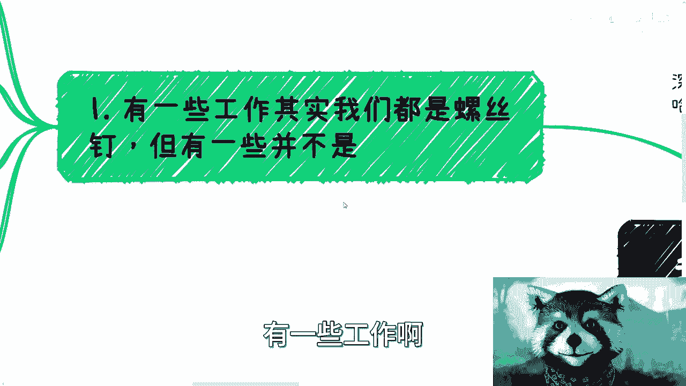

在本节课中，我们将探讨一个普遍的职业困惑：为什么许多工作内容由个人完成，但个人却无法获得与之匹配的全部收益。我们将分析其背后的原因，并提供一些突破现状的思路。

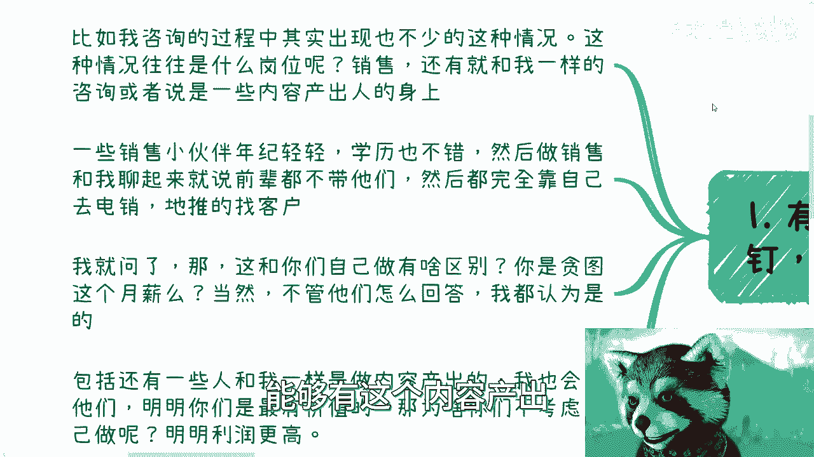

## 概述：一个普遍的职场困境

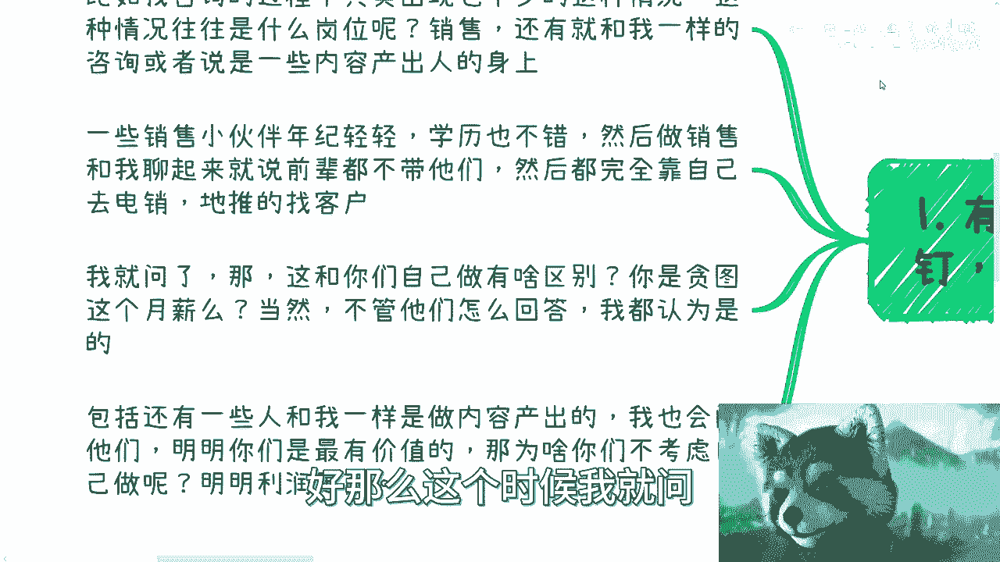

我时常思考一个问题：为什么工作中大部分内容由我完成，我却赚不到里面的钱？这是我在四五年前一直感到迷茫的问题。

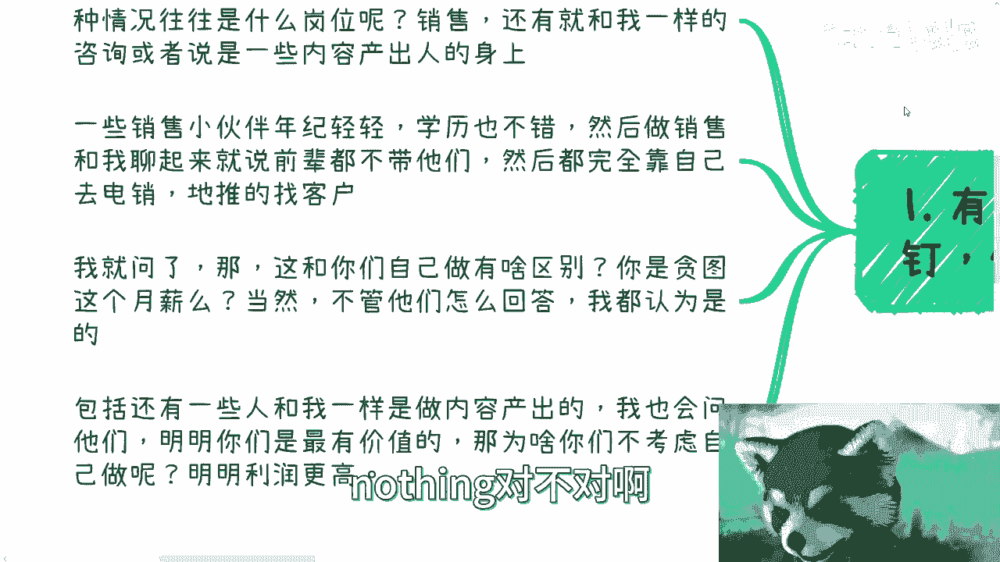

有些工作，我们确实只是“螺丝钉”。但也有一些岗位并非如此。

## 案例分析：销售与内容产出者的困境

以下是两种常见但收益与贡献不匹配的岗位情况。

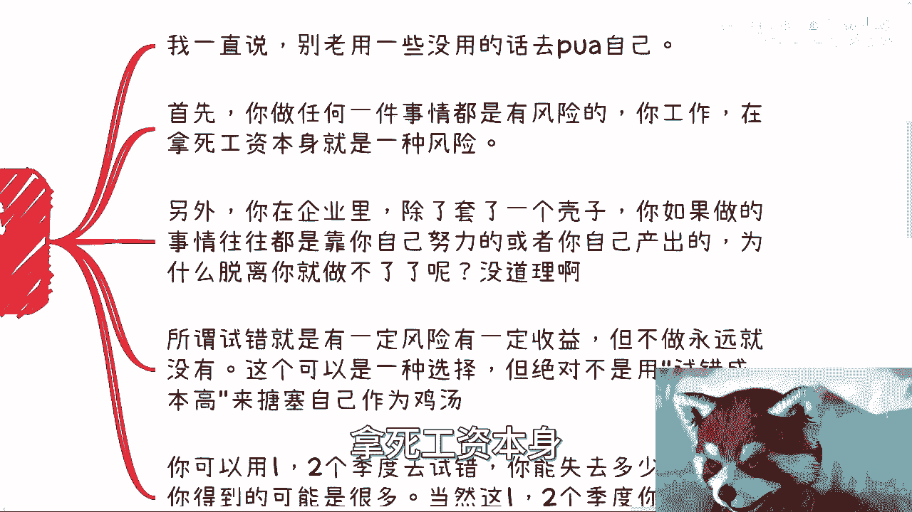

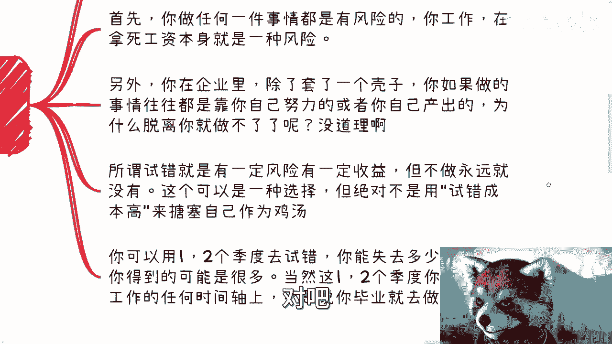

*   **销售岗位**：许多年轻的销售同事反映，前辈不愿分享资源，只能靠自己进行电话销售和地推。这时，这份工作与个人独立开展业务几乎没有区别，唯一的吸引力可能就是固定的月薪。
*   **内容产出岗位**：许多内容创作者本身具有高价值且可替代性不强，但他们很少考虑独立运作。当被问及时，他们常以“试错成本很高”为由。

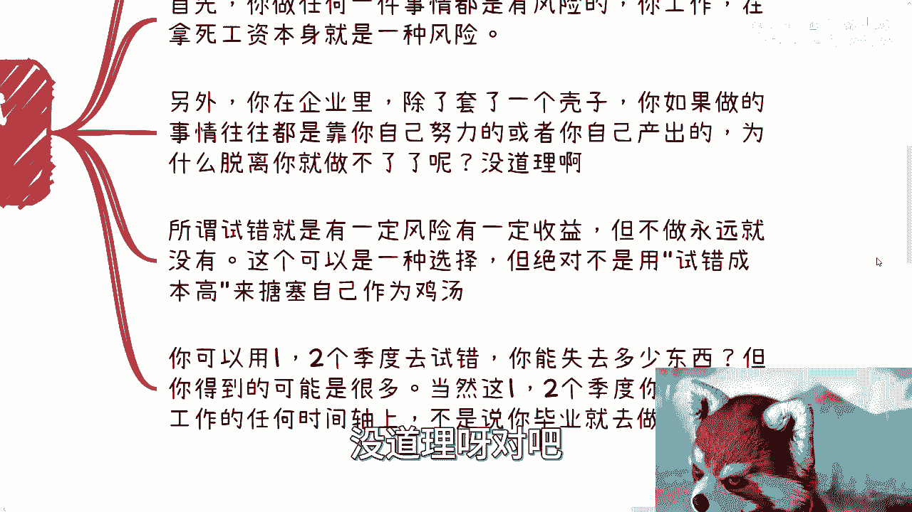

## 核心误区剖析：“试错成本”与“稳定风险”

上一节我们看到了两种典型困境，本节我们来剖析阻碍行动的核心思维误区。

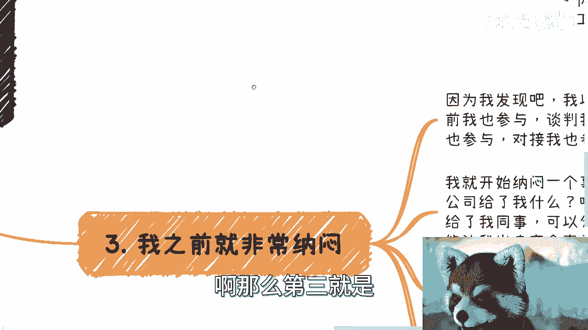

许多人用“试错成本高”来否定独立发展的可能性。这种想法需要被重新审视。

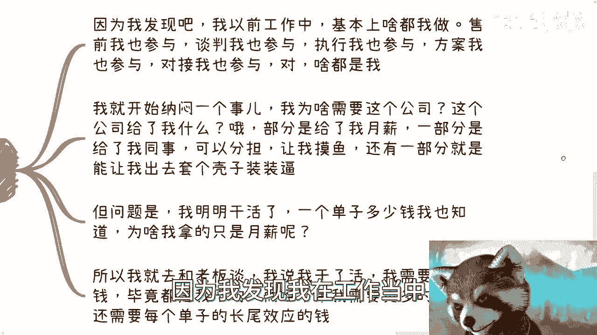

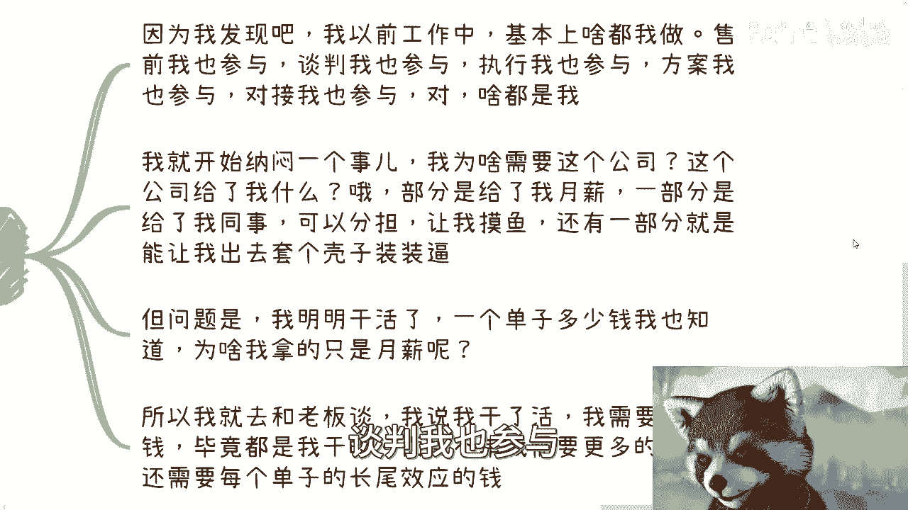

1.  **“稳定工作”本身即风险**：领取固定工资本身也是一种风险。公式可以表示为：**职业风险 = 失去工作的可能性 + 收入上限的锁定**。不要认为有工作就等于没有风险。
2.  **试错的本质是风险与收益的权衡**：所谓试错，意味着承担一定风险以博取潜在收益。不去尝试，则永远没有获得额外收益的可能。这只是一个可选项，并非要求一毕业就去冒险。
3.  **评估自身贡献与公司提供的价值**：我曾深度参与项目的售前、谈判、执行、方案、对接等全流程，但只领取固定月薪。这促使我思考：公司提供的平台、同事协作、品牌背书等价值，是否真的抵得上“项目总金额 - 我的月薪”这部分差额？我认为不值得。因此，我选择与老板谈判，要求根据我的贡献获得项目分润和长尾收益。

## 解决方案：主动拼图，打破信息差

上一节我们讨论了如何重新评估风险与价值，本节我们来看看如何采取实际行动。

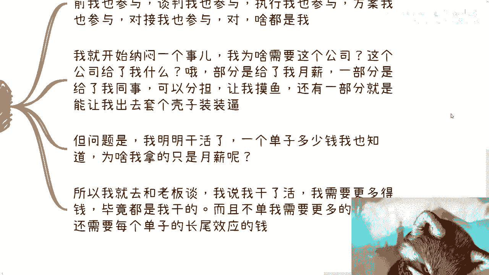

关键在于主动“拼图”，而非被动接受“螺丝钉”的命运。最毒的鸡汤就是“我们都是普通人/螺丝钉，还能怎么样？”

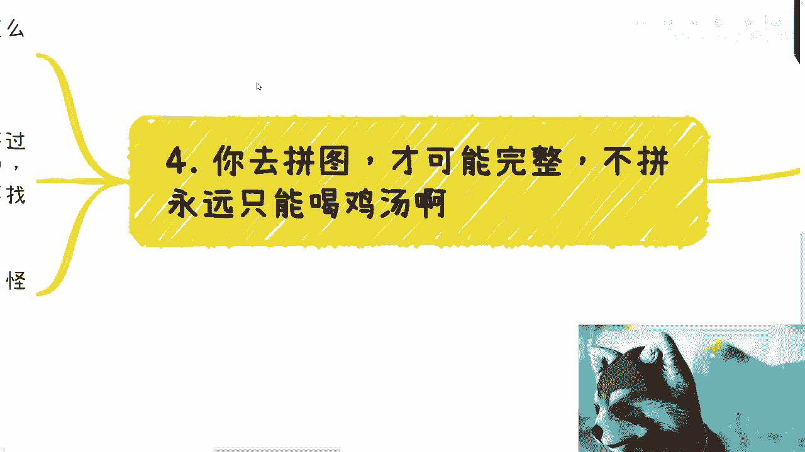

1.  **每个人都有自己的核心价值**：每个人的工作都有价值，只是有些价值单独拿出来很小，有些则很大。
2.  **寻找社会拼图**：如果你是一名设计师，你可以主动去寻找市场上的开发者、销售或商务伙伴。通过合作，将各自的价值拼接起来，就能形成完整的服务或业务链条。
3.  **草台班子理论**：许多成功的团队起初也是“草台班子”。既然别人可以，为什么我们不可以？关键在于迈出第一步，找到你的拼图。

人与人之间智力和思维的原始差异并不大。造成二十多岁后巨大差距的核心原因，往往是**信息差**。

当你不知道某些信息时，会觉得某些事很难、很遥远。一旦你填补了这些信息差，就会发现很多障碍其实源于“不知道”。获取信息、主动连接、勇敢尝试，是打破困境的关键。

## 总结

本节课我们一起学习了工作成果与个人收益不匹配的现象。我们分析了销售和内容创作者面临的困境，剖析了“试错成本高”这一思维误区，并指出“稳定工作”本身也有风险。最后，我们提出了解决方案：主动评估自身价值，勇敢与雇主谈判，并积极在社会中寻找合作伙伴“拼图”，以打破信息差，实现个人价值的最大化。

记住，许多障碍源于未知，主动探索和连接是破局的开端。