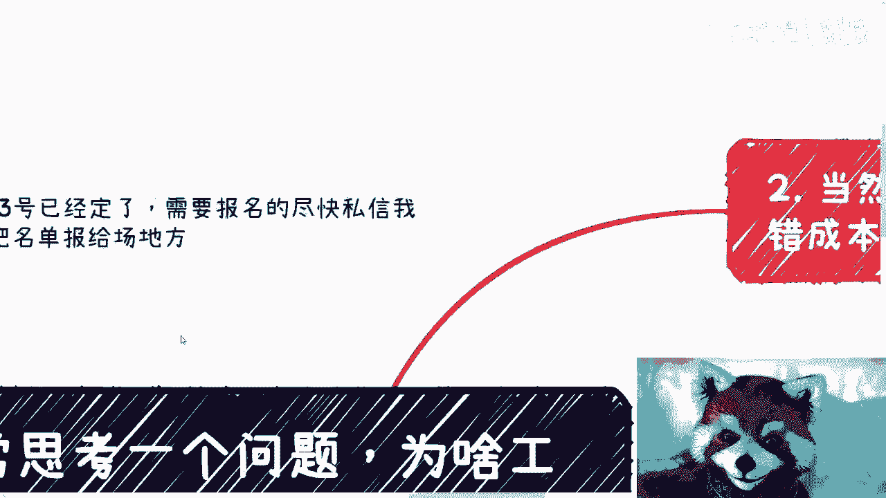

# 为啥工作明明是我做的，我却赚不到里面的那份钱 - P1 - 赏味不足 - BV1rp4y1o7od

哈喽大家好，我觉得我回了50%的血，差不多咳嗽没好呃，首先深圳活动1月13号已经定了，需要报名的尽快私信我好吧，我需要把名单报给场地方，卧槽我跟你们讲，上海现在冷的真的冷的不行啊，冷的就是啊。

南方又没暖气，无敌了，今天这个主题叫做我时常思考一个问题，为什么工作里面有一些内容，或者大部分内容是我做的，我却赚不到里面的钱啊，这是我大概45年五六年前吧，一直迷茫的一个问题，就有一些工作。

有些工作啊其实我们都是螺丝钉。

但是有一些呢也并不是，比如说我咨询过程当中呃。

出现了也不少这种情况，就是这种情况呢往往是什么岗位啊，比如说销售啊，还有些呢就跟我一样的，就是说呃咨询，或者说有一些这个内容能够有这个内容产出。

产出者的这些人身上啊，那么一些销售小伙伴呢年纪轻轻学历也不错，然后去做销售，那跟我聊天的时候就说啊，啊这个这个同事不带他，那个前辈不带他对吧，这个资源不给他，那个不给他，但凡做过销售的，尤其是应届生。

其实我貌似聊下来啊，都不太可能，为什么那人家把资源给你，人家做个屁啊，对不对啊，然后呢完全靠自己在里面电销地推，对吧好。

那么这个时候我就问我说，那你这个跟你自己做有什么区别，你是贪图他月薪吗对吧，那大部分人他可能不回答，但是我不管你怎么回答，我都认为你是贪图他月薪，那否则呢我不明白呀。

你你你你觉得这公司给了你啥nothing，对不对啊。

好，那么接下来包括还有一些人呢，跟我一样做内容产出的，我也会问他们，我说明明你们是很有价值的，你们在这里面占了很大一部分，而且可能可替代性有没有有没这么强，那咳咳咳咳，为什么你们自己不考虑做对吧。

明明比如说这个事情利润也比较高对吧。

或者怎么样子啊，好。

那么说到这了，这个小伙伴就要说了，他说废话，那他妈的你说做不做是错。

成本很高啊，好我们来讲啊，我一直说别老用一些没用的话去PV自己，首先啊你做任何一件事情都是有风险的，你工作在拿死工资，拿死工资本身这件事情本身它就是一种风险。

对吧。

就你不要觉得你现在有份工作就没风险，因为你在工作这件事情本身就是这种风险。

另外你在企业里面除了套了一层壳啊，那么你如果做的事情，往往都是靠你自己努力，或者说你自己产出的，那为什么脱离你就脱离这个公司，你就做不了了，没道理对吧。

所谓试错就是有一定的风险，有一定的收益，但是你不去做，你永远就没有这个收益对吧，这是一个可以选择的东西，不是说你还没毕业，或者说有了这就刚刚有些想法，然后去用一句话叫做试错成本很高。

我不一定能接受这种话来搪塞自己，做鸡汤有意义没有意义的。

你可以用一两个季度去试错，一两个季度你能去，你能去多少东西，但你有可能得到很多东西，当然一两个季度，你也可以放在工作的任何时间轴上面，不是说你一毕业就去就去试错，你可以在其他各个时间试错对吧。

但是你得有这个想法。

你得你得去评估啊，那么第三就是我之前就非常纳闷。

因为我发现我在工作当中。

基本上可能什么都我都参与啊，售前嘛我也参与谈判。

我也参与执行，我也参与方案，我也参与对接，我也参与马的合同，我也参与啊。

什么我都参与对吧好，但是这个不是我纳闷的，我纳闷的是，我他妈的参与了，我还只拿月薪啊，我就在想我为什么要这家公司，这家公司给我什么一部分给了我一心，一部分给了我同事可以分担，让我摸鱼。

还有一部分让我出去套个壳子装装逼，还有什么哦，这些东西什么意思，这些东西是能够抵上哦，我这个拿就是我做的这个单子，减掉我的月薪，剩下的这些钱吗，值这么多吗对吧，你自己去算这笔账吧。

但问题是我不管他值不值这么多，我觉得他不值这么多对吧，我明明干活了一个单子多少钱，我也是知道的，比如一个单子80万，那凭什么我只拿月薪啊，我不明白呀对吧，所以我就去跟老板谈，我说我干的活我需要更多的钱。

我需要这个case的分润，因为我干点，而且不耽误，我需要更多的钱，我还需要每个单子的长尾效应的钱，什么意思，就是我根本就不关心我是不是小手，你不要你不要来跟我讲说哦，因为你不是销售，不会有提成。

这跟我提不提升没有关系啊，我只是在跟他讨论我个人的价值，你要不愿意，那就是不认不认同我的价值，对不对，好。

那么最后一点就是你要去拼图，这张图才有可能完整，不拼。

你就真的只能永远喝鸡汤，什么意思呢，就是说你看啊，我们都是螺丝钉，我们都是普通人，我们能怎么样对吧，你还想怎么样子，这就是最毒的鸡汤，so对吧，我每次听到这句话，我就问他熟。

然后呢你你比如说你说的这句话，是因为你这么想吗，不是是因为你被别人植入了这个想法，但是你这么想的滞后难对吧，我跟你讲啊，就如我之前说的，每个人做的都有价值，只不过有的人拿出来单独的价值很少。

有的人拿出来单独价值很大对吧，因为有的人的这个工作他毕竟不像销售，能够直接找客户，也不像我直接能去对接客户，做咨询，做产出，但你只要到社会上去找合适的拼图对吧，比如说你是设计，那你就去找找。

找到对应的市场，找到对应的，比如说开发，找到对应的，比如说销售商务对吧，你只找到一两块，你就能把你的服务或者把整块业务做出来对吧，那么1+1加1+1，你加起来最终都是个草台班子，那我就问吧。

他妈的大家都是草台班子，那凭什么别的草班子可以，我们就不可以呢，对不对，那怎么奇了怪了，凭什么。

对不对，我跟你们讲，我跟你们讲，这个就像刚刚那个微信上，有小伙伴跟我约咨询的，我就直白跟他说，他说他的意思是什么，他说他觉得啊好像我还有我一些小伙伴，大家比较厉害，我说没什么厉害的，为什么。

因为所有的厉害，所有的就是我们称之为你们觉得牛逼也好啊，这个装逼也好，或者说怎么样也好，我说所有的这些理念概念，感觉在只要放到社会层面哦，我们说只要放到社会层面，它只来自于一个东西，叫什么叫信息差没了。

真的没了，为什么，因为我早就说过了，人与人之间的智商差异没这么大，人与人之间的就是说认知差异，其实也不叫认知差异吧，就是原本的那些思维上的差异也不会有那么大，他之所以到现在。

可能大家20多岁就有非常大的差异化，就是因为信息差，你知道吗，就是说我说的再直白一点，就是当你们不知道信息差的时候，觉得牛逼啊，难啊，跟我无关啊，然后当你你填补了那些信息差之后，你就会发现。

我他妈挣不到，为什么，就是因为我不知道啊，就这个样子的，我跟你讲，随便哪个地方都一样啊，行就这么着啊，我希望反正大家能明白吧，就是这么个事情，没有什么难不难的，都是信息差，好吧就这样吧，大家要注意保暖。

我反正算毁了50%的血，啊就这样，拜拜拜拜啊。