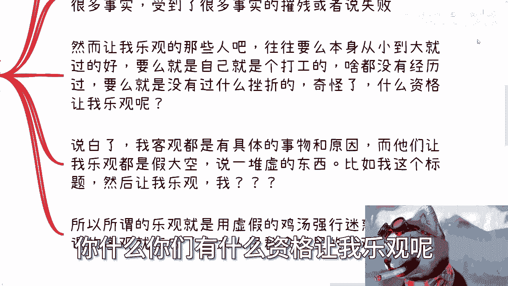

# 课程：重新认识乐观与悲观 🧠 - 第1课

在本节课中，我们将要学习如何批判性地看待“乐观”与“悲观”这两个常见的标签。我们将探讨为何简单地给他人贴上“悲观”标签并灌输鸡汤可能是有害的，并理解基于事实的客观态度的重要性。

## 对“权威”观点的质疑

上一节我们介绍了课程主题，本节中我们来看看一种常见的现象：对所谓“权威”观点的盲目推崇。

许多人会引用“教授”、“院士”或行业专家的观点来证明其正确性。然而，一个关键的问题是：如果这些“权威”的观点如此伟大且能决定行业走向，为何现实世界依然存在如此多的问题？为何需要由我来指出这些基本事实？

真正的知识传授，理应在理解整个行业、商业和社会的真实面貌之后进行。脱离实际的“优越感”展示毫无价值。

## “乐观”与“悲观”标签的滥用

接下来，我们进入核心讨论：社会上对“乐观”与“悲观”的刻板印象。

自毕业以来，我常被指责为“悲观”。但我始终不明白：当我所看到和经历的事实无法让我感到乐观时，为何要被强行要求“乐观”？这就像问一个路人“你幸福吗”，并期望得到标准答案一样荒谬。

更令人不解的是，社会似乎默认“乐观”应受表扬，“悲观”应受批评。这种评判标准从何而来？当我的观点基于具体事实时，却被简单地归为“悲观”，而他人提供的“乐观”建议却往往是空洞的鸡汤。

## 客观与“悲观”的本质区别

现在，我们来区分“客观”与“悲观”。

我并不认为自己悲观，我认为自己是**客观**的。我的观点源于对大量事实的观察、亲身经历以及从失败中获得的教训。

以下是那些常劝人“乐观”的群体的常见特征：
*   生活一直顺遂，未经历重大挫折。
*   家境优渥，未直面过残酷的现实挑战。
*   自身阅历浅薄，却喜欢对他人的处境指手画脚。

关键在于，我的“客观”建立在具体事物和原因之上，而他们提倡的“乐观”往往是**假大空**的。例如，所谓“乐观放大优点，悲观放大缺点”的说法，就是典型的无根据的鸡汤言论。

## “多数人”对“少数人”的PUA

当我们基于事实得出与主流不同的观点时，常会面临另一种压力。

当我因洞察本质而成为“少数人”时，身边的“前辈”或“权威”常会指责我“病了”、“有问题”或“太悲观”。他们声称悲观只会导致消极。

一个正常人若长期被如此评价，即使最初没有自我怀疑，也可能因这些“为你好”的言论而陷入真正的自我怀疑和消极情绪。届时，那些灌输鸡汤的人会负责吗？不会。他们只会用“我是为你好”来开脱。他们从不关心你为何“悲观”，也不愿了解你经历了什么。

## 重新定义乐观与悲观

最后，让我们重新审视这两个概念的核心。

首先，“乐观放大优点”中的“优点”如何定义？如何“放大”？是通过每日自我催眠，还是通过缴纳“鸡汤税”？“悲观放大缺点”中的“缺点”又是什么？这些概念本身模糊且缺乏依据。

我认为，无论是乐观还是悲观，其前提都必须是**切合实际**、**接地气**的。在此基础上：
*   **乐观是一个人的上限**。它提供探索更多可能性的原动力。
*   **悲观（或说审慎）是一个人的下限**。它帮助规避风险，实现自保。

我不明白从何时起，社会开始**强行要求乐观**。许多人像我一样，因坚持基于事实的客观看法而一路被指责为“悲观”。我需要一再向他人解释：这是**客观**，不是**悲观**。

我们许多人接受的教育，除了学科知识外，在思维层面可能被灌输了大量未经审视的观念。“我为你好”、“你太悲观”、“我不行”等话语常常脱口而出，缺乏依据。大家需要明白，这些不经意的话可能伤害或PUA他人；同样，他人也可能在无意中PUA你。除非你能像我一样彻底想明白这其中的逻辑。

---

本节课中我们一起学习了如何辨析“乐观”与“悲观”的标签，认识到基于事实的客观态度远比盲目乐观或接受空洞鸡汤更重要。我们探讨了滥用这些标签的危害，并重新定义了乐观与悲观在切合实际前提下的真正价值：乐观驱动探索，审慎保障安全。