# 乐观就是放大“优点”悲观就是放大“缺点”？滚！ - P1 - 赏味不足 - BV1zv421y7xo

哈喽大家好，我本来今天不打算录了，然后来想想这个写都写完了，这个不录就是心里不太舒坦是吧，那还是录一下啊。

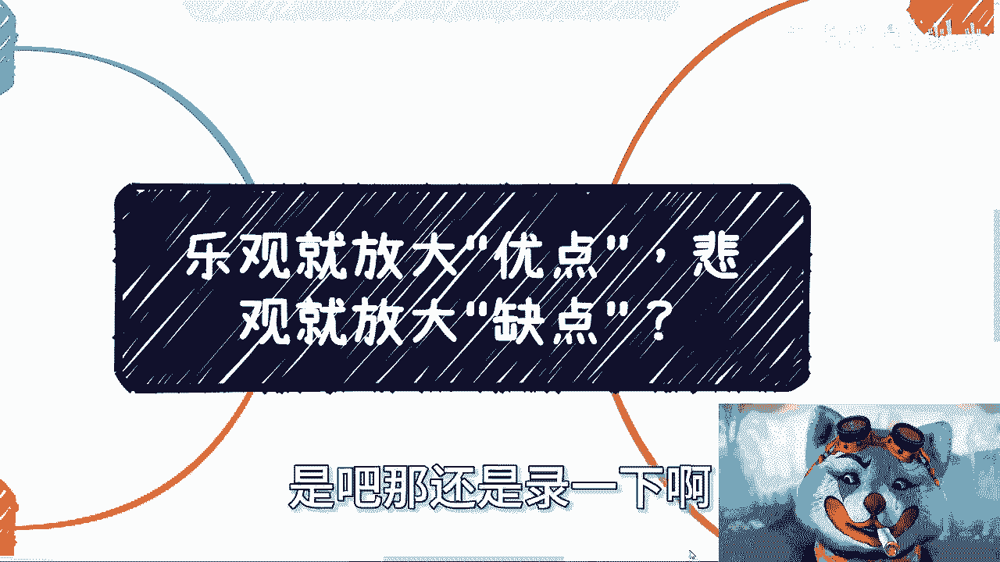

呃首先是这样子啊，我想先说一个事啊，先说一这个什么狗屁教授跟院士的笑话啊，就是还有好多这种人啊。

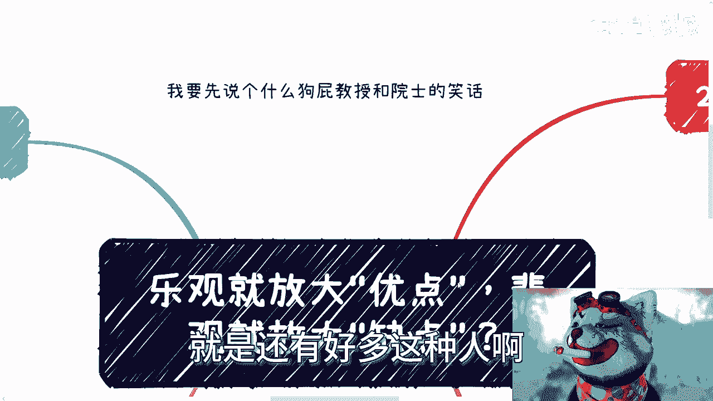

我姑且称之为你们为人啊，就很多人来跟我说什么什么啊，教授啊，院士啊，然后什么啊多大的成就啊，然后啊决定什么行业呃，什么什么走向什么东西呢，我还是那句话啊，你们嘴里面那种狗屁教授过蔑视，如果有这么伟大啊。

那么今天就不是我来这个地方，我在这个地方啊，或者说今天就不可能你们这么多人啊，只有在网上，只有我这个地方能够听到，我来跟你们讲这些东西啊，你们这些狗，你们所谓的这些狗屁教授跟院士。

难道不应该再教你们所谓的知识，之前先想想看整个行业什么样子，整个商业什么样子，整个社会什么样子嘛，对吧，我奇了怪了对吧，哦讲的我来讲呢啊秀优秀这种优越感，秀这种狗屁教授跟院士到我这边秀，滚他妈你妈的。

我跟你讲啊，首先这是第一，第一个是啊。

然后我们来讲今天这个主题叫做乐观，放大优点啊。

悲观放大缺点，他妈什么狗屁观点是吧，先说一个笑话啊，我从毕业开始呢，我听到最多的就是说我悲观啊，啊说我一点都不乐观啊，我其实说实话，我一直以来我一直都不明白为什么，因为当然我以前可能小嘛对吧，不懂事嘛。

这个我不明白，我的确不明白，我心里明白的很啊，我其实一直不明白不明白的是什么呢，就是明明我看到的事情跟我经历的事情，没有让我乐观的地方，那为什么强行要我乐观呢，对吧，哎这位路人了对吧，你幸福吗。

我幸福我幸福啊，嘶嗯我不姓陈，我姓福啊，嗯对而且令我非常不解的是什么呢，就是貌似被乐观的就是要被表扬的啊，悲观就是要被批评的，那凭什么呢，我也不明白呀，啊这那他妈的来这种道理的啊。

我看到的事实就让我悲观，这不行吗，强行要我乐观对啊，然后基本上说我悲观呢，他不但说我悲观，还要给我灌鸡汤，你知道吗，就每次跟我说一大堆有的没的啊。

我说然后呢我会我还会跟他们说，我说你又不是我，而更何况你也不了解我所了解的市场，我所看到的事实，我所经历到的事情对吧，你也没有我了解本质，那你为什么说我悲观呢，我不明白了是吧。

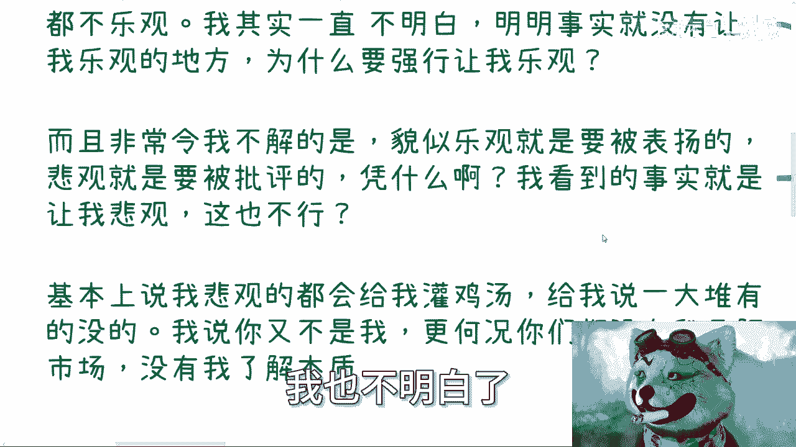

我就毫毫毫不明白啊。

然后第二点你们会发现一个问题，这个问题也很搞笑啊，就是哎咳咳啊。

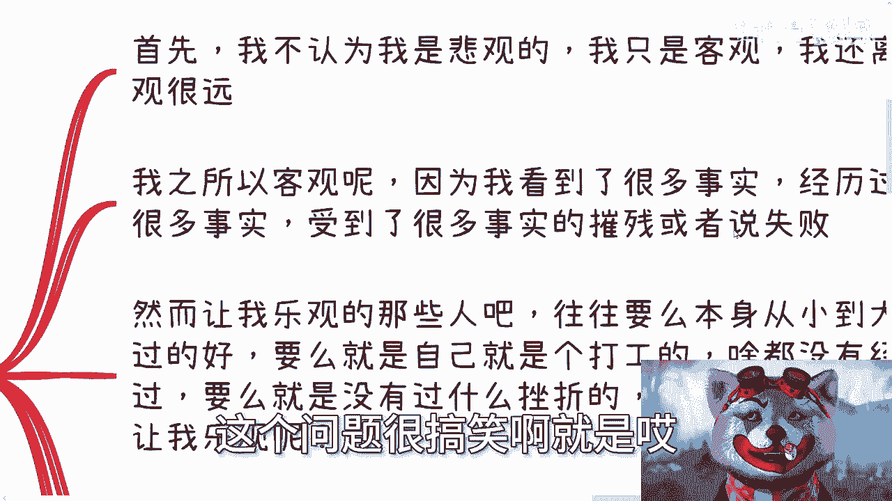

就是呢我不认为我是悲观的。

我是客观的啊，首先我就是这么觉得啊，我是客观的。

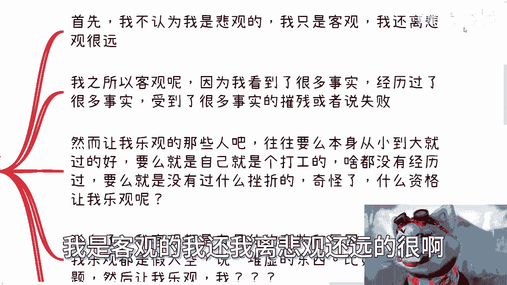

我还我离悲观还远得很啊，呃其次呢就是说我之所以客观的，因为我看到了很多事实，我经历过很多事实，我受到了很多事实的摧残，或者说我经历过很多事实的失败啊，然而呢哎我跟你讲就很搞笑的，然而让我那些乐观的人吧。

往往要么本身从小到大就过得很好啊。

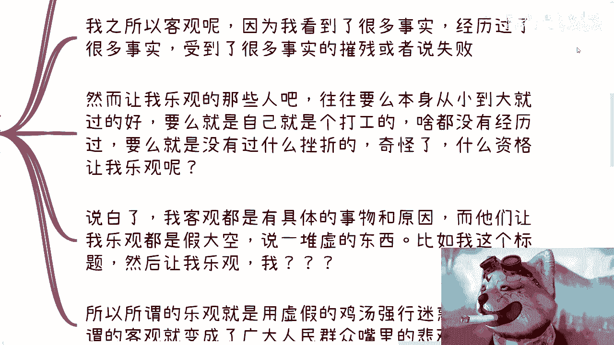

要么就是个富二代啊，要么就是自己打工的，啥都没有经历过的，要么就是个没有说过挫折，他妈的喜欢多管闲事的，哎我就奇怪了，你什么你们有什么资格让我乐观呢。

对吧，说白了我客观都是具有具体的事物和原因的，而他们让我乐观都是假大空。

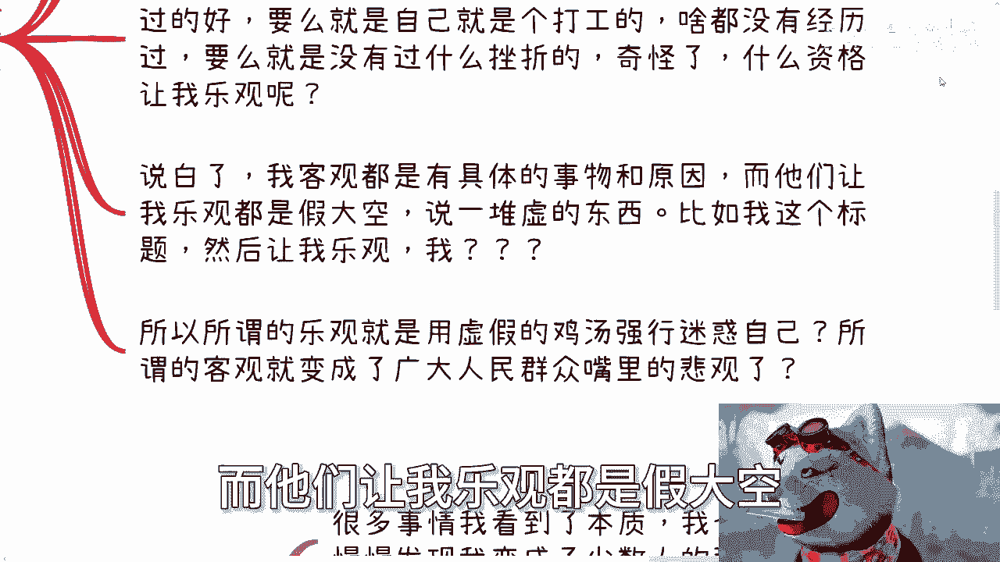

说了一堆，有的没的，比如说这个标题啊，就跟我说啊，你乐观要放大才会放大你的优点。

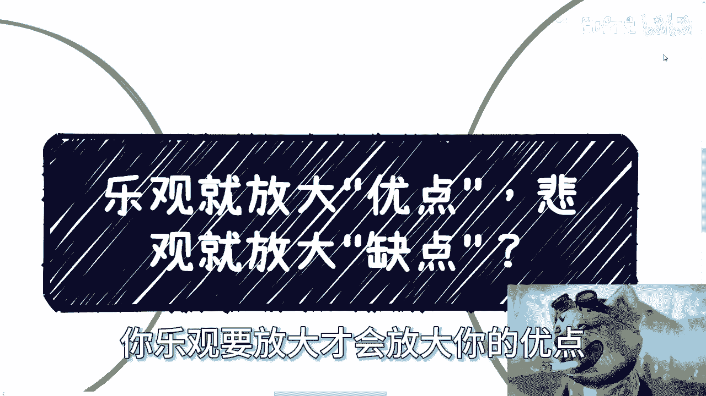

悲观会放大你的缺点，什么什么狗屁东西啊，对啦哎奇了怪了哦，哦我悲观，我客观，因为我看到的事实，你让我乐观，就是因为你给我灌鸡汤对吧，所以所谓的乐观就是用虚假的鸡汤，强行迷惑我自己，那不好意思。

我做不到啊，嘴里的悲观，或者来说甚至是打击别人的一些事情对吧。

你比如说第三点。

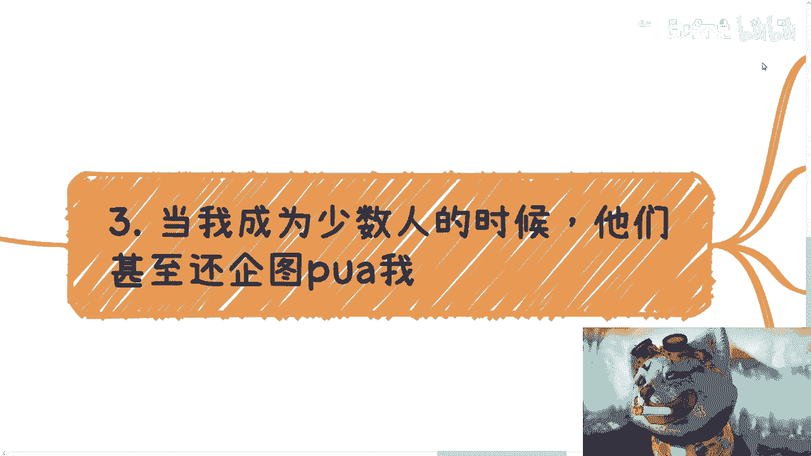

当我发现我成为少数人的时候，他们甚至还企图PUA我对吧，哎你比如说很多事情我看到了本质，我也经历过了本质，然而我经历过了很多知情之后。

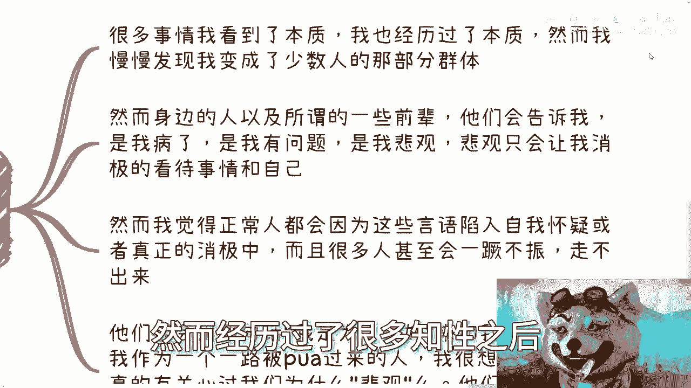

我就发现，我可能也慢慢慢慢变成了少数人的那部分群体。

对吧，然后呢，啊你会发现身边的一些人，甚至我们嘴嘴当中的那些所谓的前辈，就我刚刚跟你说的那些什么狗屁教授啊，他们会告诉我说我病了啊，是我有问题，是我悲观啊，悲观只会让我消极的看待事情和自己，对吧啊。

我跟你们这么说，我觉得一个正常人人都是要有成长过程的，我觉得一个一个正常人被身边的人这样说多了，他甚至会因为这些所谓的鸡汤或者所谓的什么，为你好的这些言论陷入自我怀疑，就是他以前没有自我怀疑。

但是他因为你们他妈的这种狗屁鸡汤，陷入了自我怀疑，甚至真正的消极当中，而且很多人甚至会就陷进去，走不出来，那我请问这是谁负责，到时候那些灌鸡汤的人会负责吗，早他妈不知道死哪去了对吧。

我就说那些狗屁教授和院士会负责吗，负责个屁啊，对不对啊，他们会用那句话，就是我是为了你好来跟我们讲，然而我作为一个一路被PUAPUA过来的人员，我想问这些人有真正关心过我们，为什么所谓的悲观吗对吧。

他们甚至都不愿意来问我经历过什么啊，就他妈来给我灌鸡汤。

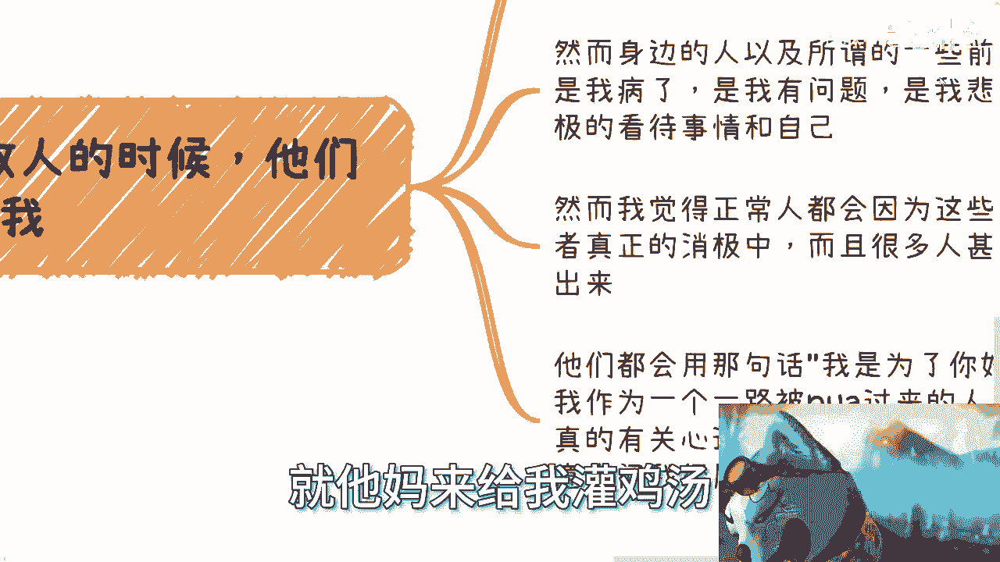

关关关你妹啊，对吧好，然后最后再来看这个标题。

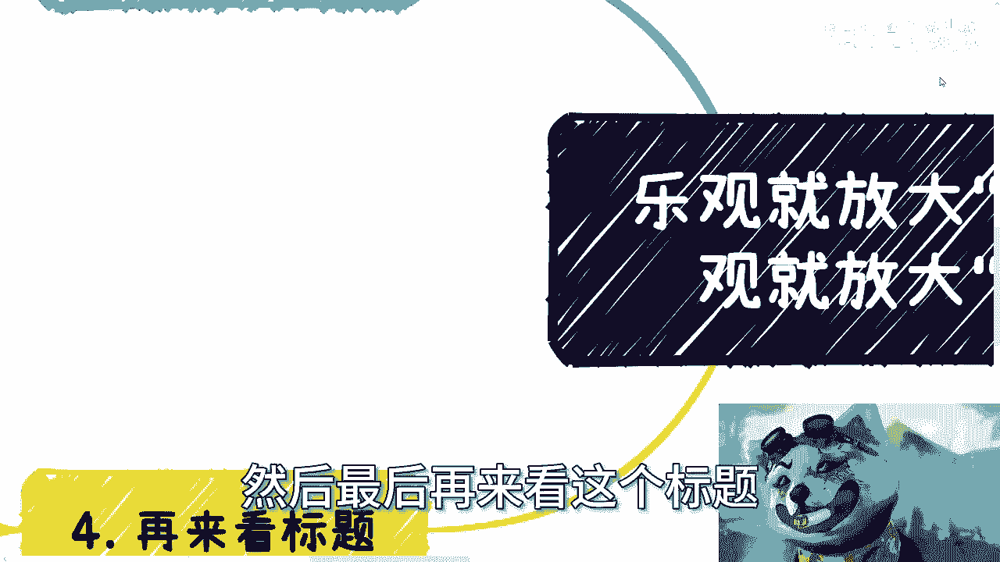

那你看啊，首先乐观就放大优点，那我请问优点是什么，怎么就放大了哦，是每天给自己喂鸡汤放大吗，还是每天给我说这个话的人交钱，我每天被割韭菜就乐观了啊，悲观就放大缺点，我可更吃你妈的，我们有啥缺点。

你们知道吗，不知道怎么就放大了呢，哎我就奇了怪了对吧，我觉得是这样子的啊，乐观也好，悲观也好，前提是要切是切切实际，要接地气对吧，一旦你切中实际接地气的话，那么我觉得乐观是一个人的上限。

它是可以提供你原动力的，它能够让你探索更多的可能性，悲观是一个人的下限，哎呀呀呀呀呀，咳咳对吧，悲观是一个人的下限，他是可以让你避免受到更多的伤害，他是能自保的，唉我就不明白。

不知道就是曾几何是怎么滴了呢，啊怎么就他妈的必须乐观。

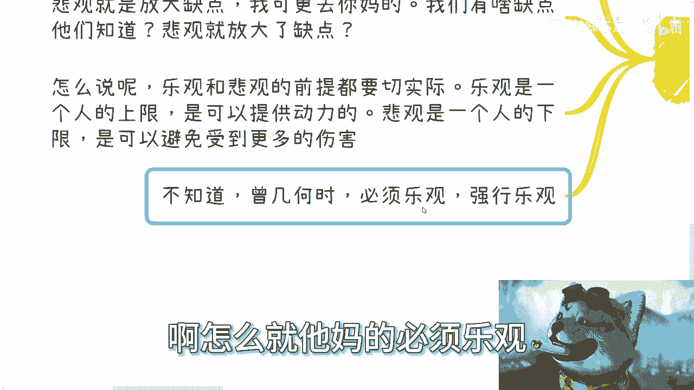

强行乐观。

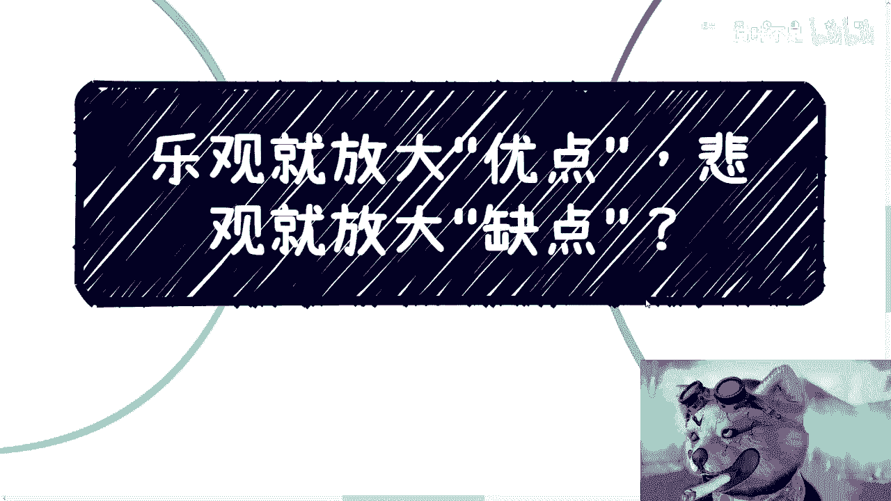

我不知道啊，我不知道有多少人跟我是一样的啊，我真的是属于工作也好到呃做别的事情也好。

一路上被人家说过来的啊，就是我悲观，从来从来没有人说过我乐观，好像是真的没有过，包括就是说我咨询也是的，我一再一而再再而三地跟他们说，我说同学，我我说哥哥哥姐姐，爷爷奶奶啊，这个你们能明白吗。

我说这叫客观，这他妈不叫悲观，你懂吗啊，我觉得真的就是，就是就跟我刚刚发的那个充电视频是一样的，就是什么就是就是我不是说应试教育不好，我也不是说什么教育好啊，我只是觉得我们现在大部分的人一路走过来啊。

除了这个德智体美劳对吧，语数外，各种学科的教育以外，对别的东西一无所知，脑子里面全部都是被灌输的，这个PV的思想，动不动就是我为你好，动不动就是哎呀，我觉得你悲观啊，动不动就是那个啊，我觉得我不行。

没有任何依据，他脱口而出，没有任何的依据对吧，我只想跟你们讲啊，我只想告诉你们是什么，就是你们要明白，很多时候别人不经意的话，他可能会伤害你，他可能会PUA你，而与此同时，你们不经意的话也会PUA别人。

真的但凡不是像我这样能想的很明白的，你们想想看对吧，你们讲这些话的时候，其实自己是没有意识的脱口而出，但是问题是别人听的人对吧，行啊，就这么着，这个明天嗯明天再发吧，明天再发吧。

这大过年的讲这个是不是也也不太开心，是吧啊行啊，反正呃职业上，职业上，深业上嗯，别的发展上面有啥的，反正我们在走咨询好吧。

