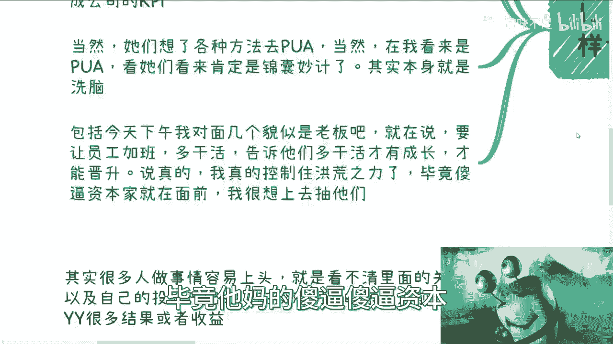
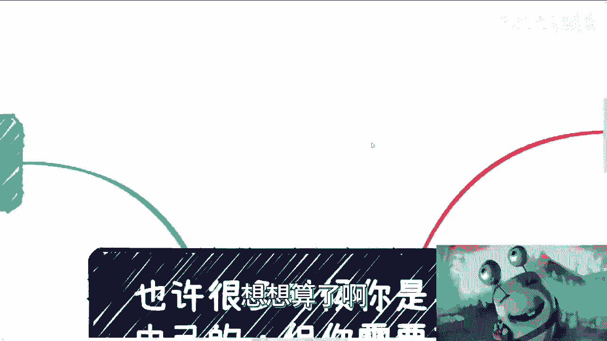
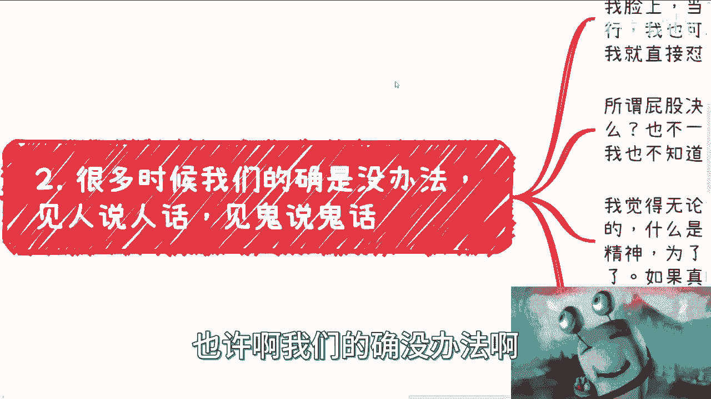
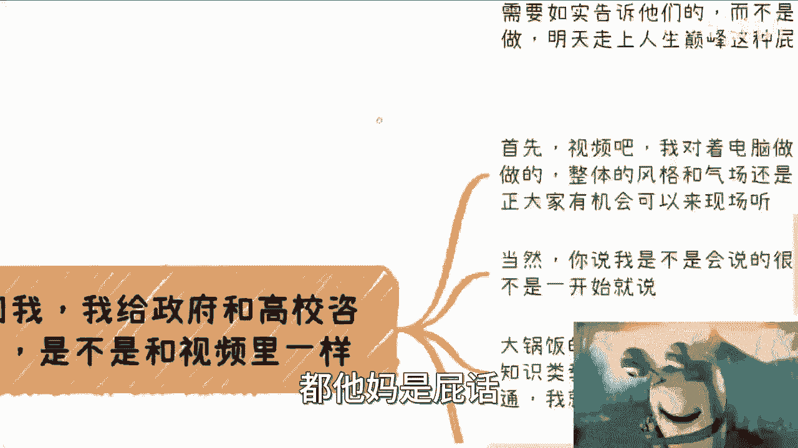
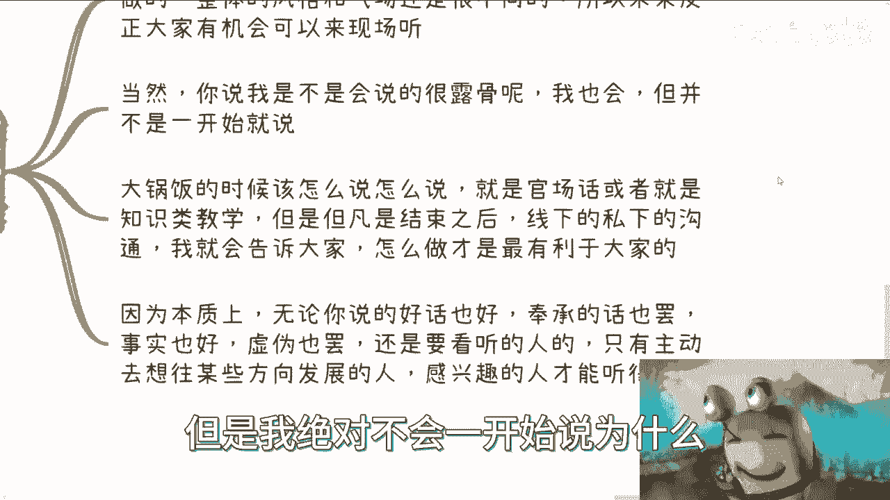
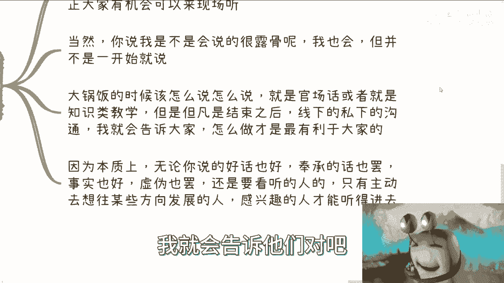
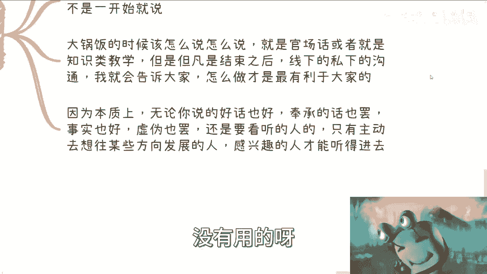
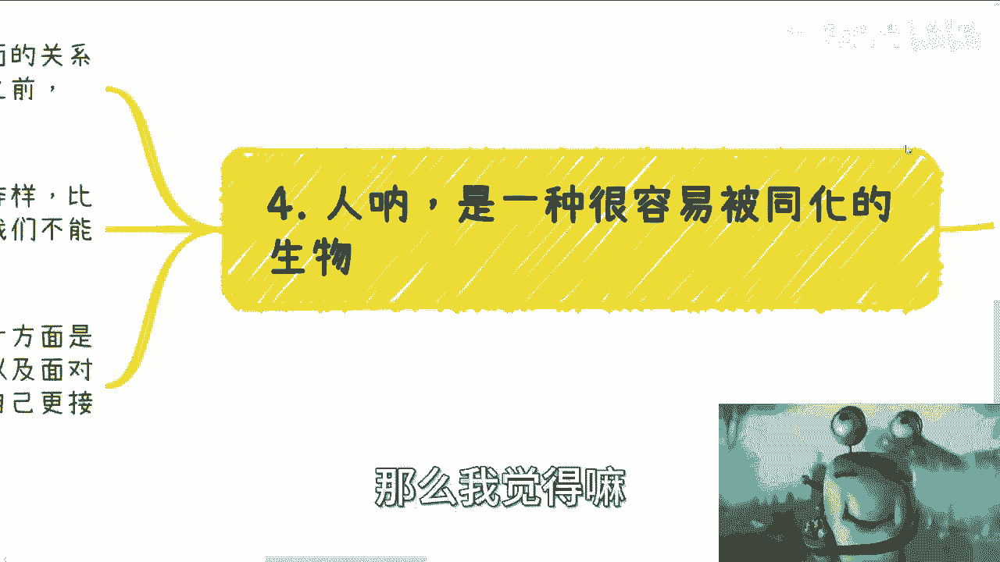
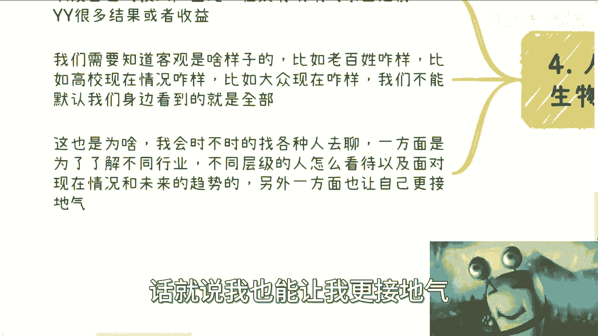

# 课程 P1：职场初心与自我认知 🧭


在本节课中，我们将探讨一个在职场中普遍存在但至关重要的话题：如何在身不由己的环境中，保持清晰的自我认知和初心。我们将通过一个咖啡馆的见闻引入，分析常见的职场现象，并讨论如何建立独立的判断力，避免被环境同化。

## 咖啡馆的见闻与思考

一天下午，我在一家咖啡馆里，无意中听到旁边一群HR在讨论工作。


他们讨论的核心议题是：如何激励本地生活事业部的员工，让他们以“内部创业”的心态，更主动、更积极地完成公司的KPI。在我看来，他们的讨论内容更像是在寻找方法对员工进行“洗脑”或“PUA”。




另一次，我又听到几位貌似管理者的人在讨论如何让员工加班。其中一位女士的建议是：要让员工相信，多干活才能获得成长和晋升的机会。






这些对话引发了我的思考。在职场中，我们常常会遇到类似的场景，身不由己地需要说一些违心的话，或者执行一些自己并不认同的策略。


## 核心原则：知晓对错，保持初心

上一节我们看到了职场中常见的“身不由己”的场景，本节中我们来看看应对这些情况的核心原则。

我认为，无论身处何种岗位——HR、产品经理、开发主管或是其他——我们都必须明白一个基本道理：**你需要知道什么是对的，什么是错的**。

这个判断不应随你的立场改变而改变。你可以是老板、员工或投资者，拥有不同的视角和利益诉求，但基本的对错标准应当清晰。不能因为今天你是管理者，就把压榨员工视为合理；也不能因为你是员工，就认为所有公司要求都是剥削。

例如，鼓吹“员工要有创业精神”却不多付报酬，或者说“打工不是为了钱”，这在逻辑上是站不住脚的。其核心关系可以简化为一个公式：

**员工付出 (Labor) = 应得报酬 (Salary) + 额外激励 (Incentive)**

如果公司只要求“创业精神”这种额外的 `Incentive`，却不提供对应的 `Salary` 增长，这就是一种不对等的关系。

对外竞争时，你可以使用各种策略。但对内管理员工时，你应该如实告知他们什么才是真正的成长，以及市场的真实情况。无论是企业管理者还是高校教师，都有责任传递真实信息，而非用虚幻的承诺进行“PUA”。




## 沟通的艺术：场合与对象


理解了保持初心的重要性后，我们自然会面临一个问题：如何在实际沟通中践行这一原则？本节将探讨沟通的艺术。

有人曾问我，给政府或高校做咨询时，我讲的内容是否和视频里一样直接。




我的回答是：**沟通方式取决于场合和对象**。

在公开、正式的场合（如大型讲座），我的讲述会更偏向知识性，内容严谨，基于既定的材料。因为台下听众认知水平不一，直接讲述过于“真实”的情况可能导致信息被误解。




但在私下、非正式的沟通中，我会更直接地分享客观事实和我的真实看法。因为愿意私下深入交流的人，通常经过了思考，他们能更好地理解并运用这些信息。沟通的有效性可以概括为：

```python
# 沟通有效性模型
def communication_effectiveness(setting, audience):
    if setting == “formal_public”:
        return “structured_knowledge” # 输出结构化知识
    elif setting == “private_informal” and audience == “engaged_thinker”:
        return “objective_truth” # 输出客观事实
    else:
        return “tailored_message” # 输出定制化信息
```




## 警惕同化与认知偏差



学会了如何沟通，我们还需要警惕环境对自身判断力的侵蚀。本节我们来探讨人容易被同化的天性以及如何克服认知偏差。

人是一种容易被环境同化的生物。你最初可能是状态A，但长期从事某项工作或身处某个群体后，很容易被改变。许多人做事容易“上头”，看不清内在关系和投入产出比，在没有明确依据的情况下，幻想出各种不切实际的收益。


此外，我们必须主动去了解客观世界的全貌，避免“幸存者偏差”。你身边人的情况，无论多好或多坏，相对于全国庞大的人口基数，都只是极小一部分，不足以代表整体。

以下是两种常见的认知陷阱：

1.  **以己度人陷阱**：用自己的认知水平去衡量潜在客户或受众。例如，你认为某个知识课程内容太简单，网上都能搜到，不可能有人付费。但正是这种想法让你赚不到钱，因为你的目标用户可能并不具备你的认知水平。赚钱的逻辑往往是 **降维打击**。
2.  **信息茧房陷阱**：长期待在固定圈子，接收单一视角的信息，导致对社会的理解片面、不接地气。


## 保持客观：多元连接与教学相长

认识到认知偏差的存在后，我们该如何主动保持客观和接地气呢？本节将提供具体的方法。

为了对抗同化和认知偏差，我们需要主动建立多元化的信息连接。

我个人的方法是：与不同阶层、不同圈子的人交流。这包括上至政府官员、高校学者、创业者，下至各行各业的普通从业者。从他们身上，我能了解到不同群体如何看待现状、应对未来。这就是 **教学相长**。



建立这样的多元连接有两大好处：

1.  **获取多维信息**：帮助你拼凑出更接近全景的社会和市场图景，避免盲人摸象。
2.  **获得外部鞭策**：即使你水平很高，做决策时也总有盲区。可信的朋友或伙伴能提供不同视角的建议，供你参考。听或不听的决定权在你，但多听无妨。


这就像我制作免费视频，你可以认可，也可以不认可。但如果不认可，就在评论区攻击他人、秀优越感，那更多是情绪宣泄，而非理性讨论，毫无必要。

## 总结与行动建议

本节课中，我们一起学习了在复杂职场环境中保持初心和清醒认知的完整心法。

我们首先通过咖啡馆见闻，揭示了职场中常见的“PUA”与“画饼”现象。接着，我们确立了核心原则：**无论立场如何，必须知晓对错**。然后，我们探讨了沟通的艺术，强调要根据**场合和对象**调整沟通策略。之后，我们深入分析了人容易被**环境同化**和陷入**认知偏差**的天性。最后，我们给出了解决方案：通过**与多元群体交流**来实现“教学相长”，保持接地气和客观视野。

**核心行动建议**：
*   **内省**：定期审视自己的行为与观念，是否在背离初心。
*   **求真**：对自己人（如下属、学生）尽量坦诚，告知真实情况与利弊。
*   **破圈**：主动接触和理解与你背景、认知不同的人群，拓宽视野。
*   **开放**：理性对待不同意见，将其作为完善自身认知的参考，而非情绪对抗的源头。

希望你能时常跳出自己的固有圈子和思维模式，以更高的维度审视自己和周围的问题。这样，你才能避免原地踏步，也不会陷入钻牛角尖的怪圈。

如果你在商业、职业发展或其他赚钱相关领域有具体、总结好的问题，欢迎进一步交流。