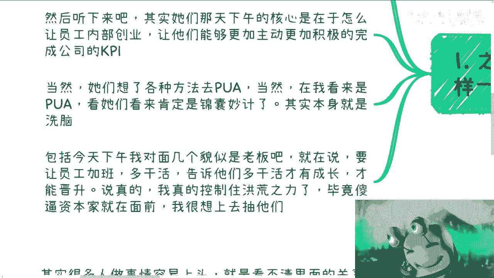
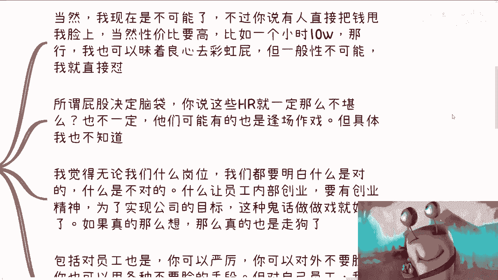
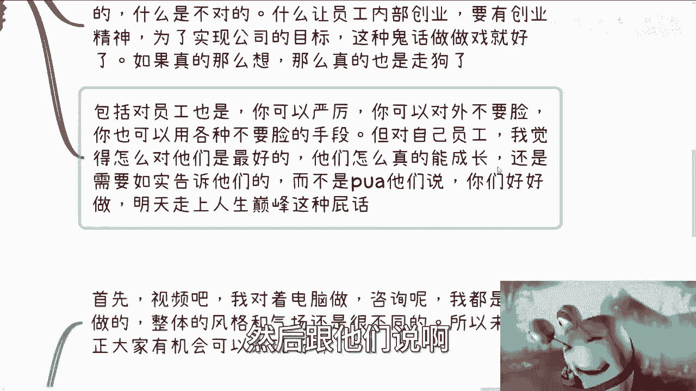
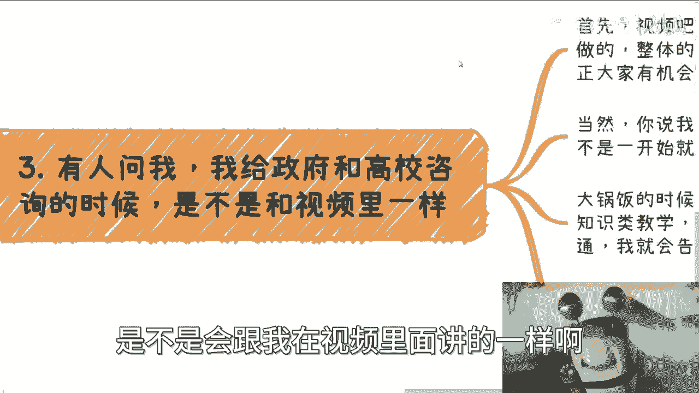
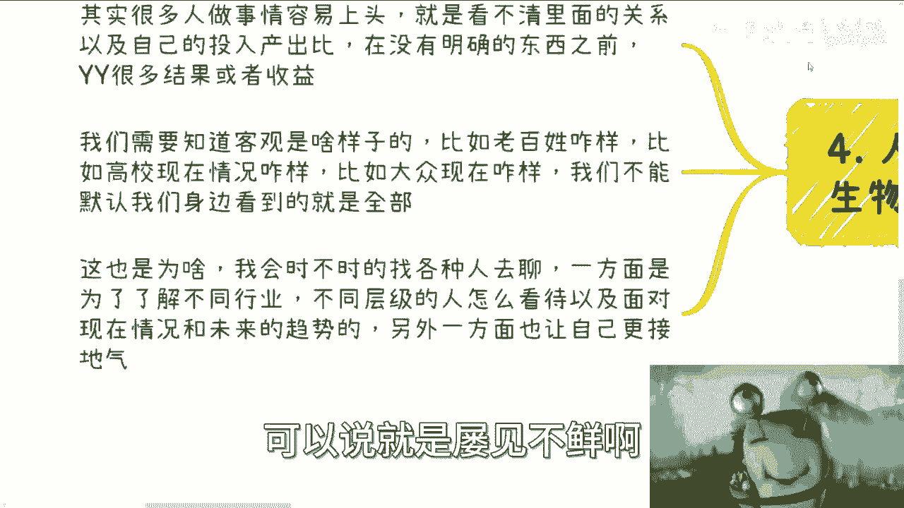

# 也许你身不由己，但你需要有初心，知道自己是谁，要做什么 - P1 - 赏味不足 - BV1M34y1w7DB

哈喽大家好，今天礼拜一啊，呃呃这我们这次讲的这个主题呢，是因为啊首先先说主题啊，就是很多时候是身不由己啊，但你需要有初心，为什么会说这个话题啊，嗯是因为之前有一次我在杭州啊。

下午碰见了这么个事儿，嗯我知道什么公司啊，但是什么公司我就不提了，这个我觉得大家心里也有数，某一天下午吧，我在咖啡馆看到了一群hr在那边下午茶，然后再讨论什么呢，说因为离我很近嘛对吧。

我很好奇他们在聊什么，毕竟我就很八卦，然后整个听下来呢，其实他们那天下午的核心呢是在于，怎么让员工内部创业啊，好像是一些对吧，就就就就就是本地生活的事业部吧，然后让他们能够更加主动。

更加积极的完成公司的KPI，当然我听了也很久了，他们相当于是一个应该是一个leader啊，带了他们的团队啊，然后呢他们就在那边想各种方法去PUA，在我看来就是想各种方法去洗脑。

嗯当然这个事情在我看来是PUA，在他们看来就是锦囊妙计，本期呢在我看来就齐了对吧，包括今天下午呢呃不是今天下午，昨昨天昨天下午我在那个呃对面啊，也就几个貌似是老板啊，然后也在说那离我也很近啊。

然后我就把耳机拿下来啊，他们的意思就是说要让员工加班多干活，然后呢其中一个女的啊，然后就告诉告诉另外两个男的，就说啊要让员工明白，多干活才有成长啊，才能晋升啊，呃说实话我是真的是控制住我洪荒之力啊。

毕竟他妈的。

资本资本家就在面前是吧，我真的很想上去抽他们啊，嗯想想算了。

跟我也没什么大关系啊，那么首先第一点呢，我觉得很多时候呢也许我们的确没办法啊。

就是你可能的确是需要见人说人话，见鬼说鬼话，那当然了啊，这个我现在你让我去做这个事情，我现在是不可能的，但是以前呢还是有可能的对吧，那不过你要说直接这个有人把钱甩我脸上吧。

当然性价比较高啊，你比如说一个小时10万块钱啊，那也行，我也可以昧着良心去拍彩虹屁啊，没问题啊，但是一般性不太可能对吧，那我就直接怼啊，你说这些hr吧，这个一定那么不堪嘛，也不一定啊。

那他们有的时候呢也是逢场作戏，但具体我也不知道，我无从考证啊，但是我觉得无论我们是怎么样的岗位啊，不不管你今天是做hr还是做产品经理，还是做什么呃，开发leader还是做什么东西啊。

我觉得我们都要明白什么是对的，什么是不对的对吧，就是说我们要站在我们的立场，而且你要有不同的立场，你说我现在可能是一个老板，可能是一个员工，可能是个资本家，可能是个什么对吧，就是你得有各种各样的立场。

但是你从不同的立场上面，你都要明白什么是什么是对的，什么是不对的，而不能说因为你今天的立场改变了你，你的对立面，你的敌人就变了，那不行了对吧，你比如说什么让员工内部创业，要有创业精神对吧。

然后说什么要实现公司的目标，这种鬼话，我觉得你做做戏对吧，说说就好了啊，如果你真的这么想，那我觉得你真的就是他妈的走狗，对不对哦，你为什么你你说你从任何角度来讲，那那我作为一个员工。

我为什么要有创业精神啊，那莫名其妙的哦，我拿一份钱打一份工，你凭什么让我有创业精神，创业精神我多付钱吗，对不对啊，难道你跟我说，我来打工不是为了钱，那他妈不是为了钱，为了什么用爱发电吗，那你一分钱别花。

那算了，对不对啊，包括对员工也是你可以严厉，你可以对外，而且你要明白就是呃你对外可以不要脸，你也可以用各种不要脸的手段对吧，去折腾你的对手，或者说去怎么样子，但是你对自己的员工。

我觉得怎么样对他们是最好的，他们怎么样才是真的有成长，你还是要如实告诉他们的，包括就是说我是觉得我们的老师，我们的高校对吧，我们得如实的告诉学生现在市场什么样子，而不是一天到晚PUA他们对吧。

哎呀你这个专业好专业牛逼啊，这个专业出去对吧，马上财富自由对吧，怎么样怎么样没有意义的呀，对啊，所以说就说我，我觉得现在就是基本上都存在这种PV下面啊，然后跟他们说啊。

你们要好好做做，做什么才能晋升对吧，明天明天就能走上人生巅峰，都他妈是屁话啊。

然后你像之前还有人问我，他说他说，那是不是说我给政府跟高校做咨询的时候，我给他们讲的内容跟话术，是不是会跟我在视频里面讲的一样啊。

首先你看啊，视频我对着电脑做咨询，我都是现场做的啊，整体风格跟气场肯定是不一样的，你让我对着电脑做，我还真没有这种风格啊，所以说未来你反正大家你要有机会，你可以来现场来听，对不对啊，首先是第一个。

第二个，当然啊你说我是不会说的很露骨，我也会，但是我绝对不会一开始说为什么。

因为我不知道下面哪些人是有什么想法对吧，因为每个人追求不一样，每个人视野也不一样，每个人的认知也不一样啊，那你说我给他们讲大锅饭的时候应该怎么说，就怎么说，也有可能是知识类的教学对吧。

就是我有啥说啥就一板一眼的，不会涉及到任何的，就我们称之为啊就是真实的情况或者怎么样子，我就是PPT上有什么我就讲什么，对不对，但是但凡结束了，你比如说线下的沟通，私下的沟通，我就会告诉他们对吧。

怎么样做是对你们有利的，或者说现实现状是什么样子的，这个事情我可以明确告诉你们，对方是学生也好，对方是领导也好，都一样的，为什么，因为本质上你要明白，你只要说大锅饭，无论你说的好话是好话也好啊。

坏话也好，封城的话也好，事实也好，虚伪也好，本质上没有区别的，就是因为为为什么，因为有区别的是什么，就是你要去看听的人，因为只有私下来找你的，只有他们线下愿意来跟你沟通的，他们主动来问出一些问题的。

那么他们是有思考的，或者他们真的能明白一些东西对吧，那么你跟这些人去讲客观的东西，或者讲一些事实上的东西，他们是听得进去的，同时你这话对他们是有价值的，否则的话你整个话说出去，下面人对吧。

你根本就不知道他接收到这个信息，你讲的是A，可能他根本理解出来就是BCDFG，那怎么办呢，没有用的啊。

那讲的都是屁话对吧好，那么我觉得嘛就是本质上呢。

人呢它是一种很容易被同化的生物，什么意思呢，就是说就是很多时候啊，呃我觉得大家以前可能是这种样子，就是比如说他可能是啊A这种样子对吧，但是呢他随着做某些事情，或者说跟某些群体时间长了。

他就容易被容易被改变，因为很多人做事情他容易上头，他看不清楚里面的关系以及自己的投入产出比，呃，他在没有明确的东西之前，他和也自己会去YY，有非常多的结果，结果或者非或者非常多的收益，就这种东西啊。

在我跟别人的咨询里面，可以说就是屡见不鲜啊。

而且另外一方面就是说我们时间长了，我们也得去知道客观到底是怎么样子的对吧，比如说你说老百姓现在怎么样啊，比如说高校现在什么样子啊，比如说创业者现在整个基本盘怎么样子啊，比如说大众现在怎么样啊。

就我们不能默认我们身边的一些一些一些一些，比如说呃人或者说一些事件啊，或者一些情况，它就代表全部没有用的，因为我可以告诉你们，你们有些人身边的人很优秀，但是你们身边人再优秀对吧，或者说量再多。

你相比整个全全国，整个14亿人他就是很小一撮，很小很小一撮，它不能代表任何东西，所以你会发现，不管是你们自己想要去赚钱，还是你们想要去做点别的事情，你们身边的这种这种叫什么幸存者偏差。

都会影响你们的判断对吧，这就像我给你们举个例子，这就像很多人跟我说，哎为什么我今天去做某某某东西，我赚不到钱，很简单啊，我说我就给你们讲，打个比方，比如说有很多人想要去做企业家培训对吧。

或者说想要这个卖所谓的知识变现吧，好我说为什么为什么你赚不到钱，是因为你今天我给你讲一个东西，我说哎比如说AIGC对吧，或者说有一个课程，你们马上就会马上就会有一种反应给我是什么，这种东西都有人报名的。

这个东西这么的这种东西，他妈的百度上一搜就有的对我说，就因为你们这种反馈，就因为你们这种样子才赚不到钱，为什么，因为你们永远在用你们的认知，去衡量你们的客户对吧，你也知道你拥有跟你们一样的认知。

人怎么会去付钱呢，怎么怎么会去上这种课呢，那如果他们不上这种课，不付钱，你们怎么赚钱呢，你有没有想过这个问题对吧，就所谓降维打击，降维打击，你得知道你们的受众是什么样子的。

而不是永远用你的认知去衡量他们，所以其实我为什么说很多人，就包括我去咨询的时候，我跟你们很多人都会说，我说就是什么，我说一开始我就说我说你们不接地气，为什么，因为的确不接地气，你接地气。

你肯定是能够知道对方要什么啊，你不接地气，然后你就会在里面抱怨说，为什么我赚不到钱，那为什么那些就赚不到钱，那怎么办呢，对不对，所以说这也是为什么，就是说我会时不时的去找各种各样的人聊天。

而这些人可能是上到领导对吧，公务员呃，高校对吧，包括一些创业者，下到比如说三教九流的，人家可能是以前做传销，做微商的，做什么东西的对吧，就因为不同层级的人，他们所在不同的圈子，才会看到有各种各样的东西。

而我从他们身上也能知道他们是如何看待现状，以及如何面对未来的这种趋势的对吧，所谓教学相长，教学相长，没有一个人能面面知道我，我从他们身上的这种叫做解决方案也好，或者行为也好。

我也能知道可能目前是什么样子的，同时他们的解决方案，可能也能给我带来很多的灵感，对不对，因为这样的话就说我也能让我更接地气。

否则的话就是说没有一个人能够保证自己，永远是能够去很客观的看待别人或自己的，但为什么我们说要聊啊，为什么我们说要有固定的一些，一些一些社交的小伙伴，这一方面是为了你能够从他们身上获取的东西。

同时另外一方面你也需要让他们来鞭策你，呀对吧，因为每一个人你你你level再高，你做决定的时候你总有盲区对吧，那么你对方听一些给你些建议，没有什么不好，就是你接不接受都是你自己决定的。

但是你多听些建议没什么不好是吧，这就像我给你们做了这么多的免费视频，一个道理对吧，就是你可以认可，你也可以不认可对吧，所以说我就不能理解，就是那些不认可的，他还要在评论区去攻击别人。

而他还要在评论区秀一下优越感，那我就觉得就是你其实并不是不认可你，更多的室友自己的情绪，那我觉得就没有必要了，何必呢，对吧啊，OK嗯就是这么个情况，因为每个人都会成长，而你们很多人都会有自己的圈子。

也都有自己的认知啊，但是我希望就是说呃，大家都都需要时不时的跳出来，以更高的高度去看待问题，看待自己，那这样的话才不会原地踏步，也不会线路，就是这种牛钻牛角尖的这种怪圈，好吧行啊，就这么着吧啊。

然后反正有什么这个商业上的问题，或者别的方面的，或者其他的这个商赚钱啊，或者别的东西，反正有问题的，你们总结好，总结好。

