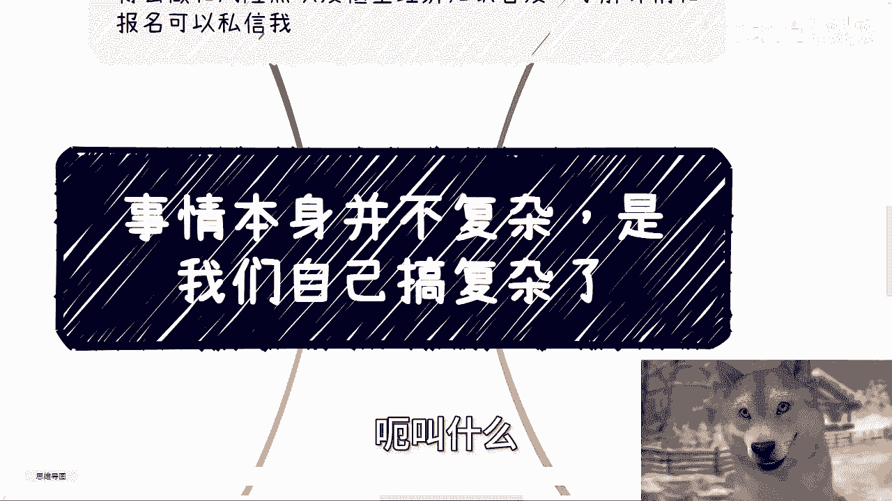
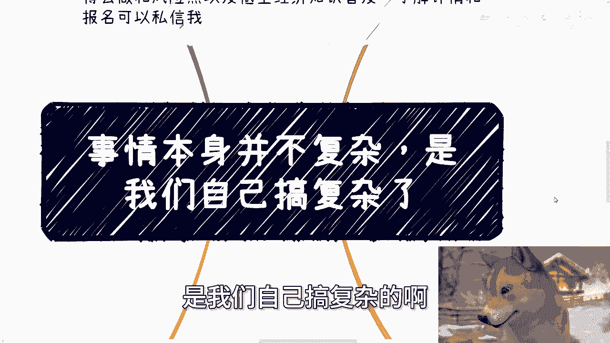
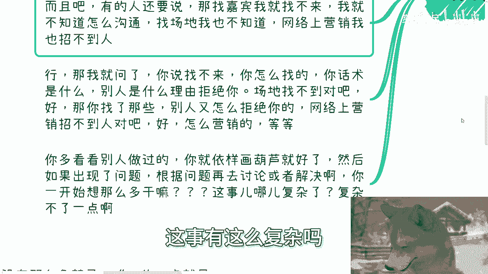
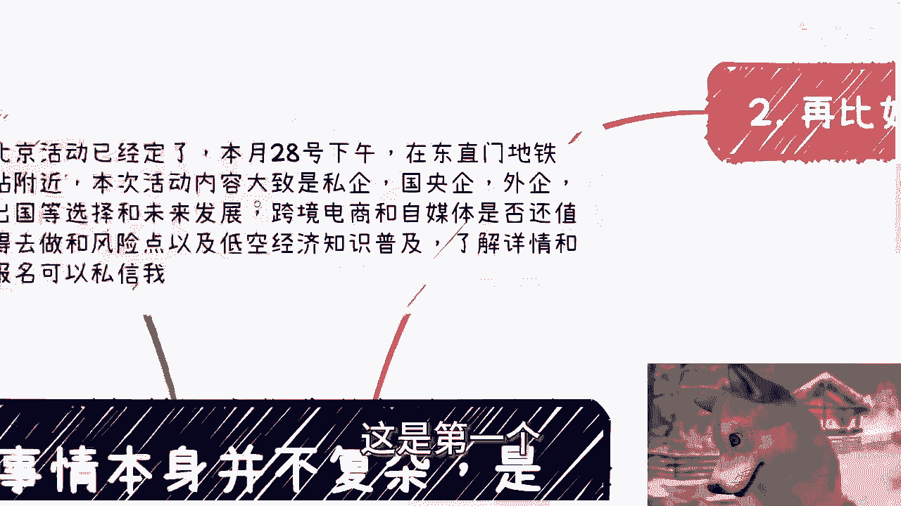
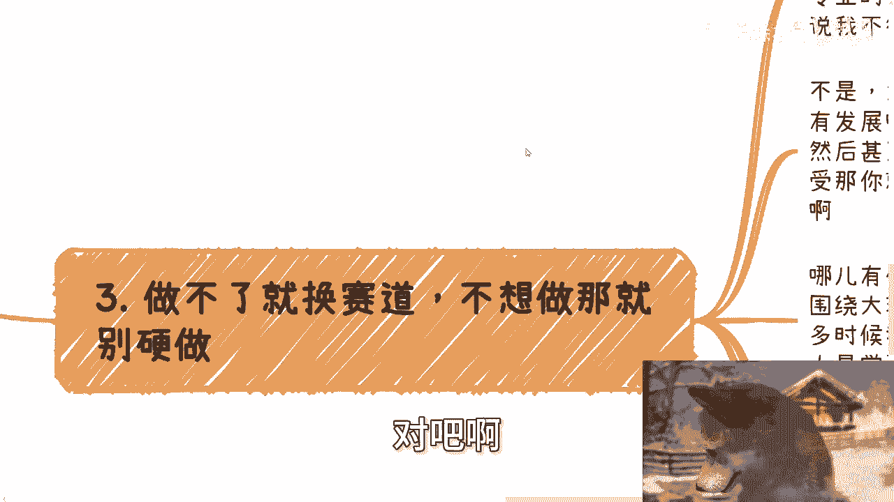
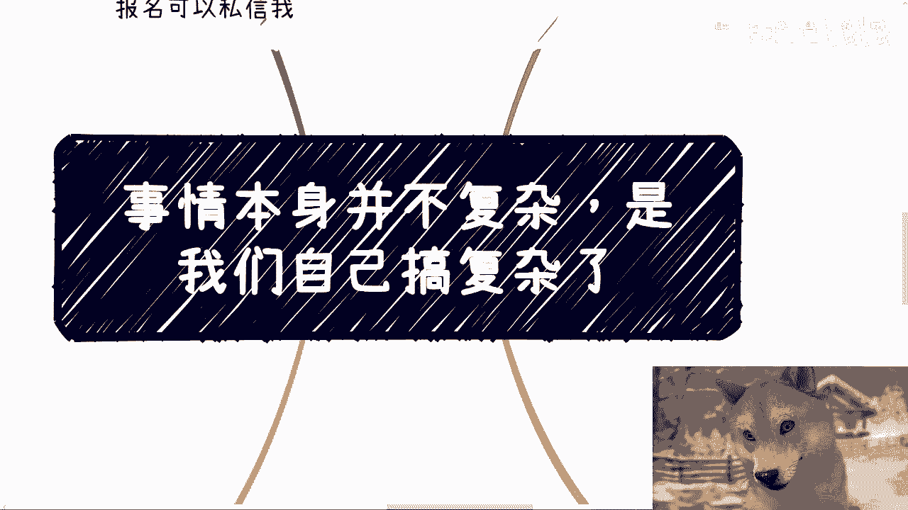

# 事情本身并不复杂，是我们自己想复杂了 - P1 - 赏味不足 - BV1Pb421773r

好大家好啊，这个呃这两天忙了一点啊，昨天怠慢了啊，怠慢了，谢谢怠了啊，呃叫什么呃。

我今天又去了一下B站对吧，这个又去B站，没想到他妈他里面还能抓娃娃是吧，还能还能打游戏啊，虽然还得我付钱。

最后一个都没抓到啊，呃首先今天是这样子的啊，今天我们讲的这个内容啊，是呃事情本身并不复杂啊，是我们自己搞复杂的啊。

具体是什么，反正你们到时候看呃，北京活动啊，北京活动就是后天28号稍后天嘛啊，对28号在东直门地铁站附近好吧，然后本次活动的话内容几个，一个是我会跟大家讲一下私企国，央企，外企啊。

出国等一些offer的一些选择，还有未来的一些发展，然后第二个呢就跨境电，就个人角度来讲，跨境电商还有自媒体啊，他是否还值得去做，还有就是说这个低空经济的这个知识普及啊，然后了解详情的跟报名的。

你们可以继续私信我，好额好，那我们今天正式开始我们这主题啊，首先啊比如说啊这些话，你看啊，你说很多人跟我聊啊，就跟我聊做活动这个事啊，就随便举个例子啊，你们自己自己举一反三啊，比如说他说出了这个事。

就咱今天就摊开来说啊，我就我说实话，我是真不明白啊，我是真不明白，就这个事难，你说难在哪里吗，是让他们验证1+1=2吗，不是啊，还是说解一个高数题目也不是啊，对不对，那难在哪呢，这事本身你把逻辑拆开来。

就是你找嘉宾，然后你找场地，然后你做营销，然后就是到了时间去执行落地不就好了吗，哎我他妈就这样问啊，你今天找不到嘉宾，你来做行吧也行吧，你找不到场地，你随便找个咖啡馆也行吗，你说你做营销，那我就算啊。

到最后变量上面一个人都不来，这个事情怎么了呢，就这个事情只能说结果不好，但这个事情落地有什么不好落吗，我实在是想不明白呀，难点在哪啊对吧，然后你们知道吗，很多人张口就来啊，他就跟我说。

哎陈老师这个事有点困难，我就不懂了，诶，你困难是什么，什么东西是困难，我他妈一点都不理解对吧，然后我问他们吧，他们就说的最多的一个原因是什么，我没有做过，我没有经验，哎我觉得有点难，哎我操大哥。

你做什么事情不是第一次啊，谁做什么事情不是第一次啊，啊那照你这么个理由，那他妈高考以前你考过吗，你没有考过9年制义务教育教育，你读过吗，也没有读过，那他妈你为什么要读啊，啊那高考你为什么要考啊。

我他妈奇了怪了对吧，哎那照这么个说法，那他妈做人我还第一次做嘞，那照你这么说的话，我不要做啦，投胎是不是啦，就哎这种理由说出来，我真的觉得蹊跷了啊，而且吧啊有的人还要说他说哎，那找嘉宾我找不来呀对吧。

我就不知道怎么沟通啊，啊找场地我也不知道呀，啊网络营销我也招不到人啊，行那我就问啊，我就问你说找不来对吧好，你怎么找的，你话术是什么，别人拒绝你的理由又是什么啊，场地找不到对吧好，那你找了哪些。

别人又是怎么拒绝你的，你花了多少钱对吧，然后网络营销找不到人对吧好，你怎么营销的海报怎么做的，对不对啊，我就这么说，今天互联网就发展到2024年了，你随便找个别人做过的去模仿就行了呀对吧。

然后如果出问题了，我们再根据问题，就像我们刚上面说的，你说你找不到人对吧，好那别人怎么拒绝你的等等等，你根据具体问题再去具体讨论解决啊，做都还没做呢，一开始就他妈给我一一连串的。

就就一连串我们这边写的这个问题唉，有什么用呢，有什么用呢，这事有这么复杂吗。

没有呀，复杂不了一点，我跟你们讲对吧啊，这是第一个第二个啊。

第二个啊，再比如再比如这些话啊，在这些话，他说陈老师我要找个增量市场，为什么呢，因为这样的成功概率该额成功概率高一点啊，呃我竞争力是这个竞争力强一点对吧好，那没问题啊。

第二个我要找个政策扶持比较强的城市啊，这样赚钱概率更高一点啊，也没问题也没问题啊，然后他说我想找一个更好一点的这种合作方，或者更优秀的人做合伙人对吧，增加我成功的概率，对不对对啊，然后呢。

更尤其的是比如说你们很多人还没毕业啊，他就这么说，他说哎我想选一个好一点的专业，哎陈老师这个专业怎么样，那个专业怎么样啊，巴拉巴拉巴拉好，我统一回答你吗，我统一回答你吗，大哥大姐啊，爷爷奶奶啊。

你们他妈的是要赚几个亿还是要赚几百个亿啊，然后你们选专业是要去得诺贝尔奖，还是说要去造核弹啊，还是要去月球上面给人类谋未来的发展，诶我不懂你们的目标是什么对吧，你们明明大部分人连几百块。

几千块都还没赚到，也明明读了一个专业，最后也无非都是一个就是没有生命线的，这么一个，读完拿了个毕业证书，考虑这些干嘛，诶我不明白，我是特完全不理解，你知道吗，就是就是我跟他们说，我说你找个增量市场。

然后呢妨碍你赚那几百几千吗，你找一个政策扶持比较弱的，就算没有政策扶持的妨碍，你赚那几百几千吗，对不对对吧，你想这些东西干嘛，为什么要搞这么复杂呢啊，然然后大部分人永远就卡在这点上面，然后就跟我说。

哎陈老师我找不到，所以我走不出第一步，是要赚几百个亿是吗，对吧啊。

然后第三做不了就换赛道，不想做，那就别硬做，什么意思，就比如说很多时候会有这样的情况，其实我都知道的，比如说啊他们问我，他说陈老师，我是化学专业的，我是土木专业的，我是设计专业的，我应该怎么活。

我应该怎么服那个发展，我怎么回答，你让我你让我怎么回答对吧，你要让我跟你说事实，我就跟你说，你大概率没什么发展，然后你但凡跟他们这么说嘛，他们就就要喷我啊，他们就说陈老师不行，我跟你讲，大哥啊。

咱就这么说啊，比如说土木有发展吗，有的呀什么发展，比如说你去社区医院有发展吗，有的呀什么发展，加班啊对吧，然后工资一般啊，没有，对你们来讲就是所谓的没有竞争力的工资对吧，然后甚至就是说跟他结那个给你钱。

甚至还是要根据项目款，结款周期来给你钱的对吧，不结款你就没有钱，那我就问你嘛，你自己接不接受嘛，对不对，你接受，那你就去做，你不接受你就去学别的赛道不就这么简单吗，对吧哦，你搞得好像你不接受。

你去死磕就能改变一样的，能改变吗，怎么地啊，改变环境的人啊啊你这么牛逼啊，对不对，没有意义的呀对吧，然后而且另外一方面，哪他妈这么多事情有解法，我早就说了，我们只能我们都是尘埃。

我们只能围绕大环境转对吧，你不可能让环境围围围着我们转，那么很多时候，我们的技能点或者我们的成长环境，我们身上的牌可能就没有解，那怎么办呢，你包括有的人还是学汉语的或者英语的，你你说怎么办，对不对。

你你就说你要解法，OK那我就告诉你你要解法是什么，就是相对来讲你一定要去学一些新的东西，学一些别的东西，比如说营销，比如说某个细分领域的一些赛道的一些知识点，对不对，你你可能结合一些你的专业能力。

还有还有就是说所谓的发展和赚钱的可能性，但是你会发现很多人啊，他们是就是他根本就不在乎你跟他讲什么，他就是就是无脑的拒绝去学习，非他本专业的东西，他也拒绝去付出更多东西，就要非要在已有的专业上面。

或者已有的手上排呃，呃那个所谓的那个有的牌上面去一路走到黑，然后还要跟跟还抱怨抱怨，卧槽，我他妈怎么走不通啊，你们怎么不能帮我走通对吧，你们他妈都是，那那我还能说什么呢，你你你你说这个事情复杂吗。

不复杂，你非要自己死磕，那他妈怪谁呢，对吧好，第四点啊，再比如有的人问我商业的竞技啊，前两天聊的时候聊到这个，我就这么说，他的原话问的是他说陈老师商业有哪些禁忌，我说要我说没有什么哪些唯一。

我觉得只有一点就是什么，就是不要让别人觉得你是，这就是商业的禁忌对吧好，那么有人要问了，那说那那你这句话就是屁话，怎么让别人觉得你不是呢，我跟你讲啊，那就是你做事情得要有逻辑性。

以及你能很顺利的回答别人的问题，好，那么我们就问什么是逻辑性对吧好，很简单啊，你比如说你来找我对吧，你跟我说你要我做什么，你跟我说你要做什么，你跟我说我们到底怎么分钱。

你也要跟我说钱到底从哪里来不就好了吗对吧，你直接把方案写出来，然后我们来讨论，而不是说没有方案，或者说就是一个模棱两可的方案，那你找别人干嘛呢，你有啥逻辑性对吧，另外就是你方案好和不好没有关系。

大家可以聊，你明白吗，但是如果你拿出个方案好，60%，70%，50%都是不确定的，问到你方案里面细节，你说哦这个嘛我还没聊好哦，那个嘛我还没确定哦，这个嘛我还是先写在上面的，那他妈的你你做什么。

受众是谁，以及受众为什么付钱等等等都不清楚，那你去找别人，你让别人怎么想，对不对，那有的人要说了，哎陈老师，那画饼不就这么画的吗，我跟你讲啊，对你说的没有错，没有问题，但是啊你想一件事情啊。

你画饼可以都说确定了，然后你落地落不下来，说出来，你呃就是所谓你写出来的你也都实现不了，那你还是呀对吧，无非就是让别人晚几天，晚几个时间周期，觉得你是，而且人别人会觉得你更，因为项目越往后拖。

大家损失越大，对吧好，那么说到这里啊，那有的人又要说了，他说那按照你这说法，那饼画不了了，我就这么讲啊，画饼如果就是让你纯张口就来，纯说空话，那有什么难点呢，谁不会画呀。

对不对，哎，什么叫画饼啊，画饼的点无非就两种，一种是你可能是有一定概率能请过来对吧，你可能没有太大把握，那你先写在上面，先装个逼对吧，这叫画饼，而不是说你真的一穷二白，什么都没有，你就往墙上画了。

对吧啊，这是第一种啊，第二种就是说你但凡画出来的东西，如果最终实现不了，你还有plan b plan c能够去做一些平替，对不对，那我随便举个例子啊，随便举个例子，我不是贬低谁啊。

比如说你今天找约一个院士，你最后约不来，没关系啊，那你找三个院长找，找两个副校长过来顶顶行不行也行啊，你不能到最后两手一摊说，唉不好意思，我一个人都请不来，那你就是，对不对，好，那么我们再打个比方。

你说我今天想找清华来对吧，想找北大来哦，最后请不来，你比如说我找交大来，复旦来，请不来，那也没问题啊，那你去找两个有点名气的职业院校，去找两个有名气点的三本二本也行啊，你不能两手一，他什么都没有啊。

你懂吗，这叫画饼啊，啊这就是我们所谓的画饼跟张口就来跟，跟怎么怎么说呢，跟哼跟诈骗跟造谣的区别啊，对吧，你你就真的就是就是你会发现啊。

我甚至会觉得我在给你们解释这件事情，我都是，为什么，因为哎你们自自己想想看吧，有逻辑性的人能不明白吗，哦你画一个饼最终实现不了，这也叫画饼吗，啊哎奇了怪了就对不对啊，所以说你会发现。

很多时候就是我跟大家沟通问题的时候哇，就是为什么我会觉得事情不复杂，是因为很简单，能做就做，不能做，拉倒换对吧，换了如果你你能不能做，你再去积累，你再去怎么样不行，那就换对吧，对方能合作就合作。

不能合作，让他滚没了呀，哪这么多屁话呀，对不对哦，然后一天到晚嘛，他们就就很多人跟我说，哎呀陈老师这个人好像关系比较硬对吧，不能得罪哎呀，那个人嘛，好像我觉得我能跟他赚到钱的。

我说你们自己听听你们说的这话，哪句话接地气，哪句话有具体案例具体性的，你跟我说这人牛逼，哪里牛逼了，怎么了呢，得罪怎么了呢，把你封杀了对吧，然后那个人说啊，这你你跟我说哎，那个人我能跟他赚钱。

我就问怎么赚钱，赚多少钱，凭什么给你赚钱，唉所有东西都不确定，然后就开始自己在里面啊，思来想去，你说事情怎么复杂了，哪儿这么复杂了呢，对吧，行吧啊就这么着吧啊，然后那个呃职业规划啊。

不那个活动啊，活动后天那个活动报名去报名。

然后剩下就是说你自己现在如果还在读书对吧，或者说你现在做什么工作啊，或者你跟别人一起合作什么东西啊，那么在这当中碰到的一些问题啊，包括合同啊，呃商业计划书啊对吧，分红分润啊对吧。

包括呃这个细一些一些业务上的细节问题啊，包括就是你自己觉得这里面有坑的，你拿捏不清楚的，包括啊你的职业未来的发展跟商业未来的发展，你们觉得有任何的问题，或者希望通过我的视野和通过我的一些呃，经历啊。

能够给你们一些更接地气，或者来说更更更更能够不走太多弯路的一些建，议跟规划的话，那么你们整理好对应的问题跟个人背景好吧，我们再来走咨询好吧。

