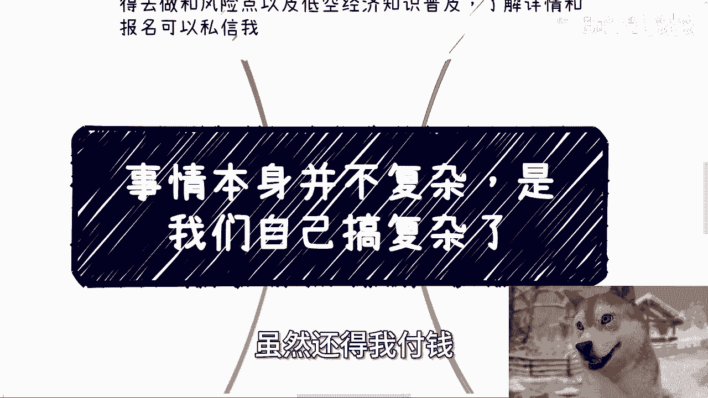
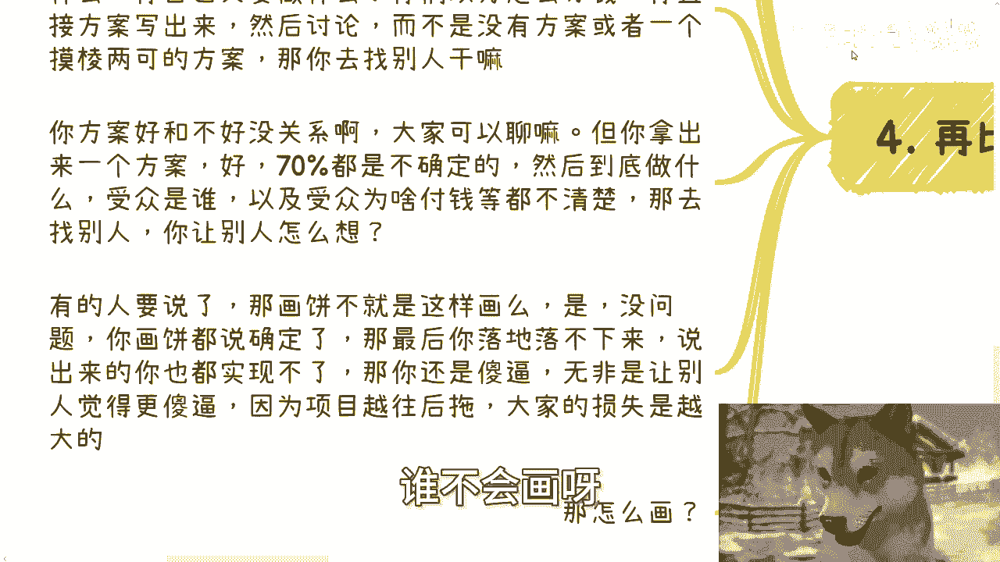
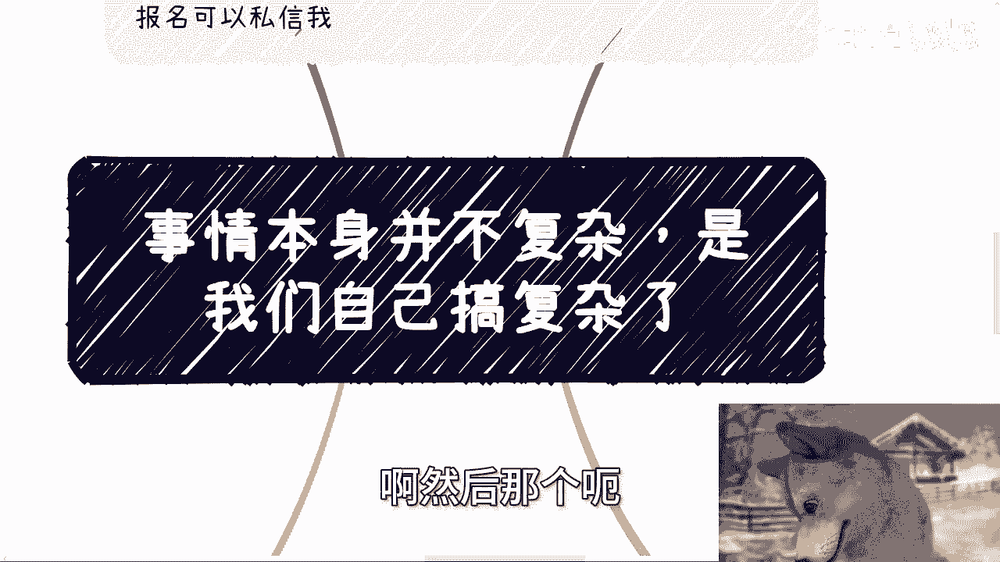
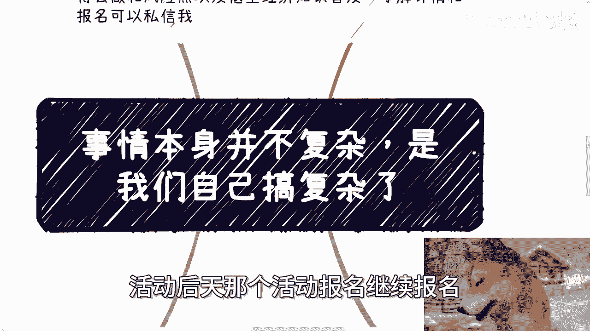

# 课程 P1：事情本身并不复杂，是我们自己想复杂了 🧠



在本节课中，我们将探讨一个核心观点：许多看似困难的事情，其本质并不复杂，是我们自己的思维和行动方式将其复杂化了。我们将通过几个具体场景来分析这一现象，并提供清晰、可操作的思路。


---

## 概述：复杂性的来源

我们常常在面对新任务或挑战时感到不知所措，将问题想象得比实际情况更困难。本节课程将拆解这种思维模式，并展示如何通过简化问题、聚焦行动来克服它。

上一节我们概述了课程主旨，本节中我们来看看第一个具体案例：组织活动的思维困境。

## 一、 拆解“第一次”的恐惧

许多人面对新任务时，会以“没有经验”、“第一次做”为理由感到畏难。以组织一场线下活动为例，其核心流程可以简化为一个公式：

**活动成功 = 找嘉宾 + 找场地 + 做营销 + 执行落地**

这个公式本身并不复杂。难点往往在于行动前的自我设限。


以下是面对新任务时的正确思考步骤：


1.  **明确核心要素**：将大目标拆解为如上几个可执行的小任务。
2.  **接受不完美起步**：找不到理想嘉宾？自己先顶上。没有完美场地？咖啡馆也可以。担心没人来？先执行，再优化。
3.  **模仿与迭代**：在互联网时代，几乎所有事情都有先例可循。先模仿，再根据遇到的具体问题（如被拒绝的理由）进行针对性调整。
4.  **聚焦具体问题**：不要笼统地说“难”，而要问“难在哪里？”。是沟通话术问题？是预算问题？还是渠道问题？每个具体问题都有对应的解决方法。

事情本身不复杂，复杂的是我们在行动前预设的种种障碍和对于“完美”的执着。

上一节我们讨论了如何克服对新任务的恐惧，本节中我们来看看另一种常见的复杂化思维：过度追求“最优解”。

## 二、 警惕“过度优化”陷阱

在起步阶段，我们常常陷入对“最优条件”的无限追求中，例如：
*   一定要进入“增量市场”。
*   必须找到“政策扶持最强”的城市。
*   非要与“最优秀”的人合伙。
*   纠结于选择“最有前途”的专业。


这种思维会导致一个悖论：**在追求100分条件的过程中，连1分的事情都没开始做。**

关键在于重新设定目标优先级。对于绝大多数人而言，初级目标并非赚取亿万元或获得诺贝尔奖，而是先赚到几百、几千元，或先掌握一项实用技能。

因此，思考逻辑应转变为：
*   选择一个“增量市场”与否，影响你赚取最初的几百元吗？
*   城市政策扶持的强弱，妨碍你完成第一个小项目吗？

过度追求宏观的“成功概率”，而迟迟不迈出第一步，是本末倒置。事情的核心是**先行动，再优化**，而不是在行动前就试图解决所有不确定性。

上一节我们指出了过度规划的陷阱，本节中我们来看看当路径受阻时，应该如何简单直接地决策。

## 三、 做不了就换，不想做就别硬撑

当在某个方向（如专业、行业）上遇到发展瓶颈时，许多人选择“死磕”，并将问题复杂化为无解难题。

清晰的决策逻辑应该是：
1.  **客观评估现状**：例如，“土木专业当前的市场待遇就是项目制、周期长、薪资普通”。
2.  **明确个人接受度**：你能接受这样的工作状态吗？
    *   如果 **接受**，那就继续。
    *   如果 **不接受**，核心解法是：**学习新技能，切换赛道**。
3.  **拒绝“无解”抱怨**：如果既不愿接受现状，又不愿学习新东西转换赛道，那么抱怨毫无意义。我们无法改变环境，只能调整自身策略。

用代码来描述这个决策过程就是：
```python
if 接受当前赛道条件:
    继续深耕
else:
    学习新技能()
    切换赛道()
```
事情不复杂：**接受，或者改变**。纠结于无法改变的现状，是最无效的复杂化。

上一节我们探讨了个人决策的简化逻辑，本节中我们来看看在商业合作中，如何通过保持“逻辑性”来避免复杂化。

## 四、 商业合作：逻辑清晰，避免空谈



商业合作中最大的禁忌是：**让别人觉得你不靠谱**。避免这一点的方法就是保持极强的逻辑性。

一次逻辑清晰的合作沟通应包含以下几个明确要素，可以视为一个合作提案的必需模块：

```
1. 我们要做什么？ (项目内容)
2. 你我各自做什么？ (分工)
3. 钱怎么分？ (利益分配)
4. 钱从哪里来？ (盈利模式)
```

与之相对，“画饼”与“诈骗/空谈”的区别也在于逻辑性：
*   **有价值的画饼**：基于一定概率和后备计划（Plan B）。例如，请不到A嘉宾，但有把握请到同级别的B嘉宾作为备选。
*   **无意义的空谈**：所有细节都是“不确定”、“还没谈”。没有落地方案，也没有备选计划。


商业合作本身不复杂，复杂的是掺杂其中的模糊承诺、人情顾虑和无法验证的“感觉”。聚焦于上述四个具体问题，就能让合作回归本质。

---

## 总结与行动建议



本节课我们一起学习了如何简化思维，直面问题核心：



1.  **拆解任务**：将大问题拆分为可执行的小步骤，立即行动，在迭代中优化。
2.  **聚焦当下**：在起步期，避免过度追求“最优条件”，先完成再完美。
3.  **果断决策**：对于走不通的路，评估后要么接受，要么学习新技能并转换赛道，不浪费时间死磕。
4.  **保持逻辑**：在商业沟通中，始终明确内容、分工、分钱和钱源，用清晰方案替代模糊空谈。

记住这个核心公式：**复杂问题 = 基础逻辑 + 具体执行 + 迭代调整**。大多数事情的基础逻辑都很简单，是我们对未知的恐惧、对完美的奢求和对沉没成本的不舍，为其披上了复杂的外衣。


**行动起来，在真实世界中遇到具体问题，再解决具体问题。**