# 互联网寒冬-2023我们需要同时拥有工作思维和商业思维-要做一个走出农场的-火鸡---P1---赏味

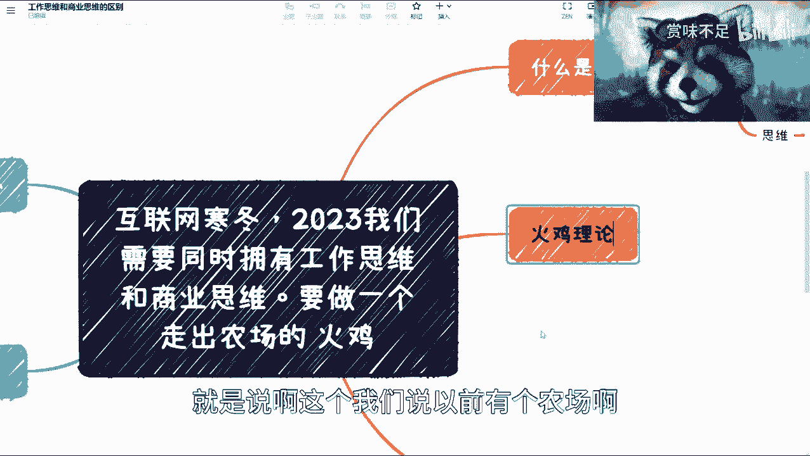

在本节课中，我们将探讨在互联网行业变化迅速的背景下，为何需要同时具备工作思维与商业思维。我们将借助“火鸡理论”的比喻，帮助你理解这两种思维模式的本质区别与重要性，并为你提供从“农场火鸡”视角转向更广阔视野的实用建议。

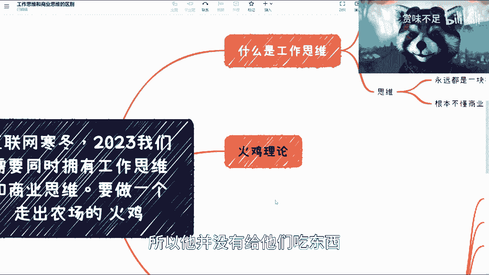

## 概述：火鸡理论的启示

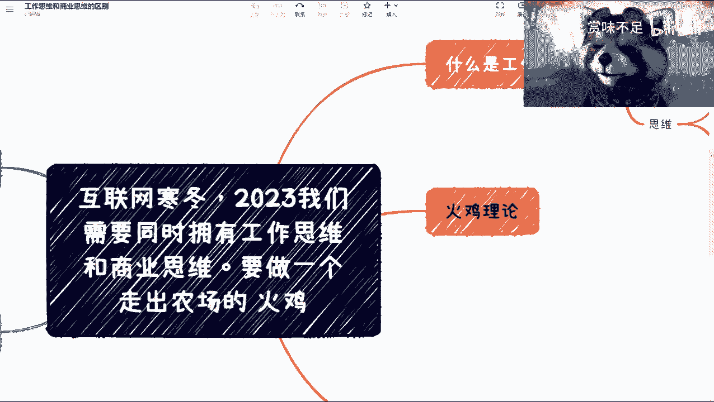

最近，“火鸡理论”因《三体》而广为人知。该理论描述了一个农场场景：农场主每天中午12点给火鸡喂食。久而久之，火鸡中的“科学家”总结出一条“真理”——每天12点食物就会出现。

然而，在感恩节那天，农场主同样在12点进入农场，却没有带来食物，而是将火鸡宰杀。这个理论揭示了一个核心观点：我们很容易将特定环境下的规律误认为是永恒真理。一旦环境改变或视角扩大，这些“真理”可能就不再成立，甚至显得愚昧。

这个比喻为我们理解工作与商业环境提供了绝佳的框架。

## 第一部分：剖析工作思维 🧑‍💼

上一节我们引入了火鸡理论的比喻，本节中我们来看看什么是“工作思维”。工作思维通常指在既定组织框架内，完成指定任务、追求职业发展的思维方式。

以下是工作思维的一些典型特征，特别是在对比“大厂”与“小厂”时经常被讨论：

1.  **技术广度与深度**：普遍认为，大厂提供的项目复杂度和技术挑战远高于小厂，能带来更快的技术成长。
2.  **沟通与应急能力**：大厂因组织庞大、协作复杂，更能锻炼个人的跨部门沟通和突发问题处理能力。小厂虽然也有锻炼，但基本盘较小，成长性可能受限。
3.  **流程规范性**：大厂人员往往对从几十人到几千人规模的项目流程管理有清晰认知，这是其重要优势。

然而，工作思维也存在明显的局限性：

1.  **容易产生傲慢心态**：部分人因身处大厂而自觉“见过世面”，产生优越感。
2.  **难以认清个人真实能力**：长期在成熟平台工作，容易混淆“自身能力”与“平台赋能”。许多人未能分清哪些是自己的核心技能，哪些是平台提供的资源和支持（**Buff**）。这导致一些人离开平台后，在创业或小公司环境中表现不适应。

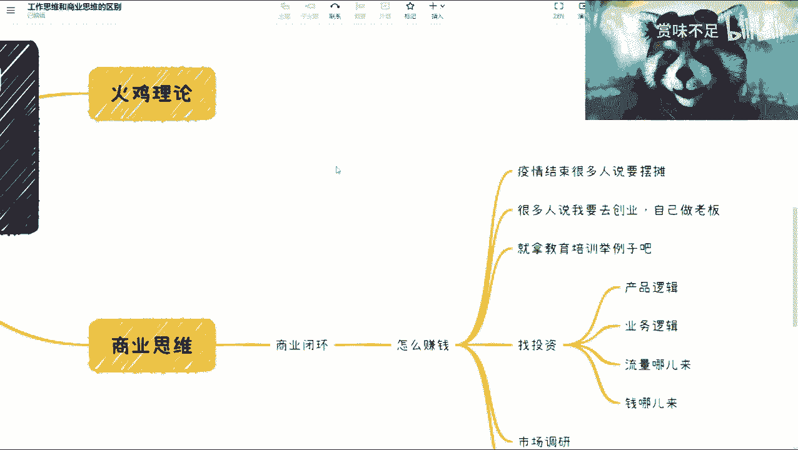

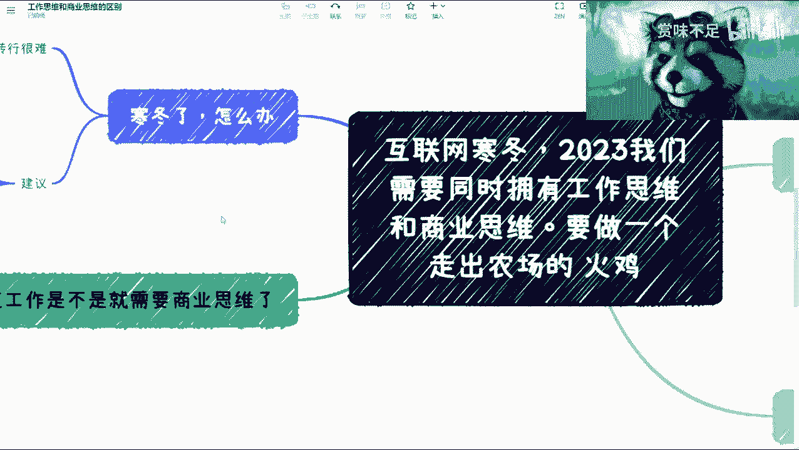

总结来说，无论在大厂还是小厂，如果只停留在工作思维层面，就如同农场里的火鸡。大厂火鸡可能吃得更好、看得更广，但本质上仍是火鸡。一旦将格局放大到整个商业市场，这种思维模式的局限性就暴露无遗。

在工作思维下，个人往往只是商业机器中的一块**拼图**。更重要的是，具备纯工作思维的人通常并不真正理解商业逻辑，这导致了与决策层之间的“信息差”。

## 第二部分：探索商业思维 💡

讲完工作思维的局限，我们来看看什么是“商业思维”。商业思维的核心是关注价值创造与变现，追求形成一个完整的“商业闭环”。

**商业闭环**指的是一个能自我维持、产生利润的商业模式。它不仅仅是有一个好点子（IDea），更要回答“如何赚钱”这个根本问题。

构建有效的商业思维，必须避免成为“农场火鸡”，不能只基于有限观察下结论。关键在于进行扎实的**市场调研**，从外部验证你的商业设想。

以下是几个需要商业思维分析的真实场景例子：

*   **摆摊创业**：不能只看到政策鼓励。需要考虑货源供应链、工作时长、投入产出比、潜在风险（如餐饮行业的水很深）。没有亲身实践，很难知晓其中所有坑。
*   **开办公司**：不仅仅是有一个创意。需要了解财务、法务、税务等企业运营的基本知识。认为“可以全部外包”的想法极其危险。
*   **教育培训**：做培训和做教育是两回事。切入教育领域涉及深厚的行业关系、固有模式和历史积淀，水非常深。
*   **寻找投资**：需要想清楚产品逻辑、业务逻辑、流量来源、盈利模式、目标用户画像等。不能错误地将热点事件的流量等同于自己项目的流量。

一个关键认知是：为公司赚取高额年终奖，并不完全等同于你为老板“赚了钱”。这可能是公司整体商业成功后的利润分享。真正的商业思维是思考：你的技能和资源，是否能直接或间接地**为企业创造收入**？个人与公司在利益上是共同体。

## 第三部分：寒冬下的根本问题与行动建议 🧊

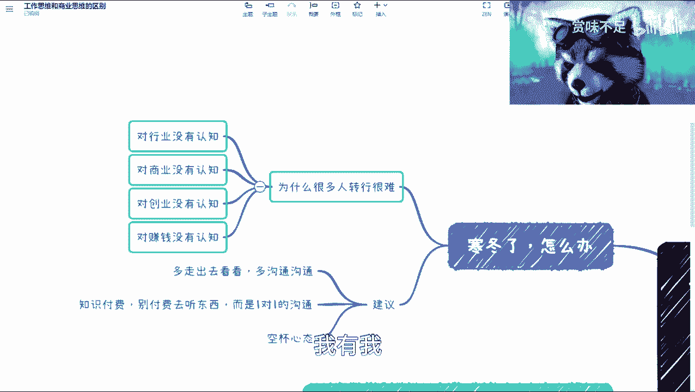

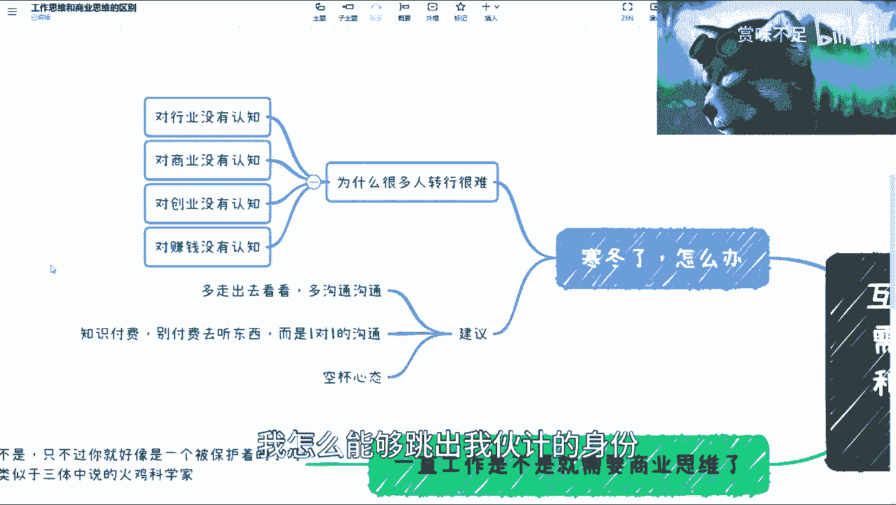

那么，为何很多人在行业寒冬时感到转型困难？根本问题在于“认知局限”。

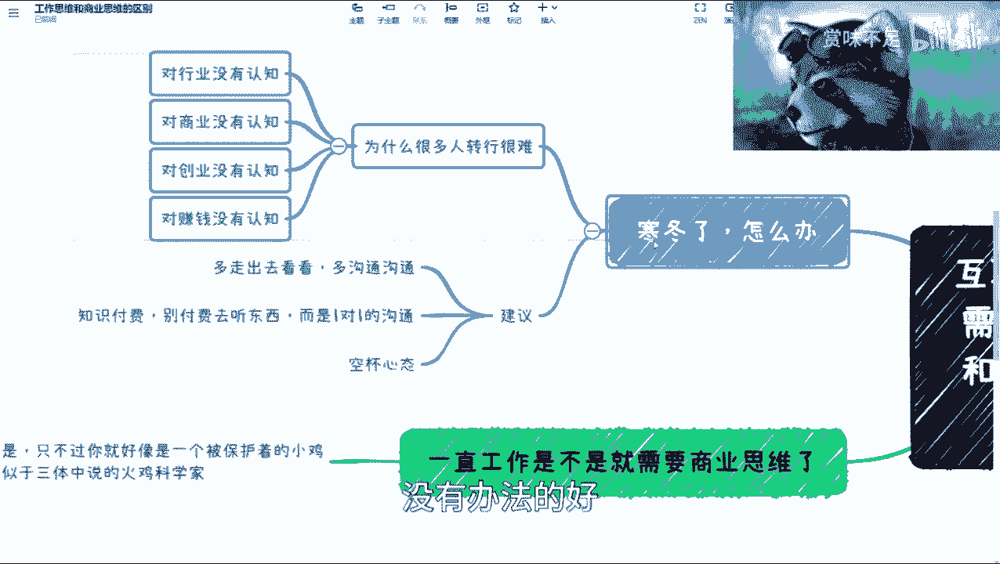

就像火鸡只看到饲料却不知农场如何运作一样，许多人对行业、商业、创业和赚钱的本质缺乏认知。焦虑的根源往往不是找不到工作，而是无法跳出“火鸡”的身份，对更广阔世界的运行规则一无所知。随着年龄增长，向外探索是必然选择。

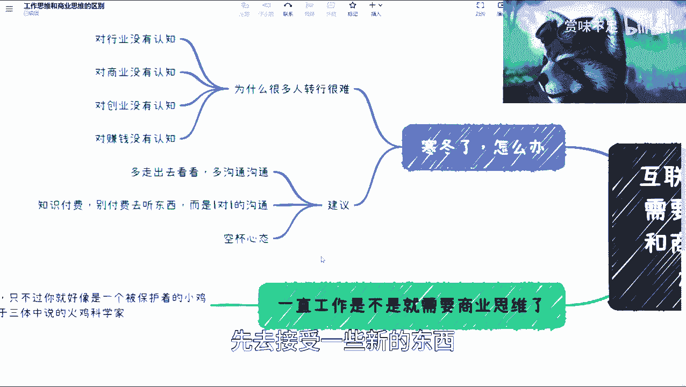

以下是几条实用的行动建议：

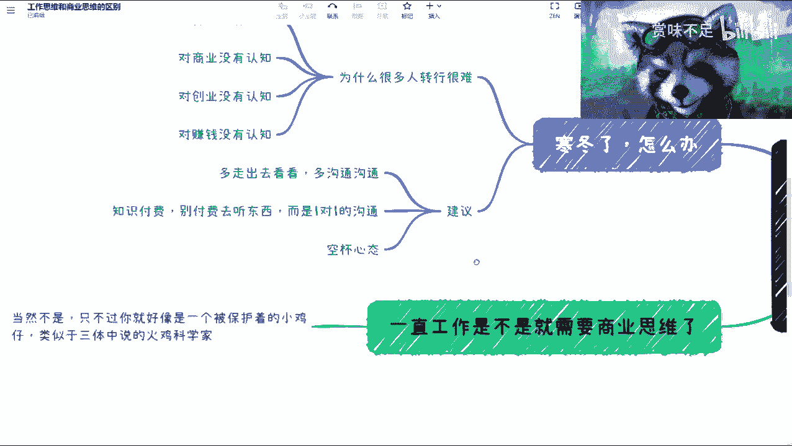

1.  **走出去，多沟通**：不要满足于网络上泛泛而谈的采访或内容。要寻找机会进行深度、一对一的交流。在信任、私密的环境中，更容易获得真实的见解和信息。
2.  **保持空杯心态**：在接触新观点时，暂时放下固有认知，先倾听和理解。避免急于反驳，可以基于事实进行理性探讨。
3.  **持续培养商业思维**：即使你计划一直打工，也需要商业思维。生活本身就是一系列“项目”（如买房、买车、大额消费），缺乏商业思维容易踩坑。商业思维是应对复杂社会关系的必要能力。

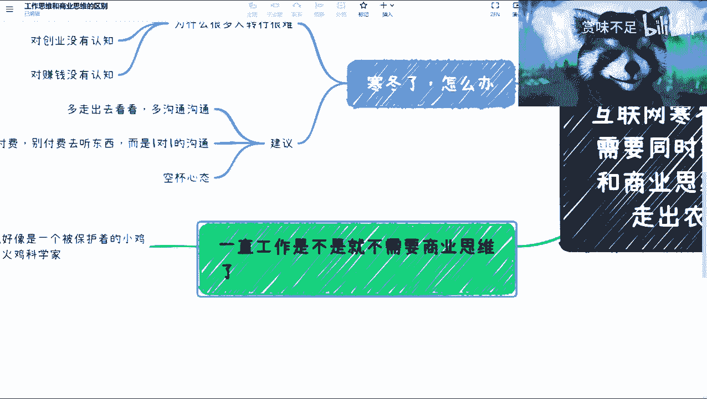

## 总结

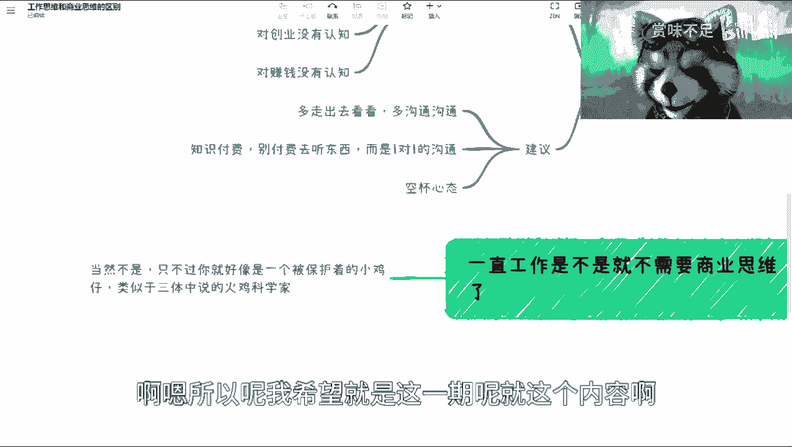

本节课我们一起学习了“火鸡理论”的启示，深入剖析了“工作思维”的特征与局限，探索了“商业思维”的核心（商业闭环）及其应用场景，并针对当前环境提出了拓展认知、培养商业思维的具体建议。

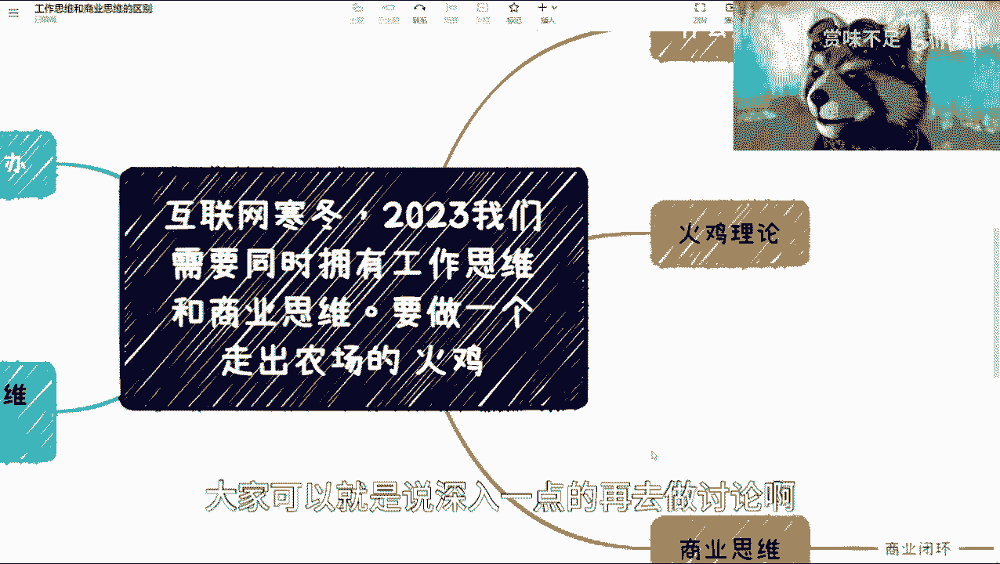

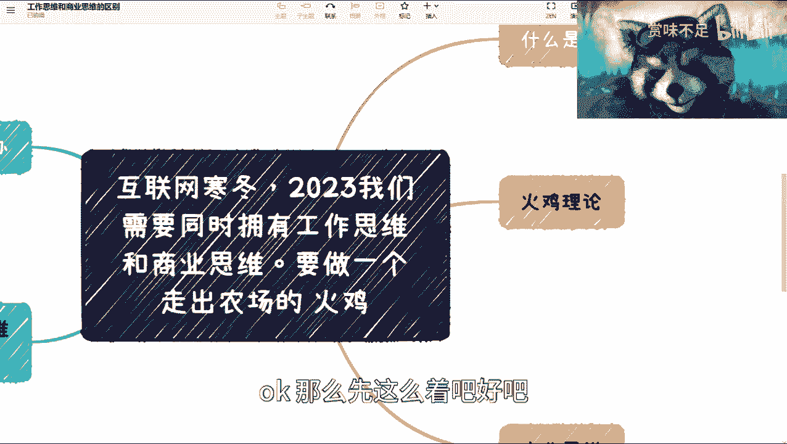

核心在于理解：局限于工作思维，就如同农场中的火鸡，视野受限于喂食器。要应对变化，必须主动走出“农场”，培养从商业本质思考问题的能力，看清价值创造与交换的全貌。这不仅是职业发展的需要，更是现代社会中一项重要的生存技能。