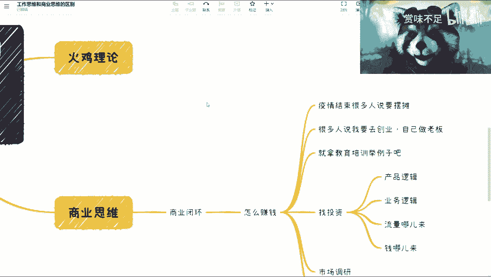
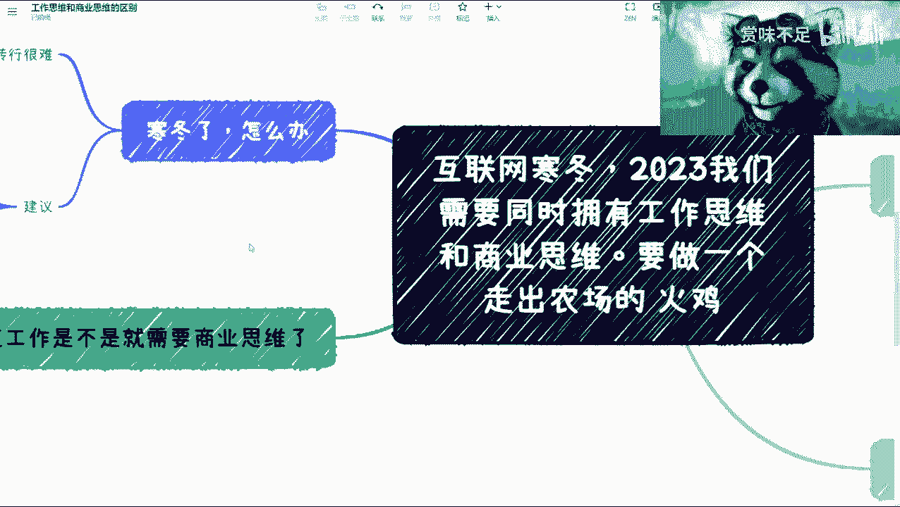
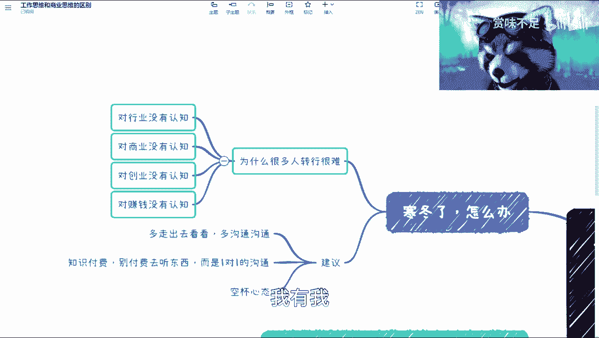
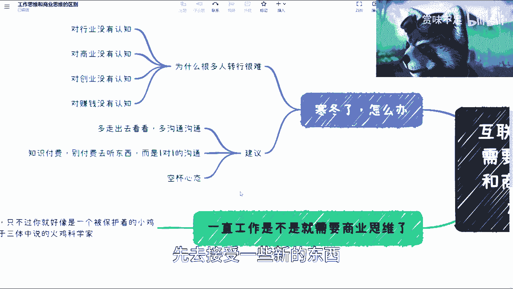

# 互联网寒冬，2023我们需要同时拥有工作思维和商业思维，要做一个走出农场的 火鸡 - P1 - 赏味不足 - BV1yT411k7dW

好啊大家好，我是赏味不足，那么呃这两天呢因为我在那个网上也看到啊，就蛮多人讨论这个叫什么，就这个互联网寒冬啊，然后说啊怎么转变啊，啊怎么准备呀，然后我看了一下，都是一些就是播放量还比较高的。

就是几10万几百万那种播放量难，但是其实里面内容呢都还比较虚啊，虽然他们采访了所谓的那些什么呃大厂啊，或者怎么样的，但其实但凡有点这个啊，但凡这个有点经验的人呢，一听就觉得其实没什么太大深度啊。

所以我这边专门出了一个内容啊，叫做互联网寒冬啊，2023，我们需要同时拥有工作思维和商业思维啊，要做一个走出农场的火鸡，那当然这个地方呢我先科普一下对吧，就这个火鸡是什么东西呢，就最近呃这个也比较火。

就那个三体啊，那么看过三体的应该都知道，嗯我这边写一下吧，啊火鸡理论，什么叫火鸡理论呢，就是说啊这个我们说以前有个农场啊。

然后里面有个农场主，那农场主呢到每天12点啊，给这些火鸡去撒饲料对吧，那久而久之呢这个火鸡理论讲的是什么呢，就是在这堆火鸡里面呢有一个科学家啊，那么久而久之呢，他就总结出一个规律啊。

就是每天的12点就会出现食物啊，他认为这是一个真理啊，就好像呃所有的人觉得就是有重力的东西，掉了会呃就是往下掉啊，比如说我先扔一个东西，它一定是往下走的，不是往上走的啊，那么他会认为这是一个真理。

但是呢就是火鸡理论所要描述的点，是在于某一天啊，这个农场主那个同样的进进到这个12点，进到了这个叫做农场里面，那么因为那天呢是那个感恩节哦，所以他并没有给他们吃东西，而是把火鸡杀了吃掉了对吧。

那么其实他本身想要描述的是说，我们呃很容易把一些规律性的东西，或者一些常见的东西呢变成一个真理啊，然后呢其实嗯很有可能在这个圈子内，他是一个真理，但是你往外扩的时候。

你会发现它啊就是就就不再是一个真理了啊，呃甚至是非常的这个愚昧啊。

是这么样子的好，那么我们来看啊，就是什么是工作思维啊，我看看大家看得清楚啊行了，那就那么几个点啊，我这边大概列了一下，那当然也不是特别全，一个呢就是我看到那个视频里面有很多人会说，什么大厂小厂的问题啊。

呃在我看来大厂跟小厂没有什么很大型的区别，那当然也有很多人会说啊，他说那怎么可能没区别呢，对不对，那他说你这个项目复杂度啊，啊我们在这边看啊，技术广度和深度肯定是不一样的对吧，你在大厂所看到的呃。

或者学习到的广度深度肯定是远大于小场的啊，这点我也承认，那毫无疑问，然后第二点呢就是关于这个叫做呃沟通能力，应急能力，那这一点呢我觉得也是在大厂里面会比较多啊，就是啊等一下啊。

我把这个摄像头稍微调一下啊，就是这个呃，一般呢也就是大厂这边能锻炼的出来，因为小厂里面其实沟通能力，应急能力，看吧就是说小厂在那种小企业里面呢，你你会发现其实你锻炼的应急能力，共同点有很多。

但是你相对在的基本盘不大哦，所以说其实这些，可能你的成长性也不是特别高啊，第三点就是那个流程的规范性，这一点就毫无疑问了对吧，机会有很多的人出来之后，他就会说啊，我这个很大的一个这个增长点是什么呢。

就是我对于这个流程应该怎么样，我很清楚对吧，就比如说从小到大啊，我几百人，几千人，我应该怎么一个规范性，我很清楚对吧，那同样的还有什么区别呢，你比如说啊这个优点我们都说过了，对我们来说缺点对吧。

这个大厂很多人出来他高傲骄傲，那为什么高傲骄傲呢，是因为呃他觉得我是大场帅的啊，我经历过大世面，对吧啊也毫无疑问啊，那么后面那个呢就是认不清楚自己是谁，那这一点呢其实是呃这个非常常见的呃，为什么呢。

是因为他这个时间长了之后呢，慢慢慢慢就忘记了，其实有很多东西是一个呃就是大厂本身，无论是你的同事还是他的这个叫做商业能力，还是他的这个叫做团队协作能力，就各方面其实都是已经比较强的。

也就是说你的起点会比较高啊，那么我们在这个地方说，为什么说他这个认不清楚自己是谁呢，是因为这个你要去清楚哪些是你的能力啊，哪些是外部给予的支持啊，这也就是为什么，我们其实会发现有非常多的人啊。

其实很强呃，但是他出去可能到一些小厂里面，或者自己去创业，他就这个非常不适应，或者说就一无是处，为什么呢，是因为他自己就没去认清楚啊，就是他的能力里面的加成，哪一部分是他的基本能力。

哪一部分是他的这个大厂给予他的Buff对吧，给出他的这个增值啊，他自己要去清楚呃，那么这个呃总总结一下，就是说我一开始说的，就在我看来呢，这两者你说有区别吧，有的啊，但是这两者区别并没有那么大。

为什么呢，这个就跟火呃那个农场主理的火鸡是一样的，就是那个大厂可能是大厂火鸡啊，你小厂可能是小厂火鸡，但是最终的核心点就是你还是火鸡啊，就不管你是怎么样的一个深度，怎么样的广度，你放到整个市场。

放到整个商业逻辑，放到整个我们说呃出了你打工的，因为我们我们这个本质上，说的是工作思维和商业思维嘛对吧，就你这些思维再怎么强，你放到商业思维上面，你还是只火鸡啊，你还是只火鸡啊，那么所以说在这个上面呢。

我觉得其实本质上，如果你把整个的格局放的足够大，哎其实也不用走过来就往上升一个level，你会发现其实你在哪都一样啊，没什么很大差别，那么思维上呢，我觉得这个得要有一定的这个认知啊，这个认知是什么呢。

就是说呃我们不管在哪呢，我们永远都是块拼图啊，就是说你的认知也都是一块拼图啊，不管你是做技术的还是非技术的，还是啊这个销售啊，市场啊对吧，这个这个叫什么，就是啊研学术研究啊等等等。

其实你永远都是块拼图啊，当然我们说这个是基于工作思维的思维的情况，下面，因为就像我们刚刚说的，你作为一只火鸡，你相对农场主来讲，你永远只是火鸡对吧，但是呢就是说同样的你如果是个农场主。

那么你相对整个社会或者整个的一个这个农场，的一个农场的这个这个大范围的这个角度来讲，其实你你也是一个单纯的这个农场的那个，商业拼图里面的一只火鸡啊，就是说每一个呢其实都有不同的这个层级啊。

但是呢你要说我们去这个思考这个问题，一定要放正自己的这个位置对吧，那同样的在工作思维情况下面呢，我我其实就是一棒子打死的，你不用反驳啊，不用反驳没有意义，就是在工作思维下面，你是根本不懂商业的啊。

这些人是根本不懂商业的，这个会导致你与上层的信息差，什么叫信息差呢，就是我们想啊，在大厂里面有很多人其实过得很舒适，或者说他会觉得一帆风顺，是为什么呢，是因为其实大厂由于他的级别比较多哦。

导致最终其实做商业决策的人跟你跟大部分人，大部分的这个工作的人呢，他是没有交集的，那么也就是说大部分人的这个沟通，他还是处于工作思维与工作思维的交交流，但是如果你往上走对吧，你会发现你呃我走的越上面。

或者你在一家创业公司，你会发现你其实是跟商业思维直接碰撞的，就打个比方，你今天跟那个这个大厂的这种上级，或者你给出那个创始团队的CEOCMO去讨论问题，你会发现大家争论的很厉害，为什么。

这就是因为大部分的争论，往往是信息差导致的啊，而这个信息差本身，是由于工作思维跟商业思维的一个碰撞啊，而导致了这么一个结果，也就是说本身啊，我们大部分人这个比如说现在在网上啊，看这个视频的啊。

或者就就像我说的，就去看什么寒冬啊对吧，怎么转行呢，就大部分人他的一个点是在于说，我怎么找到工作对吧，我怎么怎我怎么去加薪对吧，我怎么这个做职业发展对吧，而对于你的上层来讲啊，对于你的上层来讲。

他的观点只有一个，就是我在上一节课呃，这个那个这个脑图里面所提到过的就是钱啊，就是赚钱，那么当你们两个鸡同鸭讲的时候，自然而然你们会出现很大的信息差，那这个时候又有人问了，他说那我只关心工作啊对吧。

我不关心赚钱对吧好，我们想想看你自你自己想自己想想看这句话啊，你不是不关心赚钱，你只是不关心企业怎么赚钱，老板怎么赚钱，你是关心赚钱的，但是你关心的是你自己怎么赚钱，对不对，好。

那么我们说从你的整个职业发展角度来讲，如果你不关心企业怎么赚钱，你不关心老板怎么赚钱，你只关心你自己怎么赚钱，那请问如果这样的话啊，第一企业赚不到，老板赚不到你赚什么东西对吧。

这第一点第二点是如果你不往这边思考，你永远处于一个工作思维上面，那么你如何往上去走，这一点与大家来去网上学习，或者去付费学习的本质初衷是相违背的对吧，那么这一点来讲的话，我觉得就是也不要杠，也不要杠。

就大家认清事实就可以了，好那么我们讲完这个呢。

我们来讲我看看啊，那我们先来说这个吧。

现在说这个吧，诶诶等一下我看看啊，啊先说这个吧，商业思维啊，那么讲完工作思维，我们来说商业思维对吧，商业思维哈，商业思维呢其实哎等一下我看看，对，商业思维呢，就是说我们讲究的是一个叫做商业闭环。

这个词呢很多人也听到过，好我们来解释一下什么叫商业闭环，商业闭环就是比如说今天你们听过这个视频，你们私信我，你说陈老师对吧，或者赏总啊，那个我想找你创业啊，我们这给出去卖橘子啊。

哦或者我们出去流浪地球对吧，都可以啊，那么这个时候呢呃你就会发现，其实所有的时候你都会有很好的一个id，很多人都会有很好的id，然后呢就是问题是在哪里呢，就是我们要去考虑的是你闭环。

那闭环就是怎么赚钱对吧，你会发现很多的id都很好，但是他怎么赚钱呢，你一下子可能没想好，对吧好，那么这个时候呢就是我们所有考虑问题，不管你今天是工作思维也好，商业思维也好，你都要去考虑的是怎么赚钱啊。

或者你自己得要有商业闭环，那当然在这个地方有一点是什么呢，就是我着重要讲的就是这个叫强调一下，就是市场调研，就是你的商业思维，你的商业闭环一定是要走到外面去看，去做调研，才能去知道这个商业闭环。

而不是说像一只火鸡一样在那边看哦，我每天12点有这个粮食掉下来了，好我做出一个真理，我11点就有东西吃对吧，那你只是处于你自己的这个理解，你得出的整个商业闭环并没有真正的得到验证。

或者只是你的一个异响啊，那么这一点我觉得首先是要注重的，那么往下呢是这样子的啊，我们举几个例子，比如说疫情结束对吧，有有些人说这个要摆摊，因为当时新闻里面也说嘛，就是这个摊位要这个复苏嘛。

对吧嗯他说要摆摊，哎呦好像这期时间讲的有点长，摆摊摆摊呢我们就说啊，其实这个就好像什么，你说你有个很好的点啊，那么好政府说也扶持对吧好，那么这个时候我们说你的商业闭环是什么，那么商业闭环讨论的时候呢。

你得去考虑的不单单是怎么赚钱，更多的是你整个的上下游啊，链条的上下游啊对吧，合作上下游合作伙伴啊，啊你比如说这些货从哪里进啊对吧，你每天工作多长时间啊对吧，你投入产出比是多少啊，对吧等等等。

那这个我想我相信还是那句话，今天包括我在你听我这个视频的人也好，没有人真正去做过，没有人真正去吃过这个这个撞过这个墙的话，没有人是知道这里面到底有多少坑呢，啊而且我们要知道做餐饮，你的这个水是很深的啊。

不是说你今天这个心血来潮说我要做了，我就做了，对这第一点，第二点是说呢还有很多人说啊，去创业啊，我在微博上呃已经说了很多次了，就是2023千万不要去创业啊，5年内千万不要去创业啊。

因为你要去你要去创创业也没问题，那我就问你，请问你对企业的基本你了解多少，比如说财务法务对吧，比如说你那个这个企业的交税啊，包括企业的内幕，你了解多少，那有很多人要说了，他说这个很简单，到2023年了。

不用我自己亲力亲为对吧，有外包公司，我就想说一句话啊，你这种思想呢，就是最后可能怎么蹲的牢都不知道啊，好那么第二个啊，第三个呢我们就拿这个教育培训来做例子啊，有很多人跟我一样对吧，做过培训啊。

但是呢呃我大概从2019年开始接触高校啊，接触高校，然后呢你就会发现，其实培所谓的培训都是小打小闹啊，都是小打小闹，你根本谈不上教育啊，如果你要去切教育这块蛋糕，你会发现这水深的不要不要的。

教育里面所有东西不单看关系，还得看模式啊，还得去遵循以前别人，比如说十几年前，20几年前所留下来的模式，你懂不懂对吧，所以其实还是那句话，就是说咱们做很多东西的时候呢，以为我们看到了全貌。

但其实我们只是只火鸡对吧好啊，那么找投资我再举个例子，比如说很多人说啊，我写完了商业计划书，他说我要找投资对吧好，那问题来了啊，产品逻辑想清楚了没有，业务逻辑想清楚了没有，你流量从哪来，钱从哪来对吧好。

当然这个钱并不是说投资的钱，要是说这个盈利啊，谁来买单对吧，你的你的数字画像，用户画像是什么对吧，那有很多人呢就是你去写一个BP，或者你经常去创一个产品的时候，这些东西他想不清楚的啊，他想不清楚的。

他会默认说哎呀很有流量啊，他比如我举个例子啊，比如说他说我现在就要做流量地球的东西啊，因为流量地球这个呃叫做嗯嗯这个名望很高啊，所以流量很大，OK这个逻辑是什么，流量地球名望很高，没有错。

众筹到了破亿了对吧，呃那个嗯流量口袋也没错，但是这件事情跟你有什么关系，或者跟这个项目有什么关系对吧，你不能说因为这个东西流量很高，而等价于你的项目就流量很高，这里完全两码事情对吧。

我们说呃这个每一个风口，每一个红利期的时候，有很多人都会呃去蹭热点对吧，但是你会发现中国14亿人，我请问真正蹭到热点的能有多少人，如果按照这个逻辑的话，其实能就往上蹭啊，你就有流量，有流量。

你就能卖出产品，能卖出产品就能赚钱，请问有这么容易吗，对不对好，那么我们再来看啊，那么问题来了对吧，讲完商业闭环，商业逻辑，商业思维啊，商业思维你可以想想看，你给老板赚钱了没有。

那当然这个地方呢也有很多人说，他说我就算不给老板赚钱，我也赚了很多对吧，他说我举个例子啊，比如说我在大厂，我的年终奖有七八个月对吧，十几个月，那一定要明白，你在大厂年终奖有很多，并不代表你给老板赚钱了。

而是说是因为上层的商业逻辑，基于大厂的背景所赚的整个利润率，毛利率比较高，而这些钱慢慢慢慢留下了一些渣渣，给到下面的人啊，这个是指上面的商业逻辑成功了，并不是说你给老板赚钱了，这完全是两码事。

好完全是两码事，那么所以说呢反过来说，我们最重要考虑的问题是我们所掌握的技能，所掌握的关系，所掌握的一些东西，是否能给能给老板赚钱，或者能给这个企业赚钱啊，或者我们说能不能给我们自己赚钱。

因为本质上你去一家公司打工也好，你自己创业家公司打工呃也好，你跟公司是共同体啊，如果你今天说我跟公司不是共同体，那没关系，那你永远就是很打工了对吧，那么我们说到回的回到这里啊啊寒冬了对吧，怎么办对吧。

这也是最近这个回复和私信里面特别多的，我们说为什么很多人转行很难哦，这是因为呢他对行业没有认知对吧，就是你作为一只火鸡，你对农场没有认知呃，你对商业没有认知，那你对农场的这种运作模式也没有认知。

你的创业没有认知，也就是说你对农场的，比如说从小到大的这个过程你没有认知对吧，你对赚钱没有认知，也就是说你只看到了农场主给你那个喂饲料，那你并不知道这些饲料到底哪里来的，或者怎么加工来的啊。

他一开始是什么，你什么都不知道对吧，我觉得这些是目前很多人觉得寒冬的问题，或者说真正的根本问题，你说很多人觉得现在寒冬来了。

我有我，我很焦虑，他焦虑的是找不到工作吗，并不是他焦虑的是我找不到工作，找不到工作，或者我焦虑的是我现在薪资很低对吧，我没少往上走，但是他最终的焦虑的点就是说，我对于整个的农场没有认知。

我怎么能够跳出我火鸡的身份。

因为对于每一个人来讲，不管你就是怎么一个选择啊，你随着年龄的增长，你最终都是要往外走的，你不往外走，你只有死路一条啊，毫无疑问，整个经济往后发展所必然的一个一个结果啊，没有办法的啊。

没有办法的好，那么我这边有几个建议，第一个呢就是说你要多出去看看，多沟通哦，这边呢我也提了，就是你不管是出去看还是沟通还是知识付费，不要去看那些比较通用的框框的什么采访啊，什么东西没有用的。

因为你们一定要明白一点，所有露出来的东西它都有一定的前提哦，都有一定的前期都有一定的这种背景啊，你们要去了解，包括我这个视频也是一样的，你们要去了解核心，你们最好的是付费区一对一的沟通啊。

我不管是线上线下都可以啊，一对一的沟通，因为这种情况下面啊，我们在知道对方没有录音的情况下面，那么我们能够去讲很多的实话，很多的真相啊，很多真相，但当然这个前提是这个人愿意讲真话啊。

那你说这个人就是那个呃这个忽悠对吧，这个这个这个在我看来像逻辑思维这种，就属于忽悠嘛，对吧啊，就是啊他说我就是跟你扯扯淡的对吧，你付我点钱，那也行啊，那也行，但是这种的话。

但这种的话我们就没法去判断了啊，没法去判断，那还有一个呢就是说你一定要去保呃，这个保持自己的一个空杯心态，什么叫空杯心态呢，就是你放空你自己，把你所有认知的已经认知的东西，先不要先放在一边。

先去接受一些新的东西，再去做思考，你不要说你比如说今天你，你你看我这个视频对吧，你说我作为一个免费的，我跟你们讲这么多，然后有很多人可能听了之后，他上来就杠啊，你讲的不对，你扯淡对吧。

你这个就是就是就是叫什么井底之蛙对吧，你不要杠啊，你先把你的认知放在一边，你先来听听我讲，对不对，你要觉得不对，你可以指出你的这个那个摆事实讲道理对吧，然后我可以跟你battle，这个都是可以的对吧好。

那最后呢就是说我觉得一直工作呢，是不是就呃我就我就我这里写了，写错了呃，这个问题是一直工作，如果因为很多人都说嘛，他说我不创业啊，我也不做老板，那我没这么大心思啊。

他说啊我一直工作是不是就不需要商业思维了，不是我这地方写了，我说了，只不过呢你就好像是一个被保护着的小鸡，小鸡仔啊，类似于三体中的火鸡科学家，那也就是说，不管你是不是一直工作。

你终究还是要有很多的这种呃社会关系也好，也或者社会的这种接触也好，因为你不可能永远在一家公司，你也不可能永远只在公司里面打工对吧，你除了打工以外，我相信外面总有各种各样的，哪怕我们说不仅仅是合作啊。

比如说你今天哪怕出去买个房子，买个车对吧，买个什么任何的消费品，你都是跟别人是一个沟通，你知道吗，这都可以称之为一个项目啊，你在做一件事情的时候，你其实都是需要商业思维的啊，那么所以说呢。

其实这个思维是需要大家日常过程当中，慢慢去积累，慢慢去就是去认知的啊，而不是说啊我以后不创业对吧，我不是老板，我就不要啊，你你你你不要，你也会在生活的很多的地方去这个叫做踩坑啊。

嗯所以呢我希望就是这一期呢就这个内容啊，就是呃能够有更多人能够看到，那当然了就是就像我说的，就是因为我做个免费视频嘛，我也就不想说太多啊，不想说太多，那如果大家有经过，比如说这期这个内容有任何问题呢。

你们可以私信我好吧。

私信我，大家可以就是说深入一点的再去做讨论啊，做讨论啊，我也希望就是说你们这个如果有些收入问题呢，可以用这个付费的方式啊，因为免费的方式呢，我沟通的内容我觉得还是因为我个人判断，我的内容是有价值的啊。

所以我不会说这个大家私信我啊，我就啊给大家无限在里面讲，不会的好吧，OK那么先这么着吧好吧。

