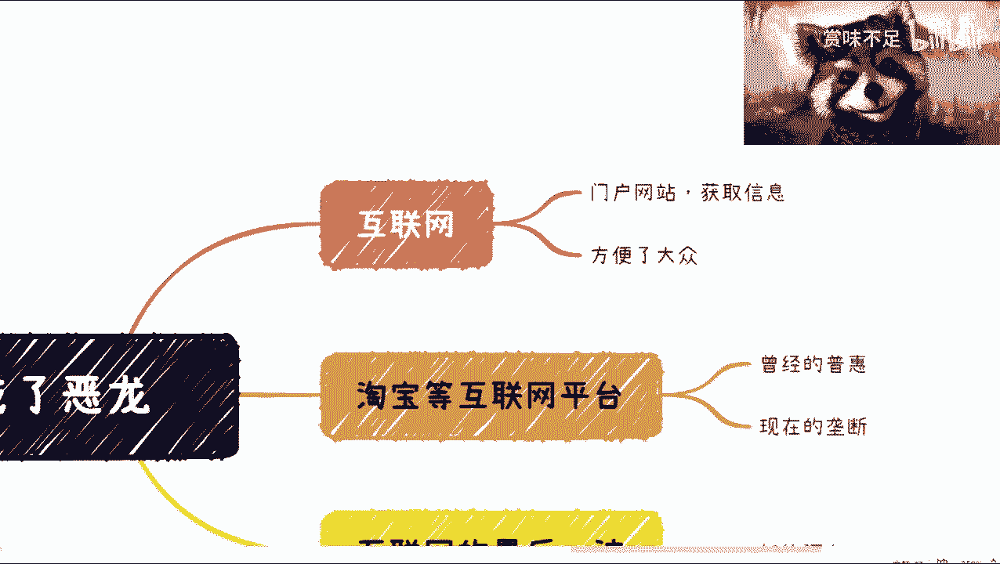
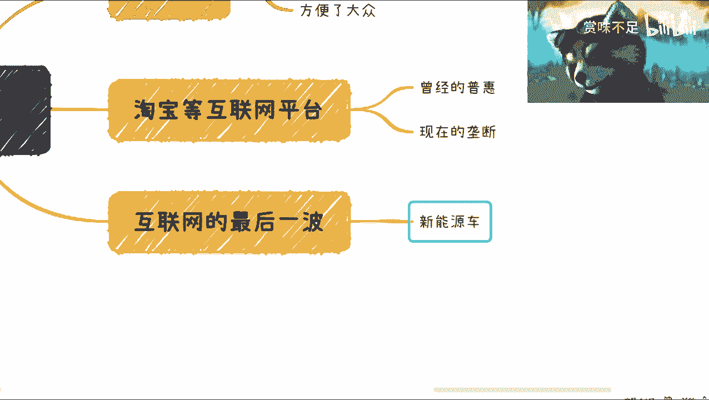
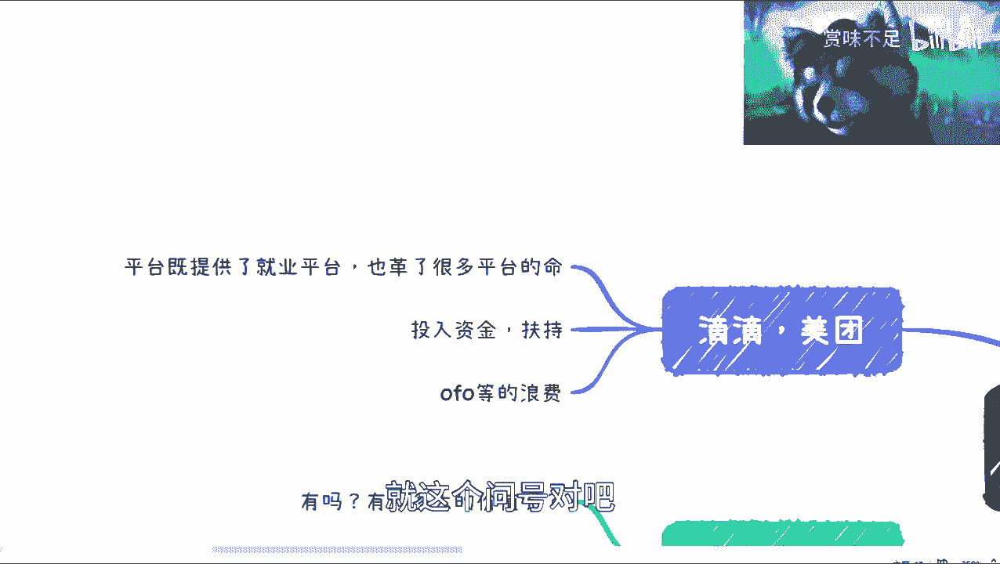
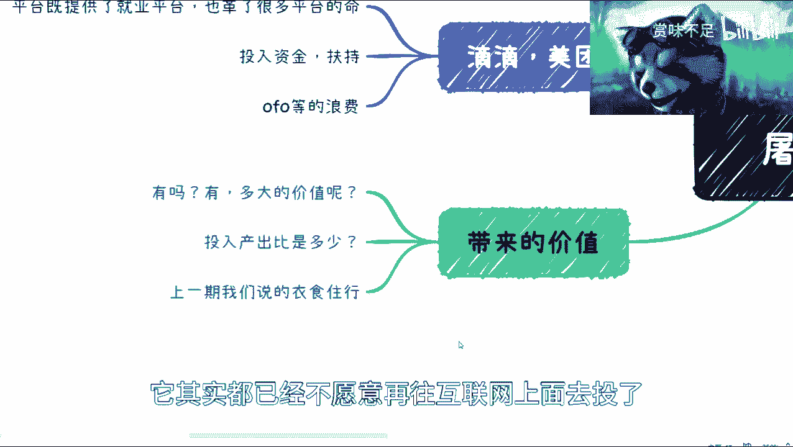
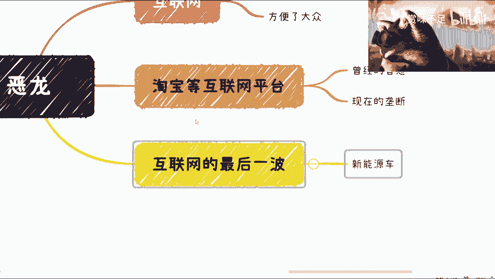
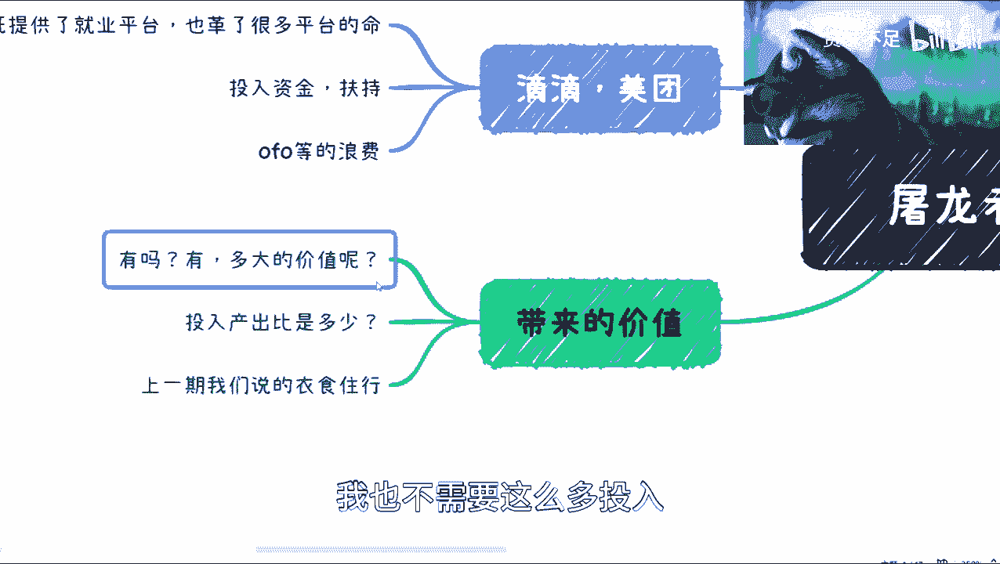
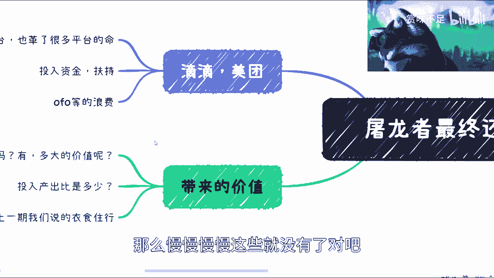
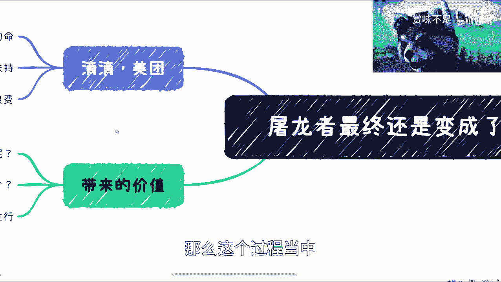
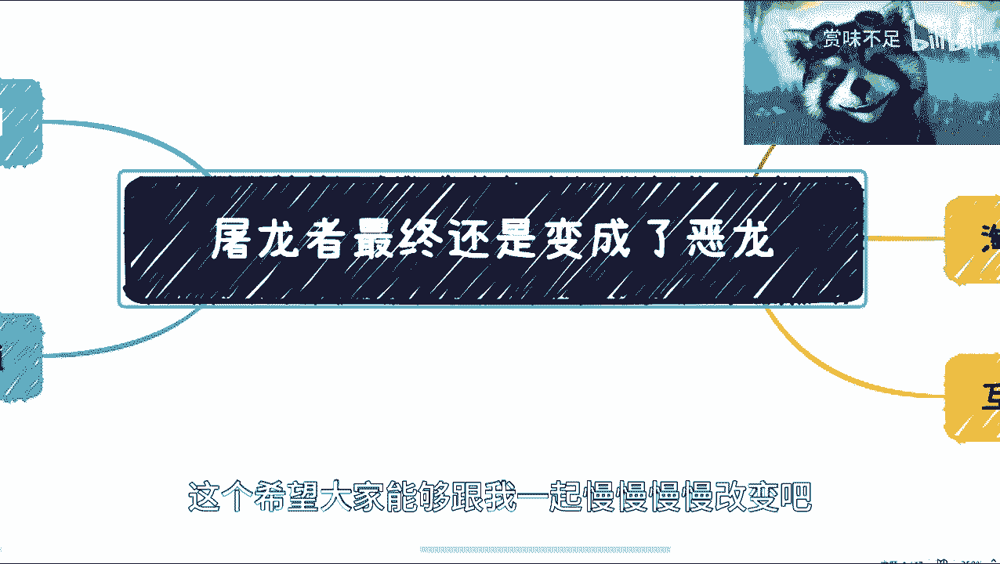

# 互联网屠龙者最终还是变成了恶龙，一个周期结束了 - P1 - 赏味不足 - BV1w54y1M7Be

好啊，我们这一期呢是来讲一下，这个互联网这么个内容，因为因为前两期的话讲了对吧，就是说这个互联网普惠的问题啊，然后我当时就说下期啊之后再单单独开一期啊，呃核心呢我觉得是这样子的。

我觉得这个故事呢其实放在哪都是一样的，呃然后呢我们也在说啊，因为之前说35年之后这个失业嘛对吧，包括你的互联网占大头吧对吧，然后疫情占了一部分啊，然后可能其他综合原因导致了这么一个点。

那还是互联网的确是逃脱不了关系啊，那么关于这一点呢，就是我想单独这一期呢可以讲一下。

那我希望10分钟之内能讲完啊，呃第一点呢我觉得是这样子的。

互联网这边呢我们都知道就是2000年对吧，门户网站对吧，大家这个通过各种各样的信息啊，通过各种各样的渠道能够更快的获取信息，包括邮件啊，包括我们现在所有的像钉钉啊，管理工具对吧，OA啊。

或者其他各种各样的东西啊，其实本质上都是来自于互联网的啊，我觉得这个呢是毫无疑问的，那么互联网带来的价值，可以说是改变了当下的一切对吧，包括呃短视频啊，游戏啊，什么各行各业对吧，深入到角角角落落啊。

好那么我觉得这一点呢咱不是说他啊。

OK那么第二点呢，我们就说这个普惠啊，其实所有的平台出来，他的目标其实都是为了普惠，就互联网最早的时候都是为了普惠啊，你们可以去找任何一个网站，就不管是什么门户啊对吧，电商啊，游戏啊啊社交啊对吧。

各种各样的就是所有的产品出来，它其实都是为了普惠，普惠谁呢，普惠的是大众对吧，但是呢我们慢慢慢慢发现对吧，我觉得也有很多这个年轻人啊，这个其实对互联网以前不太了解，那我们说其实互联网发展往后。

其实大家都能够看到它其实普惠的是什么，就是他普惠的是管理者，股东和创始者，他普惠老百姓吗，不普惠了啊，这个就像我们上一期，我当时提到那个老相机对吧，老乡鸡其实也是的，就是老乡鸡当时的口号叫什么。

叫做让老乡也能够对吧，吃得起的对吧，怎么样怎么样，一个中式快餐对吧，什么样子，那你们现在去看看老乡鸡，老乡是吃不起的啊，我也吃不起啊，哈哈对吧啊，那么正常的普通人我觉得都吃不起啊。

这个价格那其实都是一样的，就是你说呃到现在为止呢，其实我们就会看到它其实是从一个这个普惠啊，就曾经是普惠过的啊，咱不能否认这件事情到现在的垄断啊，现在垄断，那垄断一方面是无法普惠老百姓的，第二方面是啊。

老百姓要参与警局也很难，第三方面是说啊，真正的既得利益者其实就那么一些对吧。

那好那我觉得这一点啊，那么这个地方呢其实就要说一下新能源车。

因为之前我在微博上已经吐槽过这件事情对吧，就本质上是什么呢，本质上是说啊，特斯拉的这个全球的人均产值很高啊，我们设置为X对吧，那么目前国内的很多新能源车呢，它的这个模式是什么呢，是补贴对吧，贴钱啊。

这个那个那个叫什么扶持啊，那么这一点呢就跟互联网引擎是一样的对吧，那么它相当于是什么呢，它相当于就是说拿着补贴和各种加持，来和别人的一个叫做盈利模式啊，在pk，然后说哎我们比谁降价降得很对吧。

我们比谁什么产能高对吧，我们比谁什么样，但其实本质上它背后对等嘛，其实不对等，因为说直白一点，国内的新能源车是在不停的亏亏钱，而特斯拉是在不停的赚钱，那当然啊就咱们说的是事实啊，咱不是说啊国内不行对吧。

海外行，这不是啊，这个elon musk性格我其实也很看不惯，但是不管怎么样，咱们实事求是来讲，就是这个样子，而且互联网这个模模式上面，它不单单只是新能源车这样子，他从头到尾都是这个样子啊。

好那么我们往这边看啊，你比如说美团滴滴对吧，有很多人会说的，他说他说哎平台既提供了就业，平台，也隔了很多平台命对吧，那隔了很多平台命，咱有这个能这个有很多可以说啊，就说你比如说以前的这种。

这个叫什么出租车对吧，以前的很多这种现象，餐饮店对吧，那其实你是隔了很多人命，当然了，但我觉得这件事情也没什么太大问题，为什么呢，因为这也是一种进步对吧，就是说你天平的左边啊，多出来很多的这种就业人员。

天平的右边呢失业了很多人人员对吧，我觉得这也没问题啊，如果我单纯把这个事拿出来讲呢，我觉得呃站不住脚啊，这是第一点，那么最重要的是什么呢，最重要的还是在于说你的投入资金扶持啊，包括OFO这种实体呃。

自行车上面的这种浪费，就是说这个扶持本身投入资金有多大对吧，包括你包括最终的这个一地鸡毛，这些鸡毛到底是有多大的水分，在这个里面，这个其实是我们要去关心的，那么这句话怎么来理解呢。

这就好像今天早上呃这个网上还有一个人说啊，我觉得说的也有道理啊，他说他说电动车，为什么现在那个很多人觉得好啊对吧，那是因为你有扶持，因为你投入很大资金，那我们换句话来讲啊。

你投入很大资金到油车是不是也是一个效果，唉其实我跟你们说，从互联网的模式来讲，你投入哪它效果都一样对吧，其实是没有区别的，只不过说他扶持的是谁，你比如说很多很多这种钱，投入到的是互联网的新模式里面对吧。

那么你把这些事情呢，我们说直白一点，你把这些钱投投到以前黑产对吧，黑车啊，拉拉拉私活的对吧，你你把这些钱投到以前的那个那个线下，实体店对吧，投到那个叫什么，就是啊衣食住行有区别吗，没有区别。

他投资进去的钱非常非常多，就在当年的情况下，还是非常非常多的对吧，但是我们说到现在为止到底产出有多少，这个其实是大家最最关心的，就这个问号对吧。

那我们说带来的价值，其实互联网当下面临就18年开始到现在，其实面临的问题很简单，就是说你你价值有吗，有的那肯定有价值，但是问题你有多大的价值呢，就我们举个例子，就比如说就比如说你从2000年开始到现在。

打个比方投入投入50005000万亿，打比方5000万亿，那你投入5000万亿到达今天这个效果，那如果我们不投互联网呢，我们不进入这种补贴模式呢，那是不是说很有可能我投入1000万。

你甚至500万亿就可以达到今天这个效果，其实是没有区别的，就是我们说整个这个曲线它一开始是朝上的，很陡的，但是到了今天为止，它又慢慢慢慢恢复到了一个一，一个一个一个横盘对吧，但是你说有进步吗。

有你不能说他完全没有进步对吧，但是这个进步忽然出多大代价呢，这个是我觉得也不用去思考了啊，我觉得这件事情也不用去思考了，到今天为止，结果已经给出来了这个答案啊，就这么个情况。

就是说它的产出远远低于它的投入，我们说远远的我们可以加999个，远远远远远远低于投入啊，然后你比如说上一期对吧，我们说到这个现在很多人是愿意花钱在吃上面，其实衣食住行大家都愿意呃，都愿意花钱，为什么。

一呢就是大家觉得这个东西花钱是有价值的，二呢大家也觉得就是说这些东西投入呢，还是有这个呃回报比的啊，有一定回报率的啊，那么包括现在的个人啊，企业政府啊。

他其实都已经不愿意再往互联网上面去投了，为什么呢，因为他们已经知道这件事情已经定型了啊。

你所有以前的互联网的模式再去投，你现在面临的问题是什么，第一谁还有这么多钱对吧，第二你去烧了这个模式还能不能走得通，还有没有人来接盘对吧，第三就是说当下这些情况啊，大家这些情况。

就整个互联网的模式已经就告诉了所有的人说，这些模式已经一去不复返好。

那么其实我们说这个时候我们就面临的，就为什么说跟35年之后这个这个情况有关系，还是因为那你一个行业的衰败，你一个泡沫的破裂，它也不是一天两天的对吧，它是有一个有一个过渡期的。

那么我们认为35年这个时间就是个过渡期，可能5年是的确长了一点啊，3年我觉得差不多对过渡期，那么我们说这个过渡期里面会面临什么面临，就是说互联网的缩水对吧。

因为你既然这个没有什么大价值，那很简单，我就不需要这么多人。

我也不需要这么多投入，政府也不需要再有这么多补贴，那么慢慢慢慢这些就没有了对吧。

就就缩水了，就该死的死，该该该缩小缩小，那么这个过程当中。

我们说迎来的是什么，不就是下岗吗对吧，那因为因为因为很简单，因为因为这个互联网，其实也降低了很多就业门槛啊，你要说他真的那个这些人到别的地方去做，你能做吗，也不是说不能做啊，但是他能做什么呢对吧。

而且另外一方面，互联网人出来，并不是代表着外面就有这么多坑啊，外面还有这么多狼要围着肉呢对吧。

所以呢其实本质上我们得出的结论是什么呢，就是说互联网本身应该普惠大众，但是到现在为止没有哦，或者来说曾经有过，但是现在没有，现在现在又变成了，其实，现在又变成了一个2000年的时候的一个状态。

只不过呢就是说更卷啊，更形势更恶劣，而人口更多啊，这个这个和和人口配比的岗位更少啊，然后呢就是呃老百姓想要去赚到钱，或者想要去啊，就是做一些事情的门槛变得更高，对吧啊，所以其实就是这么个情况诶。

正好10分钟好吧，哎呀。

