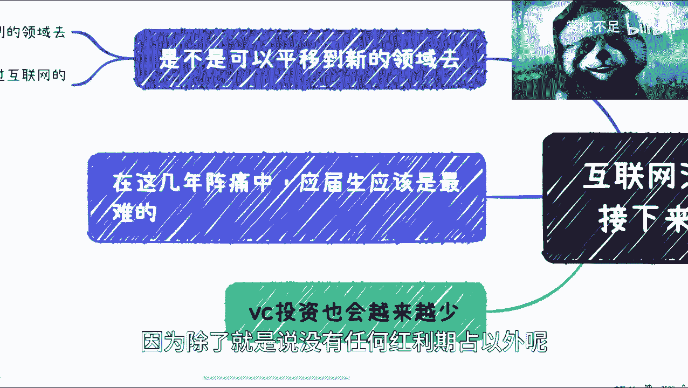

# 互联网泡沫正在慢慢消掉--聊聊接下来发生什么吧---P1---赏味不足---BV1bo4y167j1

在本节课中，我们将要学习互联网行业当前的发展趋势，理解“互联网泡沫”消褪的含义，并探讨这一趋势下可能发生的变化以及对个人职业发展的影响。课程内容基于对行业现象的观察与分析，旨在帮助初学者建立清晰的认知框架。

## 概述

互联网行业自2018年起已开始显现下行趋势。本节课程将系统性地分析这一趋势带来的多方面变化，包括政策扶持、就业市场、投资风向以及教育领域的反应。理解这些变化，有助于我们为未来的职业道路做出更明智的规划。

## 核心概念辨析

在深入讨论之前，需要明确两个常被混淆的核心概念：

*   **互联网**：通常指基于网络提供信息与服务的技术与商业模式，其核心是**连接与平台**。
*   **数字经济**：范围更广，指以数据资源为关键要素，以现代信息网络为主要载体的一系列经济活动。其核心是**数据要素与实体经济融合**，公式可简化为：
    **数字经济 = 数字产业化 + 产业数字化**

因此，数字经济的发展并不等同于互联网行业的持续扩张，两者是包含与被包含的关系。

## 行业趋势下的具体变化

上一节我们辨析了核心概念，本节中我们来看看互联网行业趋势变化的具体表现。

### 1. 政策与扶持力度变化

从上到下的政府补贴与扶持政策正在减少。这一趋势在疫情后，尤其是去年以来变得尤为明显。各地政府的绩效导向将更偏向于扶持数字经济及实体产业，因为实体产业被认为能产生更实际的价值与产出。

以下是政策变化带来的影响：

*   对大型企业影响相对可控。
*   对中小型互联网企业的冲击可能更为严重。

### 2. 就业市场与人才流动

随着行业扶持减少，相关岗位自然也会缩减。那么，原有的互联网从业者将流向何处？

互联网行业将为其他领域“输送人才”。虽然其他领域本身也存在竞争，但互联网从业者的竞争能力体现在多方面，且方式更为灵活。预计未来几年，跨行业的人才竞争将加剧。

### 3. 投资风向转变

风险投资（VC）对互联网项目的投资会越来越少。投资人对市场趋势最为敏感，他们的资金流向直接反映了对行业盈利预期的判断。投资人倾向于投资他们认为有潜力的领域，而远离可能亏损的项目。

### 4. 教育领域的滞后反应

学校的专业设置存在周期性，一个专科需3年，本科需4年。因此，高校的专业调整无法即时反映快速变化的行业趋势。这导致两个结果：

*   高校可能尚未完全意识到行业变化。
*   即使意识到，也无法立刻对专业设置进行“一刀切”式的改革。

## 对个人发展的启示

了解了外部环境的变化后，我们来看看个人应如何应对。

### 应届生与在校生的挑战

未来几年，应届生可能会面临较大挑战，原因如下：

*   **红利期消失**：行业高速增长带来的就业红利已不复存在。
*   **选择困惑**：计算机专业的“光环”在部分家长和学生心中依然根深蒂固，可能导致专业选择与市场实际需求脱节。

### 个人应对策略

面对已成定局的趋势，焦虑无益，关键在于调整自身。

*   **专业并非决定性因素**：毕业后长期从事本专业的人本就是少数。重要的是积累的经验是否具有可持续性和迁移价值。
*   **培养大局观与自我认知**：比选择专业更重要的是，培养对宏观趋势的认知能力，并深刻了解自己的优势、性格与兴趣所在。
*   **注重经验积累的方向**：无论是创业还是打工，积累的经验应有助于个人长期发展。避免长期停留在单纯“完成任务”式的打工经验层面。

**核心行动公式**：
`个人应对 = 认清趋势 + 自我分析 + 积累可迁移经验`

## 总结

本节课中我们一起学习了互联网行业步入调整期的几大信号：政策扶持减弱、就业市场收缩、投资转向以及教育反应的滞后。我们明确了互联网与数字经济的区别，并认识到个人无法改变趋势，但可以通过提升大局观、强化自我认知和积累有效经验来积极应对。下节课，我们将深入探讨“数字经济”的具体内涵与机会。

---
**下一课预告**：我们将详细解析“数字经济”，探讨在这一新范式下蕴含哪些新的发展机遇。