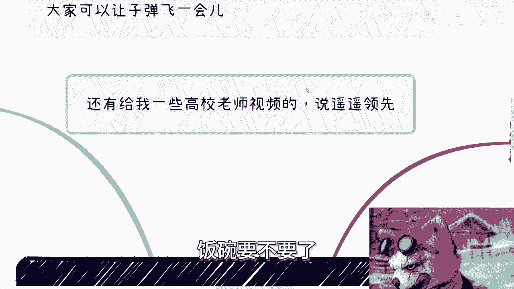
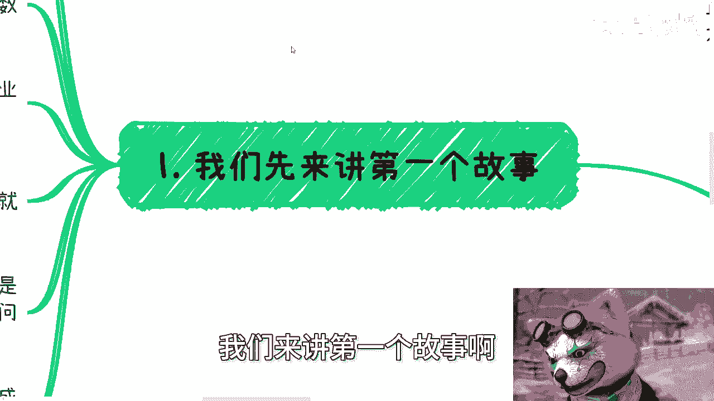
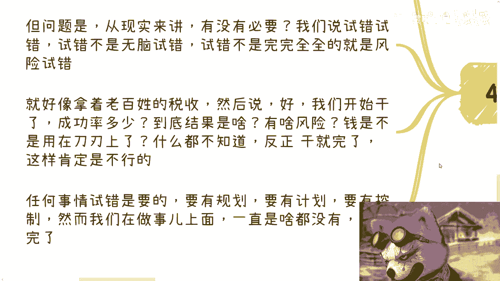
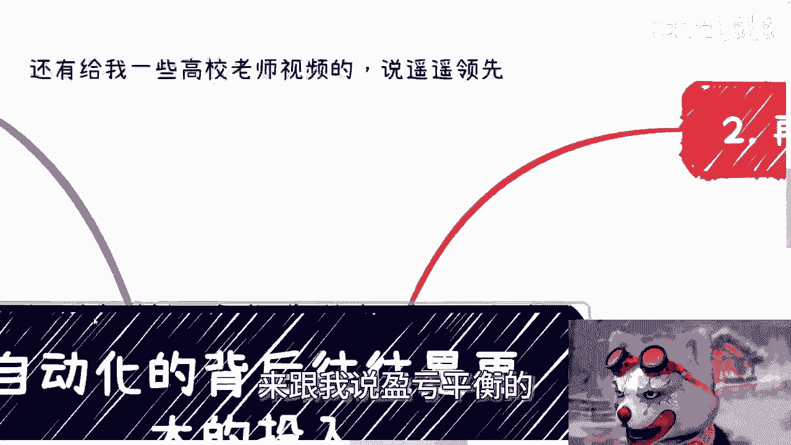

# 互联网自动化的背后往往是更大的投入 - P1 - 赏味不足 - BV1c6421f7mJ

好大家好，今天上海暴雨啊。

然后今天我们讲的主题是自动化的，背后往往是跟大家投入啊，先首先我们先说几个事情。

他妈的把我气笑了，真的把我把我气笑了，你知道吗啊，首先啊自动驾驶网约车这个事，我昨天已经评价过了对吧，反正就是那个意思，就个人态度啊，就是这个样子，就是昙花一现，就是媒体舆论啊，就是炒作就这么简单。

别来跟我讲那些有的没的啊，至于怎么样发展，你们可以让子弹飞一会，就就就就这么简单啊，然后还有跟我说银灰平衡的，我他妈就笑了，哎你们是不了解国内是吗，啊你们去看看2010年到2020年这10年。

他妈的国内所有的那些pr，所有的那些宣传融资宣传，他妈的都是夸十倍啊，夸五倍十倍增长的啊，卧槽他妈的搞笑了哦，媒体说盈亏平衡就赢平盈盈亏平衡啊，啊那我他妈奇了怪了，那那他妈媒体这么多年说这个油没问题。

怎么有问题呢，啊你们怎么信了呢，对不对，唉我跟你们讲，你们自己去算算看啊，百度这个团队团队多少人对吧，服务器硬件得要多少成本对吧，造车造价得多少成本，包括各种维护啊对吧，包括各种数据啊，数据呃。

那个服务器数据库啊，你看看按照他们的单价平衡怎么平衡啊，啊卧槽他妈张口就来，真的是啊，然后还有一点我跟你讲，昨天还有个事情把我气笑了，还有一些小伙伴啊，私信给我看了一些什么清华北大的老师的视频。

然后来问我，他说陈老师为什么这些视频里面讲的，好像中国的这个金融遥遥领先，经济遥遥领先，大哥，人家是老师，人家有屁股，他不遥遥领先，怎么滴啊啊，他他妈工作要不要了，饭碗要不要啦。

卧槽长点脑子好吗，同学们哎呦，我他妈我真的是服了。

真的是就我们可以傻白甜，那他妈不能傻白甜到这种程度的啊。

哥哥们好吗啊，首先我们继续来说啊，下一期活动我已经定了啊，7月13号本周六啊，在南京下午一点到六点好吧，内容主题的话，一个是低空经济，一个是分析一下呃，民企国央企大厂。

外企当下的这个入职优缺点以及未来的发展啊，最后我会再跟大家聊聊，各个企业当下数字化的这个发展跟机会好吧，详情报名你们也可以私信我啊，啊我们来讲第一个故事啊。

首先前两年政府啊，中央到各地方政府大规模的在推广数字化，跟数字化产业，有一个其中有一个东西很重要啊，而且是一个很大的突破点，是什么叫做打破数据孤岛啊，你们自己自己可以去查啊。

当时我就告诉你们想了很多办法，通过各种各样的技术，包括区块链边缘计算，零知识，证明各种各样的东西，来达到所谓打破那个信息孤岛的，这么一个这个目的啊，然后包括采购各种硬件，各种软件，硬件就是传感器啊对吧。

包括其他各个东西啊，然后采购软件好，当然啊你说打破之后的好处，当然很多政务也好，企业也好，做事也非常方便，给老百姓福利也会变非常便利啊等等等等等啊，然而结果打通不打通的核心矛盾，根本他妈的不在技术上面。

你们明白吗，哦包括人类社会也是一个道理，你不要以为嘛一个一个比如说无人驾驶，核心问题在他妈无人驾驶上面不是好吗，啊啊你真的把我气笑了，你们对这个社会的了解啊，这么这么如果如此简单的话，我就跟你讲。

就现在大家就不会这么困难，你知道吗，好企业核心矛盾不在基础上，而是在于企业本身不愿意，或者说他就推不动啊，或者说就是利益驱动力不够，反正就有各种各样的原因，但是绝对不是技术原因啊。

那么我们是不是可以理解为如果要改变，那么就是软件，人性，硬件等各方面都要去突破，那请问你们想想看，软件也好，人性也好，硬件也好，得他妈多大成本啊，啊你中央到各地方政府，各个城市得多少成本，对不对啊。

那么这个时候就要有人问了，他说那我们改变总要付出额外的成本和代价吧，对吧好，这句话没有错啊，问题是什么，问题是你不能无脑的付出啊，对吧好，这个东西我们后面再来讲，我们来讲第二个故事，第二个故事。

中国的互联网的企业里面啊，一直以来也很流行一些东西呃，呃auto automatically，一些东西叫automation的一些东西，比如说啊自动化的测试，自动化的运维啊，带自动化的代码扫描等等等啊。

但是啊很多团队放着开源的，也就是免费的，第三方的软件，不用非要他妈的二次开发哦，明明自己没有能力开发，非要二次在别人的软件上面去包装去修改，然后美名其曰是他妈自己做的啊。

然后很多企业就开始组队去开始改啊，那么结果你会发现什么呢，平台有了，软件有有了也有了对吧，但其实并不是那么自动化，因为平台跟软件本身拥有着非常多的bug，其本身开发迭代，其本身的更新。

其本身的维护就会需要非常多的成本对吧，那我就问了，那为什么放着免费软件不用呢，我告诉你们，因为这些团队要业绩，你放着免费的用了，请问这些维护的开发的更新的团队，这些head account怎么来啊。

啊没有这些head account预算怎么批啊，没有这一算钱，他妈怎么从左口袋到右口袋啊，对不对啊，啊。

有有这么简单吗，啊你们觉得呢哦做一个东西真的是为了目的吗，真的吗，啊还他妈跟我说啊，这个这个不能从钱出发，不能从所有东西从利益出发，卧槽他妈是我从利益出发吗，啊真的是妈奇了怪了，我跟你们讲。

你们天真烂漫，但他妈不代表这些资本家，明白吗，啊你们不要用你们天真的态度去想别人，卧槽他妈离了谱了，真的是啊，第三当然啊，我不是质疑那个无人驾驶这个事，我质疑的是整个逻辑。

首先我们要看值不值得，你刚刚举的两个例子来讲，我们这么说，轻重缓急，做事情都有轻重缓急对吧，打破数据孤岛也好，包括我们刚刚这个地方说的这个软件，自动化也好，是重要的事情吗，是的但紧急吗。

一点都不紧急啊啊紧急个屁啊啊，不做这个东西，不减那几个head account，不去降本增效怎么了，他妈公司过两年倒闭啦，对不对，自动化为了什么，为了降本增效，但他妈结果降了吗，没有对吧，以后怎么样。

我不知道啊，我不预知未来，但是我们从以前来讲没有见到过这样的，你们自己去问，对不对啊，无人驾驶也是这个道理，在老百姓都找不到工作，并且当下很难找的情况下面，这他妈是重要的事吗，而且更何况。

在法律跟安全还没有完全保障的情况下面，这又是紧急的事吗，对不对，醉翁之意不在酒，什么意思啊，就还是那句话，硬件成本，软件人员成本你们自己去算吗，能平衡吗啦啊更何况还有很多隐性成本，应酬啊。

打官司啊啊哪里这么容易啊，啊对吧，所以本质上我就说了，这就是个时间点的噱头，就是为了到各地方政府，比如说萝卜，他就是为了到各地方政府去拿更多的经费，更多城市政府的补贴，就是这样的一个逻辑啊。

的去真的说哦，这个无人驾驶怎么怎么样啊对吧，替代老百姓，而不是替代老百姓，替代那个滴滴或者怎么样子拉他妈倒吧啊，啊四好了啊，我们最后来讲值不值得啊，无论是打破数据孤岛，还是企业的自动化平台还是无人驾驶。

从结果来讲都是好的，没有错，他都是为了人类造福，为了社会造福，为了企业造福，一点毛病都没有啊，但问题是从现实来讲，有没有必要我们说试错试错，试错不是无脑试错，试错不是完完全全的风险性试错对吧。

这就好像你说人家投资人，投资人是比如说以前投资叫风险投资，是风险投资，但风险投资不是人家欠你的啊，啊人家不是他妈的钱，没地方用，在那边在那边撒，对不对，你也得看情况，看时机。

看项目啊啊这就好像拿着老百姓税收，然后说好开始我们开始干了啊，然后你说干一件事情成功率多少，做不做调研，到底结果是什么，有没有什么风险，钱是不是都用在刀刃上了，我告诉你们什么都不知道，对不对。

就像那些拿着那些所谓的那个媒体的软文，来跟我说盈亏平衡的。

哎妈奇了怪了哦，账单账单你也看不到对吧，所有东西对你来讲都黑盒，就盈亏平衡了，奇了怪了，你二说啥是啥对吧，那你还不如看新闻联播，啊所以就是说任何事情试错是要的，但是这个试错是要有规划，要有计划。

要有控制对吧，然而我们在做事情上面一点都没有，以前都是这样子，一点都没有啊。

我还是那句话，做任何事情有规划，这叫什么，这叫试错，你没有规划，这叫什么，这他妈叫贪污对吧，这只猫叫左口左口袋到右口袋。

嗨哟真的是他妈服了对吧。

我就我就问你们，你们有没有想过整个社会各个点上面，每一个节点都有很多试错的，那我请问如果来说啊，各个节点试错，他都没有造血能力，都没有盈利能力，那请问这些钱扔水里来，为什么要扔水里呢，啊老百姓辛苦钱。

血汗钱容易吗，为什么扔呢，图什么呢，真的我跟你们讲思考问题长点脑子啊，我这两天我真的是服了。

就唉唉算了，就这么着吧啊反正反正你们要是那个不信呢。

你就让子弹多飞一会儿啊，反正后面看我们走着瞧嘛。

对不对啊，当然啊我还是那句话，我不针对任何品牌，就这个事本身我就这个态度，我不管他是谁做啊。

好呃然后那个礼拜六好吧，活动继续报名，然后剩下的话就是说职业规划啊，企那个职业规划，商业规划额，股权期权，商业计划书白皮书啊。

分红分润啊啊包括合同啊，包括就是说你们手上有什么牌，你们没有什么牌呃，你们希望通过跟我的一些沟通啊，从从我的视角或者从我的一些认知，能够给你们一些更接地气的一些，这个未来的规划或者未来的一些建议的话。

你们再整理好详细的问题跟个人背景好吧，我们再来走咨询行啊。

