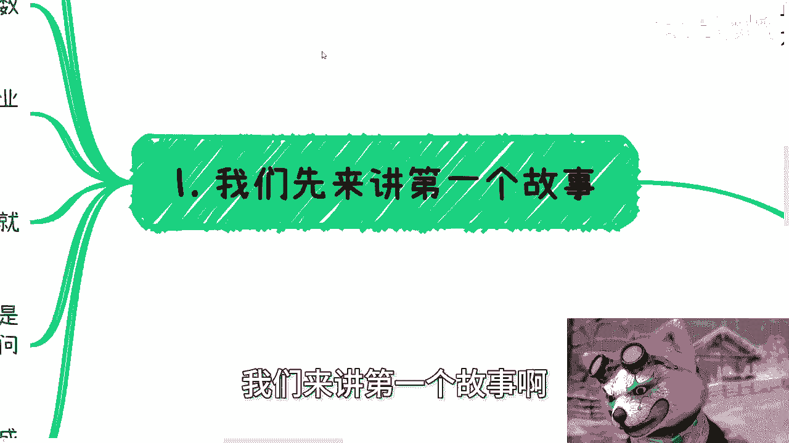
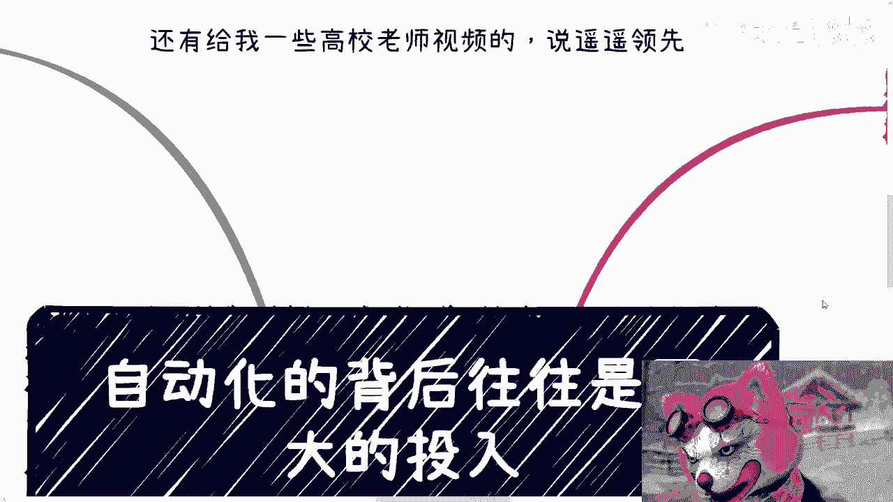

# 课程 P1：互联网自动化的背后往往是更大的投入 💸

在本节课中，我们将探讨一个常见的商业与技术现象：表面上的“自动化”或“数字化”项目，其背后往往伴随着巨大的、甚至是不成比例的投入。我们将通过几个现实案例，分析其背后的动机、成本与真实效益，帮助初学者理解商业决策的复杂性。

---

## 概述

本节课的核心观点是：许多被宣传为“自动化”、“降本增效”或“技术突破”的项目，其真实驱动力和成本结构往往与技术本身关系不大。我们将通过分析“打破数据孤岛”、“企业自动化平台”和“无人驾驶网约车”三个案例，揭示其中涉及的非技术因素，如利益分配、预算获取和舆论炒作。

---

## 对近期热点的观察

上一节我们概述了本节课的主题，本节中我们来看看近期引发讨论的两个具体事例。

首先，关于自动驾驶网约车，其本质是媒体舆论的炒作，属于昙花一现的现象。真正的技术成熟与商业落地仍需时间验证。

其次，关于某些企业宣称实现“盈亏平衡”的说法，需要理性看待。回顾2010年至2020年，许多企业的公关宣传普遍存在夸大增长数据的情况。判断盈亏平衡不能仅凭宣传，而需核算实际成本。

以下是需要考虑的核心成本项：
*   **人力成本**：研发、运营、维护团队的规模与薪酬。
*   **硬件成本**：服务器、传感器、车辆本身的造价。
*   **运维成本**：数据存储、软件更新、系统维护、安全与法律纠纷处理等费用。

在缺乏透明财务数据的情况下，宣称盈亏平衡缺乏说服力。

---

## 案例一：打破数据孤岛 🏝️

上一节我们讨论了如何审视企业宣传，本节我们来深入第一个案例：政府推动的“打破数据孤岛”项目。

前几年，从中央到地方政府都在大力推广数字化，其中一个关键目标是打破各部门间的“数据孤岛”。技术上尝试了多种方案。

以下是提及的部分技术手段：
*   **区块链**：用于建立可信、不可篡改的数据交换记录。
*   **边缘计算**：在数据源头就近处理，减少传输延迟和压力。
*   **零知识证明**：在验证信息时不泄露具体数据内容，保护隐私。

然而，打通数据孤岛的核心矛盾**并非技术**。真正的阻力在于**组织本身缺乏意愿、推动力不足或利益驱动力不够**。改变这一点，需要在软件、硬件以及更重要的“人性”（即组织协同与利益分配）上进行突破，这意味著极高的协调与实施成本。

---

## 案例二：企业内部的“自动化”平台 ⚙️

理解了外部协作的困难后，我们来看看企业内部的情况。中国互联网企业一直热衷于各类“自动化”项目。

以下是常见的自动化类型：
*   **自动化测试**：`automated_testing`
*   **自动化运维**：`DevOps`
*   **自动化代码扫描**：`static_code_analysis`

但一个普遍现象是：许多团队放着成熟的开源（免费）软件不用，非要进行能力不足的二次开发或包装，并宣称是自研产品。这导致平台bug多，开发、迭代和维护成本高昂，反而背离了“降本增效”的初衷。

其根本原因在于**团队需要业绩和预算**。使用免费软件无法创造新的“人员编制”（`headcount`）和预算审批理由，而预算则关联著资源的分配与流动。

---

## 案例三：无人驾驶的时机与成本 🚗

分析了内外部的自动化案例后，我们将视角投向更前沿的无人驾驶领域。我们并非质疑技术本身，而是质疑其当前大规模商业化的逻辑。

判断一个项目是否值得投入，需考虑“轻重缓急”。

*   **重要性**：打破数据孤岛、企业自动化、无人驾驶，长期看都重要。
*   **紧急性**：在就业形势严峻、相关法律与安全标准尚未完善的情况下，无人驾驶并非紧急事项。

其商业逻辑可能更偏向于**获取地方政府补贴和经费**，而非短期内真正替代人力或实现盈利。这涉及到巨大的硬件、软件、人员及隐性成本（如应酬、法律纠纷），平衡难度极大。

---

## 核心总结：试错与成本控制 ⚖️

最后，我们来总结如何理性看待这类项目。上述案例的最终目的或许是好的，但关键在于执行过程。

“试错”不等于“无脑试错”或“风险性试错”。负责任的做法应包含：

以下是合理的试错应具备的要素：
1.  **规划与计划**：明确目标、路径和里程碑。
2.  **成本控制**：确保资金用在刀刃上，进行严格的财务核算。
3.  **风险评估与管理**：预判并准备应对可能的问题。

缺乏规划的投入，其性质可能发生变化。当社会多个节点同时进行缺乏“造血能力”（盈利能力）的试错时，将造成巨大的资源浪费。

---

## 本节课总结

本节课中，我们一起学习了如何批判性地看待“自动化”和“技术突破”类项目。我们通过三个案例认识到：
1.  许多项目的核心阻力不在技术，而在组织利益与动力。
2.  企业内部的“自动化”可能异化为争取预算的工具，反而增加成本。
3.  前沿技术（如无人驾驶）的商业化需评估时机、成本与紧急程度，警惕其成为获取资源的噱头。
4.  任何试错都应有规划、控制和成本意识，否则可能偏离初衷，造成浪费。

希望本课能帮助你建立更全面、更理性的商业技术分析视角。