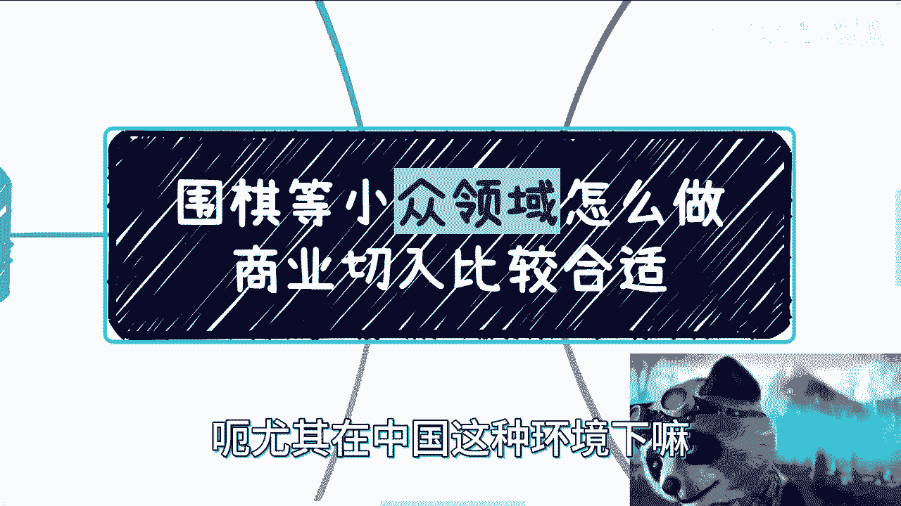
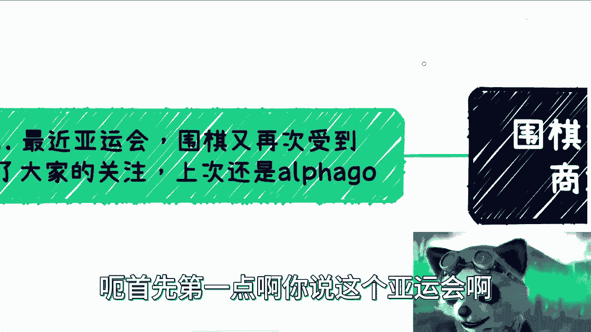
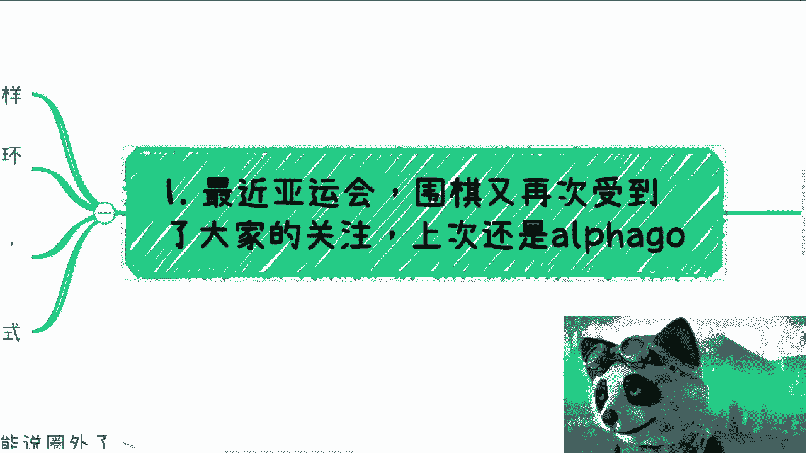
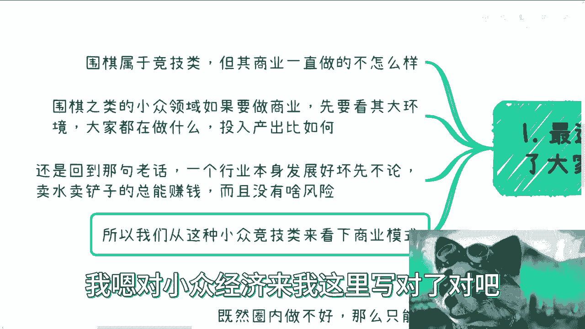
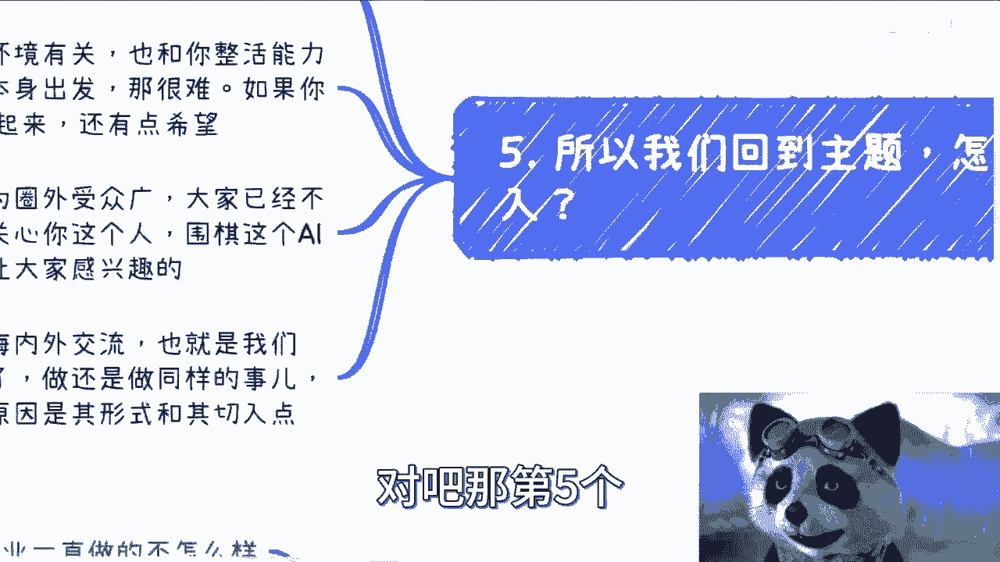
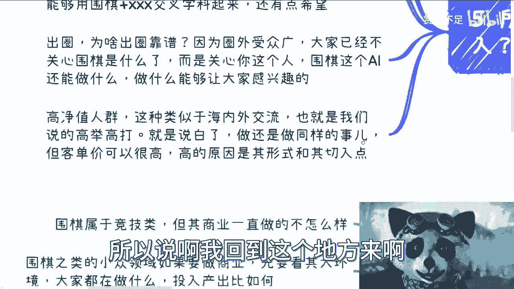
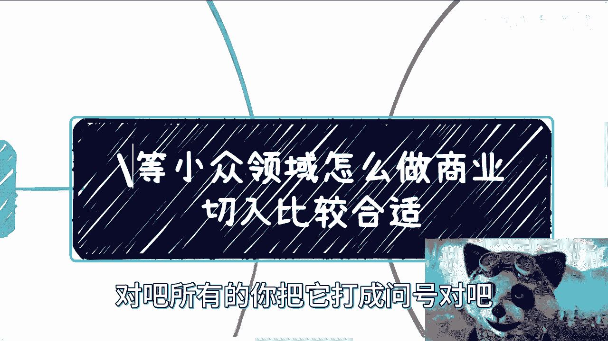
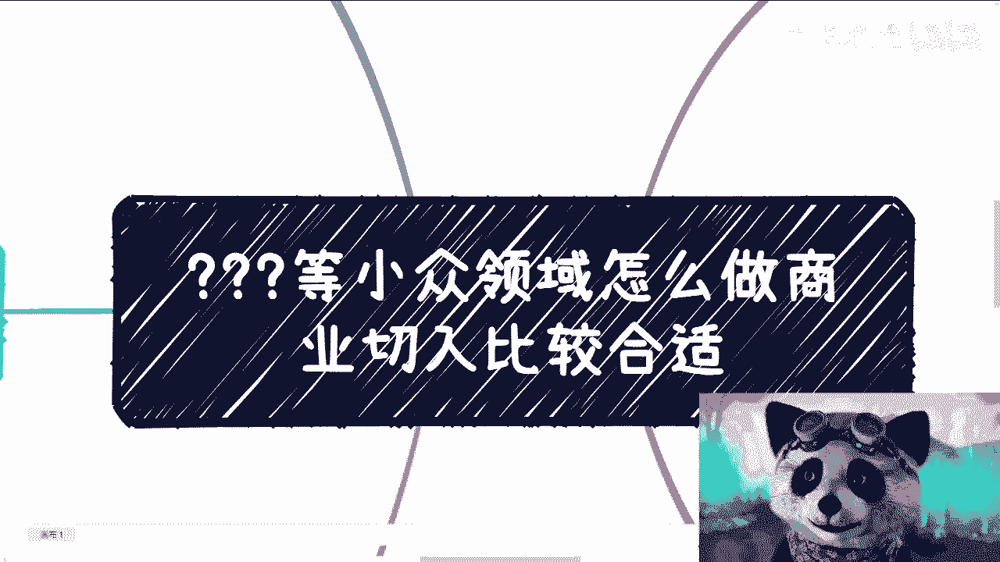
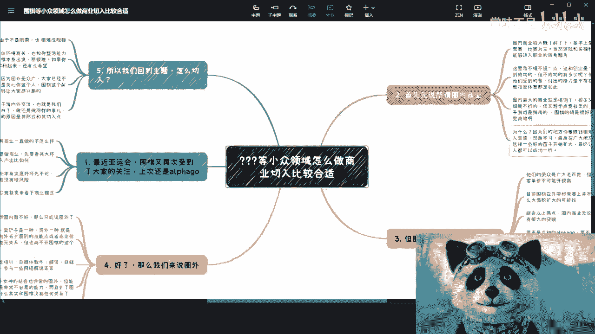

# 亚运会也开始了，从围棋来看商业怎么切入比较合适 - P1 - 赏味不足 - BV1xu4y147Wq

啊最近亚运会对吧，这个围棋这边比较火啊，然后我最近也看到了这个B站给我给我推的，各种各样的这个教教学的对吧，然后抽象的对吧，好多好多啊，那怎么做啊，就是我看了一下围棋呢，说难听点。

我觉得大部分人可能小时候都学过，或者被家长逼着学过对吧，但但学出来可能比较少，那我们触类旁通啊，就是围棋以这个东西为切入点啊，我们说这种小众领域呃，尤其在中国这种环境下嘛。

怎么做这个商业切入比较合适啊，呃首先第一点啊。

你说亚运会围棋又再次受到了大家的关注，我感觉我不知道我关注阿法狗的时候好。

那么首先呢围棋属于体育竞技类啊，但其这个啊啊我不知道是不是属于体育竞技类，这个可能不太严谨，反正是竞技类对吧，但是这个商业呢一直做的不怎么样啊，那围棋之类的小众领域呢，可以说要做商业难。

你要先去看去看它大环境，你比如就像我们之前说的，你要去看大家在做什么，比如说国家在做什么对吧，这个政府叫什么，就是高校在做什么对吧，然后那个企业在做什么对吧，那你要去看它的整个的呃，这个偏向。

比如说南北方的比例啊对吧，然后就是说大家可能做的这个投入产出比啊，你再去看你要做什么对吧，你不能说我自己YY，卧槽我觉得阿尔法够牛逼对吧，我就去搞蓝啊，那你不行啊啊然后还是回到那句话。

一个行业本身发展怎么样呢，就是本身发展好坏啊，我们先不论，但是有一句话说的特一定是对的，是什么呢，就是他卖水卖铲子的活，他总能赚钱，就赚多赚少，而且关键是没风险，你懂吗啊，那当然就说黄赌毒先不去说他啊。

就剩下的啊，这行业本身好不好，其实跟这卖卖水卖铲子没关系啊，大概率没关系啊，所以我们从这个小众，我对小钟晋级了。

我这里写对了，就小众竞技来看一下这个商业模式呃。

首先先说这个所谓的圈内商业啊，圈内商业呢我大概了解了一下，那基本上是以协会啊，各培训机构啊，各竞赛比赛为主，当然了，这个就跟买福利彩票是一样的吧，真正的能够进入职业的业余，能够往上打的也是凤毛麟角啊。

这里我不得不提一下啊，我跟你们讲，这个就跟创业一样的啊，大家都看到成功的，但是我就问嘛，那不成功的有多少嘛对吧，我一直说我一直说我说这个这个尸横遍野，为什么呢，因为你不成功的并不代表他们不存在啊对吧。

并不代表他们受到的苦不存在啊，也并不代表他们付出的精力不存在，也并不代表他们付出的金钱不存在对吧，但是你说最后有几个人记住他们这些苦，只有自己知道，这就像今天早上我看到这个推特上，有一个人说的话。

引用的那句话，很话很对啊，他说跋山涉水来见你的人，你未必一定会记得，但是你跋山涉水去见的人，你一定会记得，为什么，因为所谓受到的苦，受到的累对吧，你不管成不成功，最终只有自己记得，大众能记得的有多少。

是吧，所以说你说这些苦和累他不存在吗，当然不是这些人不存在吗，也不是他都是一个活生生的例子对吧，那么所有的我跟你讲竞技类，体育竞技类的其实都是这样子的啊，那么圈内最大的商业其实就是培训。

你没有别的东西了，就是培训，很多父母觉得孩子的运动细胞不行对吧，或者说他可能觉得孩子读书不行，那怎么办呢，得另辟蹊径，那怎么办呢，他说我想学点竞技类的，但是呢你说这个家长的认知不够对吧。

他又觉得电子游戏是垃圾，那怎么办呢，那可能筛选下来觉得啊，围棋的确是个很好的选项对吧，你别的东西它不行啊，运动细胞也不行啊对吧，你不像我小时候啊，我小时候还算是一个这个叫什么哈哈。

还算上海这边这个参加过区田径运动，这个竞赛的人啊，我还是有印度细胞的啊，那那围棋的确觉得很好选项对吧，那毕竟感觉高端啊对吧，家长也不懂啊啊那为什么呢，因为你会发现别的地方你要赚钱很难啊是吧。

那你只能进入忽悠就忽悠大众，然后做漏斗模型，然后学习，然后呢在广大我们说不成功的对吧，炮灰或者韭菜当中去选择一些好的苗子，然后开始pr就开始宣传啊，说我多么牛逼啊，我培养出来什么东西来对吧。

但其实其实大众又不知道，对你培养出来一个很牛逼的人没毛病，但你背后有多少炮灰啊，可能几万个十几万个炮灰，谁知道呢对吧，这就好像我之前一直跟大家说的，我说你们别拿一些所谓成功的例子在我面前说。

没有意义的对吧，就是有很多东西是有原罪的，原罪是洗不清的啊，你不能说广大老百姓愚昧，不知道不代表它不存在对吧，那最终让别人感觉，好像感觉人人都可以成功一样，这个东西其实就是一种忽悠啊。

那么第三那我们看圈内商业呢，其实它有个很大的bug，什么bug呢，如果我们从商业的角度去判断它，其实这个东西你要我来说啊，我觉得这个东西蛮好的，但圈内不适合做啊，他适合做什么，他适合做做交叉学科啊。

为什么你们听继续听啊，就他们手中啊，首先他们的受众是广大老百姓，但广大老百姓并没有多少钱对吧，所以说你的客单价不可能开太高，你你你跑出去看看围棋的培训，对吧他高不上去的，而且第二点围棋在升学。

在竞赛上他并不是刚需，所以他很难有什么大面积的扩大的可能性对吧，你如果说你说我以前是做围棋培训，卧槽，那他妈我一年能接几个单子，我说不好听，能接几个单子，我累成狗，我一个小时估计也就那么几块钱对吧。

你不像我可能10年前做移动互联网的咨询，我一个小时已经上班了对吧，更何况就是我的能力，跟人家围棋的这些人的能力，完全完全不能相提并论啊，人家是职业选手，我他妈是垃圾对吧啊，综合以上两点啊。

圈内商业无论从广度还是深度，其它其实就很难有很大突破，这个很难突破，不是我们不能突破，是他大框架就在那个地方，他没法突破对吧，你说的好听一点叫做什么，叫做叫做啊，这个这个我们可能可能没有挖掘到商业潜。

这个商业的这个这个商机对吧，那么说的难听点，就他妈你整个国家整个的大框架上面，它没有赋予更大的价值，你怎么突破它，那不可能啊，对不啦，那要不是当初阿尔法狗，要不是柯洁那么年轻，有年轻有为对吧。

有这么年轻的成就，估计很难引起多大的水花，能有多少人知道你放到普罗大众知道啥，你现在问他，他就知道个狗狗，他就知道柯洁他还知道啥，他知道奥运会战鹰没了，对不对，就是你要说到这个东西。

它对其实你会发现就是我们后面会说的，其实你会发现他对围棋已经毫无认知了，是不是围棋不重要，他只是个tag，你知道吗，就是说深度和广度没有的话，也就是说这个行业的顶尖人才哦，我们说职业选手他除了去打比赛。

他只剩下教学了，只剩下解说了，他没必要再录了对吧，而教学的课单价又低，你解说可能又累，或者说解说也没有很大的商业模式，那你不就陷入了恶性循环嘛对吧，也就是说就说你你大批量的在训练老百姓。

老百姓花了大量的金钱，大量的精力，凤毛麟角的突出重围，最终它还没有很大的价值，那我操那他妈的图什么，我我我不是一个职业选手，从我的商业角度来讲，我觉得这他妈就是用爱发电啊，我们说过。

任何一个圈子行业背后都是商业推动的啊，没有创造财富的效应，那这个圈子自然没法自然没有办法自然成长，你只能通过外力去推，但外力推是推不动的啊，所以就说围棋，你到现在发展其实就是僵掉的一个局面啊。

好那么我们来说圈外对吧，那你既然圈内做不好，那只能说圈外了，我们之前说卖水卖铲子是一种，另外一种就是以围棋为切入点啊，向外去拓展别的技能点或者商业价值，那就像我们刚刚说的，就是说大众为什么对狗有认知。

为什么大大众对战鹰对别的东西有认知，就是因为本质上他们出自于围棋对吧，或者说打入大众眼帘的是跟围棋有关的，但是进入大众眼帘之后，大众的认知跟围棋就没关系，因为大众不懂啊，他懂啥呀，玩对不对啊。

你卖水卖铲子，我们指的就是培训自媒体教学，自媒体解说啊对吧，这个官方解说啊，参与一些网络解说啊等等等对吧，那么其实AI的结合，虎扑女神也是非常的圈外的啊，但是我们不得不说出圈这个东西本身就很难啊。

你要让你们出去看，你们会发现任何一个只要出圈了，我跟你讲必火，为什么，因为他能出圈，就意味着他能在他在本圈内，已经是已经一定是有一定名气的，然后他出圈也就意味着他能整活他活好。

而且他能够在非本圈内的那个那个技能树上面，再去点到别的技能书，就代表他已经是有很大的潜力了对吧，他必火，那当然他火多久咱不知道对吧好，那么说难听点，你说你去看阿尔法go，你去大众去看柯洁。

你觉得是因为大众懂围棋吗，他懂个屁啊啊对不对，我也不懂啊哈是吧，是因为大众对AI感兴趣，是因为大众是想看看年轻的霸者跟AI的，结果和这个过程，而不是因为懂，所以说这叫出圈了啊。

所以这才有真正的受众的叫什么，就是就是我们说的这个流量，我们说的这个数中的群体对吧，当你把整个受众扩大的情况下，你才有真正的量啊，你你不往圈外走，你的量就这么一些。

你说我今天就就永远就这100个客人对吧，然后每个人只愿意付我50块钱，你怎么赚钱，你怎么往外拖啊对吧，那第五个。

所以我们回到主题上面，怎么切啊，这种小众的啊，第一培训，但由于不是刚需，你很难成规模，也就是说你就算啊CTRLCCTRLV，可能你的最终投入产出比并不高，我当然我不是说你赚不到钱啊，你能赚得到钱。

但是相比别的行业可能就没法相提并论对吧，这是第一点，第二点，解说科普，这跟整体环境有关，也就是说跟你的整活能力也有关系啊，如果你从围棋本身出发出发，我跟你讲，这就很难，因为懂的人就这么些，你怎么去。

你怎么去拓展用户对吧，那如果就像我刚刚说的，如果你能够用围棋加叉叉叉的交叉学科，那我跟你还有点希望对吧，那么出圈为啥出圈靠谱，因为圈外书中广啊，而且圈外大家也不关心你的专业能力了，你专业好不好。

还who care，这已经是个娱乐性质了，都已经是个乐子了对吧，你出圈之后，对方关心的是你这个人，对方关心的是你这个人围绕，就是大家关心的这个东西，比如说你出圈是因为你年纪小。

还是说因为你跟阿尔法狗对战过，还是因为什么，就大众关心的是他还懂的，或者说关心那个东西，但是你围棋怎么样，大家已经不关心了，反正他也不懂对吧，所以说就说你做什么能让大家感兴趣，这是最最重要的啊。

那么还有一点是什么呢，就是高净值人群对吧，那这种呢就有点类似于像什么呢，就是我们说的还有一种就是围棋，也有海内外交流对吧，海内外的竞赛对吧，那么这些呢高净值人群也好，海内外交流也好。

这都是我们说的高举高打，就说白了就是说你做的事情还是培训，你做的事情还是竞赛，但是呢你客单价可以打高，而这个打怪的原因并不是因为围棋，而是因为他的还认为交流这种形式，以及高净值人群的这种客群，你明白吧。

所以说啊所以说啊我们回到这个地方来啊。

就是说你把这两个你把这两个字去掉对吧。

所有的你把它打成问号对吧，所有的这一类相关的，其实都是这么一个那个思维模式，就说你说我想在一个小众群体做精很难，因为金字塔你想走到上面很难对吧，这就有点像我们说打工，所有的人都想考研考博往上去走。

但是社会本身就是个金字塔类型的，对你说阿里到今天工号可能有十几万，20几万，十几万，20几万，相比整个中国，这他妈才多大比例啊对吧，那你说我想往上做精做大难不难难，但是我我要不要只有这条路。

走到黑不一定啊，你可以做别的，你可以说卖水啊，你可以卖铲子，你可以做别的领域的交叉学科，你可以做高净值人群啊，其实都一个道理，你知道吗，这个东西就我们说就说也是跟格局有关系，就是有很多人吧。

他就是当局者迷，他很喜欢，就是看看自己眼前的东西，他总PUA自己说，我到了别的领域，别的领域我就不知道对吧，但是如果你想，如果你现在在一个地方，原本它的性价比就不高，就像很多人做土木，做建筑，做设计。

我就跟他说，你的天花板就很低，包括做画师原画，我说你天花板就很低，你为什么要拘泥于此呢，对吧，你既然还年轻，你又跟我说，你想赚钱，你为什么要自己拘泥一次对吧，我明明会跟你们去说，很有很多性价比高的方式。

或者性价比高的领域，不要不做啊，我不懂，那那怎么办，对吧，好所以说啊就我觉得就基本上是这么一个逻辑。

好吧嗯，行吧，那就这么着吧，哎，大家啊大家有什么就是说副业啊，或者有什么呃商业商业的规划啊，或者现在已经在做些东西，但自己摸不准的，吃不透的啊，或者说呢又觉得就是有哪些东西需要，我手上的牌。

不知道怎么打的啊，需要我给大家梳理一下的，那你们可以整理好问题。

整理好这个背景好吧，来我们来走这个思咨询行吧。

