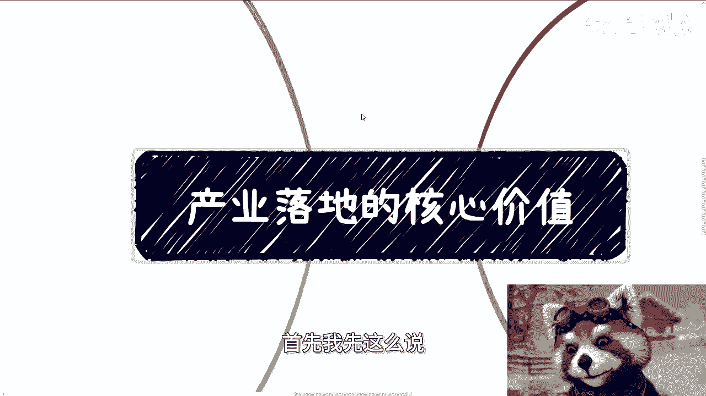
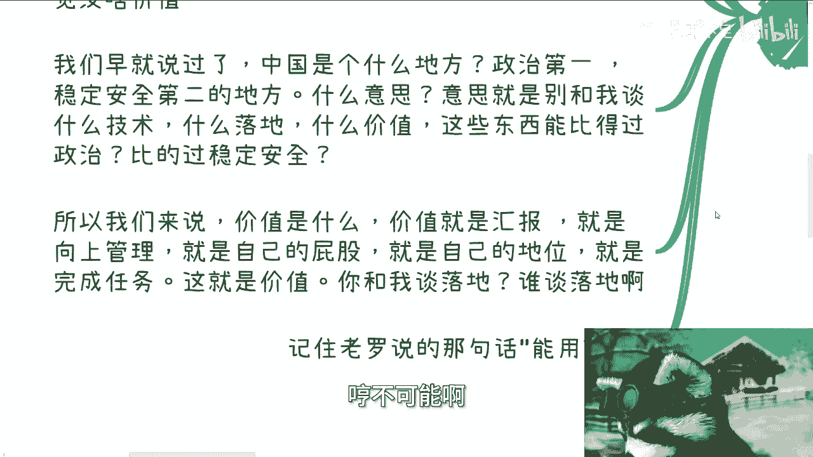
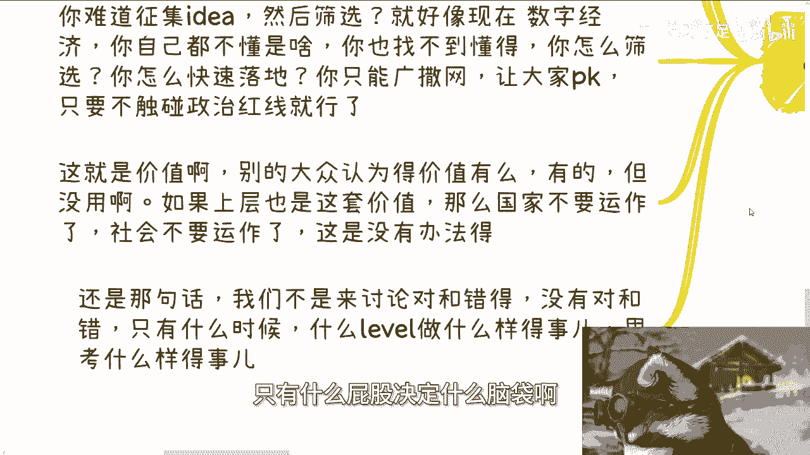

# 产业落地的核心价值 - P1 - 赏味不足 - BV1im41127Em

哈喽大家好，今天我们这一期讲的是这个产业的落地价值啊，落地的核心价值，首先我先这么说。

我没指望你们都能听懂，那个如果但凡能听懂的呢，我觉得你们也应该明白接下来做什么。

或者自己这辈子应该做什么对吧，首先济南活动呢小伙伴问了一个问题啊。

他说让我说说整体中国这个产业的运作逻，辑和模式，我当时是这么说的，我说简单来讲呢，冰冻三尺并非一日之寒啊，当然我觉得可能全球每个国家都一样啊，但别的我们不管，我们先说国内，国内的业务落地模式呢。

其实一直以来都是投入，就或者说这么说吧，从我们的角度来讲，是投入大于价值本身，那当然从上层的角度来讲，到底是不是大于我们不知道啊，不知道你们可以自己判断，那我们先来说价值啊。

我发现我聊下来很多人是这样子的，象牙塔内的小伙伴来，他就喜欢跟我谈价值，就真的，你你跟很多这种什么，有政治地位和社会地位的人，人家不跟你谈价值的，就谈钱，这就很很好玩，你知道吗。

你比如说问我什么高效落地一个课程啊，一个实验室啊，政府落地一个项目啊，有什么价值啊，跟我说感觉没啥价值，我们早就说过了啊，我早就跟你们讲过了，国内是什么地方，你们一定要牢记啊，政治第一。

安全稳定第二的地方，什么意思呢，意思就是别来跟我谈价值，也不要跟我谈技术有卵用啊，好有什么用呢，什么落地什么价值，这种东西能比得过政治，比得过安全稳定吗，比不过那他妈就别谈。

对不对啊，所以我们就来说价值是什么，价值就是汇报，就是向上管理，就是自己的屁股，就是自己的地位，这就叫价值对吧，你不懂是因为你没有这个高度，你不懂是因为你没有到你的屁股，决定了你的脑袋啊，你跟我谈落地。

那不好意思，那你去跟龚俊去谈对吧，你你既要赚钱又要谈落地，哼不可能啊。

我告诉你不可能记住老罗说的那句话啊，能用就行，能用就行好。

那么第二点，产业落地是个什么逻辑啊，其实呢就是一个巨大的一个叫什么大型的，黑暗森林的，黑暗森林的这个实验其实跟投资是一样的，你们接触过以前的VC跟政府项目，或者说，一些政府的基金就明白了。

我跟你讲逻辑是一样的啊，我们举个例子，比如说今天某个产业金额是500个亿对吧。

VC或者落地怎么落的呢，广撒网啊，就是什么个人啊，大企业中企业小企业，然后什么啊，这这个所有都来啊，然后什么合规门槛啊，没有的，放到最松啊，只要你不踩政治红线，随便你们干啊，你想怎么玩怎么玩啊。

那么你们干嘛啊，大家一起看啊，随便怎么干啊，反正就500G是要用掉的，因为它是预算，他不用掉，怎么可能呢对吧，然后啊假设有1万个项目，假设啊500个亿啊，孵化出来的1万个项目。

那么最终啊我们说放到每个省市区，那么总有那么一两个好的项目会走出来吧对吧，你不可能一个项目都没有啊，对吧好，那么一两个项目走出来之后呢，他就重点扶持啊，然后不停的往上面打补丁啊。

我说打补丁的意思就是不停的往上，就跟加加功能啊对吧，维护啊对吧，然后做产业落地啊，加码啊，那么剩下的呢就全部都是炮灰，那就是说我们就说了1万个项目，剩下可能还有9000多个项目，那都是炮灰啊。

那么这些炮灰呢可能不是一下子死的啊，可能是慢慢死的，可能是自己做不下去，也有可能是被就说啊后面的一些政策啊，或者一些东西收拢了之后啊，从合规变得不合规了，或者说从以前的一些灰色地带变成了不合规啊。

反正不管怎么样，反正就是他们就是死啊。

那么问题来了对吧，那么我们就问啊，请问投入多少，产出价值是多少，你觉得值不值啊，因为为什么呢，因为钱是真真正正真金白银投进去的对吧好。

那么我们仔细思考一下啊，小伙伴问的最多的问题是什么，他说投入大于产出，难道不只是难道啊就是这些执行的人啊，这些领导啊，不知道吗，啊我跟你讲啊，这就是问题所在，你认为投入大于产出。

人家不这么认为，为什么哦，我告诉你为什么第一要有产业发展，要有产业落地，请问目的达到了吗，达到了有什么问题呢，你跟我为什么我为什么要跟你谈投入产出呢。

这500个亿本来就要就要预算的，我为什么要跟你谈投入产出呢，对吧，第二这点钱本来就是要花出去的，你说投入大于产出，那么请问产出是什么，投入又是什么，你目的是什么，为什么你怎么定义大于和小于的对吧。

他没有一个数量，你说我500个一孵化出来一个项目，你认为不值得，他认为值得怎么了呢。

你怎么评定呢对吧，这第二点第三点，人类社会的本质是经济流通，那么这些钱流通了吗，流通了，他不管是通过融资还是通过抵押借贷对吧，还是通过什么人才培养，还是通过补贴，请问流通了吗，流通了流通就有价值。

对不对，那流通就有价值，你跟我谈什么有没有价值，你跟我谈有没有价值呢，有什么好谈的，那么请问你认为的价值，跟真正的我们称之为上层认为的价值，是一回事吗，你关心的落地，你只从落地层面去看价值。

那要我说我你要我说啊，我觉得就是格局小了啊，或者说就是不同的屁股决定不停的，不同的脑袋啊，那么第四个我们再往下想想啊，你们看了三里面所说的，你我就这么跟你们讲，你们往前翻翻各行各业。

我可以告诉你们认各行各业，各个行业都是这么一个发展逻辑，而且咱就这么说，任何一个产业，任何一个领域，你指望上面领导或者所谓的国企，央企能做好，可能吗，可能吗，我请问他们怎么做。

就各个产业刚开始做的时候都是百废待兴的，什么叫百废待兴，就是需要广撒网，需要你去野，需要各种天马行空，我就问嘛，你觉得领导和国际行行能能天马行空吗，啊他们外面的枷锁我们就这么说吧。

他们的枷锁比中小型企业比老百姓来得多，他们的想象能力也没有中小企业老百姓来的强，你让他们怎么也怎么天马行空对吧，那你说你说你不去广撒网，你怎么做，我就请问如果你是领导，你怎么做。

你怎么花这500个亿对吧，你难道跟我说啊，陈老师，我们我们就开始征集id，我要好好做，你怎么好好做对吧，我就问你，比如说像现在数字经济，你作为一个领导，自己都不知道数字经济是什么啊，你也找不到懂的。

你根本就不知道谁过来靠谱，谁过来不靠谱，你怎么筛选，你怎么快速落地，你只能广撒网，让大家pk对吧，然后大家pk只要不碰到政治红线就可以了，你还能怎么做，我就问你还能怎么做对吧，这就是价值。

你别的大众认为的价值有吗，有的但没用啊，你如果上层也是这套价值，我就这么说，所有的领导，所有的从上到下都是你们这套落地的价值，那国家不要运作了，社会也不要运作了，产业不要发展，发展不了的。

永远都在抠细节，永远都在说哦，要要落地，那你走永远走不出第一步，你怎么走，第一步对吧，我就实事求是问你，比如说500个亿，今天说这是预算，你怎么做，你第一步怎么做。

对吧你你不要觉得很多东西落地落得慢，比如说落了10年20年，我他妈让你去，你妈一辈子都落不下来，你明白吗，就还是那句话，我们不是来讨论对跟错的，不是没有对跟错，只有什么屁股决定什么脑袋啊。

怎么样的级别决定怎么样的思考方式，你明白吗啊如果你今天做开发或者做设计，或者做任何一个什么土木或者做别的东西，你只要是个打工人，你跟我所讨论的价值，你觉得跟我刚刚跟你们讨论的价值，是一个东西吗，对吧。

你你要想想看中国大部分老百姓，但普罗大众所有的人都说我想赚钱，所有的人都说我想往上爬。

那你们有用往上爬的思路去思考问题过吗，没有啊，对不对，你们想想看，今天跟这个视频配套的，刚刚另外一个那个免费的那个视频，我里面所给你们讲的对吧，就是你们如果一直以来，我不管你们以前十几岁，20几岁。

未来的30几岁，40几岁，你们只要思考问题，你们只要去了解内容，了解东西，整个思考的维度不从真正的金融价值，经济价值，社会价值上去考虑，你单纯从落地价转考虑，你怎么会有进步呢对吧。

这就好像你一直在那边说啊，我不想做工具人，我不想做打工人，我不想做怎么样，但是你的思维又一直是打工人思维，你怎么变化，对吧没有用的，你你你就是就是你们换换位思考，如果你们能有能力换位思考的话。

你们换到我这个位置上，你仔细想想看，如果有人来跟你谈价值，动不动就跟你谈价值，你会觉得什么感觉可笑，真的可笑，你你谈什么价值，对不对，你有什么价值，落地就有价值了吗，谁跟你讲落地就有价值的啊。

那难道说今天做一个产业，做一个产品，做一个软件，做个硬件，你能做出来就要有价值了，诶，那我前两天还跟有一个跟他们举例子，我说那我今天比如说今天那个那个，前两天济南活动现场，比如说50个人。

每个人发一个亿，然后每个人这一个亿都捂在手里不动了，也不消费，也不任何的流通，请问这钱花出去有价值吗，有吗，一样的呀，对不对，你就像很多小伙伴动不动就跟我说啊，老师，我们要创业了，我们要怎么样呢。

你这东西做出来有价值吗，请问对吧，你不要自己在那边自我感动的觉得哎呀，好像这个东西做了对吧，政府是需要的，老百姓是需要的，企业是需要的行，你看啊，第一步，第一点你说他们是不是真的需要，你也不知道啊。

第二点我们退1万步来讲，就算他们真的需要真的有价值吗，那又回到我们今天这个核心问题上面，你认为的价值跟真正社会价值是一个东西，如果不是，那你凭什么赚钱啊，行啊，就这么着啊，你们仔细想想看啊，嗯好吧。

然后剩下的就是那个活动，等5月份再说了啊，接下来就劳动节我也不做了好吧，然后那个职业规划商业规划啊，然后融资啊，股权啊，合同啊对吧，包括这个合伙人啊，包括其他的各种相关的东西啊，包括你们手上有什么牌。

觉得希望从我这边能够帮你们看看，这牌怎么打的，你们可以整理好问题好吧。

