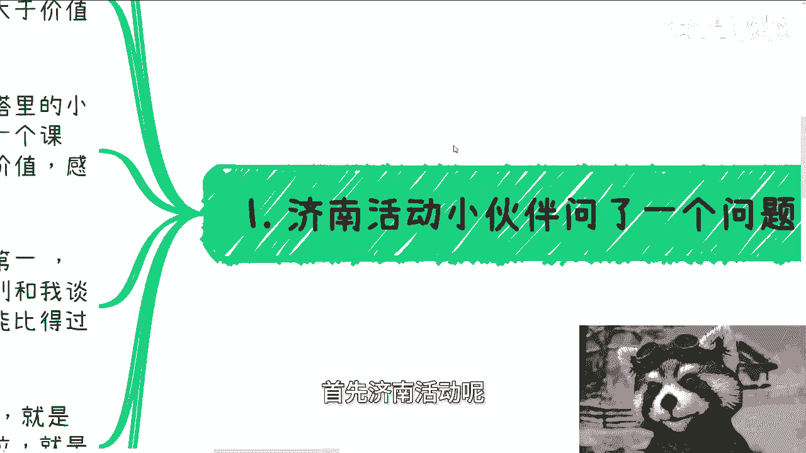
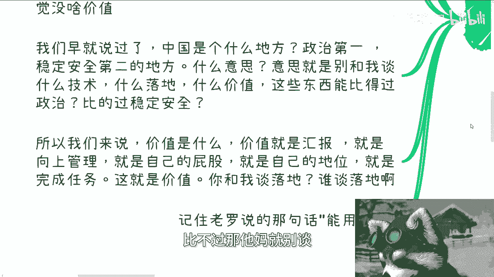
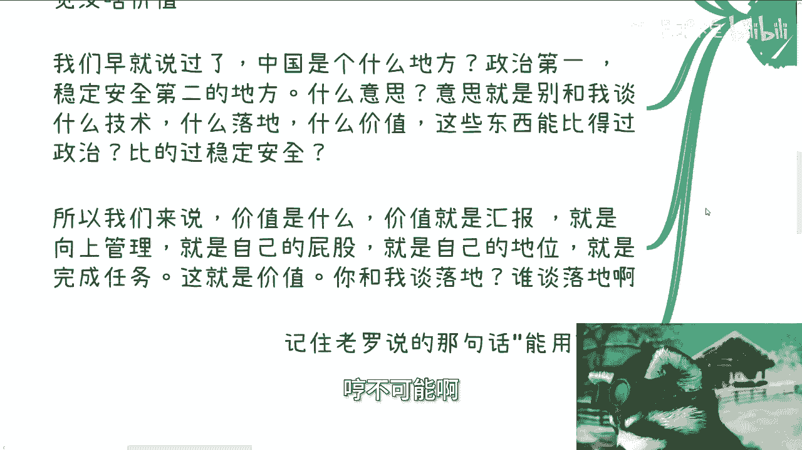
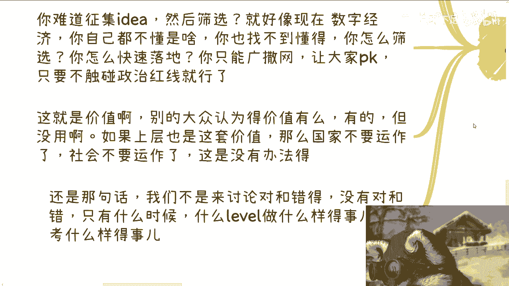
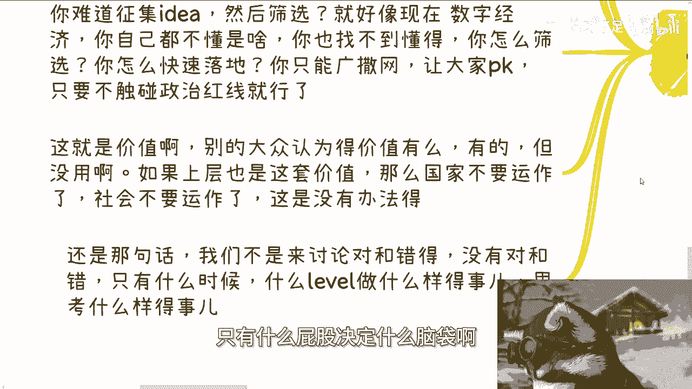

# 产业落地的核心价值---P1---赏味不足---BV1im41127Em

在本节课中，我们将探讨产业落地的核心价值。我们将分析其运作逻辑、不同视角下的价值定义，并理解为何有时“投入”与“产出”的衡量标准并非如表面所见。

---

## 概述

一位济南活动的小伙伴曾提问，希望了解中国产业的整体运作逻辑与模式。我的回答是：冰冻三尺非一日之寒。虽然全球各国可能都有类似情况，但今天我们聚焦于国内。国内的业务落地模式，从我们的角度看，往往是**投入大于价值本身**。至于上层视角是否如此，大家可以自行判断。

---

## 什么是“价值”？💰

上一节我们提到了“价值”，本节中我们来看看不同人群如何定义它。

我发现，象牙塔内的伙伴们喜欢谈论“价值”。然而，许多有政治或社会地位的人并不谈价值，他们谈的是**钱**。这很有趣。

例如，当被问及高效落地一个课程、一个实验室或一个政府项目有何价值时，有人会觉得“没啥价值”。我们早就说过，国内是**政治第一、安全稳定第二**的地方。这意味着：不要空谈价值或技术有什么用。落地和价值，能比政治和安全稳定更重要吗？如果不能，那就无需多谈。

所以，这里的“价值”是什么？价值就是**汇报**，就是**向上管理**，就是**自己的位置**，就是**自己的地位**。这就是价值。不理解，可能是因为你尚未达到那个高度，你的“屁股”决定了你的“脑袋”。既要赚钱又要谈纯粹的落地价值？不可能。记住一句话：**能用就行**。

---

## 产业落地的逻辑：黑暗森林实验 🌲

理解了价值的定义后，我们来看看产业落地遵循什么逻辑。

产业落地本质上是一个巨大的“黑暗森林”实验，其逻辑与投资（如VC或政府基金项目）相似。

以下是其运作流程：

1.  **广撒网**：假设某个产业有500亿预算。落地方式就是广泛征集项目——个人、大中小企业均可参与。合规门槛放到最松，只要不触碰政治红线，任其自由发挥。
2.  **自然筛选**：假设这500亿孵化了1万个项目。最终，在各省市区中，总会有一两个优质项目脱颖而出。
3.  **重点扶持与淘汰**：对于走出来的这一两个项目，进行重点扶持，并不断“打补丁”——即持续增加功能、维护和产业落地投入。而剩下的成千上万个项目，则成为“炮灰”。它们可能慢慢消亡，或因政策变化从合规变为不合规。

那么问题来了：投入了500亿，只成功了一两个项目，投入产出比如何？值不值？因为钱是真金白银投进去的。

---

## 重新审视“投入”与“产出” ⚖️

上一节我们提出了关于投入产出的疑问，本节我们来深入分析为何视角不同结论也不同。

小伙伴最常问的问题是：投入明显大于产出，难道执行者和领导们不知道吗？这就是关键所在：**你认为投入大于产出，但人家不这么认为**。

原因如下：

1.  **首要目的已达到**：产业要发展、要落地，这个目的达到了吗？如果达到了，还有什么问题？为何要跟你谈投入产出比？这500亿本就是预算，必须花掉。
2.  **如何定义“产出”**：你说投入大于产出。那么“产出”具体指什么？“投入”又指什么？你的目的是什么？如何定义“大于”和“小于”？这没有统一标准。你认为500亿孵化一个项目不值，他认为值，你如何评定？
3.  **经济流通即价值**：人类社会的本质是经济流通。这些钱流通了吗？无论是通过融资、抵押借贷、人才培养还是补贴，只要流通了，就产生了价值。流通即有价值。那么，你关心的“落地价值”和上层认为的“流通价值”是一回事吗？
4.  **历史的必然模式**：回顾各行各业的发展初期，几乎都是这个逻辑。任何一个新兴产业在“百废待兴”时，都需要广撒网，需要野性生长和天马行空的创意。你认为领导或国企、央企能做到天马行空吗？他们的束缚更多，想象力可能不如中小企业和个人。如果不广撒网，你怎么做？如果你是领导，面对500亿预算和“数字经济”这类自己都不甚了解的新领域，你如何筛选靠谱的团队？你只能广撒网，让大家在避开政治红线的范围内自由PK，优胜劣汰。这就是现实中的“价值”。

大众所认为的“落地价值”存在吗？存在，但在此模式下作用有限。如果上层也只遵循这套价值体系，国家、社会和产业将无法发展，大家会永远陷在抠细节、谈落地的第一步，永远迈不出实质性的步伐。实事求是地问：给你500亿预算，让你推动一个新兴产业，你的第一步是什么？

不要觉得某些项目落地慢（比如花了10年20年）。如果换一种思维方式，可能一辈子都落不下来。我们不是在讨论对错，而是**屁股决定脑袋**，不同的位置决定了不同的思考方式。

---

## 思维升级：从“打工人思维”到“上层思维” 🧠

我们探讨了产业落地的逻辑和不同的价值视角，本节我们来思考这对个人有何启示。

如果你是一名开发者、设计师或任何领域的打工人，你所讨论的“价值”，和我刚才所讨论的“价值”，是同一个东西吗？

中国大部分老百姓都想赚钱、都想往上爬。但你们是否曾用“往上爬”的思路去思考过问题？没有。

如果你们一直以来——无论十几岁、二十几岁，还是未来的三四十岁——思考问题的维度始终局限于“落地价值”，而不是从真正的**金融价值、经济价值、社会价值**去考量，你怎么可能取得进步？

这就像你一直说“我不想做工具人，不想做打工人”，但你的思维却一直是打工人思维。这没有用。

换位思考一下：如果你处在决策者的位置，有人动不动就来跟你空谈“（落地）价值”，你会觉得可笑。落地了就一定有价值吗？难道做出一个产品、一个软件就有价值了？

我举一个例子：假设在济南活动现场给50个人每人发1个亿，但他们把钱捂在手里，不消费、不流通。请问这钱花出去有价值吗？一样的道理。

很多小伙伴跟我说：“老师，我们要创业了，我们要做某个东西。”请问，这东西做出来就有价值吗？不要自我感动，觉得政府、企业、老百姓需要。第一，他们是否真的需要，你未必清楚；第二，就算真的需要，你认为的价值就是真正的社会价值吗？如果不是，你凭什么赚钱？

---

## 总结

本节课我们一起学习了产业落地的核心价值。

1.  **价值定义因视角而异**：在产业落地中，**价值往往等同于汇报、向上管理和巩固自身地位**，而非单纯的技术或产品效用。
2.  **落地逻辑是“黑暗森林实验”**：通过**广撒网、自然筛选、重点扶持少数成功者**的模式来推动产业发展，大部分项目成为“炮灰”是常态。
3.  **投入产出比的认知差异**：决策者更关注**预算执行、目的达成和经济流通**等宏观价值，而非微观的项目投入产出效率。**屁股决定脑袋**。
4.  **思维模式决定行动高度**：个人若想突破，需将思考维度从“打工人”的落地细节，提升到涵盖**金融、经济、社会**的更大价值层面。

希望本节能帮助你理解产业运作背后的逻辑，并重新审视自己所追求的价值。