# 产品运营和售前对未来创业、副业的影响 - P1 - 赏味不足 - BV1hL411B7o4

很好这个大家星期四好是吧，哎呀我今天早上出去搞钱去了。

所以就对吧，慢了呃，之前呢有小伙伴让我聊聊，这个产品运营跟售前哦。

呃我还是那个观点啊，就是说我呢也的确给大家整理了一些内容对吧。

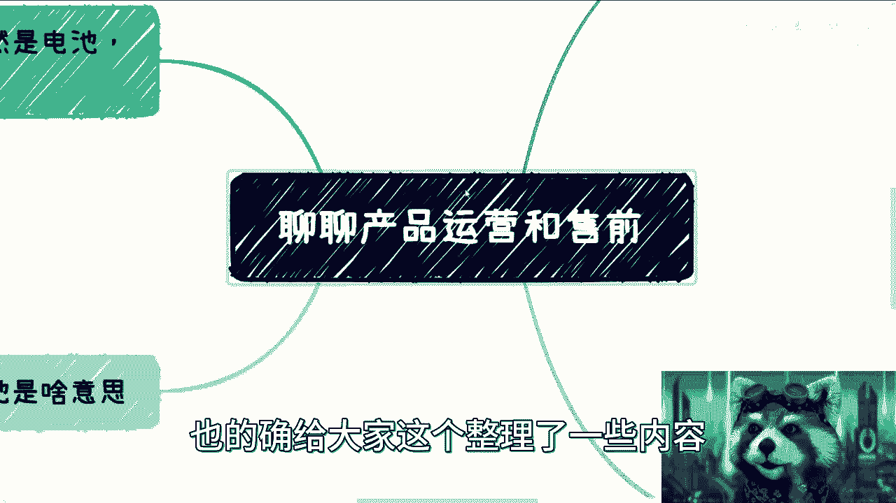

你可以看啊，反正整理一些内容啊，包括这个生命周期啊。

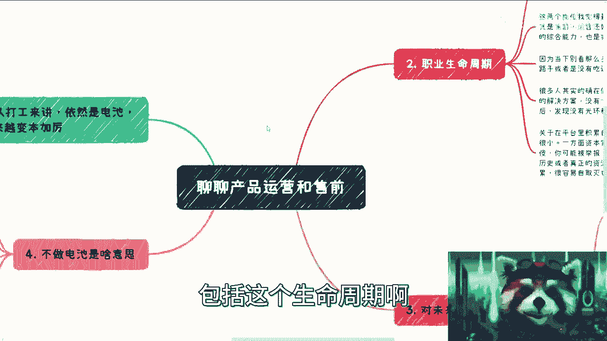

包括这个小伙伴提到对于后面副业，还有创业的影响，但是呢就是说整个岗位本身啊，我可能待会讲一下，但是公司内打工呃。

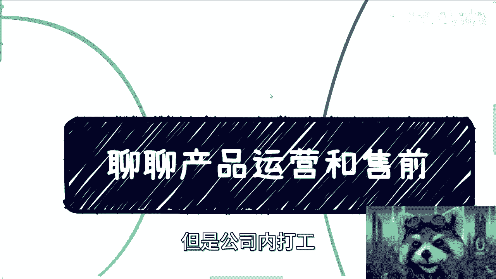

做电池这个角度我就不去多说了，因为这不是我想读书的东西啊，而且说实话打工里面的精髓。

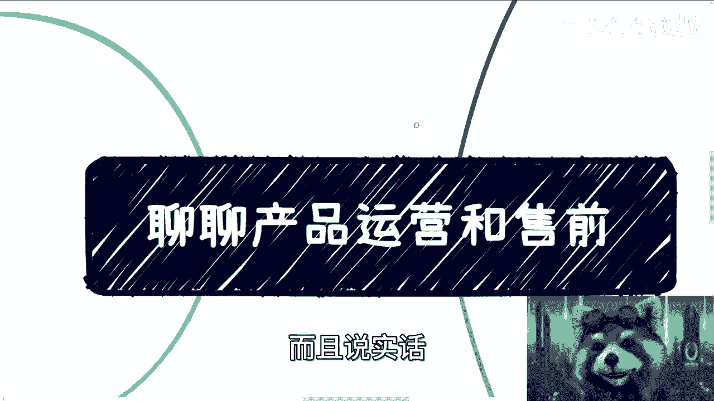

我也不是那么的专业啊，呃首先是这样子的对吧。

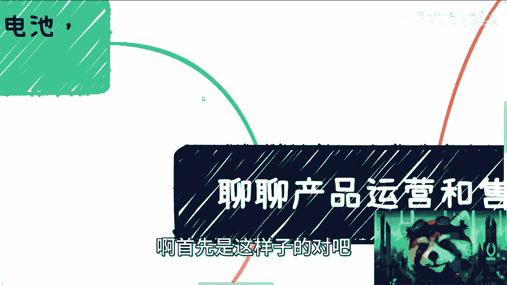

首先啊对我来讲，从打工角度来讲依然是电池，所以说本身呢呃大家的这个价值只会越来越低，然后可替换率只会越来越高，产品运营跟售前这两个岗位本身也是一个啊，怎么说呢，就是我后面也写了。

就是对资本家来讲呢是肯定要的，但是呢到底谁来做啊，这个并不是那么重要，当然了，就是说如果你做的在金字塔比较顶顶尖的对吧，你说我在医药公司里面是一个总监，或者是个VP或者是个怎么样。

那你的可替换率可能相对比较低嘛对吧。

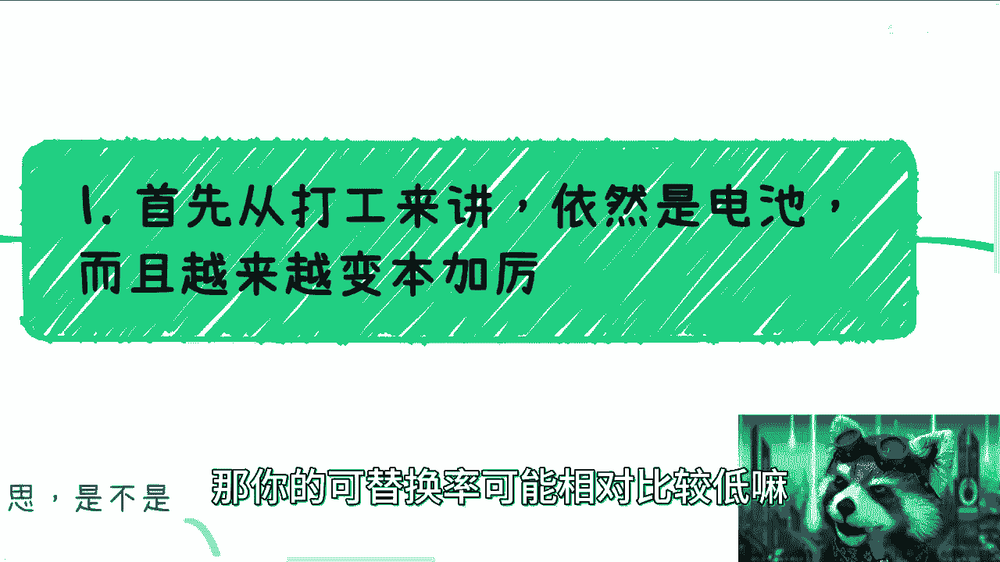

但是大部分打工人，这个可替换率肯定会更高的啊，首先呢先讲完故事啊，直播带货大家都知道对吧，直播带货呢都很火，那我就问啊，你们知不知道为什么最近有很多的人啊，这样很多老板资本家对吧。

为什么越来越多的企业需要数字人，唉其实也很简单啊，因为他们就担心呢直播的这个人的IP，这个人的形象啊，会抢走这个企业的用户，那简单来讲就是说资本家并没有把你当人看啊，就是你只是一个壳子啊。

你只是一个背后的螺丝钉，前面是谁并不重要，所以他们现在需要更多的数字人啊，来把你的这个人你就是说白了你脸都不用啊，比不上你的脸啊，你只要一个活人在后面对吧，讲讲就可以了，那大家对这个这个IP对吧。

对这个形象有认知对吧，就可以了啊，那么就说明这是很有替换性的，那你说从我角度来讲，我就不一样对吧，你说啊我今天用了这个小熊猫的形象没问题啊，那明天你换一个人来了，那大家你们一听就知道了对吧。

因为我要阐述的是我的价值观，我的很多的认知对啊，但是直播卖货不一样啊，我的，别人过来他就是买买货对吧，听你介绍，那你说他谁知道背后是谁啊，是吧啊，再说现在变身变身的这个技术这么好是吧。

然后呢就是大公司啊，我跟你讲，大公司现在情况也非常的清楚，就是大公司发展这么多年了，0~1呢基本上都完成了，1~70和80都有可能完成了，所以说你会发现进去你要能学到东西吧，能的就是大公司的管理啊。

流程啊对吧，各个方面你肯定难的没问题的，但是很多的业务你已经接触不到了对吧，因为真正有价值的是0~1，真正有价值的是1~50，1~60这两个节点过程发展都很有价值，但是你进去你就会发现啊。

虽然我在了一家大公司，但是我好像什么都不知道对吧，你你上下文什么都不知道，你就干活对吧，虽然你干活呢你也干干的懂，但是你对全职没有了解，为什么我要说这个事啊。

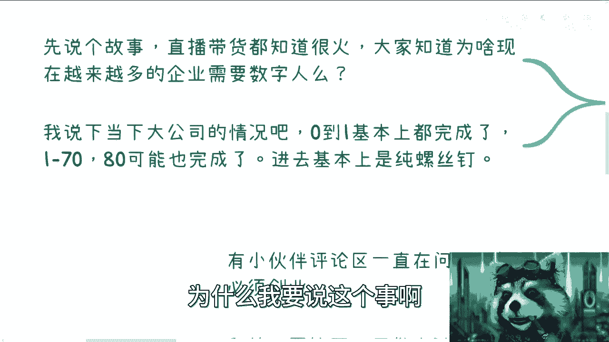

是因为既然要说产品运营更售前。

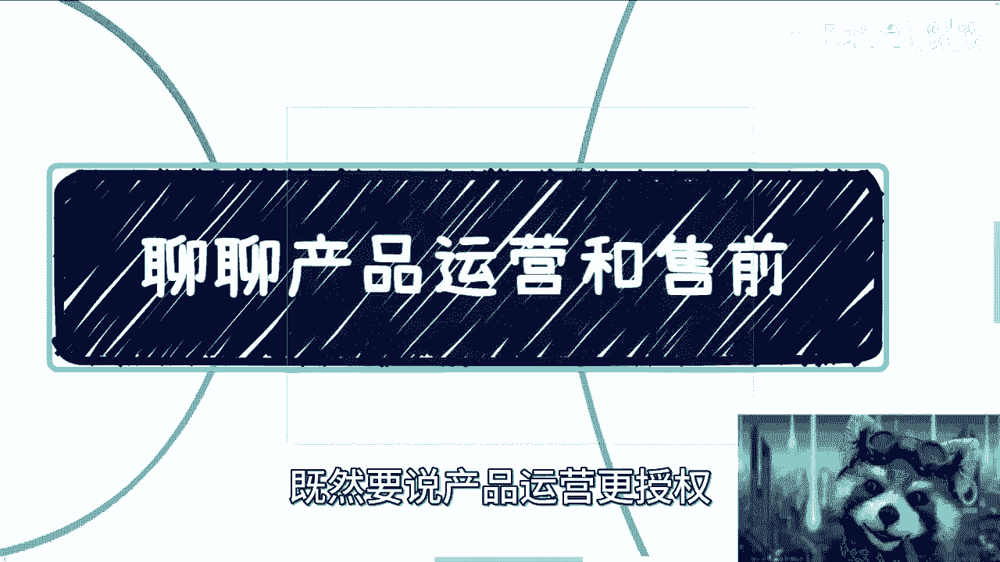

那么这两个岗位，对于我们刚刚说的那些是非常依赖的。

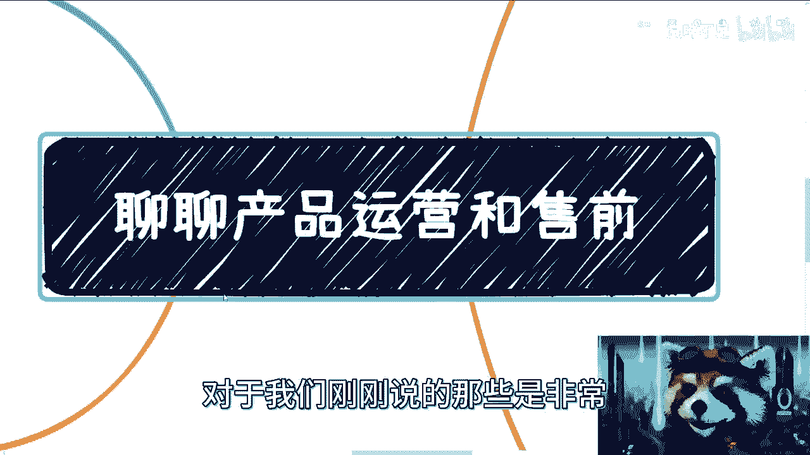

依赖性极强，你知道吧，依赖性极强，好我们来往下看啊。

首先呢我们再来看这个职业生命周期，我在这个地方写了，首先啊从打工的电池角度来讲，早晚都是要被替换的，因为从资本家来讲，他不缺，就他也许是缺不了这个岗位，但是他肯定是缺来了这个人的啊。

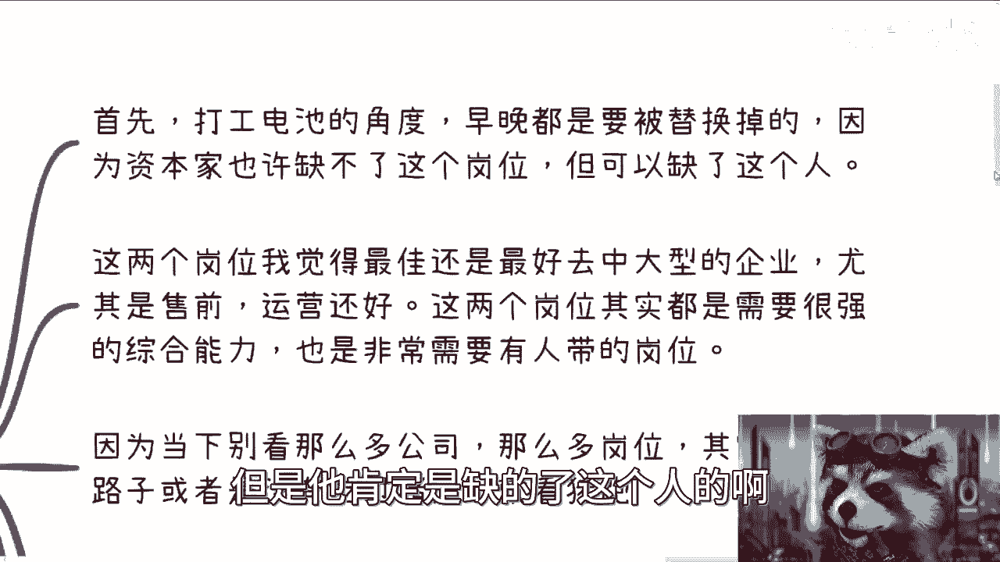

就是对于大家来讲，你们能被替换掉是无所谓的，因为岗位重要，人不重要对吧，这是第一个，第二个是什么呢，这两个岗位就像我刚刚说的，这两个岗位其实是很吃经验。

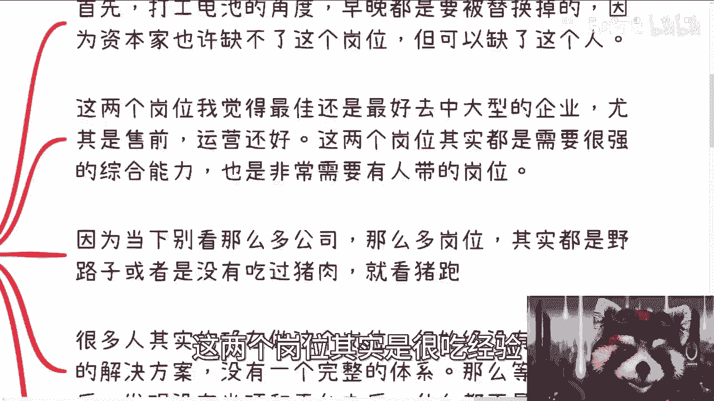

而且是很吃这个解决方案的，为什么呢，因为这两个岗位你看啊，我说最佳，目前当下当下最好的就是去中大型的企业啊，尤其是售前运营本身还好，尤其是售前，因为售前这个岗位我跟你们这样说，反正我看下来了，很简单。

就是哎呀这个要么外企对吧，要么大公司对吧，他分工啊这个这个角色啊分的还不错的啊，很多小公司妈的搞了一个售前，很搞笑，你知道吗，就是啊开发不像开发，售销售不像销售，反正四不像，就是一个人干两个人的活对吧。

就说白了就这么回事啊，就是老板要省钱啊，那么这两个岗位呢本质上它是很吃经验。

很吃过程，很吃综合能力，也是非常吃解决方案的，对于大部分新人来讲啊，就是他是必须要有人带的，这样岗位没人带，我跟你讲野蛮发展没有任何，只是你可以被资本家利用，但是对你来讲毫无帮助啊，这是第二点。

第三点呢就是当下呢我没看这么多，就我跟你们说，当下你你也别去看这么多，有这么多公司，这么多岗位，其实都是野路子，就是说白了就是别人有我们也得有啊，别人没有，我们也得有，但至于怎么做。

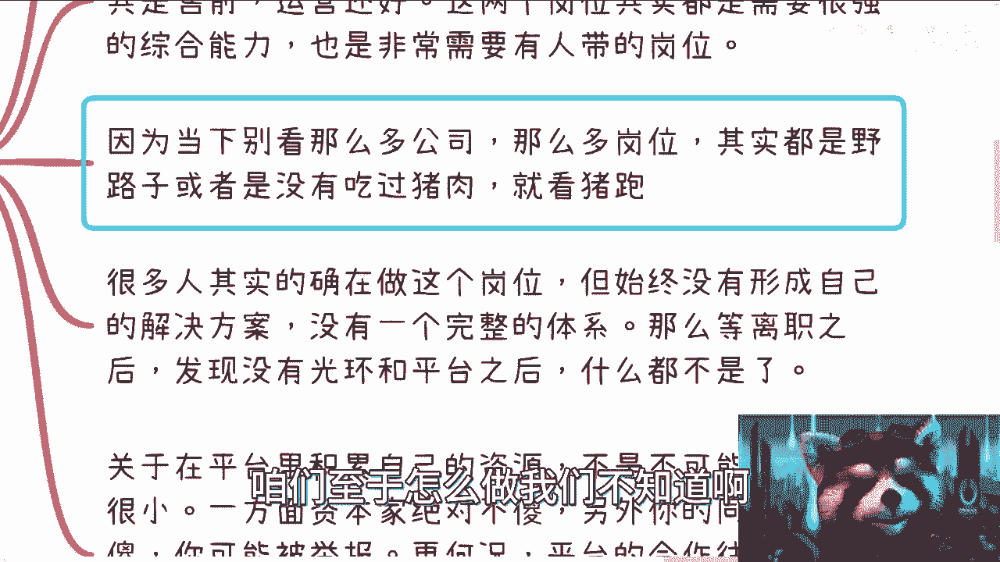

我们不知道啊，反正就是三个字不知道啊，然后呢就是说就是说我这边写的，就是说就是属于没有吃过猪肉呢，但是看着猪跑啊，自己也想跑啊，就这么个情况，那你说他是不是猪吧，这个猪都不如是吧啊。

那还有呢就是很多人其实在的确在做这个岗位，但始终我跟你讲，这个是非常重要的标新啊，这个标签他能不能给我标个重点，嗯嗯好像并不行是吧啊，就是他始终没有形成自己的解决方案，没有一个完整的体系啊。

就是你自己想看，如果你今天做的是marketing，你做的做的是这个售前对吧，或者是一些什么techtechnical assistant对吧，你是没有一个完整的体系的，那么等你离职的时候。

你会发现你没有了这个公司的光环，没有了这个平台，你就什么都不是啊，对对我，可能说的不好听点，就是的确是什么都不是，因为你没有一个完整的，你你没有一个完整的体系，你不了解一个上下文，你到任何一个别的地方。

还是那句话，你作为一个螺丝钉，哪个地方要找螺丝钉都很容易，但是你如果有一个完整的认知，完整的体系，完整的方案，那么这种你这样的人也许也有，但是你的可替换率就会变低对吧。

就市场上面企业当老板或者甲方爸爸要去找，这样的人，相对就比较难找，对不对，或者说也好找，但他可能花的钱更多，对吧啊，所以说呢还有另外一方面啊，关于在平台里面积累自己的资源啊。

这个事儿呢也有非常多小伙伴提到，我跟你们讲不是不可能，但概率很少啊，咳咳咳完了咳咳，呛住了哈啊，为什么，一方面是资本家绝对不傻，因为你去要积累自己的资源，我不是说你抢他的资源啊，但是你积累自己的资源。

你等于常态资源啊，是不是啊，这是第一个问题，第二个问题呢，另外的问题呢，在当下这个情况下，你同事也不傻，你明白吗，就是说你制作很多东西为你自己成长没问题啊，但你可能被举报啊，对不对。

那你这样就已经超出卷的范围了，对不对，人家就说你作弊啊，你违规啊，你这个不能这样卷，对吧啊好，那你怎么办呢，对不对，更何况啊平台的很多合作呢，它往往是有些历史或者真正的资源方的啊，这样我打个比方。

这就比如说啊你你在我手下打工啊，然后呢啊，你跟别人资源方可能有点这个啊小动作啊，然后想积累自己的关系怎么样，那人家是跟你熟还是跟我熟啊是吧，那人家回头跟你聊完，回头一个电话打给我啊。

你们这边谁谁谁怎么样怎么样怎么样怎么样，对不对啊，所以呢我跟你讲啊，你在做电池的时候呢，尽量啊就是就不要贸然去积累啊，你情商智商都够了，我觉得可以啊，但大概率我觉得你别啊。

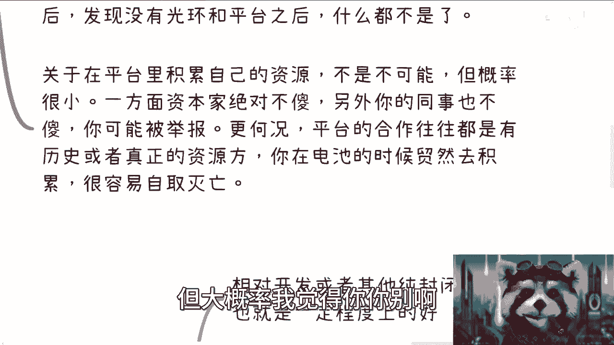

别就是很容易自取灭亡啊，这个事情我在这个地方已经提醒过你们了啊。

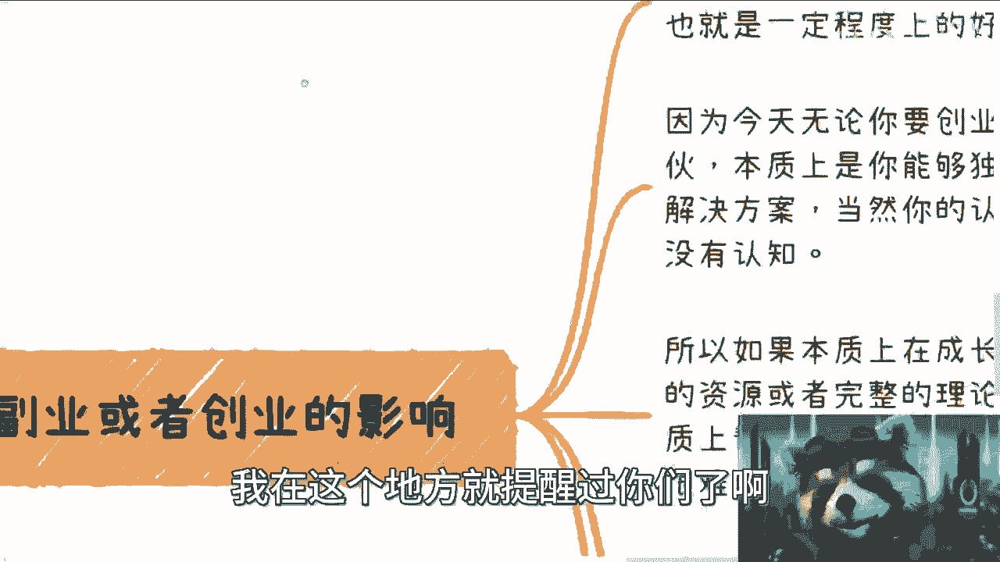

那么第三点对于未来副业跟创业的影响呢，这一点唉这个我们来再一个个来看吧，好吧，相对开发啊或者其他纯封闭式的岗位啊，销售跟啊不是小时，售前和运营的确是好很多的，因为毕竟它还是一个跟市场。

跟用户和客户有过交集的这样一个岗位，对不对，但是啊这也就是一定程度上的好，什么意思呢，这这这也就是一个电池程度上的好，对，就是说叫做比上不足，比下有余是吧啊，那这是第一个。

那么第二个呢就是说因为今天呢你要这样想，你无论是去创业还是副业，还是别人拉你入伙对吧，本质上是什么呢，是你能够独当一面，为什么呢，因为本质上总不能是，本质上如果是你能够做螺丝钉。

那别人会找你干什么呢对吧，你买张彩票怎么不是你中奖呢是吧，这不就这个道理嘛是吧啊，那么也就是说呃，也就是说我说的这个完整的解决方案，当然啊就我这地方也写了，你的认知可以是错的。

你的你甚至解决方案都可以是错的啊，但是你不能说我没有认知啊，是不是啊对错，咱们再先不去说它，因为很多地方呢它是啊，你比如说你在京东啊能够做，你在阿里能够做，但并不代表你适合一个新的创业产品对吧。

咱们有很多东西是要灵活去去什么调整的啊，但是你不能说我不知道啊，是吧啊，我说我找你合作啊，然后我说你能不能帮我搞一下运营，你说嗯我做过运营，但是这个东西怎么从零开始从0~1呢，好你问我吗。

你问我他妈我找你干什么，是不是啊，那么所以说呢本质上呢在成长过程当中呢，如果积累不到自己的资源，或者完整的一个理论逻辑，那么对创业或者副业本质上其实帮助是不大的，因为缺了平台之后，你要从零开始做。

其实很难呃，你可以自己问一下这个问题，或者你可以自己假装自己要去创业，或者别人拉你入伙对吧，你想想看你你会做什么对吧啊，因为我跟你们这样说，是这样子的，你未来要去做副业或去做创业，或者做自己的一些东西。

不是只考虑方案的啊，就比如说你跟我合作了，我跟你比如说我跟你合作了啊，我一定会问你的，你这个方案这样做对吧，可以的，那你给我个预期值啊对吧，比如说预期有多少流量，预期有多少收入，预期大概有多少转化预期。

我们跟别人到底有什么差异，你得告诉我呢，这就要完整的认知完整解决方案了，你不能扔给我一个东西，然后我就问你这些问题，你说哦我也不知道为什么我没有经验，那你那你做好螺丝钉就好了呗，做好电池不就好了呗。

是吧啊，所以说呢从恒宏观角度来讲呢，其实更没有什么帮助，为什么呢，因为从商业化角度啊，商业化逻辑啊，公司管理啊，公司注册啊，商业谈判啊，股权架构啊对吧，财务法务啊，你你我不管。

你这样做产品运营还是做售前，你该不懂的还是不懂啊，该被骗还是被骗，没有区别的，所以你知道吗，这个字为什么，我说你相对开发或相对测试，相对产品相对项目经理啊，相对一些对内的你的确是有一定的优势。

但是这优势也就是那么丢丢是吧啊，那么也有人会说来了，他说不对啊，还有售前，我跟你讲啊，售前呢其实是个很神奇的岗位啊，就是说我看到过比较正规的呢，我说的很清楚了，就是大公司或者外企是有的。

别的就是四不像啊，简单来讲就是说你可以做，不是你不能做，你拿笔钱，每个月万把块钱也可以拿，但是你也就那么做啊，看似你很有成长，但其实没卵用啊，不要来杠啊，没有没有意义的好吧，就是我觉得你们要觉得有成长。

那你们觉得有成长随便啊，那个不做电池，最终我来解释一下什么意思啊，因为最近小伙伴在评论区一直在问啊，不做电池什么意思啊，是不是说必须创业啊，我统一回答一下，什么叫不做电池呢，就是说你活着为你自己活着。

你工作为你自己工作赚钱，为你自己赚钱，你知道吗，不是说你工作为别人工作，你赚钱是为别人赚钱，你拿到的只是一个毛零头，别人赚的是股票，这不叫工作，这就叫电池哦，你的收入，你的工作，你的赚钱你是可以掌控的。

至于模式不重要啊，别别不用去想说啊，一定要全职，一定要坚持，一定要怎么样不重要，我管你是什么模式对吧，你要你要为自己就可以了对吧，你比如说我给你们举个例子，比如说我现在也坚持给很多企业，政府打工打的呀。

但这些我可以控制啊，为什么，因为从0~1，从一到落地全是我做的，对不对，就从销从销售端对吧，从推广从产品包装，从谈判到丰润到最终都是我呀，我为什么不能选择，我可以选择做，我也可以选择不做对吧。

当然也有很多人说，那你这样子别人也可以选择，对不对，哎对没问题，但是啊第一由于我跟别人不是全职合同，所以他不可能说把我干掉就把我干掉对吧，因为说把我忘掉就把我干掉，找一个人替换，是因为什么。

是因为他找一个人替换，很好替换，但是啊我的甲方爸爸跟我的模式，他但凡把我换掉，你们想想看，政府跟企业最怕的是什么，最怕的是这个单子的供应商，最怕的是这个单子解决方案不稳定，也最怕的是这个人不靠谱。

不可信，这个当中啊，你们要明白，信任关系比我能拿出解决方案更重要，当然同样的说，再退1万步来讲，我也不关心，为什么呢，因为我对完整的链路很清楚，天象甲天下，甲方爸爸这么多，我不带，我根本就不care。

多多多出几个，少出几个无所谓啊，对不对，而且同时最重要的是是什么，我的时间自由，以及我不会受到年龄的限制，我不可能出现一个说啊，由于甲方爸爸知道我多少岁了啊，这个人不行，年纪太大了。

换一个年轻的不现实的呀，对了啊，所以我才说为什么大家要去积累自己的关系，为什么要去做商业合作，这才是这个道理啊，我就觉得可能很多人真的没有想明白啊。

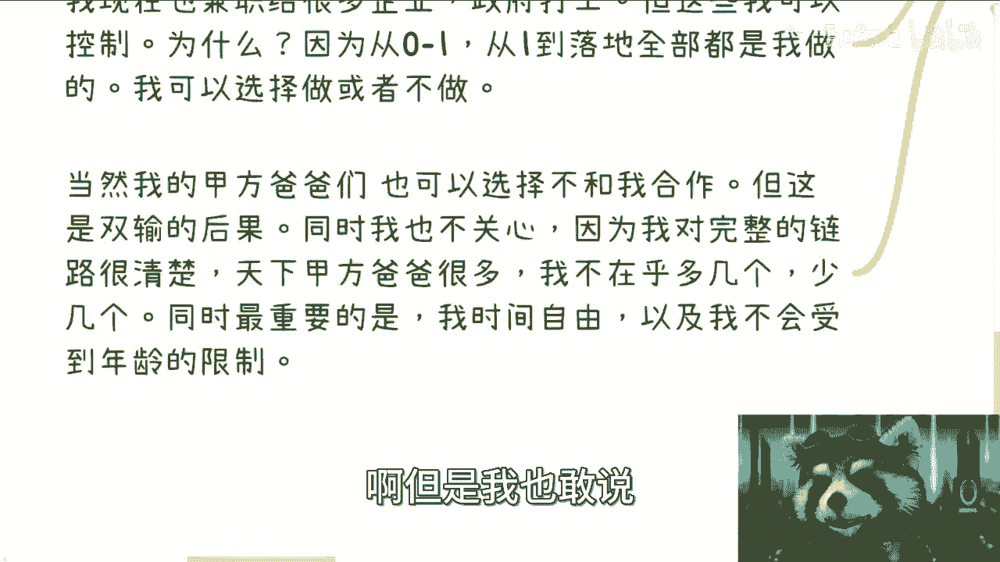

但是我也敢说你们到想明白的时候，可能已经来不及好吧。

那么产品运营跟销售我觉得也是就大差不差吧，对吧啊，这个关于你说怎么运营啊，这个怎么做售前这些技能的东西，你们在别的地方可以去学啊，这个不是我一呢也不是我能讲的，二呢也不是我想讲的啊，没有太大必要。

我的三观，我的任职一级告诉大方，我要告诉大家，我不是来教大家怎么做电池的啊，怎么做电池这样事情我是不会做的，唉行吧啊，就这么着吧。

