# 产品运营和售前对未来创业-副业的影响---P1---赏味不足---BV1hL411B7o4

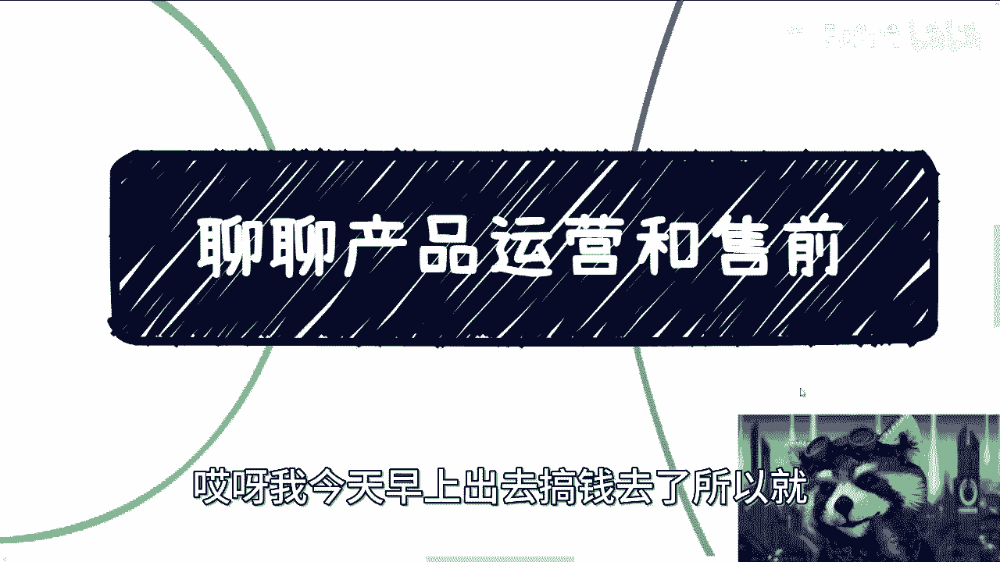

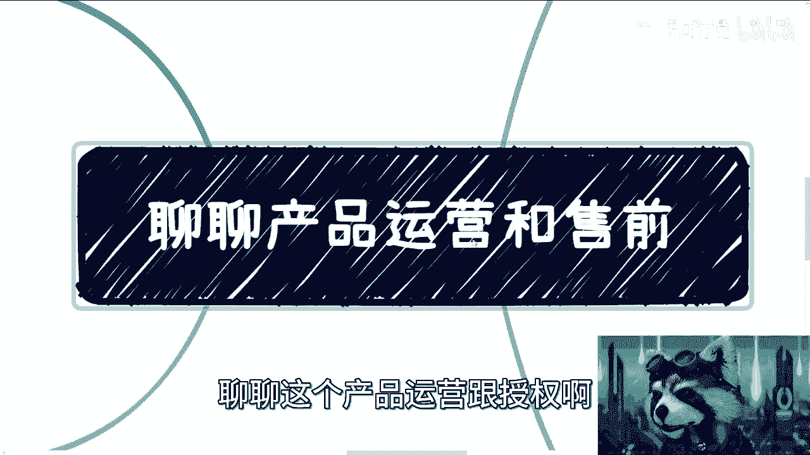

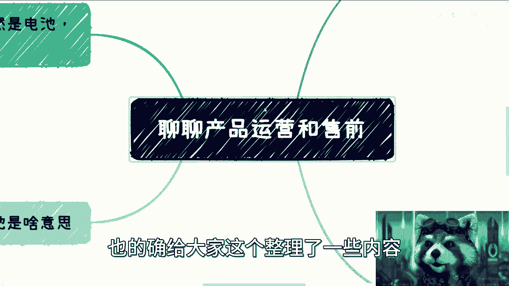

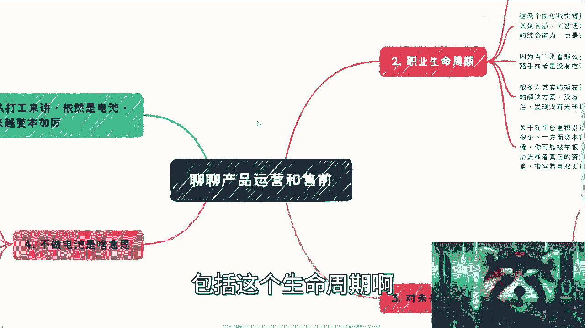

在本节课中，我们将探讨产品运营和售前这两个岗位的职业本质，并分析它们对个人未来开展副业或创业可能产生的影响。我们将从“打工人”的视角出发，剖析这些岗位的局限性，并讨论如何超越“电池”角色，为个人长期发展积累真正的价值。

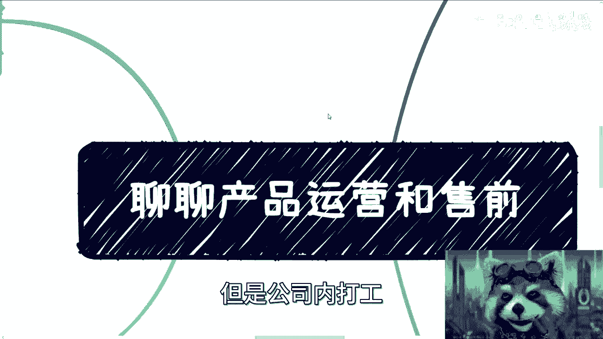

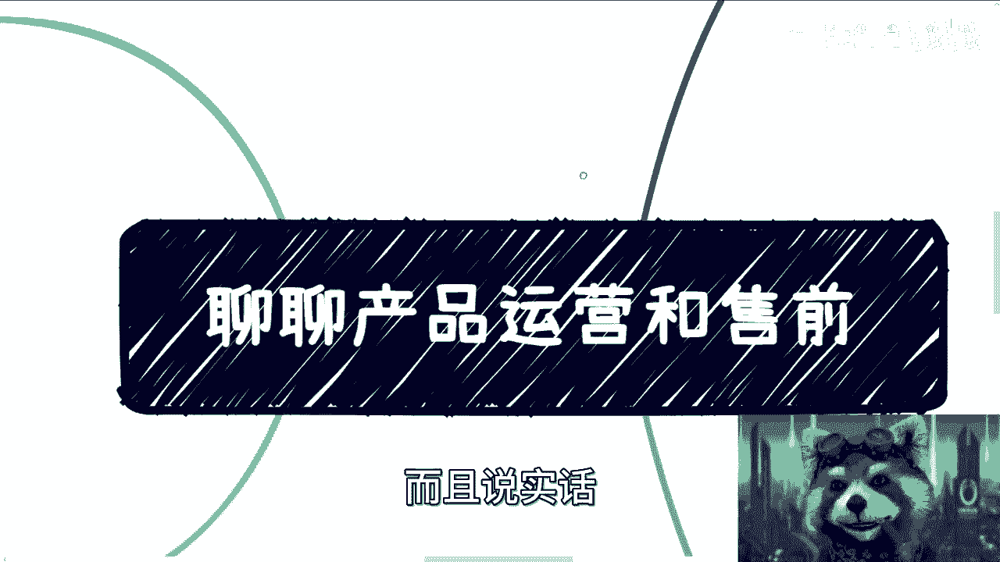

---

## 职业生命周期与岗位本质 🔄

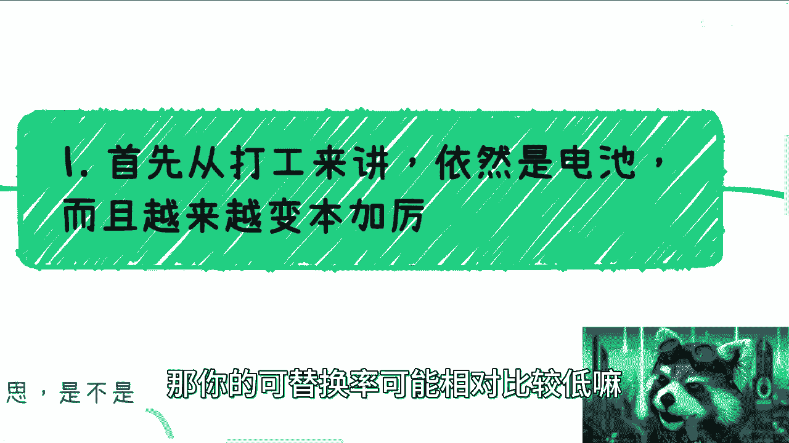

上一节我们介绍了课程的主题，本节中我们来看看产品运营和售前岗位在传统职场中的生命周期和本质。

首先，从为公司打工的“电池”角度来讲，从业者早晚都可能被替换。资本方需要的是岗位职能，而非特定的个人。公式可以简单表示为：

**岗位重要性 > 个人重要性**

其次，产品运营和售前都是非常依赖经验和解决方案的岗位。它们的最佳实践通常存在于中大型企业或外企，因为这些地方分工明确。在许多小公司，这些岗位可能职责模糊，一人多职，本质上是老板为了节省成本。

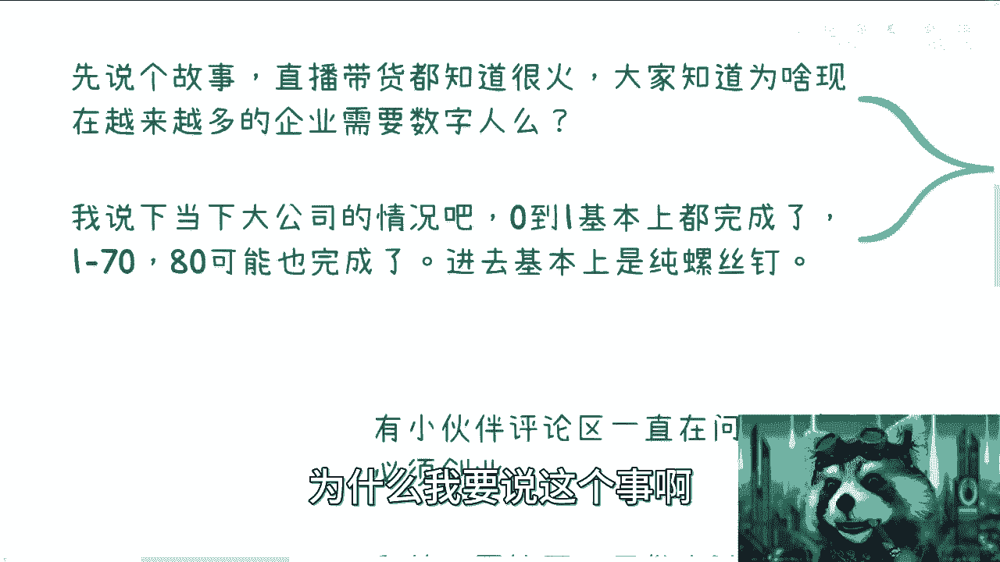

第三，当前市场上有许多公司设立了这些岗位，但缺乏成熟的体系和方法论。这导致从业者可能“没有吃过猪肉，但见过猪跑”，在实际操作中缺乏深度认知和完整的解决方案体系。

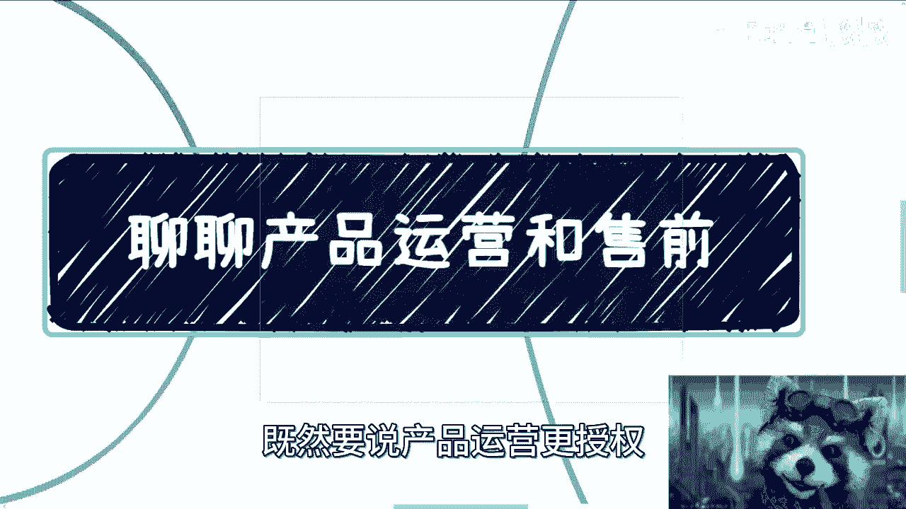

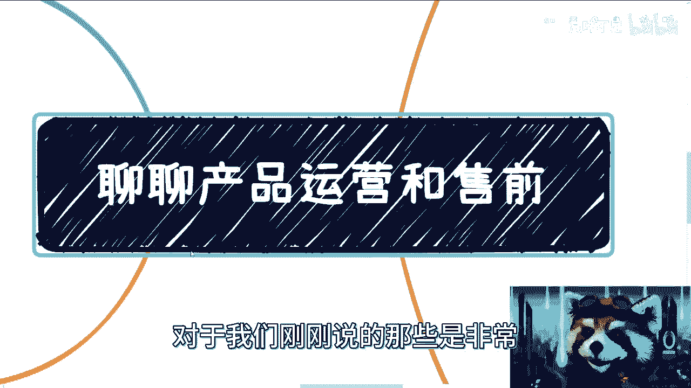

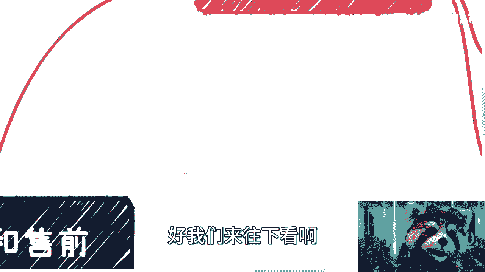

---

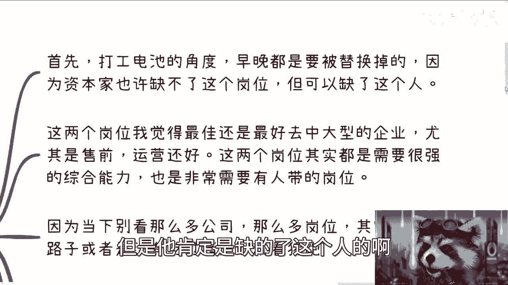

## 平台内积累资源的困境与风险 ⚠️

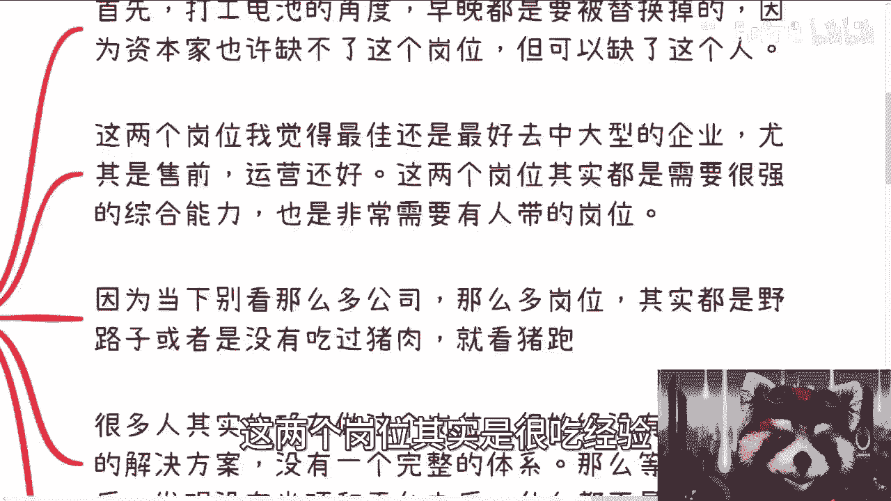

了解了岗位的本质后，我们自然会想到是否能在工作中积累个人资源。本节我们来分析这种做法的可行性与风险。

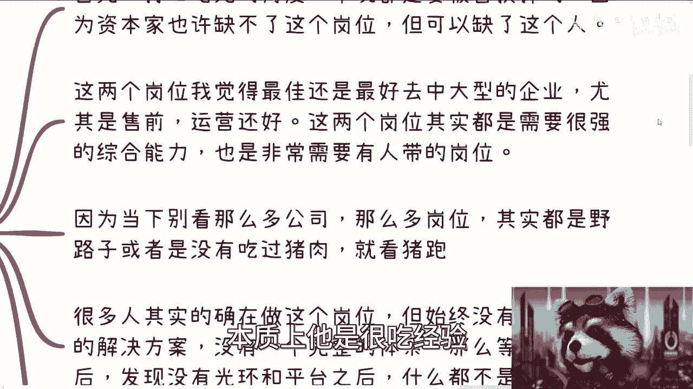

关于在就职平台内积累个人资源，这并非完全不可能，但概率很低且风险较高。

以下是主要风险点：

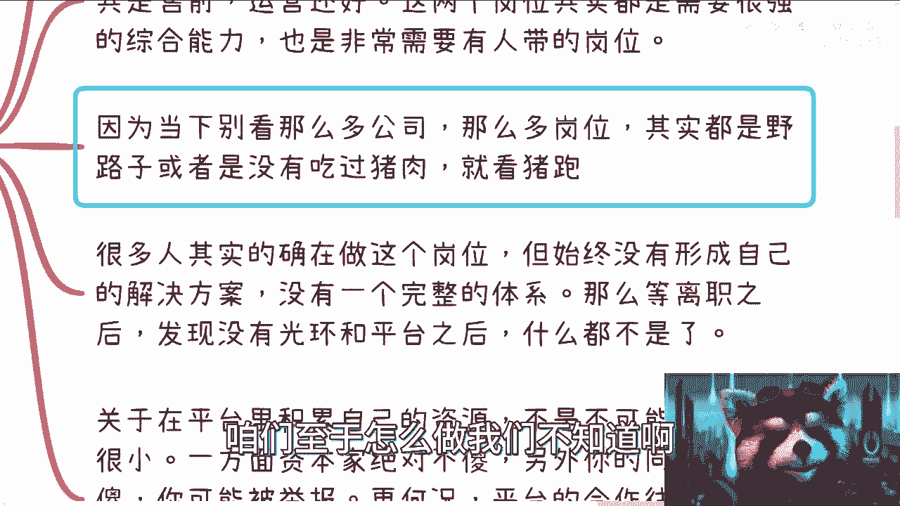

1.  **资本方的警惕**：公司通常不鼓励甚至禁止员工私下积累可能与公司业务冲突或形成竞争的资源。
2.  **同事的监督**：过度为个人目的运作可能被视为不正当竞争或“作弊”，招致举报。
3.  **合作方的立场**：平台合作的资源方，其首要信任关系是与公司而非个人建立的。个人试图建立的关系往往很脆弱。

因此，在作为“电池”工作时，贸然尝试积累个人资源很容易导致失败，甚至危及现有职位。

---

## 对副业与创业的实际影响 🤔

既然在岗位内直接积累资源困难重重，那么这些岗位的经验本身对副业或创业有帮助吗？本节我们对此进行具体分析。

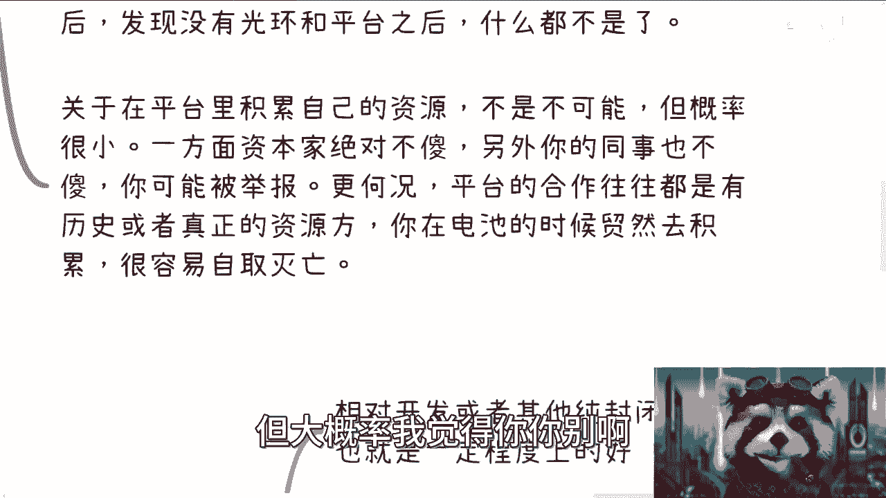

相较于开发、测试等对内岗位，售前和运营因为需要接触市场与客户，的确存在一定优势。但这种优势是相对的，可以表示为：

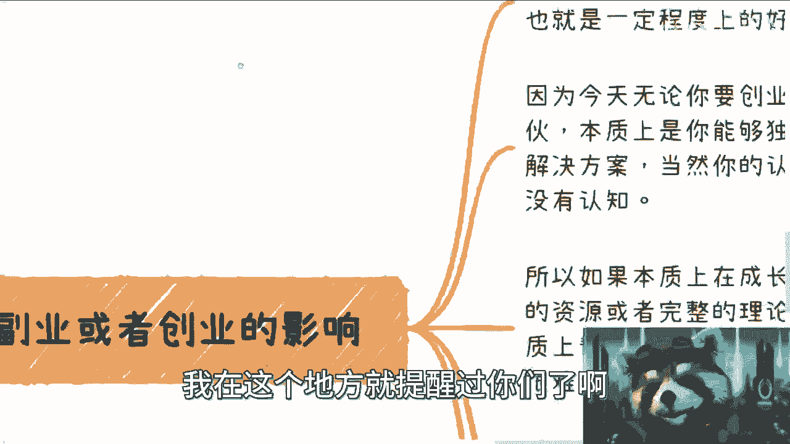

**比较优势 ≈ (市场接触度 - 体系依赖度)**

然而，这种优势有限，原因如下：

1.  **创业需要独当一面**：无论是创业还是被邀请入伙，对方需要的是能提供**完整解决方案**的伙伴，而非仅仅执行某个环节的“螺丝钉”。你需要有自己的认知和方法论，即使它最初可能不完美。
2.  **缺乏平台后从零开始难**：如果在大平台没有形成自己的业务逻辑和资源网络，离开后独自启动项目会非常困难。你需要能回答关于流量、收入、转化、差异化的具体预期问题。
3.  **宏观商业能力的缺失**：产品运营和售前经验通常不涉及公司注册、股权架构、财务法务、深度商业谈判等创业必备知识。在这些方面，你与纯技术岗位出身的人可能处于同一起跑线，**该不懂的还是不懂**。

---

## 超越“电池”模式：为自己工作 💡

分析了岗位的局限性后，关键在于如何突破。本节我们阐释“不做电池”的核心含义。

“不做电池”并非指必须立即创业，其核心在于：**你工作的主导权和收益应归于你自己**。

这意味着：

*   **掌控工作**：你能主导从0到1，或从1到100的完整业务链条。
*   **建立信任关系**：你的价值建立在个人能力和可信度上，而非单纯依附于某个平台光环。
*   **摆脱年龄与岗位束缚**：你的价值随时间积累而增长，不易因年龄或公司结构调整被轻易替代。
*   **模式自由**：你可以选择合作、顾问、项目制等多种形式，核心是能自主选择做与不做。

为自己工作，关键在于积累**完整的业务认知**、**可迁移的解决方案能力**以及基于个人信誉的**商业关系**。这比在某个岗位上单纯执行任务具有更长远的价值。

---

## 总结 📝

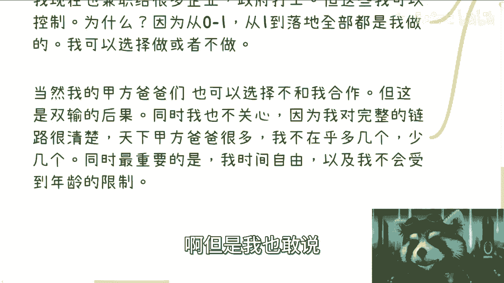

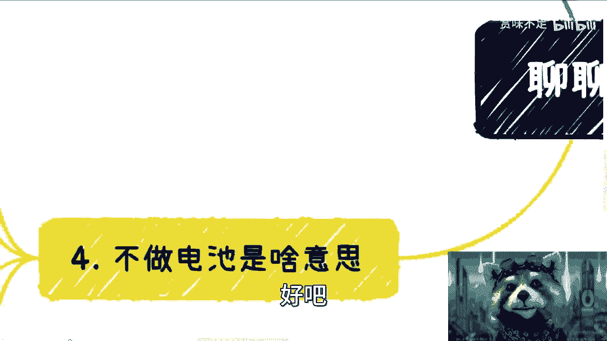

本节课我们一起学习了产品运营和售前岗位的职业特性。我们认识到，在传统职场框架下，这些岗位同样面临高可替代性的挑战，且在其中积累个人资源的道路充满风险。虽然它们比纯技术岗位更贴近市场，但其经验对创业的帮助有限，除非从业者能主动构建完整的商业认知体系和解决方案能力。

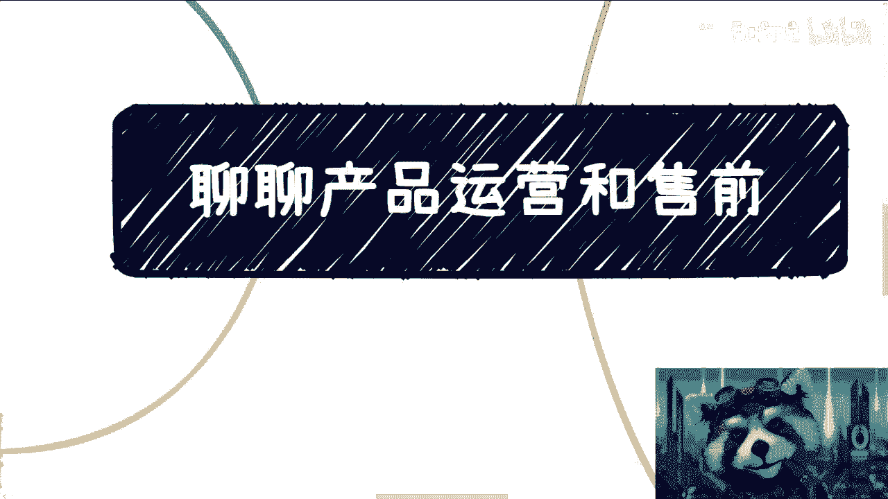

最终，无论是哪个岗位，想要获得长远发展，都需要思考如何从“为平台工作的电池”转向“为自己工作的主导者”，积累真正属于个人的、可迁移的价值。