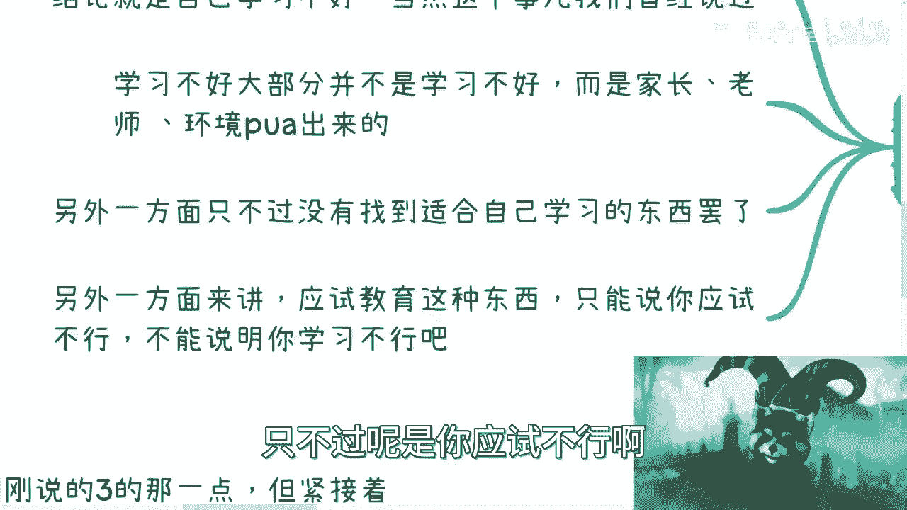
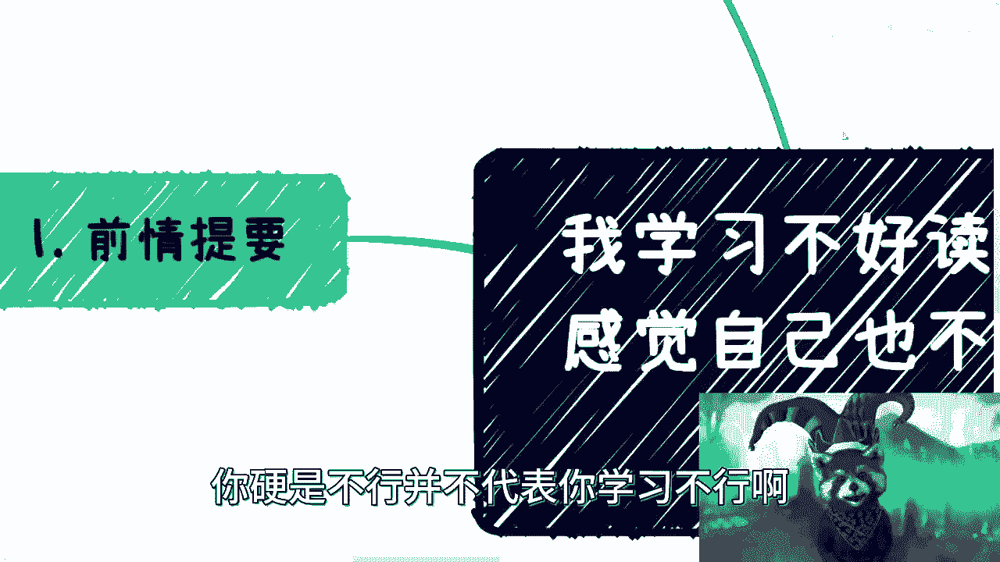
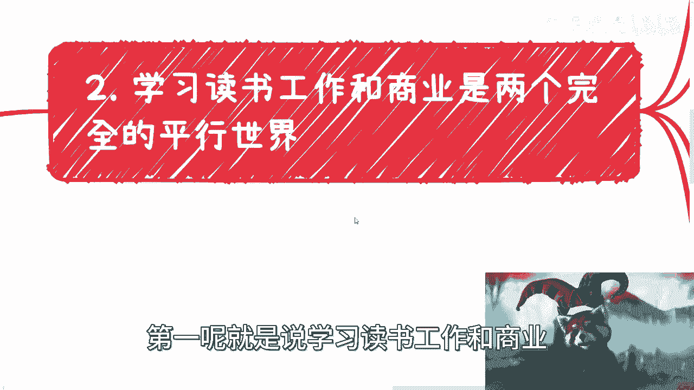
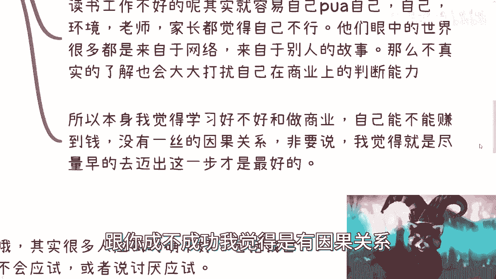
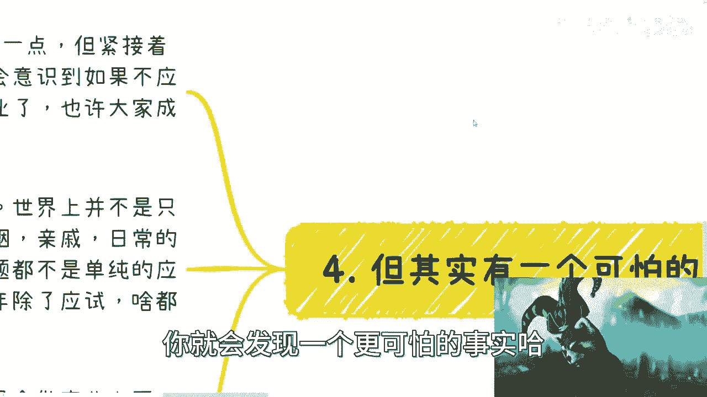

# 人生中多数的问题都没有固定公式去解，但我们却浪费了太多的事情在应试上 - P1 - 赏味不足 - BV1H8411m7Vi

好大家好啊，这个日常也希望大家有什么想要了解的，可以告诉我啊，嗯今天我们来讲的呢，就是最近咨询下来，蛮多小伙伴呢也提到了这个问题，就是关于这个学习读书啊，然后也就好不好对吧，和这个商业挂不挂钩。

因为大部分的这个小伙伴沟通下来呢，就发现啊，他说我学习读书不好啊，那感觉我好像做别的东西也也不太行啊，做商业不太行，这个事儿啊，我大概想了一下，首先打人肯定是没有因果关系的，但是我得去整理出来。

一些大家觉得可以接受的理由对吧，而且逻辑上是要通的啊，那么首先呢先说啊，就是说很多人啊，潜意识当中得出来了一个说这自己学习不好啊，那么当然这个事情呢我们曾经说过，首先要学习好不好呢。

大部分并不是说学习本身好不好，而是说家长老师啊，在各种各样的环境下面，所PUA出来了这么一个结论啊，那么所以呢我觉得很多小伙伴啊，你们要是觉得你们比如说啊学习不好啊，读书不好啊对吧，但是你们要去想想啊。

就并不代表你们的学习能力不好啊，这是两码事，这第呃第一个第二个呢就是说另一方面呢，我觉得只不过是大家学的专业啊对吧，或者说这一路走过来的这个当中的各种细节，这个各种事情吧对吧。

就是说我们没有找到一个适合自己的一个，学习方法和学习的这么一个方向啊，并不代表说学习不行啊，那么还有一个呢就是嗯本身啊，这个中国的大部分教育，无论是商业培训，还是啊这个义务教育和高等教育啊。

其本身都是应试教育，那么应试教育这个东西呢，我只能这么说，就如果你不行啊，或者你自己觉得我很厌学对吧，我就是我就是讨厌学习对吧，或者怎么样子，我觉得你得啊换种思路就是说啊，不见得是你学习不行。

只不过是你应试不行啊。

你就这么理解，所以说呢我觉得这个是两码事啊，你应试不行并不代表你学习不行啊。

那么接下来我们展开说一下，第一呢就是说学习读书。

工作和商业，它本身完全就是两个平行世界，那么在这个事情里面呢，我们要这么说啊，我们在日常当中啊碰到的人足够多，其实你会发现有一点呢，就是无论是什么样子的人啊，无论之前工作读书多么优秀啊。

呃也无论啊他比如说现在赚多少多的钱啊，无论你看上去他多么的牛逼啊，但是当他只要切换到自己去做事情，就是比如说他要自己去做商业啊对吧，自己去寻求一些啊完整的商业模式啊，嗯等一下啊，有人诶，啊求的吗。

得出多么的，啊算了，我待会再来弄吧，啊对吧，就是无论什么样子的人对吧，就是说他之前赚更多的再多的钱啊，你会发现，当他寻找自己的这个商业模式的时候呢，基本上啊就是他都是从零开始的，你从我话来讲呢。

就是无论之前怎么样的人啊，无论你看这样多多牛逼哦，那么他在商业层面，他可能就是跟一个小学生，跟一个幼儿园同学是一样的，那么什么意思呢，也就是说无论你以前怎么样子，其实你要去做商业。

咱们就那或者咱就这么说，我们要为了自己活着对吧，为了说自己去去能掌握自己赚钱的逻辑啊，为了掌握自己的这个赚钱的命运对吧，我不说赚多大的钱对吧，几百块也是赚，几千块也是赚几块钱也是赚对吧。

那么你要走上这条路，那么一切都是从零开始的，无论你以前怎么样子啊，所以说呢如果我们要选择商业，我们一定要明白，就是说我们要抛弃已有的东西哦，那么你说读书工作都不错的人啊，当然从我的角度来讲。

我觉得读书工作都不错的，都不错的人，其实很难抛开打工人和工程师思维啊，关于打工人跟工程师思维，大家可以在我的前面的视频里面所看到对吧，那么他们眼中的世界呢，是用自己的身边的案例去放大。

因为呃有很多很优秀的人啊，他们会觉得啊他们接触过很多人，他们也会有比较强的这种自信，但是呢就是说呃从商业角度来讲，他们接触到的人和他们所经历的东西，相对而言也还是非常的小儿科的，那么也就是说。

他们看到的东西会从身边的案例去放大，其实也是一种YY哦，那么由于自己的优秀或者曾经的一帆风顺，那么我可以说很多优秀的人啊，他们在商业层面在一开始或者在这种中短期啊，他们会大大扰乱自己在商业上对于人也好。

或者对于case也好啊，一种判断能力啊，那么读书工作不好的呢，其实就是容易，那当然就是说咱们还说有那些读书啊，这个应试不行啊对吧，觉得自己验血大二这样子的，啊这样子的。

那么这一类人呢其实也很容易PUA自己啊，那么他PUA自己呢主要是来自于什么呢，主要是来自于自己环境啊，老师家长对吧，觉得自己不行啊，然后呢以往的这些经历啊，然后呢让自己没有自信对吧，他们觉得哎呀。

我好像就做了做了很多事情没有成功啊对吧，做了很多东西好像没有结果啊对吧，但是其实你会发现20多年对吧，回过头去看大家所谓的不成功，所谓的不行，其实更多的还是在应试教育上面，你说真正自己尝试过多少吧。

我觉得打问号，你说是吧啊，那么你说单纯从应试教育上面得出来的啊，你说你就全盘否认你自己这个人对吧，全盘否认你的一个一个一个一个认知，全盘否认你的兴趣爱好对吧，那我觉得这个就不行啊，那么呃我觉得这一类难。

大部分时候啊，就是呃眼中的世界其实很多是来自于网络，来自于别人的故事对吧，但是但是就是说不管是来自于网络，还是别人的故事本身都不太真实，而这种不真实，其实也会大大的干扰自己在商业上的判断能力。

所以说综合而言啊，你会发现没有，就是大家都是从零开始，就是我是觉得在商业层面对吧，那除了你是非常优秀的那一类人，剩下的我可以说几乎啊，大家都可以是同一个起跑线，所以说本身我觉得学习好不好啊，应试好不好。

跟做商业跟你自己到底能不能赚到钱，没有任何一丝因果关系，而且就拿我身边的人来讲，我所有看到的，我不说那些什么大家耳熟能详的是吧，这个容易刘强东是吧，马云是吧啊我就说真正的那些闷声发大财对吧。

能够赚到钱的人，我没有看到过几个，是他们的学习跟他们现在是完全有因果关系的，没有的啊，没有的，非要说有的话，我觉得是什么呢，就是尽可能早的去迈出这一步是有因果关系的，而晚卖跟你成不成功。

我觉得是有因果关系，但是你说学习没有什么直接因果关系啊，那么下面一点呢，我觉得我们来聊一下什么呢，第三啊，第二个就是我觉得有一种很奇怪的思维逻辑啊。

这思维逻辑是什么呢，哎啊我觉得是很奇怪，就你们会发现，其实很多人应试教育的确是不好对吧，做的不好啊，包括我自己，我觉得我就不属于那种很会应试的人啊，我要垃圾啊，或者说我讨厌应试是吧，但是你会发现。

既然大家有很多人觉得应试不好对不好，或者讨厌那种循规蹈矩的东西，或者说自己觉得自己学习不好对吧，不适合去死读书的，其实蛮多人的，我跟你讲，蛮多人这么想的啊，这不一定他们会说啊，但蛮多人这么想的。

但是呢你会发现一个很神奇的现象是什么呢，就是到了商业战场上，到了就让你让他们选另外一条路的时候，你说啊这就是一个野蛮生长的世界对吧，这就是一个黑暗丛林法则对吧，他就是一个完全自由的一个市场对吧。

就是你可以大喊freedom这种对吧，但是你会发现你把它扔到一个，大家完全可以自由发挥的市场呢，哎他反而啊反而就开始去找诶，这个驴老师有没有书看啊啊，有没有总音经验总结啊，有没有网站啊，有没有视频啊。

就就你会发现真的我不说，我觉得95%以上人都这样子，就是就是你会发现他知道这个东西不好，但是你把它扔到一个很自由的地方，他反而又走到了应试教育的这条老路上，呃你可以认为这是一个人的本性。

你也可以认为他是被PUA出来的结论，但是不管怎么样，你想想看是不是这样子对吧，就是就是所以说你想想看问题到底在哪里，就是问题到底是真的在读书上面好不好嘛，就问题真的是在学习上面好不好嘛，就是人对吧。

是一个有脑子的高等生物，不是一个被编好程序的机器人，那么为什么我们在面临未知东西的时候，我们在就是就是明明自己觉得我不适合应试，我不适合就死读书学习的，而到了另外一个地方，我一我们依然很多人在那边追求。

说哎有没有固定的，就是好像在问我们说诶，有没有固定的解方程的公式来解这个东西一样，你想想为什么你知道吗，就是我觉得这个就是一个很大的一个电池思维。

而这个思维到底怎么出来的，我觉得它的因素很多很多啊，那么第第三个啊，然后呢顺着我们刚刚那个思路，你就会发现一个更可怕的事实。

好就更可怕的事实是什么呢，就是很多人也许意识到了，我们刚刚说的那个问题，对不好，但紧接着呢更可怕的问题是什么呢，就是我相信大家意识到，如果不是应试的话，那应该怎么做，也许大家就就大家大学毕业对吧。

大专毕业啊，或者说我高中毕业无所谓啊，也许大家成年了啊，但是你会发现完全不知道怎么做对吧，就是这个就是个最最可怕的事情，就是你活大20多年，对你你受了高等教育对吧，然后你也成年了啊，然后你发现诶。

就是当我面临一些非读书类的东西的时候，我完全不知道怎么做，就是就是就是你你可能我说的不好听点，就是这有种像什么，有种像就是当你活在这个，你明明是活在这个世界上，但是你在这个世界上生存的啊。

或者说除了应试以外的，生存的能力几乎为零对吧，那么你会发现啊，这就是我们要去解决的问题，你知道吗，这也是我们所有人要去解决的问题，这也是我们需要跟自己去调调解调和，需要跟家庭去调和的问题，就是你要知道。

世界上并不是只有商业跟打工这两个事情对吧，包括婚姻啊，包括亲戚啊，包括日常朋友的沟通啊，呃和别人的相处啊，包括日常的生活啊，包括你出去活在这个社会上，你会碰到无数个事情对吧，法律公司，陌生人打交道。

社交对吧，群体对吧，你会发现很多很多问题，但是这些问题其实并不是单纯的应试问题，就是很多问题没有一个固定的公式给我们去解，对不对，那么换而言之，就是说很多人20多年以来除了应试，什么都不会对吧。

拿缸子不好，所以说呢就是说你会发现，其实根本问题根本不在于你读书好不好，也不在于你应试好不好，也不在于你商业会不会做，也不在于你有没有勇气迈出这一步，这一步也不在于你自信或不自信。

你会发现这些都是表面的问题，就是这些都是浮在水上的，你们看得到的问题，但真正水下的问题是什么，是几乎所有人对于除了应试以外的别的东西的，一无所知所产生的恐惧对吧，也就是说我们要去学习大20多年以后对吧。

从你出生到20多年以后，你要去学习的是我到底怎么去生存，在这个社会当中，我应该怎么去学习，非应试以外，非实习，而非读书以外的东西，我应该怎么去探索，我应该怎么去让自己更好的产生价值。

我我当然你可以是对别人产生价值，你也可以是对自己产生价值，从而从而从而能赚到钱，而不是说你的生存，你的赚钱，你的定位是在你的自由，是在别人身上对吧，而不是说什么东西，我们都能够拿到一个公式去解。

并不是这样子的，对吧所以说呢我们说到最后一句对吧，就关于这个知识改变命运的事情，我相信这个事啊，不管是我还是大家，从小都是被灌输这么一个观念，我觉得这句话没有错啊，这句话从来就没有错。

因为本身知识的定义很广很大很宏观，没有人和大家说过啊，知识就是读书应试，所谓的读书读出来的知识，没有这么说过啊，从来没有人这么说过，这就好像我跟别人说，这技术很有用，但是我从来没有说过技术就是电工。

钳工或者说写代码，或者说你懂得某些业务的逻辑，或者你懂得啊，某些运作规则我从来没有说过技术，就这些东西对，包括你出去社交，包括你懂得人情世故，包括包括你察言观色，这也是技术啊。

对包括有些人一块按照三上吊也是技术啊，没有毛病啊，谁跟你讲，这不是技术，对不对，所以说你会发现除了金字塔顶端的那些人以外，我觉得剩下对于普罗大众来讲，知识是什么，知识就是所谓的见识啊。

就是就是所谓的你能看到多深，你能看到多么多，你能看到多透，你知道吗，这个是什么，就是这个才是你能够改变命运命运的本质，别的没有啊，因为别的都是我觉得都是附属的东西，对吧，所以说呢我觉得嗯可能这个标题啊。

我今天可能要改一个，可能不是这样的标题，我觉得可能核心点是在于说，除了应试以外，几乎没有哪个东西是有公式固定公式去解的，但是你会发现反过来说啊，没有固定的东西去解的，可能占99%。

应试也只占了那么很小的一部分哦，或者说在我们人生当中占了很小的一部分啊，但是反而我们大部分的人把大部分的青春，大部分的经历，大部分的学习叫做有有有有有，非常好的学习能力的。

这个青春的时间付就是付出给了啊，这么一个微不足道的市场适应上对吧，你们可以想想看，好吧好，先说这么多吧，啊这个大家有什么副业啊，有什么商业的想法或者别的东西啊，你们可以总结好问题。

或者说这个有数字经济啊，有其他的这种商业合作的，也可以找我好吧，唉呀这一期感觉讲得有点沉重啊。