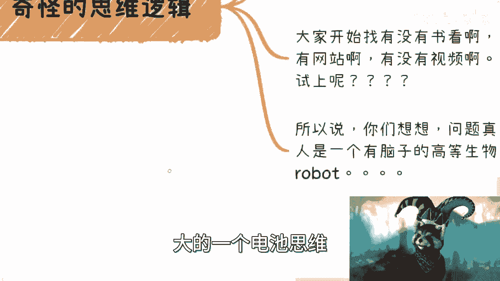
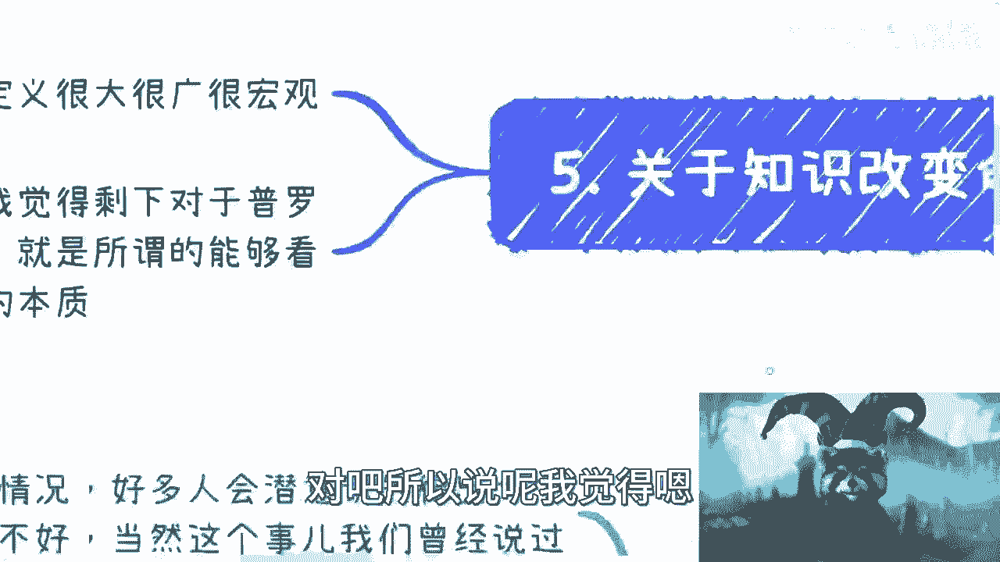

# 课程01：应试思维与商业现实 🧠

在本节课中，我们将探讨一个普遍存在的困惑：学习（应试）成绩的好坏，是否与个人在商业或事业上的成功有直接关联。我们将拆解“学习不好”背后的多种含义，并分析为何在商业世界中，大多数人实际上站在同一起跑线上。

---

## 概述：问题的核心

许多人在咨询中提到，感觉自己学习或读书不好，进而怀疑自己做商业或其他事情的能力也不行。我们需要理清，这种自我认知从何而来，以及它是否真实反映了我们的潜力。

首先必须明确：**学习（特指应试）的好坏，与商业成功之间没有直接的因果关系**。这只是一种被环境塑造的、片面的自我评价。

---

## 第一节：重新定义“学习不好”

上一段我们提出了核心观点，本节中我们来看看“学习不好”这个标签究竟意味着什么。

很多人潜意识里认为自己“学习不好”，但这个结论大部分并非源于学习能力本身，而是家长、老师在各种环境下“PUA”出来的结果。因此，你需要区分两个概念：

1.  **应试表现不佳**：指在标准化的考试、测试中成绩不理想。
2.  **学习能力低下**：指理解、掌握、应用新知识或技能的根本能力不足。

**核心公式**：
`“学习不好” ≠ “学习能力不好”`

中国的教育体系，无论是义务教育、高等教育还是部分商业培训，本质多是**应试教育**。如果你厌恶学习或觉得自己不行，可能需要转换思路：你讨厌的可能是“应试”，而非“学习”本身。

**结论**：`应试不行 ≠ 学习不行`。这是两件完全不同的事。

---

## 第二节：商业世界是全新的平行宇宙

理解了“学习不好”的误区后，我们进入更关键的领域：商业。

学习、读书、工作与商业，本质上是**两个平行的世界**。在日常观察中，无论一个人之前读书、工作多么优秀，或已经赚了多少钱，当他开始尝试构建自己的商业模式时，几乎都是从零开始。

这意味着：
*   无论你过往经历如何，在商业层面上，所有人都可能像小学生一样从头学起。
*   选择商业道路，意味着需要**抛弃已有的“打工人”或“工程师”思维**（关于这两种思维，可参考前期课程）。过往的优秀和自信，有时反而会干扰对商业中人与事的判断，因为其经验可能仍局限于较小范围。
*   同样，那些自认“学习不好”的人，容易因过往的应试挫折而自我PUA，缺乏自信。他们的认知可能更多来自网络或不真实的故事，这同样会干扰商业判断。

**核心洞察**：在商业的起跑线上，除了极少数顶尖人才，**绝大多数人都处于同一起跑线**。应试好坏与能否赚钱没有因果关系。真正的相关性在于：**尽可能早地迈出实践的第一步**。起步晚与不成功之间的相关性，反而更大。

---

## 第三节：可怕的“解题公式”依赖症

认识到商业从零开始后，一个更深刻的问题浮现出来：我们的思维模式。

存在一种奇怪的思维逻辑：许多讨厌应试教育、讨厌循规蹈矩的人，当被抛入可以自由发挥的商业战场时，反而会下意识地寻找“标准答案”。

以下是这种思维的典型表现：
*   寻找“必读书单”。
*   寻求“终极经验总结”。
*   渴望有固定的“成功公式”或“解题步骤”。

你可以认为这是人的本性，或是被长期驯化的结果。但关键在于，**商业和人生中绝大多数问题，都没有固定的解题公式**。追求一个“解方程的公式”来解决所有商业问题，这是一种根深蒂固的**电池思维**。

---

## 第四节：超越应试的生存能力

顺着上面的思路，我们会发现一个更可怕的事实：即使意识到不能依赖公式，很多人也完全不知道下一步该怎么做。

这就是核心问题：接受了多年教育并成年后，当面对**非应试类**的挑战（如商业、社交、婚姻、法律、人际相处）时，许多人感到无所适从，生存能力几乎为零。

因此，浮在水面上的问题（读书好坏、自信与否）都不是根本。水下真正的问题是：
> **几乎所有人对于应试之外的世界一无所知，并由此产生巨大恐惧。**

成年后，我们需要重新学习的是：**如何在社会中生存，如何学习非应试的知识，如何探索并创造价值**。你的价值可以服务于他人，也可以成就自己，从而获得财富与自由。这绝非靠一个万能公式就能解决。

---

## 第五节：什么是真正的“知识改变命运”？

最后，我们来重新审视“知识改变命运”这句话。这句话从未出错，错的是对“知识”的狭隘定义。

没有人说过知识就等于“读书应试”。这就像说“技术有用”，但技术绝不仅限于写代码或做电工。

以下是“知识”更广阔的范畴：
*   社交能力与人情世故。
*   察言观色的洞察力。
*   对业务逻辑和运作规则的理解。
*   任何能创造价值的实践经验。

对于普罗大众而言，**知识就是见识**——是你看待问题的深度、广度和透彻程度。这才是改变命运的本质，其他都是附属品。

---

## 总结与核心启示 🎯

本节课我们一起学习了应试思维与商业现实之间的巨大鸿沟。

我们剖析了“学习不好”这一标签的虚假性，指出商业世界人人近乎从零开始的平等性，并批判了在面对复杂现实时寻求“解题公式”的依赖症。最终，我们揭示了问题的本质：**我们恐惧的并非失败，而是对应试之外世界的陌生**。

**核心启示**：
人生中**99%的问题都没有固定公式可解**，应试只是其中微不足道的一小部分。然而，我们却将最具学习能力的青春年华，大部分奉献给了这微不足道的“解题训练”。是时候将目光投向更广阔的世界，去学习真正关乎生存与创造的知识了。

---
**课程结束**。如有关于副业、商业想法或其他合作的具体问题，可进行总结后进一步探讨。