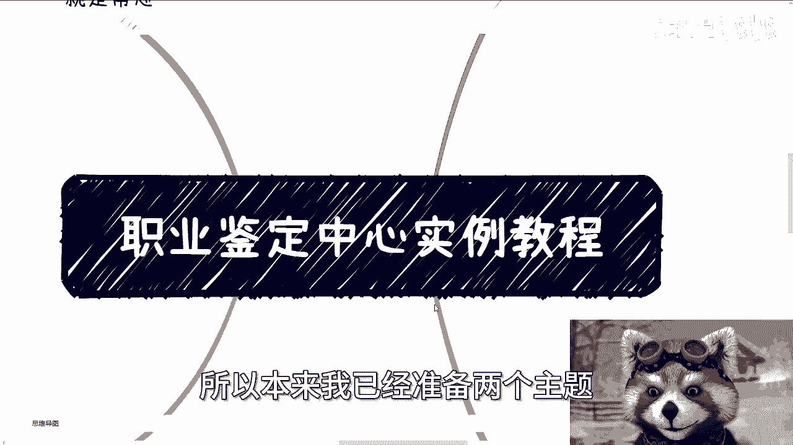
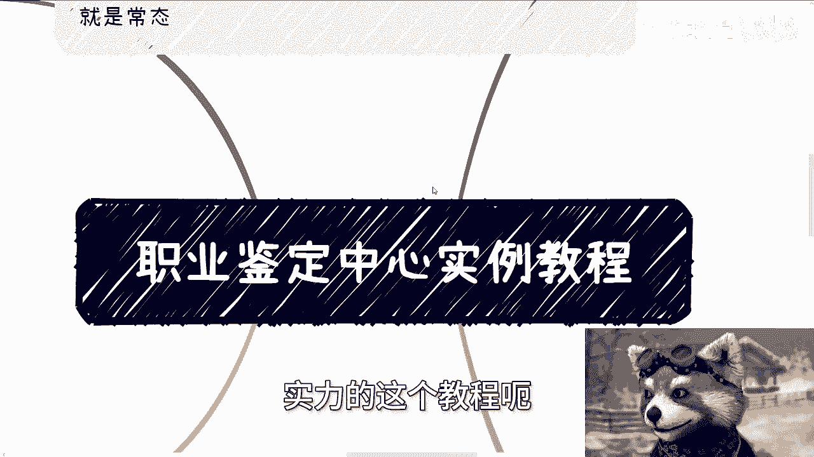
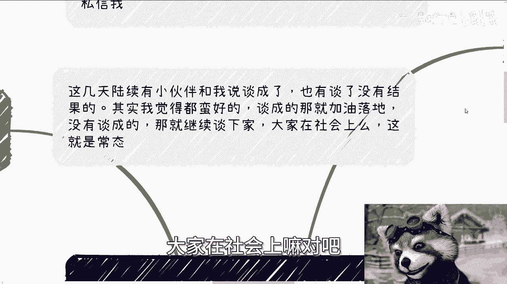
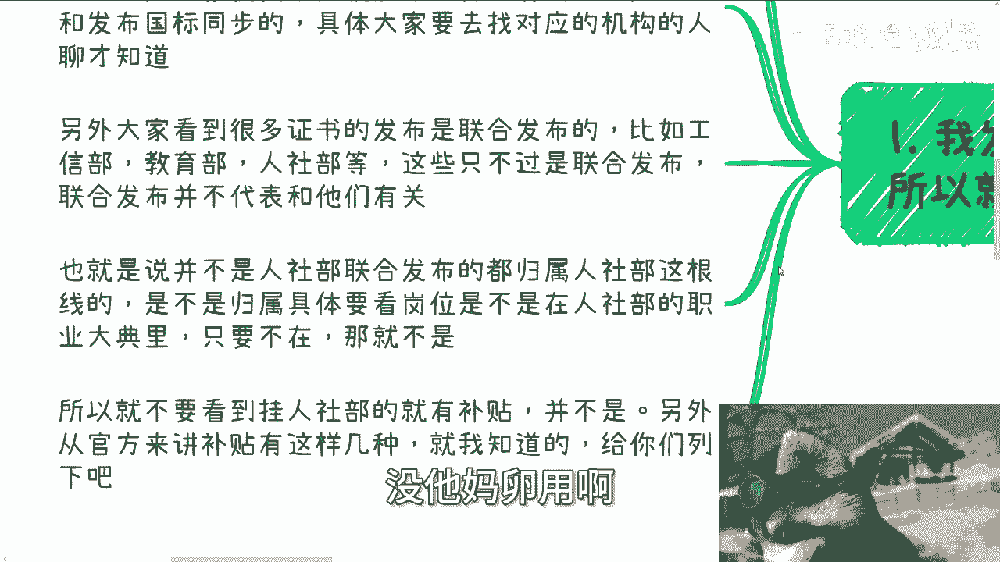
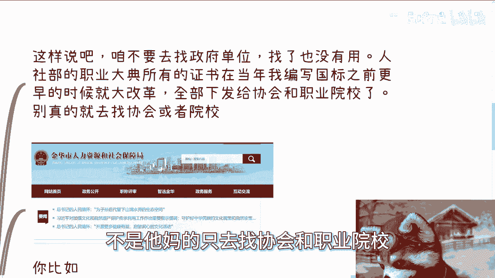
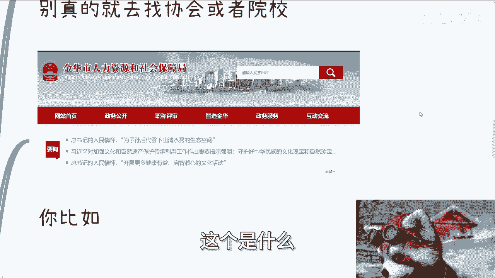
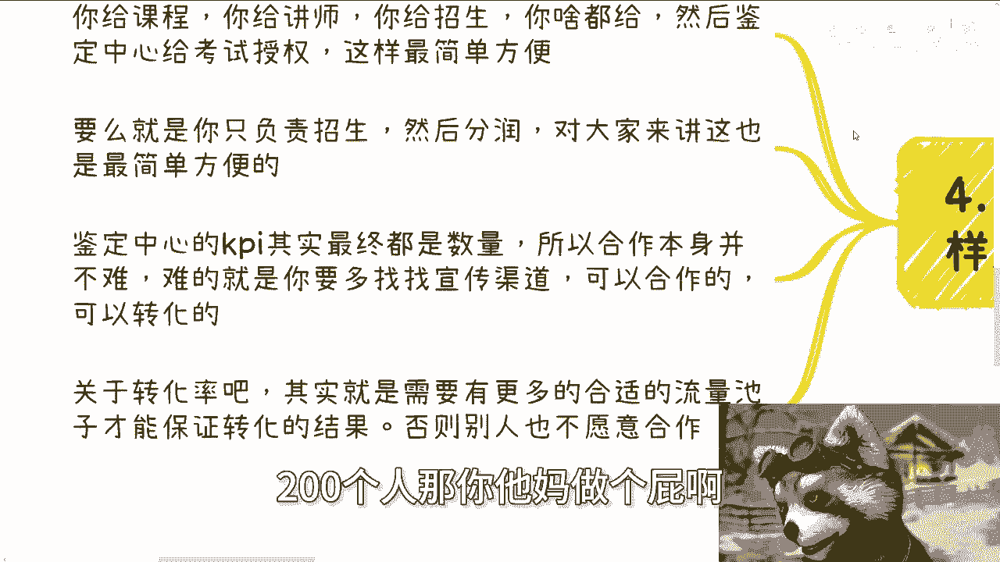
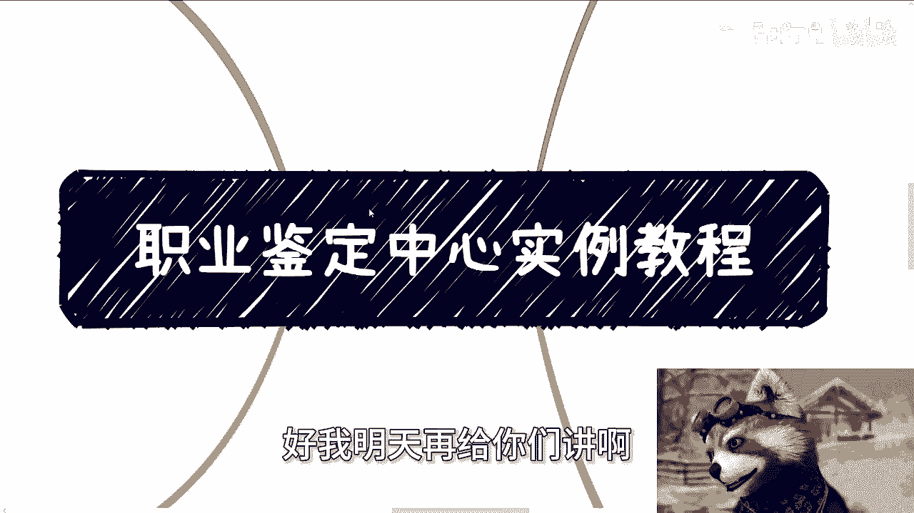

# 人社部职业鉴定中心实例案例 - P1 - 赏味不足 - BV1kS421X7NN

好大家好啊，今天这个时间又晚了，所以本来我已经准备了两个主题。

但是今天先只讲一个吧，另外一个留到明天给你们讲吧，啊，呃今天我们来讲的呢，这个叫做职业鉴定中心啊，实力的这个教程呃。

首先啊就是先说一下这个下期的活动，在本周日啊，8月11号在长沙啊，在长沙，那么大概主题的话呢，一个是围绕不同的企业的offer，比如说民企啊，国央企啊，外企啊对吧。

那另外一方面呢就围绕自媒体跟跨境电商啊，最后也帮大家啊展望一下未来啊，那么这个经济情况，包括其他的报名或者了解详情的呢，你们可以继续私信我，呃然后另外一方面呢，就是说这几天呢陆续也有小伙伴哦跟我说啊。

就是说谈成了啊，也有不谈谈了没有结果的啊，但不重要，我觉得都蛮好的，就谈成的男的就继续加油落地，那没有谈成的，那就继续弹下家，呃，大家在社会上嘛对吧。

那他成谈得成，谈们人都是常态啊，这不过这个平常心啧。

然后为什么今天会讲这个主题啊，首先第一呢我发现很多小伙伴他分不清楚啊。

所以呢就索性咱讲的再再精准一点，首先啊人社部下面两大线路，一条是职称啊，另外一个是职业技能等级，我从头到尾一直所说的就是职业技能等级啊，然后你们如果要去查对应的网站，主要都是集中在OSTA。

就是整个网网址当中是包含LOSTA的啊，整个OSTA的这个系统，那么职业技能等级呢，在不同的这个城市落地的方式会有所不同，有的地方呢是直接提交给中央就发布国标，有的地方呢是试点和发布国标是同步的。

具体呢大家还得去找对应的这个机构的人去聊，才明白啊，那么另外呢，大家看到很多证书的发布是联合发布，人社部对吧，呃你们要明白一点啊，这些呢只不过是联合发布，联合发布并不代表就跟他们有关系。

也就是说并不是人社部参与联合发布的，都归属在人社部这根线，或者说都在我们刚说的职称或者职业，竞争等级上面，不是这么回事啊，是不是归属具体要看岗位，以及是不是在人社部的职业大典里面啊。

他只要不在人社部的归属岗位，或者只要不在人社部的职业大典里面，他就不是啊，那么不是的话，他就没有补贴，明白吗，不要去看，就是说某些证书啊，没他妈卵用啊。

所以你就不要看，比如说挂人社部就有补贴，并不是的啊，另外从官方来讲啊，补贴有这么几种啊，我给你们列一下嗯，人社部，国资委啊，怎么说呢，咱就这么说啊，呃我不打死，我说的呢只不过是我了解的。

但并不代表全部有一些呢有出入的，大家反正你们自己可以补充，或者你们反正就自自己也可以相互聊啊都行，有补贴的啊，我就这么讲啊，我参与过的，以及我所知道的就是人社部的职业竞争等级，那真的就没了啊。

别的可能会有什么可能会有，比如说啊什么招投标的这个标准啊，嗯比如说可能会有些间接的补贴啊，那么在这个地方呢，我们就这么说，你说招投标标准也好，间接补贴也好，包括什么教育附加税也好。

这些东西它可能是一个地方特点啊，也就是说，可可能这些补贴并不是一个通用的规则，它往往是具体的城市，具体的那个情况，再具体分析，并不像职业竞争等级和一加X这么的固定，你知道吗，就是职业竞争等级跟一加X是。

你在中国这片土地上拿到哪，他都有这个通用规则的，它相当于是全国的统一的一套流程，只不过就是在落地的时候，他可能会有些就不一样的地方啊，那么第三有的小伙伴找吧，他妈的他还没找对啊，我们来看看啊。

呃咱就这么说啊，咱不是要去找政府单位啊，我发现很多小伙伴呢他其实找错了，他找的是政府单位，找了也没用，因为人社部的职业大典所，所有的证书在当年我编写国标之前，更早的时候就已经改革了，你们自己可以去查啊。

那么他改革的逻辑就是全部下发给了当地的，各地方的协会和职业院校啊，嗯但是呢说到这个东西啊，有很多人就说了，哎那那按照这个逻辑，我就去找协会和职业院校，不是的，你要去找的是人社部在各省市区授权的。

能够做职业技能等级的协会和职业院校，不是TMD只去找协会和职业院校啊。

好那么比如说今天有小伙伴问我，他说金华市对吧，我就帮他查了一下啊，首先你比如啊金华市人力资源和社会保障局，这个是什么。

这个是政府单位对吧，这个是政府单位，你找他有用吗，没有用，因为它已经他根据当年人社部的改革规范，他已经下发给协会跟职业那个那个职业院校了，对吧好你再比如他说有一个东西叫精华，是职业技能鉴定中心对吧好。

我也查了一下，他是政府单位，就浙江省金华市对吧，然后是叫做额，他归属在政府单位上面，那么这种就算啊，他有一个机构名字就叫职业鉴定中心，那么他只要是政府单位，它还不是你们要去找的，你们要去找的是什么。

我后面又帮他找过了，2024年6月份，金华市社会化职业技能等级认定计划出炉，对吧好，你看啊，这张图看到没有啊，就是他得有对应的职业名称，然后有对应的工种，然后有认定等级。

然后后面这个机构名才是你们要去找的机构，明白吗啊，因为只有这些机构名才是有直资质的啊，然后联系人电话对不对，你电话不打，你可以先加微信啊，啊就这么简单啊，直接明了啊啊当然啊这些，就和我之前说的。

大概率也可能不做，所以真的要找合作，要么就是找名单上的这些，要么就是直接去找这些名单上合作的培训机构，因为他们只是鉴定中心，鉴定中心未必会干培训的活，但是赚钱的就往往是培训，能明白吧啊好。

那么第四点合作模式，从0~1来讲，无非就这这样几个，第一你给课程，你给老师，你给招生，你什么都给，然后鉴定中心只给考试授权，这样最简单对吧，然后第二要么就是你只负责招生，然后分润对大家来讲。

这也是最简单的啊，第三鉴定中心的KPI其实最终都是数量，你别去讲那些，就是比如说你说我们大家聊的这个有的没的啊，你别管他有的没的，他最终KPI就是数量，能招多少人，有多少人考试，所以你我跟你讲啊。

合作本身并不难，难的是你能否多找找宣传渠道，能不能多找找招到人的这个渠道，对吧啊，然后关于转化率啊，核心点是什么，你得有更多的流量池子，你才能保证转化率，因为一般来讲我们说这个转化率，比如说10%。

5%对吧，2%对吧，那你说如果我今天跟职业鉴定中心合作，或者我跟培训合作哦，你说我手上就那么100个人，200个人，那做个屁啊。

对不对，那别人怎么会愿意合作呢，哦所以就是说咱再回到这边啊。

就是你们要去找，首先你们得把整个上下游关系链路得摸清楚，写国标的是什么角色对吧，呃职业鉴定中心是什么角色，人社部，人力社会资源保障部又是个什么角色对吧，然后下面的培训中心又是什么角色。

你得把整个链路大家到底怎么合作的，你得搞明白吧对吧，你连整个全局这里面到底有哪些角色，大家怎么分工的，大家可能上下游谁是谁的甲方，谁是谁的乙方对吧，谁分别又是甲方的甲方，你整个链路都搞不清楚。

你怎么做呢，对吧啊，所以就说就说就说在你们查的过程当中，不是说真的就这么死的去看，也不是说真的让你们去找政府单位，你们要明白他关系好吧，所以我今天才会出这个东西，当然还有另外一个。

但我今天来不及讲了好吧。

我明天再给你们讲啊，行吧啊，就这么着吧，然后那个活动好吧，继续报名啊，长沙的8月11号就那个额周日啊，周日下午啊，然后那个叫什么，就是呃职业规划啊，包括你们自己做些副业或者跟别人合作的啊。

呃在这过程当中，比如说涉及到一些合同啊，啊分红啊，丰润啊，商业计划书啊，白皮书啊，什么股份啊，期权啊啊，涉及到就是说一些这个未来的商业规划，或者怎么样的啊，你们希望通过呃跟我的交流。

或者跟我的一些这个这个这个沟通啊，呃希望通我通过呃结合你们个人的情况，结合你们个人的背景，能给你们一些更接地气的啊，让你们少走点弯路的这个规划或者建议的话，那么你们可以整理好对应的问题跟个人背景。

我们再来组咨询啊，行好吧。