# 人社部职业鉴定中心实例案例---P1---赏味不足---BV1kS421X7NN

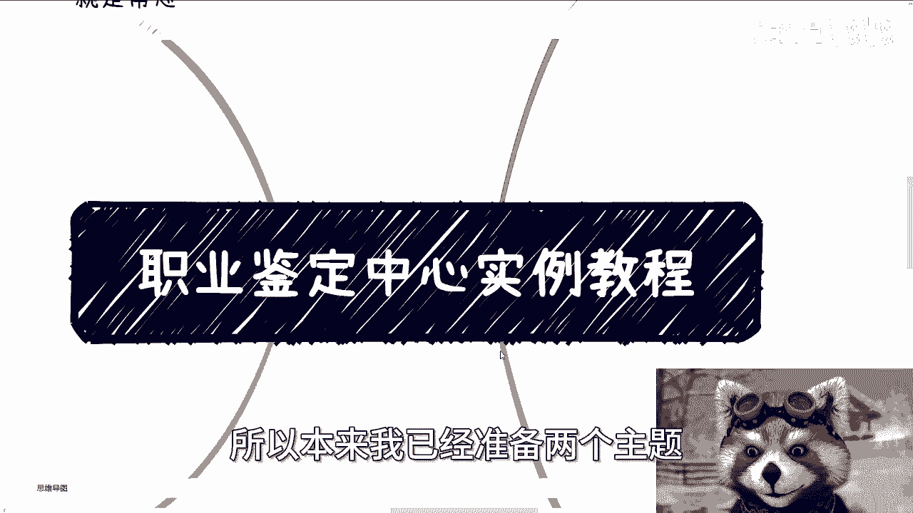

在本节课中，我们将要学习如何理解并参与人社部职业技能鉴定体系下的合作。课程将厘清核心概念、指明正确合作路径，并分析关键的合作模式与要点。

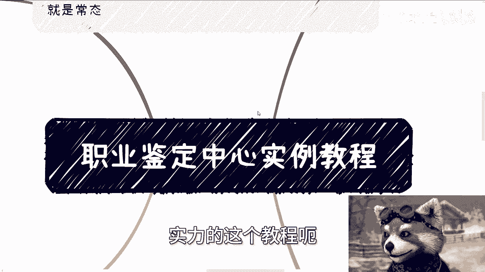

---

## 课程概述

人社部下属的职业技能等级认定体系，是获取国家认可证书和补贴的重要渠道。许多从业者对此体系存在误解，导致寻找合作方时方向错误。本节课程旨在澄清这些误解，并提供清晰、可操作的行动指南。

上一节我们介绍了课程的整体目标，本节中我们来看看人社部体系的具体构成。

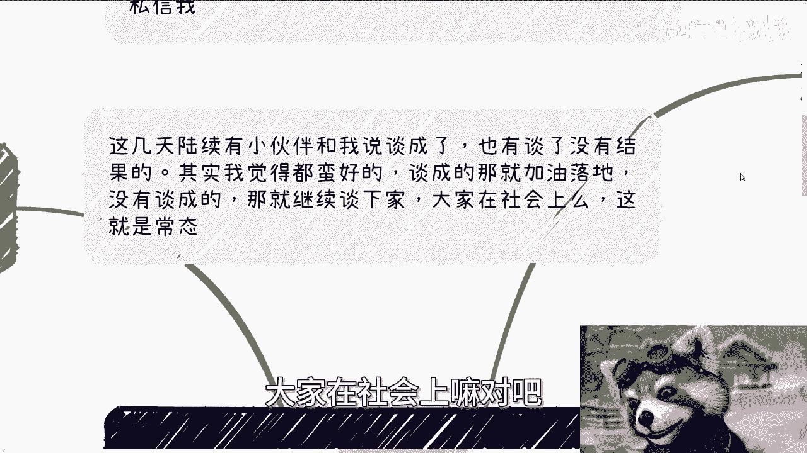

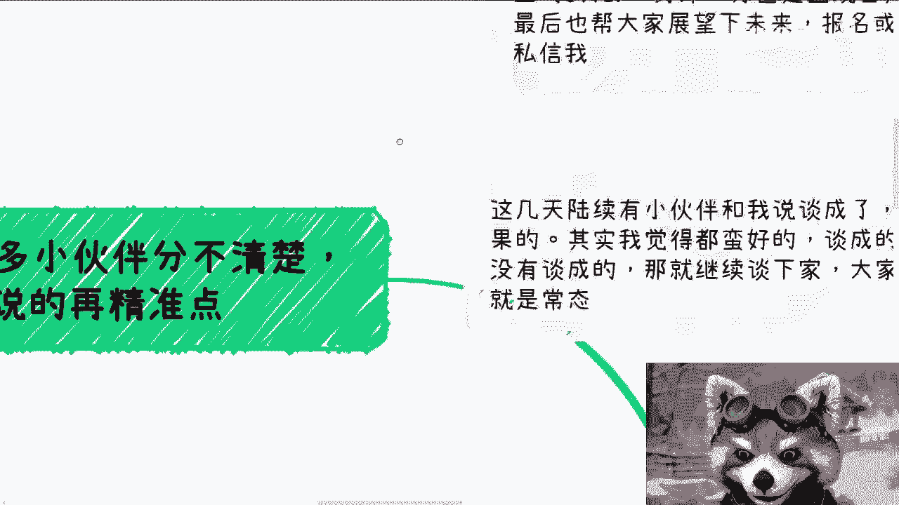

## 人社部体系的两大线路

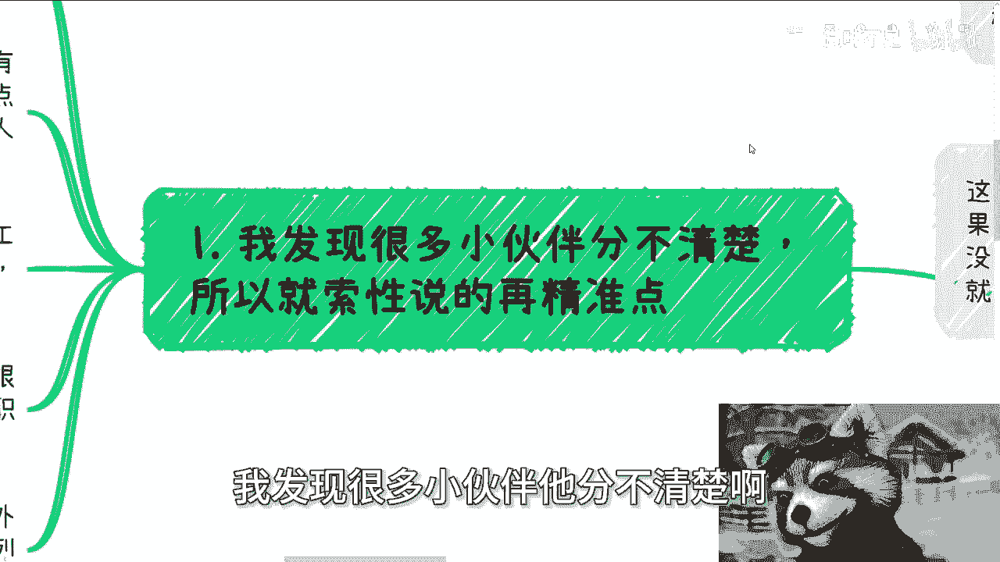

首先需要分清楚，人社部下设两大主要线路：
*   **职称**评定
*   **职业技能等级**认定

本课程及后续讨论的核心，始终围绕**职业技能等级**认定展开。

## 如何查询官方信息

职业技能等级认定的官方信息，主要集中在 **OSTA**（国家职业资格工作网）系统中。查询时请注意网址中包含“OSTA”字样。

职业技能等级在不同城市的落地方式存在差异：
*   有的地区直接向中央提交并发布国家标准。
*   有的地区试点与发布国标同步进行。

具体执行细节，需要与当地对应的机构人员沟通才能明确。

## 识别有效证书与补贴

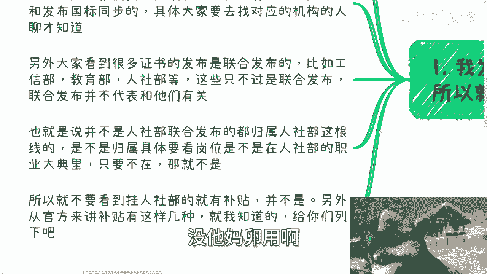

市场上存在许多“联合发布”的证书，其中包含人社部。但需明白一个关键点：

**联合发布 ≠ 归属人社部体系**

一个证书是否真正归属人社部职业技能等级体系，核心判断依据是：
1.  对应的**岗位**是否在人社部的管理范畴内。
2.  该**职业**是否收录在《中华人民共和国职业分类大典》中。

**只要不满足以上任一条件，该证书就不属于人社部体系，通常也无法申领相应的国家技能提升补贴。** 不要仅因证书上印有“人社部”字样就认为其有效。

## 补贴的主要来源

关于补贴，需要明确以下几点：
*   **明确通用的补贴**主要来源于**人社部的职业技能等级**认定。这是全国统一、规则固定的补贴渠道。
*   其他可能存在的补贴（如基于招投标标准、地方教育附加税返还等），往往是**地方性、非通用**的政策，需要具体城市、具体情况具体分析，不具备全国普适性。

职业技能等级与“1+X”证书制度类似，在全国范围内有统一的规则框架，仅在地方落地执行时可能存在细微差别。

## 寻找正确的合作机构

这是最常见的误区。许多合作者找错了对象。

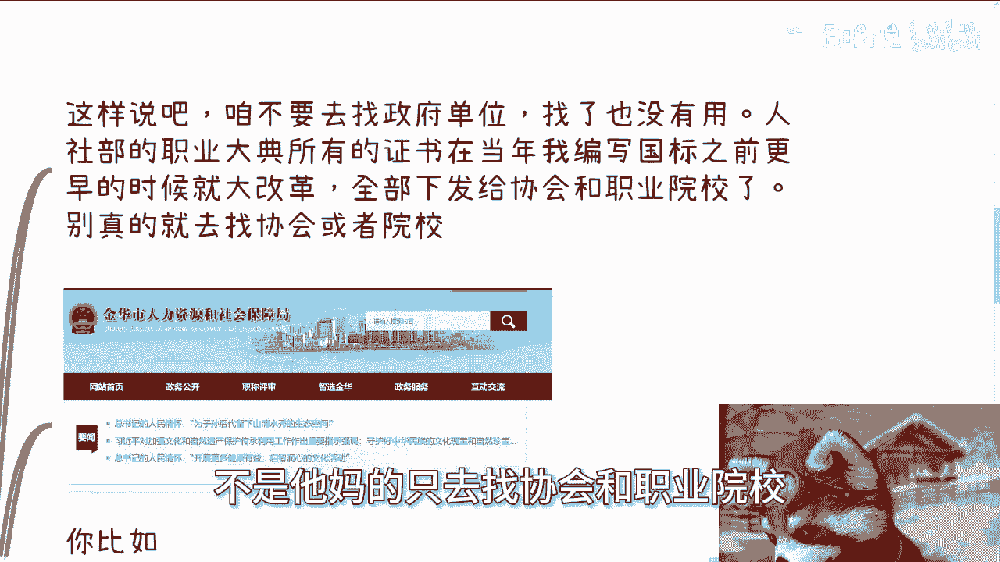

根据人社部早前的改革方案，职业技能等级认定的具体执行工作，已**全部下放**至地方授权的协会和职业院校。

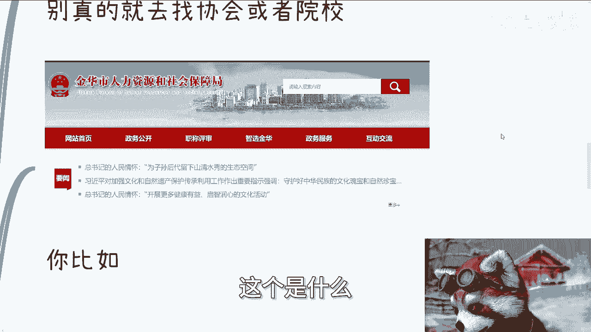

**关键点：你需要寻找的是“经人社部在各省市区授权的、具备职业技能等级认定资质的协会和职业院校”，而非普通的协会或院校，更不是直接去找政府人社局。**

例如，某地“人力资源和社会保障局”或“职业技能鉴定中心”如果属于政府单位，它们通常已不直接开展具体认定业务。你应该查找的是当地官方发布的“社会化职业技能等级认定计划”名单。

以下是查找和判断的步骤：
1.  找到当地人社局发布的“职业技能等级认定机构”名单。
2.  名单中会列明**机构名称、认定职业（工种）、认定等级、联系人及电话**。
3.  这些名单上的机构，才是具备资质的合作目标。

**注意**：这些鉴定机构可能只负责考试发证，不负责培训。而盈利点往往在培训环节。因此，你也可以寻找与这些鉴定机构合作的培训机构进行合作。

## 核心合作模式分析

从零开始建立合作，主要有以下几种模式：

以下是几种常见的合作模式：
1.  **全包模式**：你方提供课程、师资、招生等全部资源，鉴定中心仅提供考试授权与证书发放。这是最简单直接的模式。
2.  **招生分润模式**：你方只负责招生引流，鉴定中心或合作培训机构负责教学与考试，双方进行利润分成。这对初创者较为友好。
3.  **资源互补模式**：双方各自贡献优势资源（如你方有课程，对方有生源渠道），共同开展项目。

无论哪种模式，都需要理解一个核心：**鉴定中心的最终KPI是考核数量**，即有多少人参加并通过认定。因此，合作谈判的核心不是你方的背景多强，而是**你能否带来稳定且足够的生源**。

## 成功的关键：流量与转化

合作本身并不复杂，难点在于可持续的运营。

转化率（如2%、5%、10%）是一个相对固定的比例。其绝对基础在于**流量池的大小**。

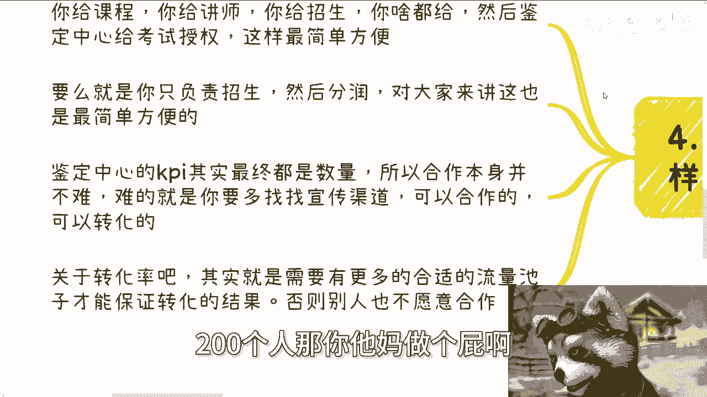

核心公式可以简化为：
**成功合作 ≈ 足够大的潜在客户流量 × 稳定的转化率**

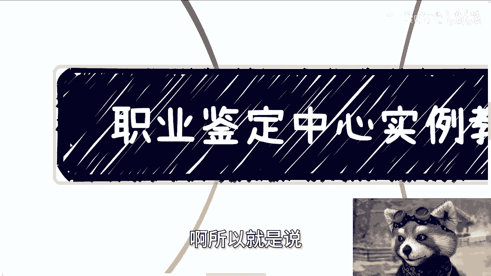

如果你只有一两百人的资源，很难吸引到优质的合作伙伴。你必须拓展更多的宣传与招生渠道，扩大流量基础，才能保证项目的可行性与吸引力。

## 全局思维与行动建议

在行动之前，必须理清整个产业链的上下游关系：

你需要理解整个生态中的各个角色：
*   **国家标准撰写方**：制定职业标准。
*   **人社部/地方人社局**：政策制定与监管主体。
*   **职业技能鉴定中心/授权机构**：认定执行与发证主体。
*   **培训机构**：培训服务提供与市场推广主体。

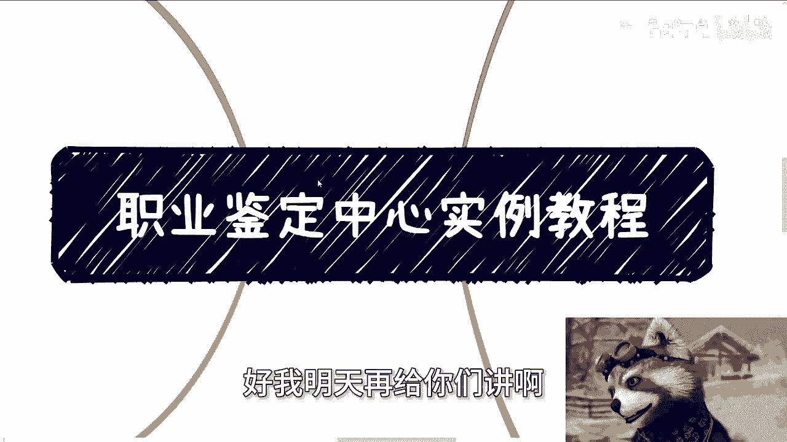

你需要弄清楚这些角色之间如何分工协作，谁是甲方谁是乙方，资金和资源如何流动。只有掌握了全局，才能找到自己的精准定位和切入方式。

---

## 课程总结

本节课中我们一起学习了人社部职业技能鉴定体系合作的核心要点：
1.  明确了**职业技能等级认定**是核心赛道。
2.  学会了通过**OSTA系统**及地方认定计划名单查找正规授权机构。
3.  掌握了判断证书有效性及补贴来源的关键依据。
4.  纠正了“寻找政府单位”的错误方向，转向寻找**授权协会与院校**。
5.  分析了**全包、招生分润、资源互补**等几种基础合作模式。
6.  认识到**扩大生源流量**是合作成功与否的基石。
7.  强调了建立**产业链全局认知**的重要性。

理解并应用这些知识点，将帮助你更高效、更准确地切入职业技能培训与鉴定市场，避免走弯路。下节课，我们将探讨另一个相关的主题。