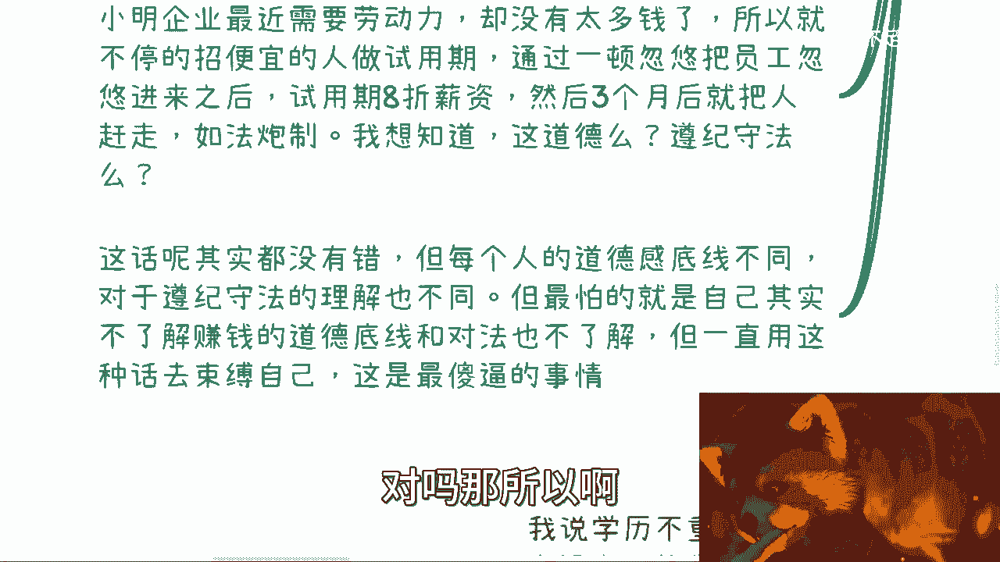
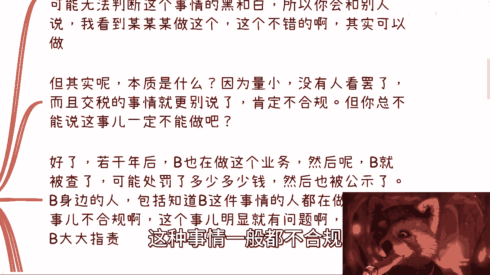
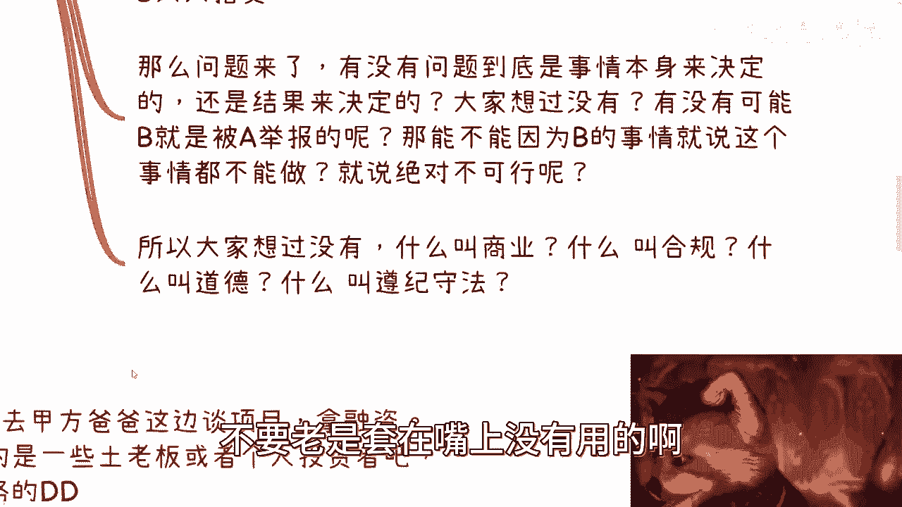
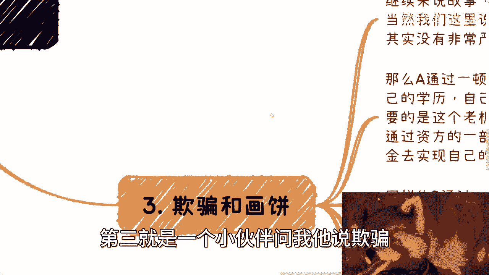
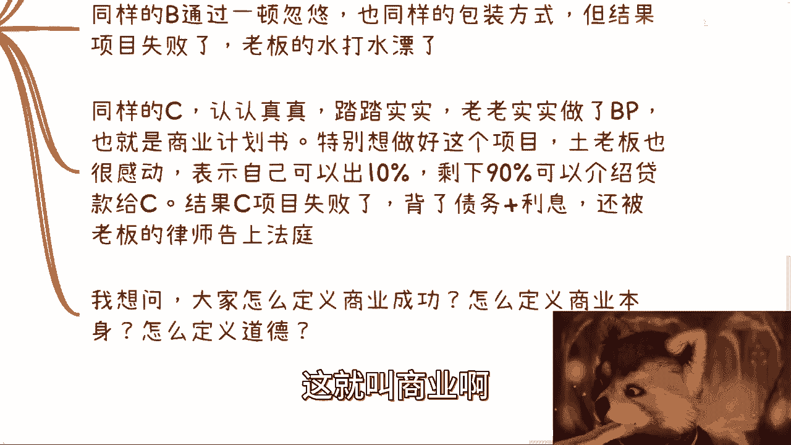
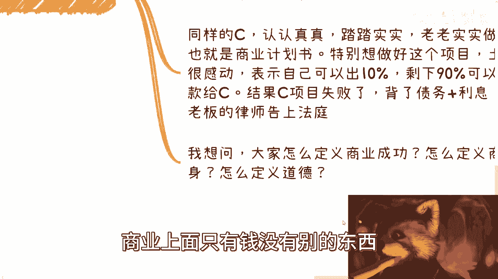
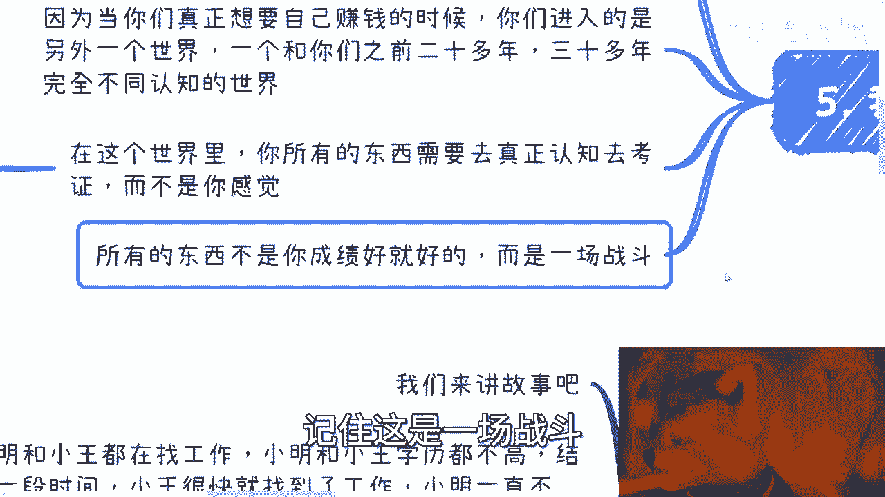
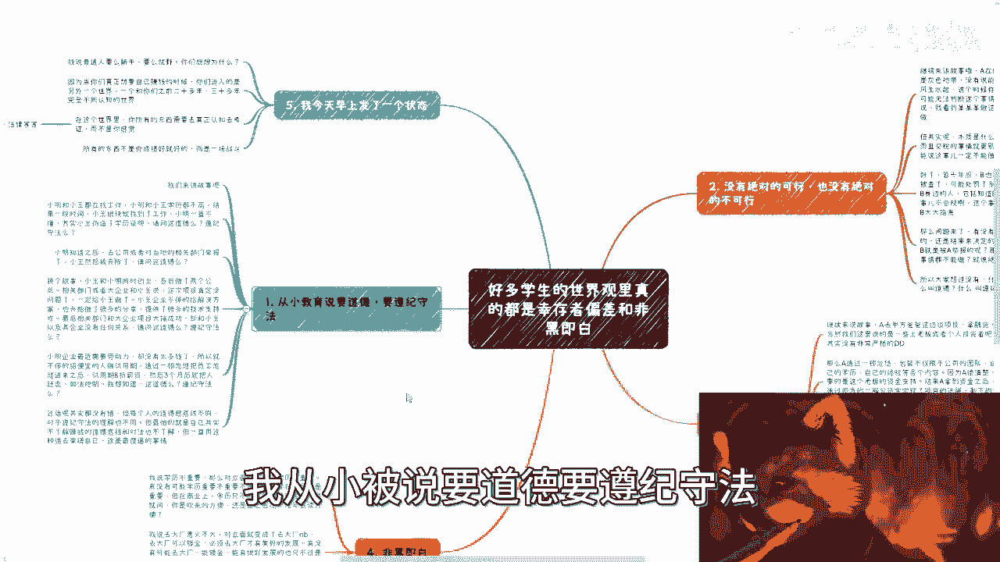

# 什么叫做事要道德？什么叫遵纪守法？ - P1 - 赏味不足 - BV1yF411Z7nQ

好大家好，我们今天对这个零点还没过对吧，那就还算今天啊，今天我们来讲的这个内容呢，这个我希望大家能够认真听完啊，就这个内容很重要啊，就是很多小伙伴啊跟我聊下来了，我就发现啊都在都说啊，都觉得啊。

就是说这个事就是基本上这个世界观里面呢，就是只有幸存者偏差啊，只有非黑即白啊，只有就是说呃道德底线和只有叫什么，就是呃遵纪守法，那我觉得这个东西对吧，我不能说不好啊，不好人举报我啊。

首先第一个呢就是我们来看啊，就是从小说这个对吧，要道德啊。

要遵纪守法啊，我们来看看啊，首先呢我们来讲这个故事啊，小明跟小王对吧，都在找工作啊，小明跟小王呢学历都不高啊，结果一段时间呢小王很快就找到工作了啊，小明呢一直是，啊可以的。

哎我我还以为我小浣熊脱了脱了呢，就是啊小明呢一直是不懂啊，这个小王这个到底怎么能这么快找到呢对吧，那么小王呢其实是伪造了学历证明，那么我们首先第一个事情先来了，就是这个事情请问道德嘛对吧。

就是怎么判断道德不道德，比如说我今天是小王，我觉得伪造学历证明没什么，我我也没觉得有什么不道德的，怎么滴了呢对吧，那你非要来强迫我觉得不道德吗，那我觉得好像有点过分了。

对不对，那你说遵纪守法这个事情吧，我觉得怎么说呢，就是如果我是小王，我就会这么跟你讲吧，第一这是我的事情，跟你没有关系，对不对，就是说我觉得很多时候我们去看问题的时候，你只要看你自己，你别去看别人对吧。

你要改变的也是你自己，你不要改变的也是你自己对吧，那么我觉得这第一点，第二点就是我觉得对我来讲，比如说对小王来讲对吧，就是我要达到我的目的，我就要不择手段对吧，那你说什么叫遵纪守法，那我就来问你。

如果你要跟我谈这个事情对吧，那我就问你，我违反的是哪个季，我违反的是哪个法律，你能不能说出来，你不能说出来，你就别跟我逼逼这些事情。

对不对好，那这第一个第二个呢对吧，小王知道之后呢，去公司或者去当地，相当地相关的这个有关部门举报来了对吧，然后小王被开除了，那我就请问你啊，啊不是我写错了，小明小明小明小明就知道了对吧。

那我就请问我就问你啊，这件事情有这么一个上下文在这，我不管你今天知不知道这个项目上下文啊，我就问你那小明道德吗啊我问你小明道德吗，你觉得呢对吧，就是什么意思呢，就是说所谓道德不道德。

第一每个人的底线是不一样的，第二每个人的定义是不一样的，第三呢你每一个事情有不同的上下文，不同的背景也都不一样的，你觉得有意义吗，去讨论这个问题没有对吧好，那我们再换个故事啊，小王跟小明对吧。

同时创业啊，各自做了两家公司对吧，相关部门或者大企业跟小汪说，小汪啊，你这次好好做啊，这次这个项目呢肯定是没什么问题的，你只要做了啊，这个项目就一定给你做啊，这个给你做什么意思呢，就是这个招投标啊。

什么赔标啊，投标啊，反正都给你啊，反正就是你做的啊，那么小王一听很开心对吧好，那小王的企业呢不停的在给出解决方案啊，然后呢也这个做了很多的分享对吧，因为你们但凡跟企业跟政府交涉过。

你们就会明白这个当中要做的事情很多很多哦，就是不单单是PPT的事情，就是解决方案啊对吧，包括给他们分享这个技术架构啊对吧，包括里面的细节啊，很多很多啊，最后啊相关部门跟企业项目大高成功啊。

哎我觉得我这根烟呐啊，这根烟不不不是很给力啊，等一下啊，妈的这个诶诶帮我搞一下，啊完了啊完了哎，这个搞不了啊，算了算了，搞不了啊，你就这么着吧啊，那么他最后说啊，他说这个大获成功啊。

但是呢其实小王也没有参与，就说白了小王只是前期被白嫖了啊，那么我就问啊，我首先告诉你们，这些事情在商业上面很常见啊，也就是说你们是很容易被国企央企，被大企业被政府白嫖的，我明确就跟你们讲，那我就问啊。

请问这道德吗对吧，请问这遵纪守法了吗，对吧好，那么我就这么说，你们回答我这道德，那好我无话可说，无话可说，你要回答我这不道德，那我就请问不道德又怎么样又怎么样，你是能够去告他们呢，还是能够把钱要回来了。

还是能够把这个灯单子要回来了，我就告诉你对吧，你什么都做不了，就这么简单，你你觉得有意义吗，有没有没有啊，没有好，再往下啊，小林企业啊，最近呢很需要劳动力啊，却没有太多的钱啊，资金链肯定要断了啊。

那所以呢他不停的招便宜的人啊，做实习生啊，不呸呸，怎么做实习生啊，我妈的唉，我脑子不行，做做试用期啊啊做试用期，那么通过一顿忽悠呢，把员工忽悠进来之后呢，试用期都是八折薪资对吧，大家都知道啊。

一般签呢签三个月啊，然后呢就把人赶走了，对吧哎呀我终于可以对吧，那我就请问啊这种情况，然后他不停的如法炮制对吧，就是111轮一轮一轮轮换，那我想知道我就请问这道德吗啊，遵纪守法嘛，我首先告诉你们。

从法律上来讲，他没有违反任何东西啊，从规则上来讲，他也没有违反任何东西，但你说他道德吗，我你如果觉得他不道德，但是我觉得你从小明角度来讲，小明觉得他道德为什么，因为小明觉得我得保住我公司的员工。

但是你觉得他不道德，是因为你从一个上帝视角，或者你作为他的一个八折薪资的员，员工被嫖的员工，你觉得他不道德，但是请问这件事情有对和错吗，没有你怎么去定义它呢，对吧哦，你这个时候来跟我说说哎呀。

因为他也没有违反什么法律，所以他道德啊，那你这个时候这么说了，那按照这么个说法，只要不违反的，没有写进相关这个政策里面的都很道德啊，你想想看是不是，那肯定也不是对吧，那所以啊我们首先得出第一个结论啊。

就是这个画就是什么话，就是你比如说啊我们从小教育要说要道德，要遵纪守法，对不对，好这个话其实没有错啊。

但是每个人的道德底线是不同的对吧，同时哎呀我这个放的太大了啊，同时呢对于遵纪守法的理解你也是不同的，但最怕的是什么呢，最怕的就是说，其实你自己根本就不了解什么叫道德底线，而且你对法也是不了解。

你就是个法盲对吧，然后呢还一直用这句话去PUA自己，去束缚自己，我跟你讲，这他妈就是最的事情，你懂吗啊，就是别老是用这些吃法去挂在嘴边。

你懂吗，其实你不懂。

OK这个是第一点，我们来说第二个没有绝对的可行，也没有绝对的不可行啊，什么意思啊，你们来看看啊，首先第一点啊，继续来讲故事，A呢再做一个业务，那么这个业务呢相对来讲是灰色地带啊。

我就明确跟你们讲灰色地带三不管三不管，没有说能做啊，也没有说完全不能做啊，那么A坐在那风生水起啊，那么这个时候呢你看到之后啊，因为你的无知啊。

因为你的无知，因为你的这个知识面太窄啊，因为你的没有认知啊，你可能无法判断这件事情的黑和白，也就是说，你无法判断这件事情到底能不能做。

对吧好，那么这个时候这个时候啊，你碰到别人，你会跟别人这么说，哎你说哎我看到那个某某某啊，那个A啊，这个业务做的不错啊，那个你们可以如那个模仿一下啊，其实大家也可以做这个业务呢，蛮赚钱的啊。

你可能会这么讲啊，好但其实呢本质是什么，本质不是三不管。

也不是完全的灰色地带，而是因为量小没有人看到罢了，你知道吗，所有的生意都一样的啊，而且我跟你讲，就是这种事情，你要说他合规，我告诉你这种事情一般都不合规。

因为单纯一个税收就是不合规的啊，你交涉这个事情就更别说了对吧，就是你把这些事情的人排在那对吧，蒙着眼睛对吧，就是扫扫射不带冤枉的啊，所以说呢你从交税这个角度来讲，那肯定是不合规的。

但你总不能因为这个事就说这件事情不能做吧，你想想看这两者能得出因果关系吗，不能吧对吧。

那如果今天你能得出这个因果关系，那我就这么问你啊，我说哎那个谁今天咱做个生意啊，做生意，然后那个那个一个单子大概20万啊，但是呢我们可能就是打给你个人就不交税了，你怎么滴啊，哦你跟我讲哦，陈老师不行啊。

哦驴老师不行啊对吧，就是你必须给我交税，不交税吗的这20万我不要的，你不要把你不要，我不要脸，不要有的人是人妖，是不是，who care啊，那么好了啊，若干年后B啊也在做这个业务，然后呢B呢好来啊。

命不好对吧，被查了啊，可能呢过了呃，这个呢可能也处罚了这个一定的钱财啊，然后也被公示了啊，那么这个时候呢B身边的人呢，包括知道啊B做这件事情的，包括这个知道这个事情不合规的啊。

也都知道这个事呢明显是有问题啊，同时呢也开始对B进行网络暴力对吧，大大指责啊等等等，好，那么问题来了，有没有问题，我们你们想想看啊，有没有问题，到底是事情本身来决定的，还是结果来决定的啊。

就是你们想过没有，有没有可能B就是被A举报的啊，那有能那能不能因为B的事情，就说整个这个事情不能做，还是说是绝对就不能做，你们想想看，很多时候都这样子，就是你们碰到一个问题对吧。

感觉哦这个这个事情好像被查了啊，这个东西怎么来了，哎这个东西不能做是吗，是因为这个事情不能做，还是因为你觉得因为他被查了，所以你觉得不能做对吧，你们想想看啊，所以你们有没有想过什么叫商业啊。

商业里面什么叫合规，商业里面什么叫道德，什么叫遵纪守法，你们自己想想看，不要老是套在嘴上。

没有用的哦，没有用的，第三就是一个小伙伴问我。

他说欺骗，他说驴老师，他说欺骗跟画饼，他说我没搞明白啊，我今天让你们搞明白一下啊，继续来讲故事啊，A去甲方爸爸这边谈项目，拿融资啊，当然我这边说个前提啊，我们这边说的是一些土老板啊。

或者是一些个人投资者，或者是一些小的基金啊，其实是没有这么严格的滴滴啊，滴滴是什么呢，就被调啊，没有这么严格的背调好，那么A啊通过一顿忽悠啊，包装但不仅限于公司的团队啊，包括自己的学历。

自己的经验等各个方面内容啊，呃因为A很清楚他要的就是老板的资金支持，结果呢A拿到了资金啊，A拿到资金，同时这个拿到了一部分的资金之后呢，通过资金的一方面，比如说他拿到1000万，他拿了100万去实现。

更给这个老板啊，这个说的这个项目对吧，他去做了剩下的这个900万呢，就去实现自己梦想了啊，我不管他什么实怎么实现自己梦想了，反正就是这900万就他就自己去用了啊，不管是那个分给自己用。

还是说自己做自己想要去做的项目，我不管啊，好这是A啊，同样的B通过移动忽悠啊，也同样的包装了方式，但是呢结果项目失败了啊，那么啊老板呢就打水漂啊，老板呢这个钱呢就算打水漂了啊，不是老板的水。

我打错了钱就打水漂了啊，那么这个时候呢就有人会问了，他说那为什么这个老板不去追究他责任呢，对不对好，首先很多土老板，很多这种小的基金，他其实也不懂的，而且他觉得他没有这么完善的体系。

也就是说它更多的偏向于风险投资啊，那么风险投资是什么，就是就自己那个呗，就自己吃亏，自己买进呗，对吧，就这么个情况，就是认怂啊，就结束了，你知道吧，而且另外一方面呢就是你要明白啊。

老板会觉得A跟B是个人才啊，从这种土老板来讲，他们是尊敬和尊重A和B这样的人的哦，那么他们会觉得哎呀没关系对吧，大家都是朋友啊，这次做不成还能做下一次啊，好那么我们再往下看啊，同样是C啊。

同样的C认认真真，踏踏实实，老老实实做项目计划书，也就是我们所说的BP，特别想做好一个项目，然后呢他可能在态度上啊，在很多方面都是那种就是乙方的姿态，就是相当于跪舔啊，相当于这种就是呃好像弱势的一方啊。

那么土老板也很感动啊，表示呢要么这样啊，我呢可以出个10%，也就我给出100万啊，剩下900万呢我介绍个贷款啊，这个高利贷啊，或者说是一些小贷款给你啊，那么结果呢这个C啊自然而然啊想都不用想。

屁股都想得出来啊，这个项目失败了，背了债务加利息啊，然后呢他会被老板律师告上法庭，为什么，因为老板觉得你就是个渣呀，对不对，你就是个垃圾啊，你对我来讲毫无用处啊对吧，你既然把我的钱还亏掉了。

那我不把你弄死，这就叫商业啊。

所以啊我想问大家怎么定义商业成功，那怎么定义商业本身，怎么定义道德啊，我想问的是，如果今天我干坏事干了100年，然后我开始做慈善，是不是代表我是个好人，或者来说我做慈善做了100年，我今天开始干坏事。

那是不是代表我不是个好人。

我就问问看你们怎么定义商业上面，我告诉你们商业上面只有钱。

没有别的东西，不要来谈别的啊，好那么第四个叫做非黑即白。

什么意思啊，我呢从视频做到现在这么长时间了啊，我说的很清楚，我说学历不重要啊，那么对立面就来了，对立面的意思是什么呢，他说学历很重要啊，学历很重要好，这就叫黑黑，黑黑即白，什么意思啊，有没有可能啊。

我的意思是学历重不重要，并不是一个问题，而是说你在职场上也许是重要的，但是但是在商业上，学历只不过是一嘴带过的一个东西罢了，在你介绍里面的那么一秒钟罢了啊，我就问你是靠吹来的方便。

还是自己花个几年去读个东西出来方便，你是真的有钱去读书，还是说你现在缺钱要去赚钱，你们自己想想看重不重要啊，好那么第二点啊，我说去大厂意义不大啊，对面的对立面也来了，他说哎去大厂能变得很牛逼啊。

去大厂可以镀金啊，毕并且呢他觉得必须去大厂才有美好的未来啊，好那么有没有可能啊，去大厂能镀金，能有发展的有啊，但是只不过也是少数人，有没有可能本身去不去大涨，意义大不大不大，重要的是你去了大厂又如何呢。

你还是一个打工的，你只不过是一个还是不能财富自由的一个，打工的人罢了，有什么区别呢，对不对啊，好那么第三个啊，就是我我说啊，我说做电池不好，那么对立面你要说来了，他说那你的意思就要创业了。

不做电池了对吧，那么有没有可能我想说的是，创业呢大家也是死路一条，打工呢没有前途啊，我们呢你说是不是要去打工或者创业，这个并不重要，重要的是你现在的努力干活，努力赚钱，你的积累你是为了自己去积累。

你的钱是为了自己去赚，而不是说你的打工和付出努力，为了你的公司和未来，为了就是不是你的公司啊，为了你签合同的那家公司和，为了你签合同的那个老板啊，而你拿到的只不过是他们极大利润里面的，很小的一部分。

而最终你自己毫无积累，他们可能通过股票，通过别的东西都财务自由了对吧，这个才叫不做电池啊，不是说听到不足电池哎呀，这个驴老师让我们去创业对吧，这种这种什么忽悠我们创业的，大家不要踩他是吧，这有意义吗。

没有意义啊，好那么最后我今天早上来发了一个状态，是这么说的。

我说普通人呢就是要么躺平，要么就是以你们想想看。

为什么啊，因为当你们只要真正的想要去，为自己赚钱的时候，你们进入的是另外一个世界，一个与你们之前20多年，30多年完全不同认知的一个世界，一个完全与你们现在认知的世界平行，宇宙的这么一个世界。

那么在这个世界里面，你所有的东西需要去真正的认知以及去考证，而不是靠你那些有的没的感觉，我们举个例子，比如说财务法务合同法律什么意思啊，就比如说我举个例子啊，就比如说你今天跟我说。

你说这个东西这个涉及到就非法集资了，对吧好，那我就问嘛，你知道非法集资上限就最少几个人嘛，你知道非怎么判断非法集资吗，你知道这个资是怎么定义吗，哪些东西是在资这个范围里面的，你不知道对吧。

你别老是用这些东西PV自己，或者PV别人没有用的，这些都是老百姓的YY，你知道吧，包括就是什么，包括就是说也就是很多人还要说什么，他说哎呀，这个东西是不是说啊某些东西有没有资质对吧，有没有报备，有没有。

你去翻啊对吧，哪个条例有了哪个东西有了你做商业，你要去你就要拿出东西来啊，没有就别逼逼呀对吧，就好像有很多人跟我说，哎呀我我们是跟高校合作，跟政府合作，可以啊，拿出证明来有没有合同文件，对了。

你有没有院长，有没有老师拉一个出来没有，你给我哔哔什么东西啊，你懂吗，就是你的思维一定是这样子，但是不要再用一些有的没的PV自己，对吧，所以说在商业层面啊，所有的东西不是像以前你在学校里面，你成绩好。

你某一个东西学得好就是好的，没有用的哦，这是一场战斗，记住这是一场战斗。

所以啊就是我想告诉你们核心是什么呢，就是不要用那些什么，哎呀我从小被说要道德，要遵纪守法。

我觉得有些事情是绝对可以做，绝对不有些事情绝对不能做的对吧，我也不知道什么叫欺骗，什么叫画饼对吧，我也不知道什么叫非黑即白，对不对，好，我就跟你们讲啊，所有东西你去考证，如果你考证不出来，你就别逼逼。

你，知道吗，就像我这边写的，你告诉我道德是什么，你告诉我遵纪守法，遵的什么纪守的什么法对吧，你告诉我哪些东西绝对可做，哪些绝对不可做，有没有证据，有没有依据对吧，你告诉我什么叫欺骗，什么叫画饼对吧。

你告诉我就是整个社会意义上面，法律意义上面哪些东西是确定你叫画饼，确定你叫欺骗的，有不啦，对未来你你如果自己都找不出来。

你为什么老师要去框住你自己，你不但框住你自己，你还要框住别人是吧，所以我跟你们讲啊，我在做商业过程当中知道吗，就是有边界性，有东西有风险性，你该去考证就考证，你该去咨询律师的，就咨询律师。

但是不要拿那些有的没的去吓唬自己，或吓唬别人，没有意义的好吧，到最后就是一个既要又要的结果啊，行吧啊，就这么着吧，我觉得今天这一期呢就是嗯还是那句话，能懂的自然懂，不能懂的呢，我相信你们未来也会懂啊。

反正就这么回事好吧，那么最后一样的好吧，就是你们但凡有手上牌不知道怎么打的啊，资源不知道怎么用的，或者未来不知道怎么走的啊，然后职业发展不知道怎么搞的好吧，你们可以总结好自己的这个word啊。

总结好问题，总结好人背景，你来私信我好吧。

我们我会跟你好好去，把你的整个就根据你情况吧啊。