# 什么叫做事要道德-什么叫遵纪守法----P1---赏味不足---BV1yF411Z7nQ

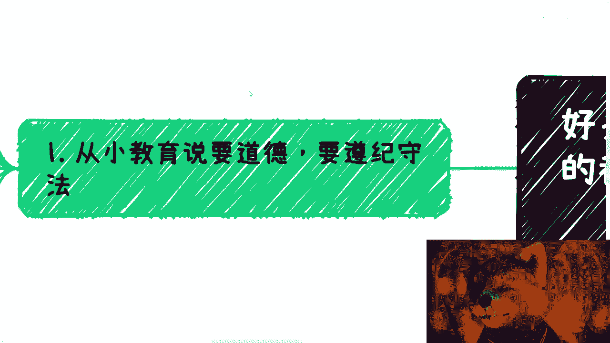

在本节课中，我们将通过几个商业故事，深入探讨“道德”与“遵纪守法”这两个常见概念在现实商业世界中的复杂性和模糊性。我们将看到，简单的二元判断往往不适用，真正的商业决策需要更深入的认知和具体的考证。

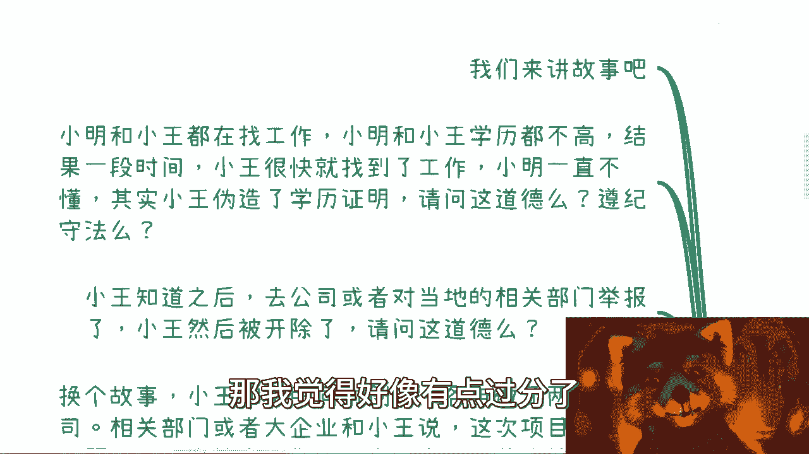

---

## 第一部分：道德与守法的相对性

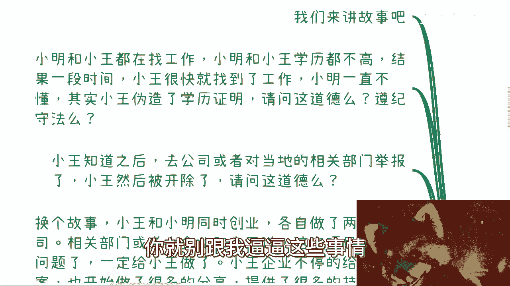

上一节我们提到了课程的主题，本节中我们来看看第一个核心观点：道德与守法的标准是相对的，因人、因事、因背景而异。

**故事一：伪造学历的小王**
小明和小王都在找工作，学历都不高。小王通过伪造学历证明很快找到了工作，而小明则一直未能找到。我们从这个故事出发，提出几个问题：

1.  伪造学历道德吗？
    *   对于小王本人而言，他可能认为这没什么不道德。道德感是个人的、主观的。
2.  伪造学历违法吗？
    *   这需要对照具体的法律条文。如果无法明确指出违反了哪条法律，那么“违法”的指责就缺乏依据。
3.  举报者小明道德吗？
    *   当小明得知真相后去举报，导致小王被开除。这个行为本身是否道德？这又取决于你站在谁的立场，以及如何看待“维护公平”与“个人手段”之间的关系。

通过这个故事，我们得出第一个结论：

> **公式：道德底线 ≠ 普遍标准**
> 每个人的道德底线不同，对“法”的理解也不同。最危险的是，自己对道德和法并无深入了解，却总是用这些概念来束缚和PUA自己。

---

## 第二部分：没有绝对的“可行”与“不可行”

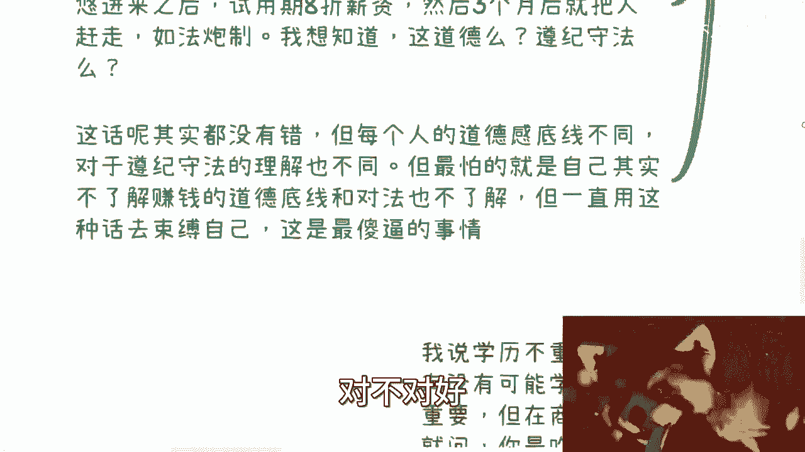

上一节我们讨论了标准的相对性，本节中我们来看看商业世界中所谓的“灰色地带”。

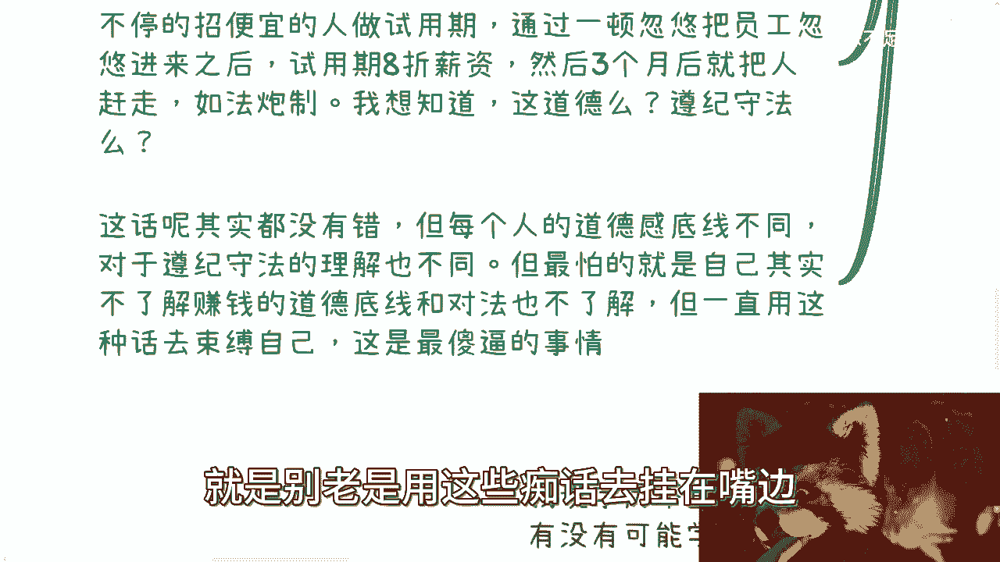

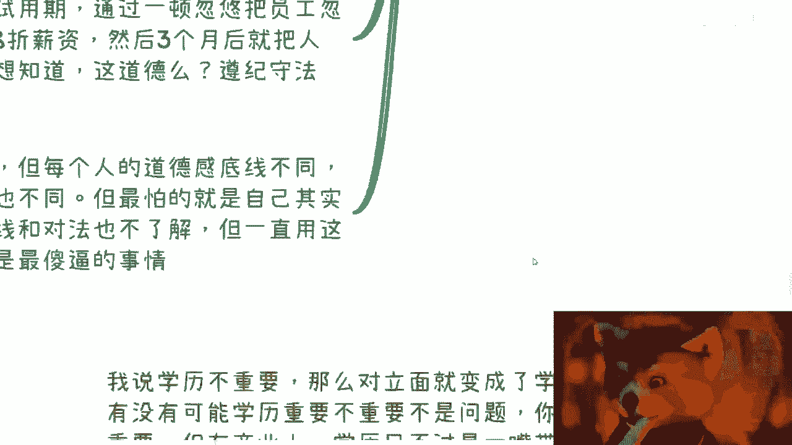

**故事二：游走于灰色地带的业务**
A在做一个处于“三不管”灰色地带的业务，并因此获利。你因为认知有限，无法判断其黑白，可能会建议别人模仿。但本质可能是：
*   **代码表示本质：`业务状态 == “因量小未被关注”`**
*   该业务可能本身就不合规（例如税务问题），只是尚未被监管注意到。

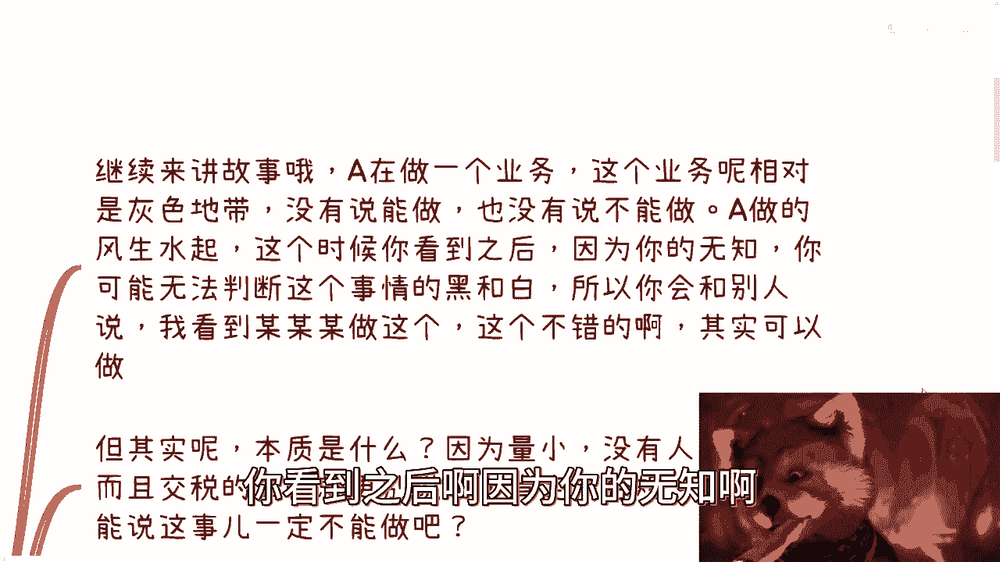

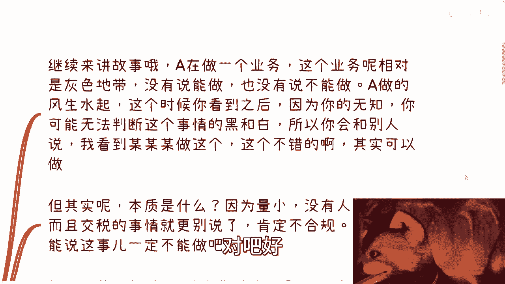

**故事三：被查处的B**
后来，B做了同样的业务，但因故被查处并公示。这时，人们开始抨击B和这项业务。

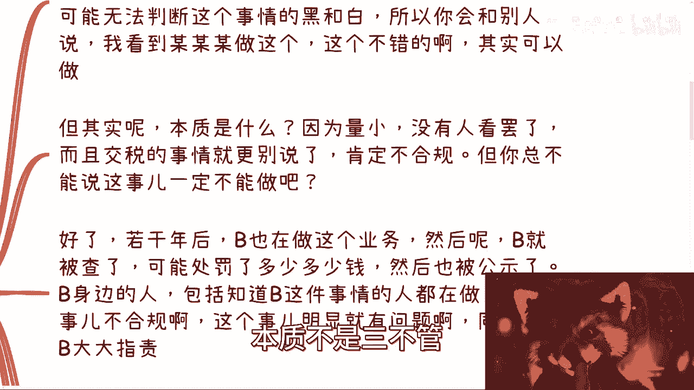

这里的关键问题是：**是事情本身决定了“不可行”，还是结果（被查处）决定了“不可行”？**
有没有可能A举报了B？能不能因为B的失败，就断定整个事情绝对不可做？

这引出了我们对商业的思考：

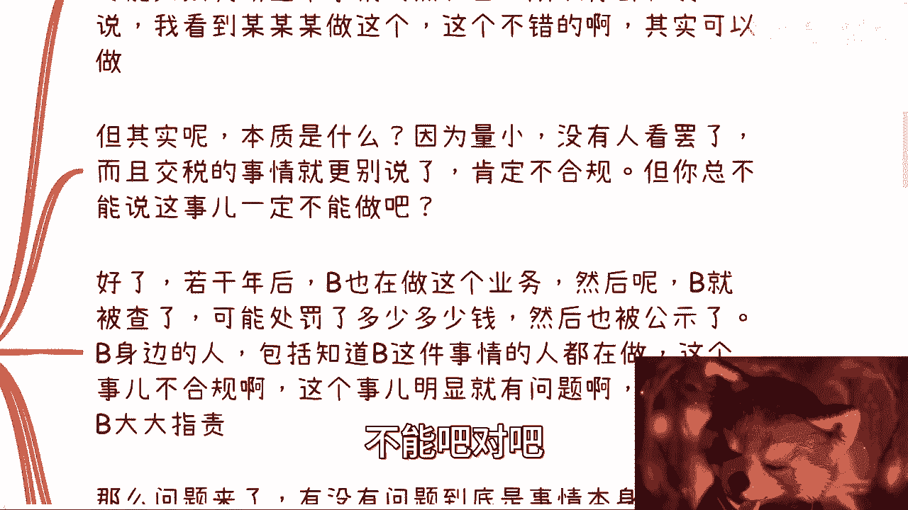

> **核心概念：商业 ≠ 道德审判**
> 商业世界中的“合规”、“道德”、“守法”是复杂且具体的。不能仅凭感觉或个别案例下结论，需要具体的考证和依据。

---

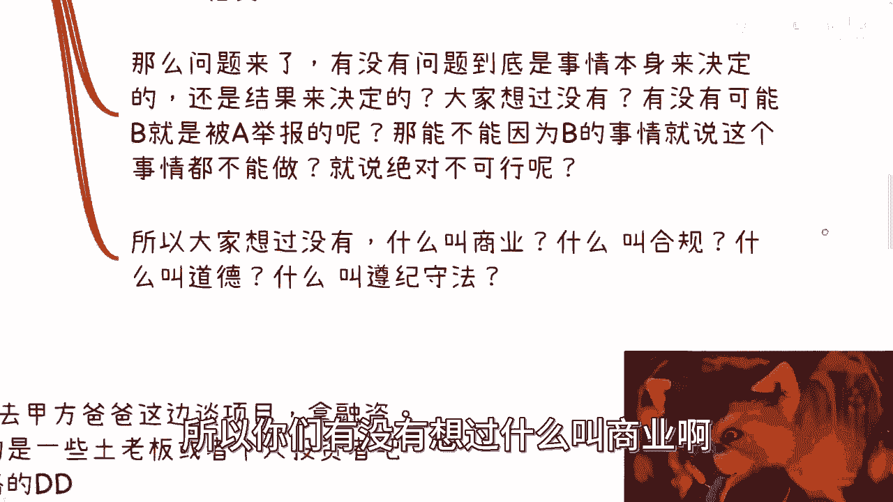

## 第三部分：欺骗、画饼与商业现实

上一节我们探讨了行为的模糊边界，本节中我们通过融资故事，来看看商业世界中“欺骗”与“画饼”的微妙区别。

**故事四：融资的A、B、C**
以下是三种不同的融资方式及其结果：

1.  **A（包装忽悠，项目部分成功）**：通过包装团队、学历等获得投资。用少量资金做出样子给老板看，大部分资金用于实现自己的其他目的。结果：老板认为A是人才，关系维持。
2.  **B（包装忽悠，项目完全失败）**：同样通过包装获得投资，但项目彻底失败。结果：老板自认风险投资失败，可能仍尊重B。
3.  **C（踏实认真，姿态卑微）**：老老实实做计划书，以乙方姿态求融资。结果：老板只愿出少量资金并介绍高利贷。项目失败后，C被老板告上法庭，因为老板认为C毫无价值。

这个故事揭示了商业的残酷逻辑：

> **公式：商业世界的首要规则 = 利益（钱）**
> 商业场上，最终评判标准往往是结果和利益，而非单纯的过程或态度。“画饼”（给予希望）与“欺骗”（造成损失）的界限，常常由结果来反向定义。

---

## 第四部分：打破“非黑即白”的思维

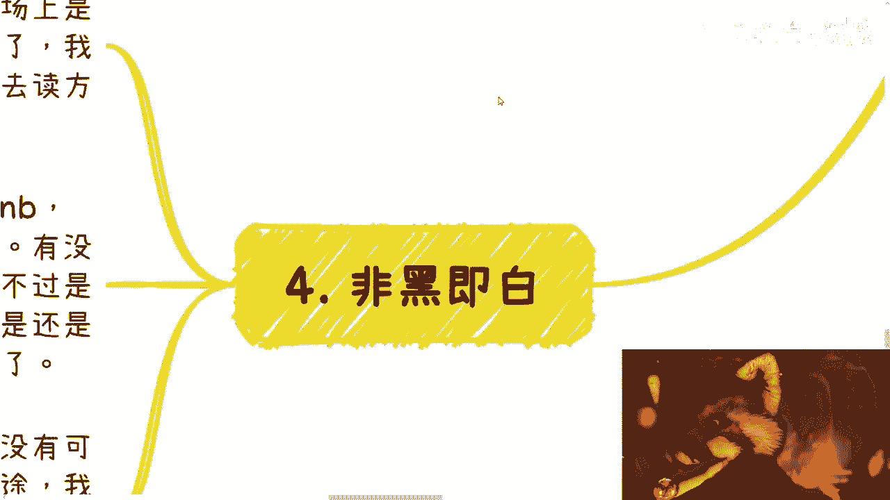

上一节我们看到了商业以结果为导向的特性，本节中我们来破除几种常见的二元对立思维。

很多人习惯非此即彼的思考方式，但这在商业中行不通。以下是几个例子：

1.  **关于学历**：我说“学历不重要”，对立观点是“学历很重要”。但真相是，在职场初期可能重要，在商业博弈中它可能只是一笔带过的背景。关键在于：**你的目标是靠吹嘘快速获得机会，还是花长时间去读书？**
2.  **关于大厂**：我说“去大厂意义不大”，对立观点是“去大厂能镀金”。但真相是，镀金者永远是少数。关键在于：**去了大厂，你本质上是否仍是一个无法掌控财富命运的打工者？**
3.  **关于“不做电池”**：我说“做电池（指单纯打工）不好”，对立观点就认为“这是在鼓吹创业”。但我想表达的是，无论是打工还是创业，核心在于**你的努力和积累是否为了自己，而不是在为老板的财富自由做嫁衣**。

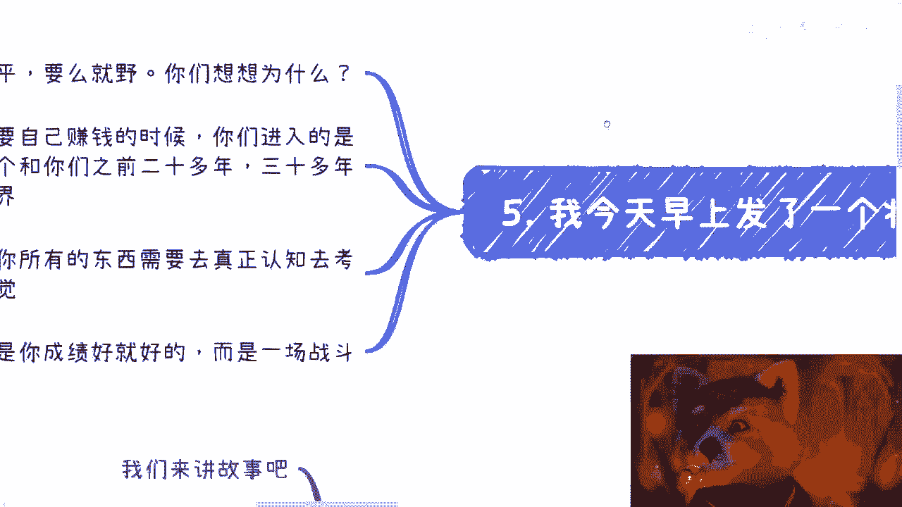

真正的商业世界，与你过去二三十年认知的世界，可能是一个**平行的宇宙**。在这里：

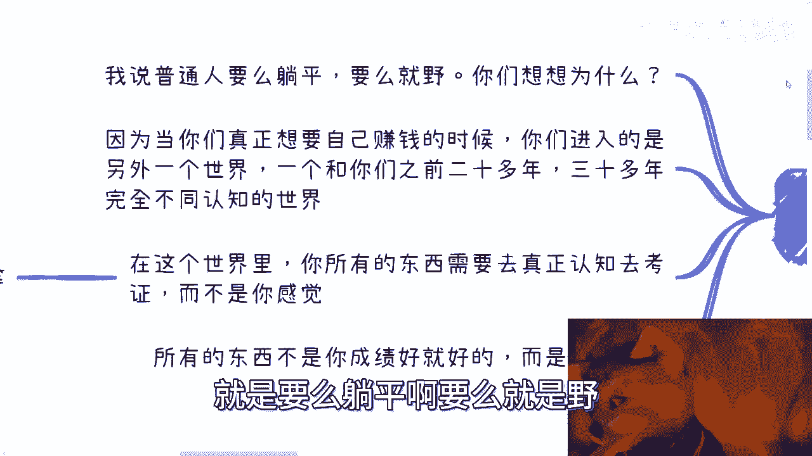

> **核心要求：考证 > 感觉**
> 所有判断需要基于事实和规则，而非感觉。例如，你说“这是非法集资”，那么请回答：非法集资的准确定义是什么？人数下限是多少？“资”的范围如何界定？如果自己都查证不清，就不要用这些概念吓唬自己或他人。

---

## 总结与行动指南

本节课中，我们一起学习了如何重新审视“道德”与“守法”在商业语境下的含义。

我们通过多个故事分析了：
1.  道德与法律的判断具有**相对性**和**主观性**。
2.  商业中很少有绝对的“可行”或“不可行”，多为**灰色地带**，需具体分析。
3.  商业的核心驱动力是**利益**，结果常常定义手段的性质。
4.  必须打破**非黑即白**的思维，凡事需要基于证据和规则进行**具体考证**。

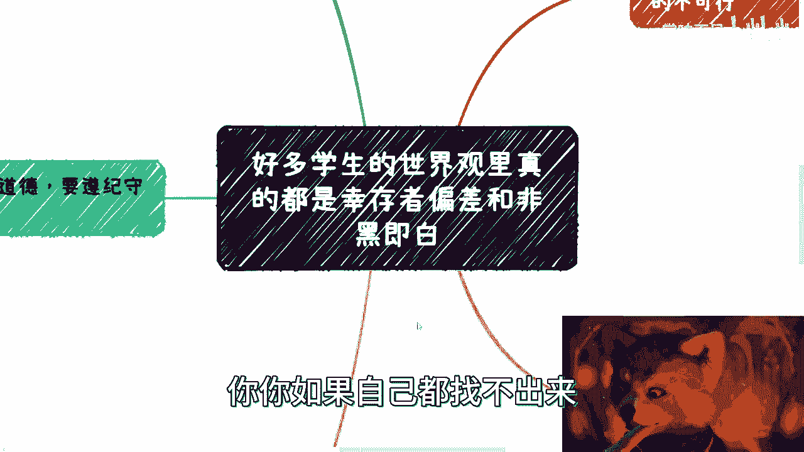

**最后的建议是**：在商业实践中，要有风险意识，该咨询律师时务必咨询。但不要用那些自己都一知半解的“道德”或“法律”概念来束缚自己的手脚。商业是一场需要智慧和勇气的战斗，既要保持敬畏，也要敢于探索边界。

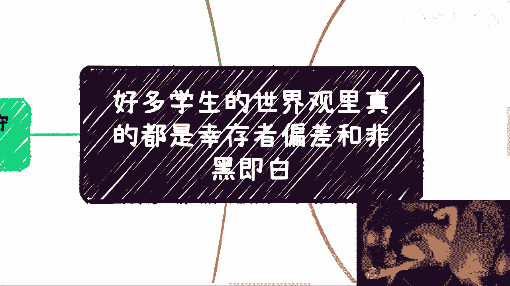

如果你对个人职业发展、资源整合或未来方向有具体困惑，欢迎整理好你的背景和问题，通过私信与我进一步交流。