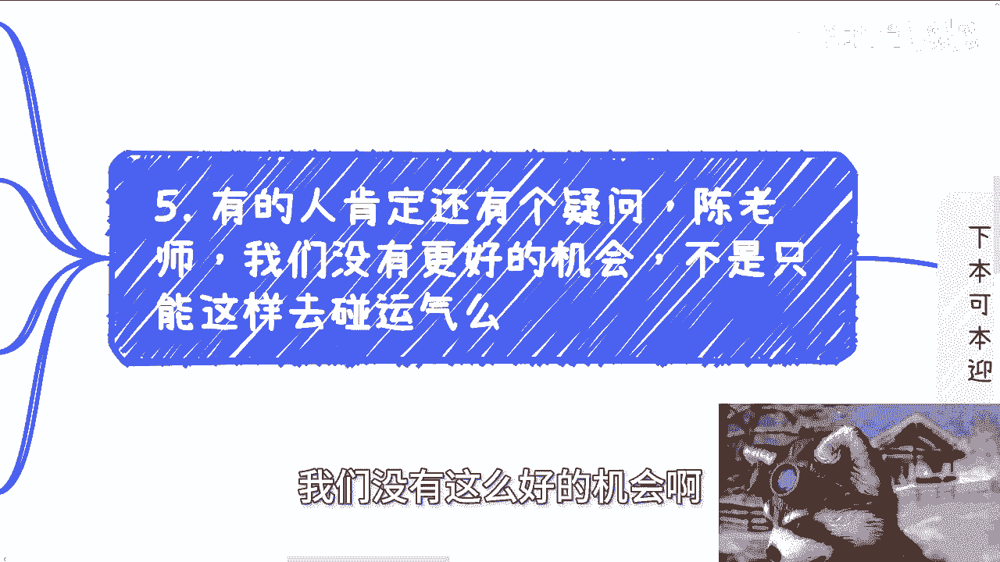
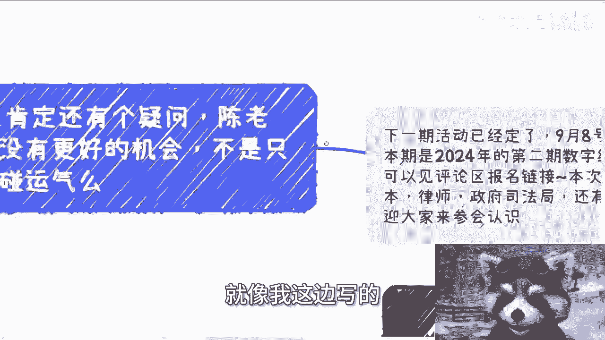

# 课程名称：如何甄别有效合作与“画饼” - P1

## 📖 课程概述

在本节课中，我们将学习如何区分值得投入的真实合作与不切实际的“画饼”项目。我们将通过一系列核心原则和具体案例，帮助你建立判断标准，避免在商业合作中浪费时间和精力。

## 🔍 核心判断原则

上一节我们介绍了课程主题，本节中我们来看看甄别合作的核心原则。关键在于关注项目的实质，而非表面的承诺。

以下是判断一个合作是否值得投入的五个核心要点：

1.  **确定项目方与出资方**
    *   必须明确项目的发起方是谁，以及最重要的——钱由谁出。
    *   公式：**合作价值 = 明确的出资方**
    *   示例：杭州某组织提出一个预算在70万到100万的软件项目，出资方可能是某公司或政府部门。

2.  **计算投入产出比**
    *   必须明确自己需要投入什么（时间、技术、资源），周期多长，以及对应的报酬是多少。
    *   任何额外的投入都必须有相应的费用。没有报酬的合作等同于被“白嫖”。

3.  **警惕“未来收益”陷阱**
    *   对于“项目上线成功后再分钱/分股份”的承诺要保持高度警惕。这本质上是让对方承担全部风险，属于空头支票。
    *   类比：这就像去公司上班，公司说“等这个产品盈利了再给你发工资”，没有人会接受。

4.  **关注实质，而非概念**
    *   不要被“蓝海市场”、“数字经济”、“数据要素”等宏大概念迷惑。这些概念与你能否赚到钱没有直接关系。
    *   核心问题永远是：**钱从哪里来？** 钱不会凭空产生，它必然绑定在一个具体的、可执行的项目上。

5.  **保持独立判断，避免被利用**
    *   许多人并非故意“画饼”，而是他们自己先相信了别人的“饼”，然后无意中成为了传递“饼”的“枪”。
    *   不要因为对方的身份（如“大佬”、“教授”）而忽略对项目基本面的审视。无论对方是谁，都要回归到“谁出钱”这个根本问题。

## 💡 实践策略与心态调整

理解了核心原则后，我们来看看在实际操作中应采取的策略和心态。

**宁缺毋滥，珍惜时间**
没有合适的项目时，等待优于草率行动。将时间浪费在资金来源不明、规划模糊的项目上，不如用于学习、休息或陪伴家人。一个开发人员为不靠谱的项目白干一两个月，这本身就是巨大的损失。

**所有付出都应计价**
即使是提供案例、规划等前期工作，也需要投入时间和精力，因此也应有相应的报酬考量。如果对方无法为这些前期工作付费，通常意味着其项目本身缺乏坚实的资金基础，即“饼”的可能性很大。

**理解商业的本质**
无论商业模式多复杂，其核心都是 **买卖**。你需要清楚：卖什么？谁来买？利润率多少？销售周期多长？如果对这些基本问题都一无所知，那么合作就是空中楼阁。

## 🎯 课程总结

本节课中我们一起学习了甄别有效合作与“画饼”项目的关键方法。

总结起来，你需要始终抓住几个**实质点**：**明确的出资方**、**清晰的投入产出计算**、**即时的报酬承诺**而非未来幻想，并**关注具体的买卖逻辑**而非空泛的概念。避免被他人利用的关键在于保持独立判断，坚持“先谈钱，再做事”的原则。记住，你的时间是最宝贵的资源，只应投入在闭环清晰、有真实资金支撑的项目上。

---

**附：活动与咨询信息**

*   下一期活动已定于9月8日在上海举行，这是2024年第二期数字经济大会。
*   年底将在北京再举办一期。
*   活动邀请了投资机构及多位创业者，欢迎通过评论区链接报名参与。
*   若在职业规划、商业合作（涉及合同、股权、融资、项目计划书等）方面需要具体、接地气的建议，希望少走弯路，可整理好个人背景与具体问题进一步咨询。