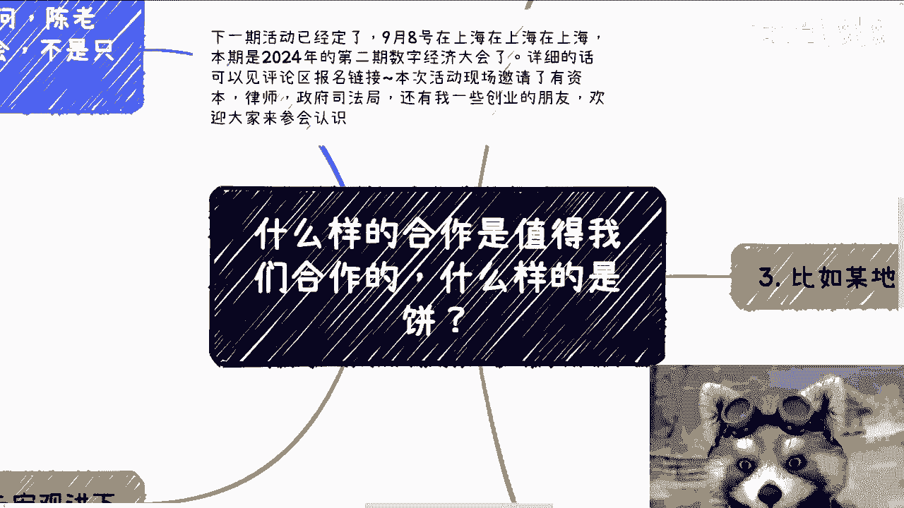
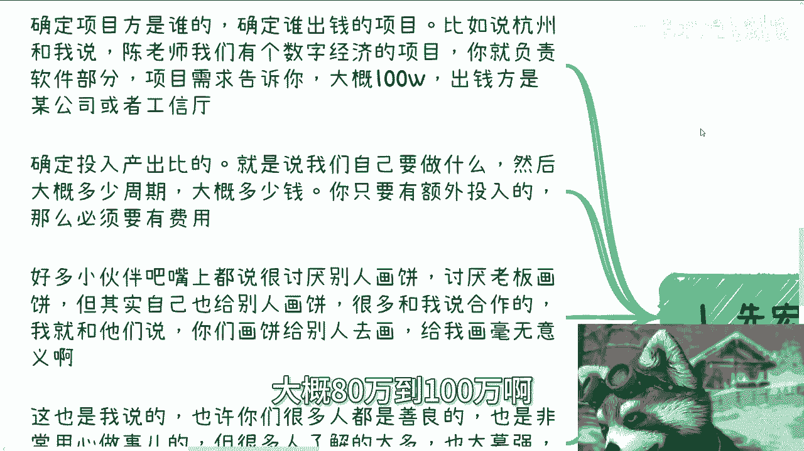
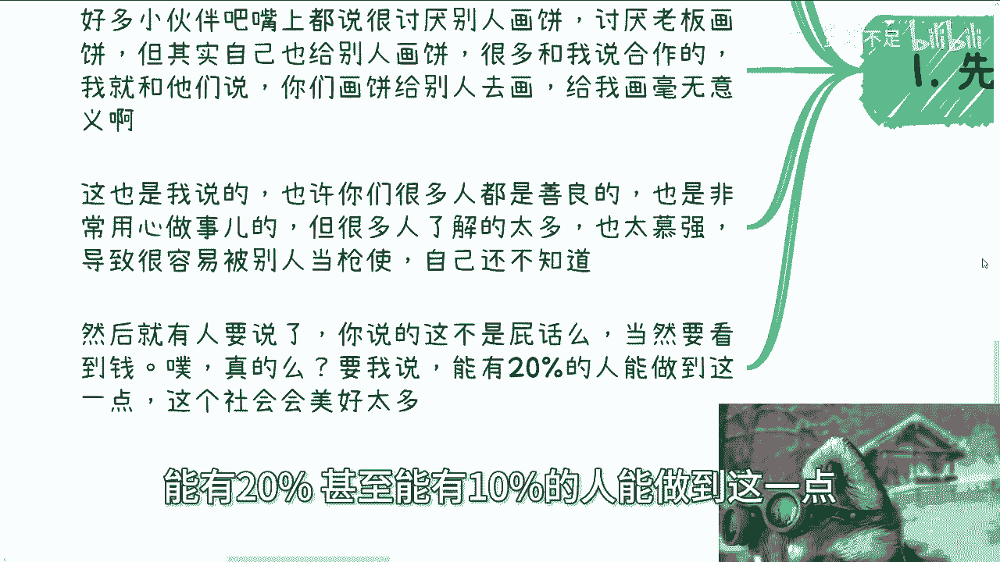
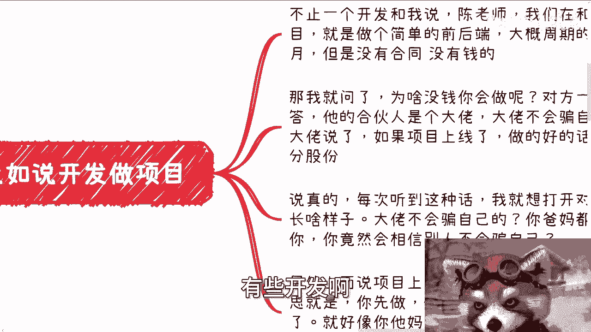
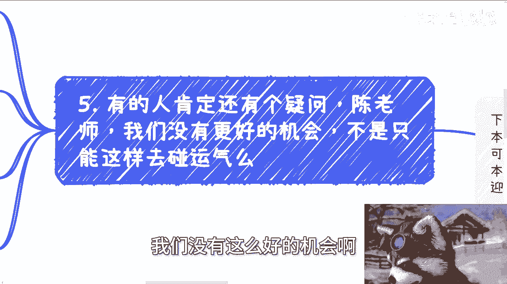
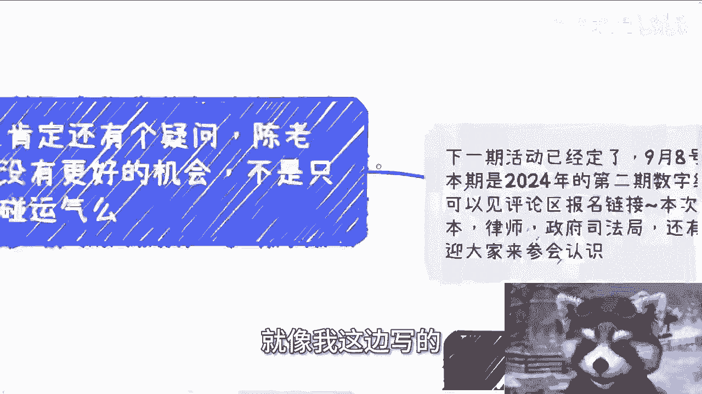
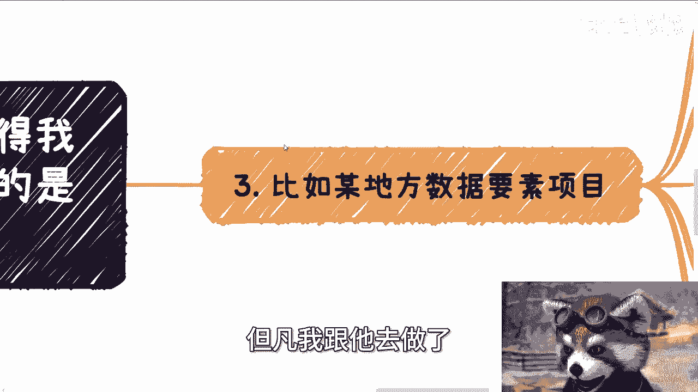
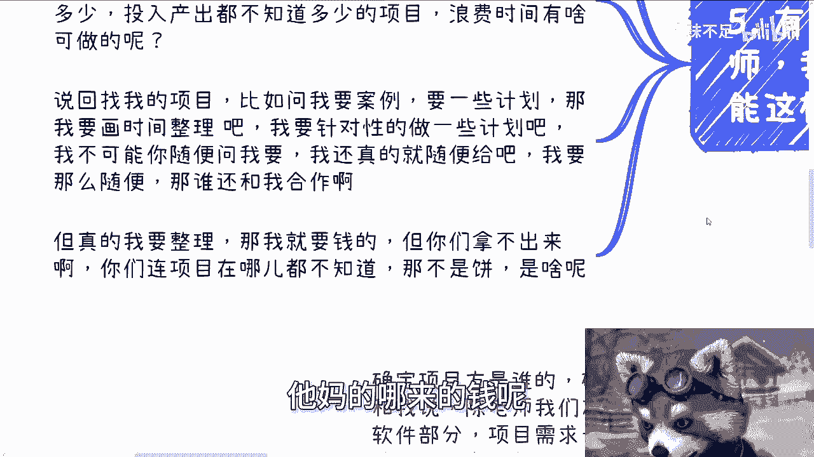

# 什么样的合作值得我们合作，什么样的是饼呢？ - P1 - 赏味不足 - BV1i5HqeyEix

好大家好啊，这个明天就开学了啊，不知道大家作业做的怎么样了是吧，哼哦今天我们来讲的这个主题啊，叫做什么样的合作值得我们合作对吧，什么样的是饼啊，这个主题呢，也是因为今天一位小伙伴问我问题啊。

我后来想了一下，这个还是要总结一下啊，首先是这样子啊，下期活动已经定了9月8号啊，在上海，那么本期呢是2024年的第二期，数字经济大会，年底呢还会再办一期，在北京好吧，详细的话呢可以进评论区。

评论区的那个报名链接，本次活动呢我也邀请了有资本啊，还有我的一些创业的伙伴，欢迎大家也可以过来参会啊，多认识认识，那这些人呢，呃我相信不管是现在还是未来啊，多多少少大家肯定都是有求于他们的啊。

不管是真的是赚钱也好，包括未来有些纠纷也好对吧，那我觉得其实都是对大家有点帮助的啊，那么这些人因为跟我认识很多年了嘛，所以我觉得就是说不管是做事情啊，各个方面上面都还是很不错的啊。

不至于那种什么爱答不理的这种啊，呃首先哎这是第五个了，首先第一个我先宏观一点来讲啊，那你说什么项目值得做，什么项目不值得做，那他妈屁话吗，这不很简单嘛，那么赚钱的项目值得做吗，对不对啊。

好那么我们来看啊，第一我说啊项目确定项目方是谁，确定谁出钱的项目，比如说啊杭州啊某某某组织跟我说，哎陈老师啊，我们有个数字经济的项目啊，呃你比如说就负责软件部分啊，然后项目需求呢我们列给你啊。

列列个excel表格给你啊，大概80万到100万啊。

最低不会超额，最低不会低于，比如说70万对吧好，那那你给我个大概的范围啊，那么出钱发呢可能是某个公司啊，或者说是杭州这边的工信，或者来说是那个经信委对吧，都可以啊，那么第二点呢就是确定投入产出比啊。

也就是说我们自己要做什么啊，然后呢大概多少周期啊，大概多少钱额，你只要有额外的投入，那么就必须是要有费用的，因为你没有，你不要费用，那就是被白嫖这个事我做我说过，咱没必要这么做对吧。

然后很多小伙伴呢嘴上啊都说讨厌别人画饼，当然他们内心可能也会讨厌别人画饼，讨厌老板画饼，对不对，但其实你们在跟别人沟通的时候，你们也在给别人画饼，很多就跟我合作的啊，跟我来说合作的，我就跟他们说。

我说你们画饼给别人去画，你给我画没有意义啊，对不对啊，这也是我说的，你们很多人也许maybe都是善良的，也许是非常用心做事情的，但是很多人了解的不多，我这边写错了啊，就很多人了解的不多，也太慕强对吧。

就导致很容易被别人当枪使，然后当枪使的时候，你们他妈自己还不知道，对不对，就像很多人给我画饼，是因为他们想画吗，不是是他们分不清楚哪些是饼，哪些不是饼，然后别人给他们画了之后呢。

他们就觉得哦好像有点东西的，然后就来找我聊，我他妈一听就知道是饼啊，对吧哦，然后就有人要说了啊，你说的这不是屁话吗，当然当然是要看钱了，不看钱我们怎么会做呢，哼真的吗，really啊，你要我说啊。

整个中国我就这么说，去头去尾能有20%，甚至能有10%的人能做到这一点。

卧槽这个社会绝对会比现在美好很多啊，你们在搞笑嘞，你有几个人做得到对吧。

第二比如说我来给你们举个例子，比如说之前啊有些开发啊跟我说做项目。

我妈搞笑了啊，他到至今为止啊，不止一个开发跟我说，他说陈老师我们在跟别人合作项目啊，这个项目呢做跨境电商的啊，做什么，比如说数字经济的啊，做什么那个农业的啊，我觉得都不错啊，然后呢我就问他们做什么。

他说我们这很简单啊，就几个小伙伴给他们要做做前后端的系统嘛，对吧，那大概周期的话呢我也问过了，差不多一到两个月啊，但是问下来呢就是呃也也也也都比较神奇，就是合同呢有的有有的没有啊。

但是统一的一点呢就是没钱，那我就问了，我说那那我说有一点我不明啊，我说那我我你们也不要太往心里去啊，我说我就问一点，为啥没钱，你们会做呢，对不对，我说你们也老大不小了啊，然后对方一般都这么回答。

他说哎呀，我的合伙人或者我们的这个这个叫什么，就是项目的这个发起人呢是个大佬啊，他以前怎么样怎么样怎么样啊，然后呢他们就觉得大佬不会骗自己的啊，同时呢大佬也说了，如果项目上线了，做得好的话。

就分钱或者分股份，哼那说真的每次听到这种话呢，我他妈就想打开对方脑子，看看长什么样子，是不是他妈的把胎盘养大了，把人忍了，是不是大佬不会骗自己的，爸妈都会骗你们啊，你这样会相信别人，不会骗你们。

我他妈搞不懂了，对不对，那另外一方面，项目上线了就分钱，那什么意思啊，那不就白嫖吗，意思就是说你先做做得好，如果卖的出去，那就给钱，卖不出去，那就不分钱，唉这事情有什么好做的呢。

哎这就好像今天去一家公司，你跟我说爱陈老师，我今天去百度，对吧啊，我不是黑百度啊对吧，他说我今天去百度啊，百度跟你说，先盖啊，我你你你所在这个业务部，这个事业部产品要是最后盈利了，我给你们分钱，不盈利。

你没工资的，你干不干嘛，对不对，这不一个道理吗，啊那第三比如说啊某地方数据要素的项目，这也是今天我说这个主题的缘由，就因为有个小伙伴跟我说了一下啊，他那边所在城市啊，所在地区有数据要素啊。

和这个数字经济对吧，相关的项目我下午正在忙嘛啊，我忙完我后来看了一下他留言啊，又就说了一大堆啊，我我大概看了一眼，我都没仔细看啊，我说我就回答啊，我说我只想关心谁钱谁出的以及多少钱，然后你就告诉我。

你要我干嘛，对不对，我说你说了一堆对我来讲都是丙有什么用呢，如果你今天说了这对文字有用的话，那谁跟我说这堆文字都有用啊，那我还做什么项目啊，对不对，我说你说的这堆文字没有任何东西是实的，全是虚的啊。

然后他就跟我说，他说哎呀我还以为数据要素额，数据经济，数字经济是蓝海对吧，是可以发展的，我说大哥他妈的蓝不蓝还红不红坏，跟我们吊关系啊，诶奇怪嘞，我说我们的目标是赚钱，你去关心什么蓝海。

红海和你吊关系啊，对不对啊，红海的项目，红海的行业也有，照样有人赚得到钱，蓝海的项目行业照样有很多人被白嫖，关心这些有什么用呢，你就好好关心钱从哪里来对吧，我早就说过了，钱不会从天上掉下来对吧。

至少在中国这个国家，钱这个东西就是跟项目强绑定的，不管你什么学历，也不管你是谁，你懂吗，你你总不可能说他妈的，我爸是谁谁谁钱，就他妈直接送你口袋里，不会的呀，你至少怎么滴，还得需要一个实际的项目。

左口袋掏右口袋吧，你明白吗，对不对，你得找到个撬动点啊，第四就是不要被别人当枪使啊，就其实很多人在我看来其实都是来画饼的，但其实你你说从我角度来讲，我知道就他们的初心都是好的，为什么。

因为他们都不认为自己在画饼，而往往都是别人给他们画完饼，他们信以为真了，就被别人当枪使了，但你要真的问他们，你们愿意被别人当利用吗，他们肯定不愿意，但是社会上很多人可说不就是如此吗。

我为什么一直跟你们说，你们多去了解了解，多长长自己的脑子，对不对，为什么不是说难听点啊，并不是说真的希望每个人都有独立的思想，这我也不指望了对吧，但是你们不能太具有，就是容易煽动啊，就是属于那种啊。

别人一说什么哦，我就信了啊，就他说的对，我就骂，干了对吧，干啥玩意，干了一个所谓的大佬，说，说了点什么钱，他妈也没有合同，也没有资质，也没有关系，也没有什么都没有，说了两句大话，很多人就信了。

尼玛奇了怪了对吧，你包括很多人跟我说，哎，这个项目我们这个学校什么哪个教授主导的啊，我的那个导师主导的，我说然后呢，关我吊事，你就告诉我有没有钱，对不对，你我管你导师是谁啊，一个道理啊。

对你们来讲不是一个道理吗，你妈的那个项目方，你管他是谁啊，钱谁出，对不对，逼逼那些有的没的对吧，所以我才说真的能做到的。

能他妈有20%就他妈不错了啊，第五点，有的人最终听到现在啊，肯定还会有个疑问啊，他就说陈老师我们没有这么好的机会啊。

也没有这么多的机会，是不是，只能通过这种滥鱼充数的方式去碰运气啊，是我跟你讲是碰运气，试不停的去试，但是所谓的试你总归得得选择正常的case呃，正常的项目去试吧，你不能说他妈的找那些玩。

一开始就觉得不靠谱的，纯粹浪费的时，纯纯浪费时间的项目，其实吧对吧，宁缺毋滥，这句话什么意思啊，就是你情愿没有好的项目，你也不要浪费时间去做，一些钱都不知道从哪儿来，周期都不知道多少投入。

产出比都不知道多少项目，你浪费这些时间干嘛用呢，就像我这边写的这开发给他开发了一两个月。

你有这时间他妈的躺躺平不好吗对吧，找找女朋友不好吗，啊啊给你爸妈买点买点礼物，买点好吃的对吧。

多照顾照顾爸妈不好吗，是不是你包括这个数据项要素项目也是的，但凡我跟他去做了。

我这边也写了啊，就是你说回我的项目，比如你问我要案例，你你你说我今天说啊，比如说哎我们可以做对吧，做啊，那他肯定要问我要东西啊对吧，那我我要花时间去整理吧，我要有做针对性的做一些项目，我要做一些规划吧。

对不对，我不可能说你今天随便问我要，我还真的就随便给，就是你随便问我要，那是你的事情，我要给我肯定是要有针对性的给我，不可能他妈赖于出处去给的吧，对不对，那我要是那种随便给的，那他妈谁还跟我合作啊。

啊还你我我难道难道真的还指望说哦，我以前合作的啊，高校啊，政府啊或者其他人啊，然后就就觉得啊陈老师对吧，这这这这这这我我这样做事情还怎么合作呢，对不对，但真的我要整整理，我肯定是要钱的。

我不可能白给你干活对吧，但是你们拿不出来，而且我知道你们拿不出来，因为你们连项目在哪都不知道。

他妈的哪来的钱呢啊那不是品是什么，是不是对吧，所有东西都是一样的，你们明白吗，你就包括啊就包括就是说那个是什么，所有跟流量有，因为我我其实以前跟大家讲过钱这个东西，无论里面逻辑多么复杂。

核心点就是一个买一个卖对吧，我不管今天卖的是什么，无论就是个买卖嘛对吧，那你总归得得买什么，就是卖什么，你得清楚卖有多少人来买，你得清楚，然后嗯嗯卖了之后有多少利润率，你得清楚。

然后卖大概多久你得清楚吧对吧，你大概率这些东西都不清楚，就他妈合作了，我也不知道大家合作的想什么东西对吧，因为到现在为止很多人跟我讲啊，什么什么还有合作电商的，然后我就问他。

哎那这个东西大概一个月能卖多少呢，我不知道这个东西要要看要看流量的，那我说现在合作方有不来没有的，现在就靠自然流量，那你做个屁呀，哎奇了怪了，真的是对吧，我我我再三跟大家强调啊。

不要一天到晚说你们试错成本很高，我跟你们讲，试错成本很高的原因是，你们压根自己在那边没有判断能力，自己在那边选择那些所谓的根本没有闭环的，都不知道什么业务逻辑的项目在那边做，然后还在那边抱怨，哎呀。

陈老师，普通人试错成本很高，他妈的怪谁啊，活该好吗，哎妈奇了怪了。

好吧行啊，就先这么着吧，然后定个9月8号好吧，活动报名好吧，大家继续报，反正有任何疑问的，你们私信我好吧，有任何问题你们私信我没什么太大问题，你们就评论区直接链接这个买票就可以了好吧。

然后剩下的话就是你们的职业规划啊，包括你们工作上啊，包括你们跟别人合作啊，就是包括呃商业合作上面啊，呃合同啊，股份啊，呃叫什么期权啊，分红啊，分润啊，啊股权啊，融资啊，估值啊对吧。

包括项目计划书啊等等等啊，你们希望在这些呃，这个职业规划或商业规划里面，能够啊通过跟我的一些沟通，通过跟我的一些咨询，能够给你们呃带来一些更接地气的建议，或者规划的话，同时让你们少走点弯路的话。

那么你那么你们可以整理好对应的问题，跟个人背景好吧。