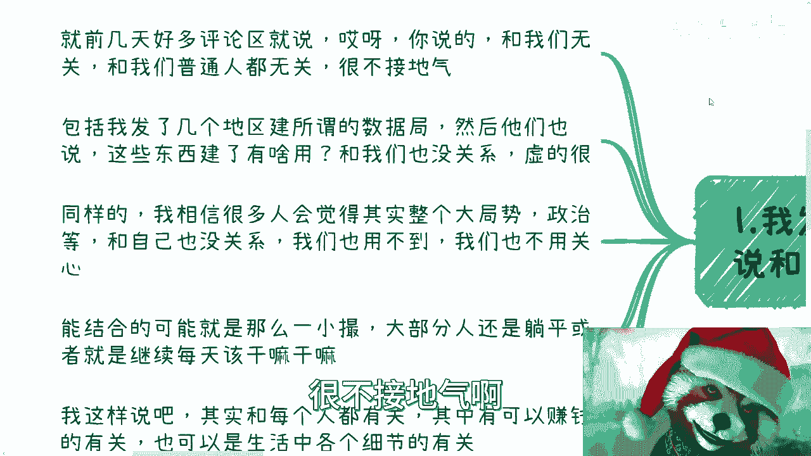
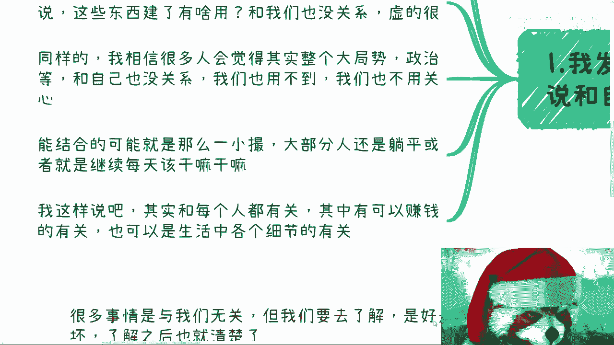

# 什么都与你无关，你还赚啥钱 - P1 - 赏味不足 - BV12C4y1P7Zy

嗨大家好啊，哎呀昨天我本来想昨天回来给大家录一下，我昨天在广州晚上嗨的太晚了，回来都已经快12点了，我想想算了，嗯嗯我们这次讲的主题呢是这个东西叫什么，都跟你无关，你还赚什么钱啊，呃何出此言呢。

首先是这样子的，就是我发现吧，就是说啥呢，很多人都说跟自己无关，而且他不但说跟自己无关的，他说这个说完之后，他还要去去贬低啊。

去批评，就是嗯来看啊，就前几天呢我看了一下一些评论区啊，他说什么呢，他说啊吕老师你讲的很多东西呢跟我们无关啊，他和我们普通人无关啊，很不接地气啊。

这是第一点，第二点呢他说发现呢，我前两天也发了几个地区啊，去建立了所谓的数据局，教育数据交易啊，然后呢他们也说啊，这些东西见了没吊用啊，和我们也没什么关系啊，虚得很好，同样的啊，我相信很多人呢会觉得啊。

包括整个呃这个地方政治啊，国家大局等等，跟自己没有关系，我们也用不到啊，我们也不用关心啊，那么同样的呢，包括就是说呃他们觉得呢很多东西能结合呢。

就是那么一小撮大部分人呢还是躺平，或者说继续每天回家该干嘛干嘛啊。

我就这么说啊，首先你觉得有没有关系，它并不重要啊，重要的是本质上整个的大局，整个的一个经济发展方向，怎么会没有关系呢，你想想看啊，交税也好，五险一金也好，医疗也好，你等你。

你跟各个这种细节当中跟大家都有关系，只不过其实没有太大感知，你说怎么会没有关系对吧，首先这第一点，第二点就是说如果你从赚钱角度来讲，就像我们说的，我们得认清局势对吧，什么叫局势，就是存量市场。

我们不用去搞了，搞不动的我们就得去搞增量市场，对不对，那增量市场大家又要问了，那我们从哪里去搞呢，方向在什么地方呢，路在什么地方呢，那不得关心吗，你不关心你赚什么钱，对吧。

好啊，那么我们往下看啊，首先啊按照这些人的说法，那么我说什么东西跟南阳有关呢。

我也思考了一下，反问一下自己啊，然后呢我就在想啊，要么就是说啊跟你们说一起来做啊，我跟你们讲跟着我做啊，交钱每个人交个5万10万，交个100万对吧，那100万也没有啊。

然后呢你们每个月稳定赚多少钱啊对吧，觉得大家觉得这个东西我讲了，是不是跟大家有关是吧啊，那首先这第一个第二个还是我说好好考研，好好出国啊，好好怎么样，各种各样的有关啊，还是说每天每个月对吧。

就是多赚几百几千块钱有关啊，还是说要么就是我跟大家说个业务啊，就是我们以前也有的什么做一单中介费，拿个几千万也有的啊，什么马上马上暴富啊，我跟你讲啊，这些东西无论是鸡汤还是镰刀。

网络上现实中遍地都是这东西，需要我来讲吗，不需要对吧，而且还说和大众有关的东西真的有吗对吧，你想想看这些东西就是我们刚刚说的，有的没的真的有吗是吧，我觉得呢其实大部分人心里是有数的。

但是呢就不要自欺欺人，没有什么必要对吧，事实证明老百姓能切的呢，能做的呢只有那些增量市场，为什么大家说混乱当中才有机会，为什么大家说发展当中才有机会，这就是因为的确有机会啊，对吧啊。

你要是大家都抱有一种想法，就说啊这个老百姓没什么好切的，那不要做了，但大家永远都不要做了，那照这个说法，所有的这个上下上下，中央到地方政府上下，所有的地方，所有的人他都是关系户，都是那个官家出身。

会不啦不会的呀，对不对，你整个上下游去了解一下，了解一下就知道了，真正做的，哎呀回头我来给你们再再出出一个内容啊，叫什么呢，因为这两天我在B站上面其实看到啊，有有一些视频上面写的。

当你这个发现世界原来是个草台班子是吧啊，我虽然不能不敢说这个一定是个草台班子，但是呢我跟你讲大差不差的啊，不要觉得怎么样怎么样啊，我跟你讲啊，你能做就是增量市场，那就想办法去搞，没有了对吧。

你要不愿意相信增量市场跟自己有关的，而要去相信玄学啊，那或者来说相信存量市场自己能分到一杯羹，那我也没什么好说的，是吧啊，这个是第二点，我们来看第三点，第三点，嗯等一下啊。

第三点我们就拿前两天我发那个数据集来讲啊，你看啊数据交易也好，数据集也好，或者别的东西也好，很多人呢一开始就是一顿批评，一顿数落啊，说这个没用啊，那个没用啊，说这个什么什么什么什么软件。

或者什么大数据或者什么东西都没发展起来，寒冬什么数据局吧，他妈的蓝并卵啊，哎呀我就这么讲啊，有没有用，我能不知道吗，啊啊你说什么东西发展不起来，我能不知道吗，对吧，真是的，我跟你讲，你该关心的不关心。

不该关心的乱关心，为什么你任何一个地方你成立一个东西，你首先第一步不是去批评他啊，不是去在那边抱怨，就说哎这个东西这个没有用，那个没有用，有你抱怨有用吗，没有用啊，你知道成立一个东西。

优先级最高的是先去马上去看当地政策，然后看一下里面怎么写的，寻求一下跟自己的行业有什么关系对吧，你想尽办法往上去靠，就是你实际一点就是你得去想你怎么赚钱，你不是在那边说啊，这个东西有用，这东西没用对吧。

你逞一时口舌之快没有用的呀对吧，你任何东西我告诉你们看似是一个点，它其实影响的是个面对吧，你说你今天不管是数据局也好，数据交易也好，怎么样也好，你看似是数据这个东西，但是他上下游都要有关吧。

他上下游未来都要发展吧，他上下游都要有产业，都要有交易吧，都要有这个合作吧，对吧好，哪怕我们不能抓住那个核心的点，我们抓住面上的一丝一毫，那不也行吗对吧，瘦死的骆驼比马大，不就这个道理吗。

你不要上来就去否定他们，否定他们没有用啊对吧，就像我说的中国中国聪明人这么多啊，你说的东西他能不知道吗，还是那句话啊，当下也许什么都没有对吧，比如说你去查了，你会发现哦，可能也是就像你们说的虚的对吧。

或者怎么样子，但当你没有更好的方向和目标的时候，明面上有一些东西，尤其是政策相关的出来，你就跟着你能跟多久算多久，你能寻找到对应的相关目标，就寻找到对应的相关目标，你能在这当中能沟通就沟通对吧。

你在这当中所积累到的关系，所积累的一些人，无论怎么说，都比你每天在那边过家家来的好吧对吧。

所以说啊我们一直都说你做业务赚钱之前，什么意思呢，就是你最优先就是要去做的了解全貌，这也是印证了那句话叫什么。

就是大家赚不到认知外的钱，但是问题是认知不是固定的，认知是我们可以去提升的对吧，你又不是说哦，我现在比如说十岁，我就十岁的认知，那我这辈子都赚不到十岁以外的钱，可能吗啦对吧，就很多事情你看似与我们无关。

但是你要去了解你，了解完了你再去判断好和不好，就是好和不好，也都是面上面好和不好，下面都能赚钱对吧，有意义，不然没有意义的呀，啊无论而且另外一方面就是说，无论你想提升你赚钱效率也好。

还是说去提升你的认知也好，眼界也好，上下脉络也好，框架也好，也是最先要去了解整个的这个全貌的对吧，你不了解你怎么弄啊，你没法弄的，对吧，然后另外一方面就是说你了解清楚。

或者说你大概了解一个那个概论之后对吧，我们才能知道我们在全局当中是个什么，是个什么位置啊，我们才能知道哪些是我们可以做的，哪些是我们根本做不了的对吧。

就是所有的东西，不是我们每天在那边用一句话就说哎。

我们是普通人，我们做不了，我们是老百姓，我们做不了啊，我这个东西跟我们没关系啊，这个东西就是个虚的，你们想想看有用吗，没有用啊，啊如果来说按照大就是这些人的这些理论啊，这些说法，那不要做了。

所有东西都不要做，所有东西做的都是假的，所有东西做的都是没有用的，但这个是你我要关心的事情吗，不是啊对吧，我们要关心的就是融入其中啊，能是否能抓住其中一二，已经完全就够了，对不对啊，行啊。

这个待会下午就办活动好吧，哎呀很是期待啊行啊，那先这样吧，大家反正有什么问题，整理好自己的这个相关的question list。

好吧。