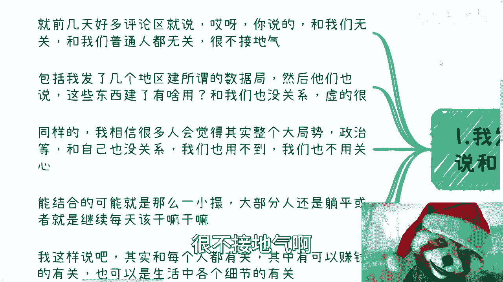
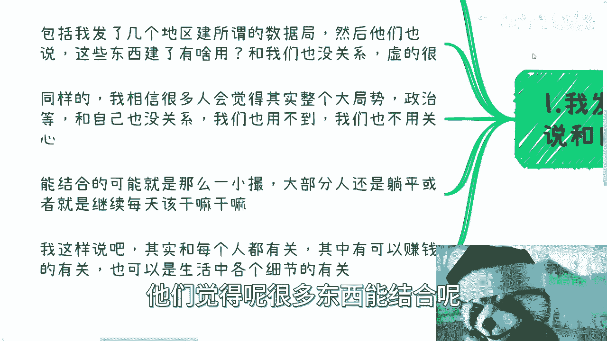
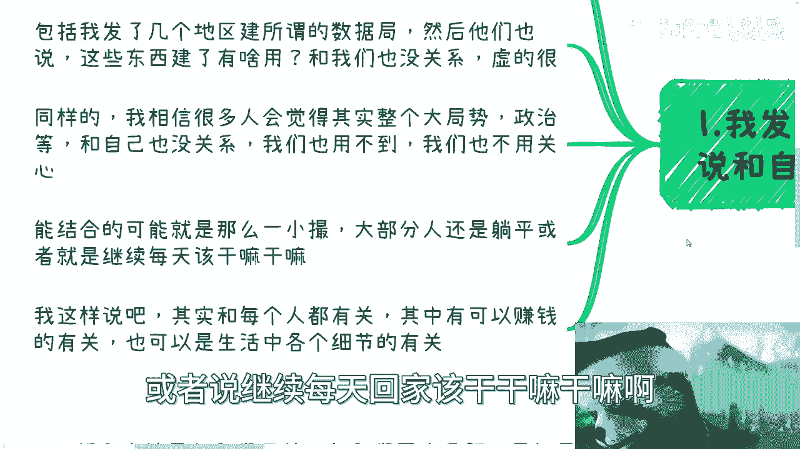
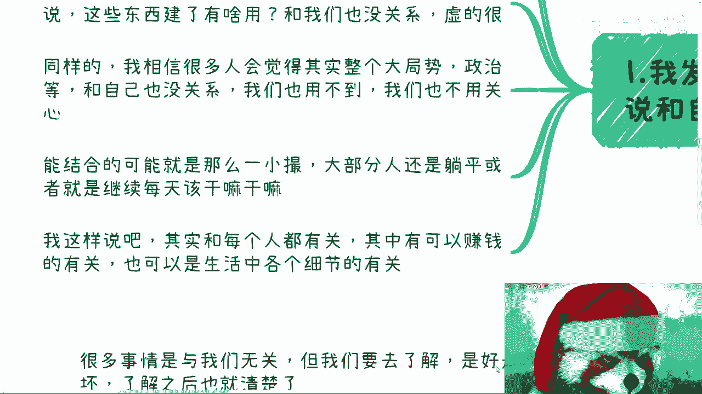
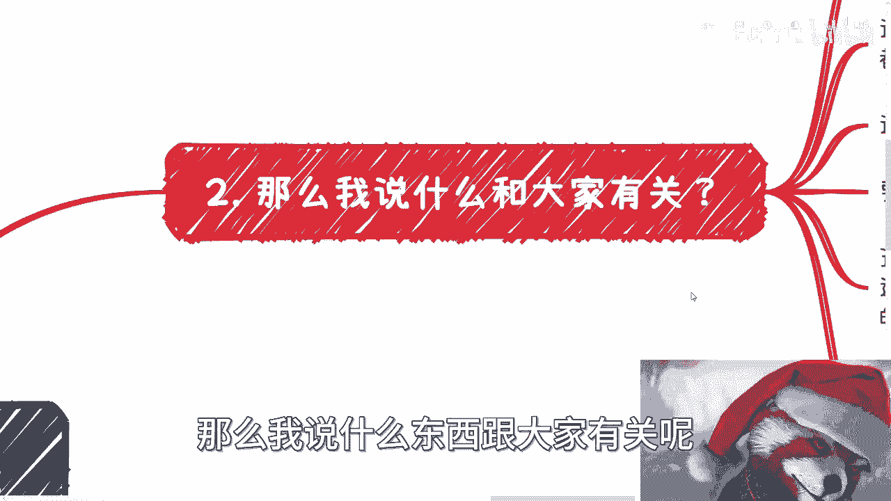
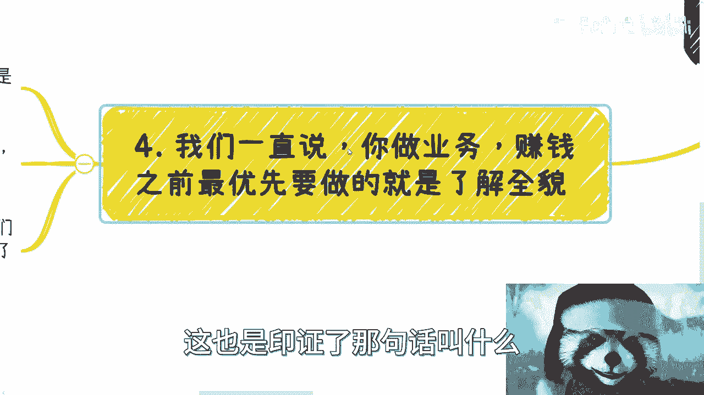
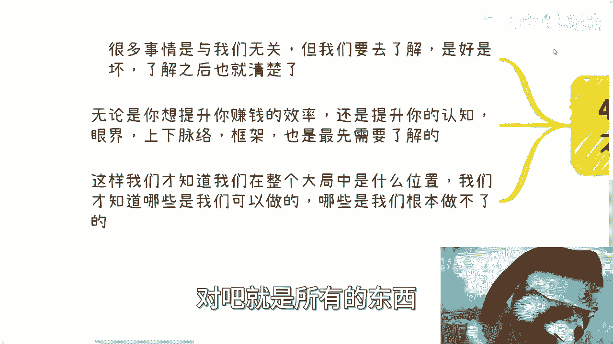

# 课程01：什么都与你无关，你还赚啥钱 💰


在本节课中，我们将探讨一个常见的思维误区：认为宏观趋势、政策变化与自己无关。我们将分析这种心态如何阻碍个人发展，并学习如何通过关注“增量市场”和提升认知来发现并抓住赚钱机会。


---



## 引言：一个普遍的思维误区

我发现很多人习惯性地认为许多事情与自己无关。他们不仅认为无关，还会在此基础上进行贬低和批评。



例如，近期一些评论指出，我讲的内容与普通人无关、不接地气。也有人看到某些地区成立数据局、推动教育数据交易时，认为这些举措虚而无用，与自身无关。



同样，我相信很多人觉得国家大局、政治动态等也与自己无关，无需关心。他们认为能从中获益的只是极少数人，大部分人只能选择躺平，维持日常生活。

## 第一节：为何“与你无关”的想法是错误的？🤔

上一节我们提到了这种普遍的疏离感。本节中我们来看看，这种想法为何在本质上是错误的。





首先，你认为有没有关系并不重要。重要的是，整个经济发展的大局怎么可能与你无关？税收、五险一金、医疗等社会系统的细节，都与每个人息息相关，只是感知不明显。

其次，从赚钱的角度看，我们必须认清局势。**局势就是存量市场与增量市场的区别**。公式可以简单表示为：
**机会总量 = 存量市场 + 增量市场**

存量市场已经饱和，难以突破。因此，我们必须寻找增量市场。那么，增量市场在哪里？方向何在？如果不关心宏观趋势和政策导向，如何能找到这些机会？不关心，又凭什么赚钱呢？

## 第二节：什么才是“与你有关”的机会？🎯

上一节我们分析了关注大局的必要性。本节中我们来探讨，究竟什么才是普通人真正该关注的“有关”机会。

按照那些批评者的逻辑，我也反问自己：究竟说什么才与大家有关？
以下是几种常见的、看似“有关”的建议：
1.  鼓吹“跟着我做，交钱就能稳定赚钱”的承诺。
2.  鼓励“好好考研、出国”等个人提升路径。
3.  分享“每月多赚几百几千”的小技巧。
4.  描绘“做一单中介费拿几千万”的暴富神话。

无论是心灵鸡汤还是收割韭菜的镰刀，这类内容在现实中遍地都是，无需我来重复。这些真的是大众需要的、有价值的内容吗？大部分人心里其实有数，不必自欺欺人。

事实证明，普通人能切入、能参与的，正是那些新兴的增量市场。这就是为什么说“混乱中才有机会”、“发展中才有机会”。如果所有人都认为“老百姓切不到机会”，那就真的什么都不要做了。但现实并非如此，整个社会的上下游产业链中，存在着大量非“关系户”出身的成功者。

## 第三节：以“数据局”为例，学习如何抓住机会 📈

上一节我们区分了真假机会。本节我们以一个具体案例——新成立的“数据局”为例，看看如何正确看待并抓住新趋势。

很多人看到“数据交易”、“数据局”等新事物，第一反应是批评和数落，认为其无用、是寒冬、是“然并卵”。

然而，这种抱怨毫无意义。任何一个新机构或新政策的设立，优先级最高的行动不应该是批评，而应该是：
1.  **立即研究当地相关政策**。
2.  **分析其内容，寻求与自身行业的关联点**。
3.  **想尽办法向上靠拢，思考如何借此赚钱**。

你需要关注的是实际利益，而非逞口舌之快。任何新政策看似是一个“点”，但其影响的是一个“面”。以数据局为例，它涉及的上下游产业链、配套产业、交易与合作机会都会随之发展。即使我们抓不住核心，能抓住这个“面”上的一丝一毫也足够了，正所谓“瘦死的骆驼比马大”。

不要上来就否定。当下这个新事物可能确实不成熟，看起来有点“虚”。但在你没有更好方向的时候，明面上出现的、尤其是政策支持的新动向，就值得你去跟随。能跟多久就跟多久，能在其中找到关联点就去找，能积累人脉就去积累。这远比每天停留在空谈和抱怨中更有价值。

## 第四节：提升认知，了解全貌 🧠

上一节我们学习了分析具体案例的方法。本节我们来总结其背后的核心逻辑：提升认知，了解全局。


我们常说，赚钱的前提是了解业务的全貌。这也印证了那句话：**你赚不到认知以外的钱**。但关键点在于，认知不是固定的，认知是可以提升的。



代码可以象征性地表示这个过程：
```python
if 认知提升():
    可赚钱的范围 = 扩大(原有范围)
else:
    可赚钱的范围 = 保持(原有范围)
```

很多事情看似与你无关，但你需要先去了解，了解之后再去判断好坏。而且，无论是好是坏，在“面”上都可能存在赚钱的机会。

另一方面，无论你想提升赚钱效率，还是想提升认知、眼界、对行业上下脉络的理解，最先要做的就是了解全局。不了解，就无从下手。只有了解概况后，我们才能知道自己在全局中处于什么位置，才能分辨哪些是我们可以做的，哪些是我们做不了的。

## 总结与行动指南 🚀




本节课我们一起学习了如何打破“与我无关”的思维定式。

核心要点总结如下：
1.  **拒绝疏离感**：宏观趋势与社会发展与你息息相关，是机会的来源。
2.  **瞄准增量市场**：在饱和的存量市场外，寻找新兴的增长点。
3.  **停止无效批评**：对新政策、新趋势，首先分析其与自身的关联和机会，而非抱怨。
4.  **提升认知**：主动了解全局，扩大认知范围，才能发现认知以外的机会。

如果总是用“我是普通人，做不了”、“这跟我没关系”、“这东西太虚”来否定一切，那结果就是什么都做不成。我们要关心的不是事物本身完美与否，而是如何融入其中，并抓住其中一二。这完全足够了。


请大家整理好自己的问题清单，思考如何将上述方法应用到你的实际观察中。