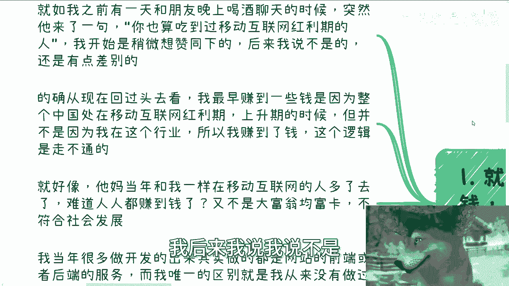
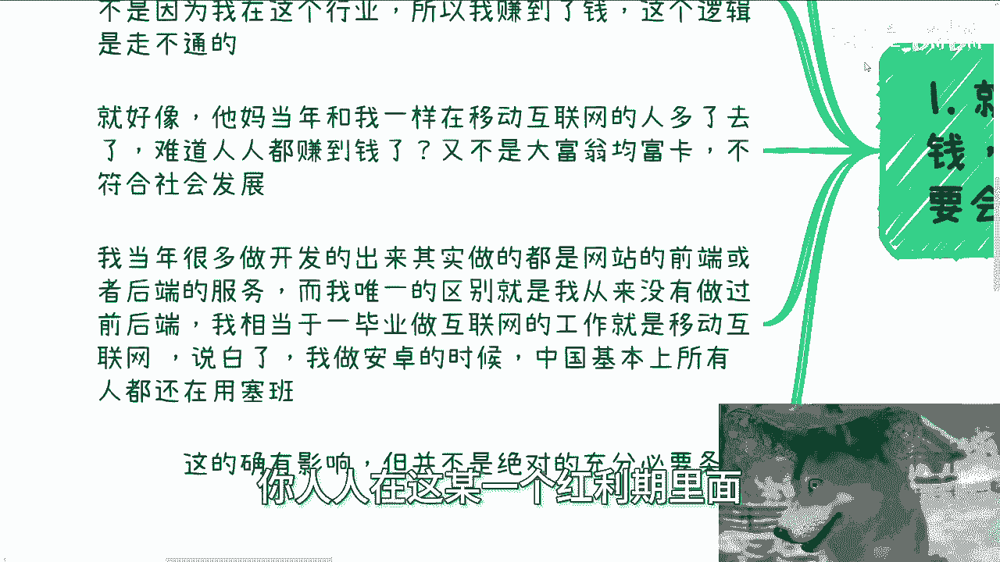
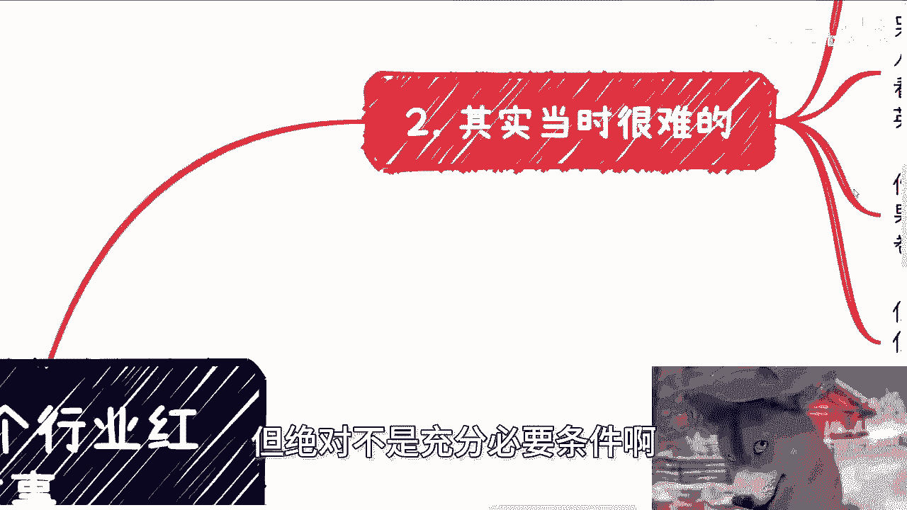

# 今天我们来聊聊行业红利期的故事 - P1 - 赏味不足 - BV1G64GeEEnz

嗯啊大家好，今天呢我们来聊一下啊，关于这个行业红利期的故事啊。

嗯也正好想起来这么个故事啊。

跟大家说一下，那就如我们之前说的啊，你说你要赚钱并不是因为你在红利期啊，而是说你要会利用红利期，这就像我跟很多人说的，就是什么呢，就是说你跟我说，你有什么东西没有用对吧，我一直举的那个例子是什么。

就是你今天头上挂着MIT的学历，你今天头上挂着清华北大的学历，so你站在路口前会掉下来吗，不会对不对好，那我们还是那句话啊，钱之所以会到你口袋里，一定是因为对方愿意掏这个钱，而对方愿意掏这个钱。

你们自己想象一下，对方愿意掏这个钱，会因为你们学历吗。

啊这个逻辑在社会上永远是走不通的啊，永远是走不通的好。

那么就如我之前说的啊，有一天我跟朋友呢晚上喝酒时聊天，但这大概前前年的事情了吧，突然呢他来了一句，他说他意思跟我说，他说你也算吃过这个移动互联网红利期的人，我开始呢我想了想，好像是有那么点道理的。

我后来我说我说不是。

我说这个事情呢跟你说的还是有点差别的，我说的确现在回过头去看啊，我说我最早赚到一些钱呢，是因为中国处在移动互联网的红利啊，上升期，但并不是因为我在这个行业里面，所以我赚了钱，这两者是没有因果关系的。

这逻辑是走不通的啊，这就好像这就好像我们我们一直说，你你说我们来讲这个问题，就摆事实，讲道理嘛，这就好像TMD当年跟我一样，在移动互联网的人多了去了，对不对，那难道人人都赚到钱了。

又不是他妈的大富翁均富卡对吧，你人人在这个某一个红利期里面都赚到钱。

这不符合社会发展，对不对，我就这么说啊，我当年很多做开发的这个出来的这个毕业生啊，其实一开始他们刚毕业做的是什么，是网站的前端啊，或者说是后端的服务，但是我跟他们不一样哦，我跟他们唯一的区别就是。

我从来都没有做过前后端，就是很多人啊，就以前认识我的人啊，就会觉得就说啊跟陈老师做过，可能以前做过开发对吧，做过一些网站或者服务端的东西，我一我是一秒钟都没碰过，就是我相当于是什么呢。

是一毕业就做移动互联网的这个工作啊，那么说白了我一毕业其实做的就是安卓，就是当然啊之前可能还有失业的时间，因为我我失业大概有半年嘛，然后做那种高空的维修也做了大概两三个月嘛，就是就这些事情都不算啊。

就我正式的第一份工作，我就说做安卓，就在我做安卓那个时候，中国基本上我可以说所有人都在用塞班，就就都没有听到过安卓这个东西，你们知道吗，就是你们现在去查查google安卓的版本，我这么跟你们讲。

我做安卓的时候，google版本就是1。0，就是1。0啊，就是你问我这有没有影响。

这的确有影响，但绝对不是充分必要条件啊。

第二当时的确很难难，主要是两个地方，一方面是我自己其实顶着巨大的舆论压力，为什么，因为我我我其实也跟你们说嘛，我当时在那个上海的那个紫竹嘛，紫竹就在闵行闵行呃，紫竹在哪里呢，就是上海交大的那个对面啊。

然后呢一方面是交大的学生，另外一方面呢就是我们那个产业园里面嘛，都是微软啊，IBM嘛这种公司啊，就当初身边的所有的高材生，基本上都在跟我说，塞班是未来的发展，塞班以后就是那个前景很好对吧。

然后就说我这种做安卓的对吧，就垃圾对吧，发展不起来的，他说你你这样以后工作都找不到的对吧，那说的其实就很没前途，那另外一方面呢，我做的也的确难，为什么呢，因为一方面我身边没有任何人可以交流。

就除了我以外没有人做这玩意儿，因为都没人听说过这玩意儿，那另外一方面呢，网络上也的确没有任何的材料可以查，唯一可以看的就是google的document，就是google的这个文档，但是我英文非常差。

我我我当时基本上就看不懂，我根本就不知道他妈的文档都讲什么玩意，所以你说红利吧，我觉得有一点可能是就是怎么说呢，是就不是我主动的，可能是有一定的这种天意对吧，就是我如果真的以我的能力啊。

我如果真的去做了前端，后端，我基本上就废了对吧，因为我如果当时去做了前端或者后端，就等于要跟无数的人去卷去竞争，而且还还嗯就是在所在的这个行业呢，还不是一个所谓上升趋势的一个行业对吧，但反过来说。

你说我做安卓，虽然啊你说竞争没有这么激烈对吧，或者几乎没有人竞争，就就你就跟我前两年做数字经济是一样的嘛，但是你谁能保证未来的发展是好还是不好呢，对不对，而且以我当年刚毕业的时候，我也没有判断能力。

是不是，所以你说哦我能够去做一个判断，或者我看清楚什么东西是不可能的啊，但是就像我们今天主题上面写的，你说行业红利，我在这个行业里面吗，在算红利吗，算但是问题在于你能不能把握对吧好，那么这就是第三点。

就关于赚钱啊，一样的道理啊，我在行业里面各种打工，你说是不是竞争压力比我做点别的小呢，那肯定是小的，没毛病的啊，但是你说工资高不高嘛，那真不可能为什么，因为那个时候你想想看啊。

整个全国甚至全球都还在用塞班，那个时候做安卓的基本上都是创业公司，那说白了做创业公司都是做今天没有明天的，本质上都不愿意投入太多经费，他怎么可能给我这么一个垃圾比较高的工资呢，对不对啊，我这么跟你们讲。

我2011年的时候转正，我转正之后额应该是1800，1800一个月，你想想看1800一个月一年才多少钱，对不对，到211年一年也其实也不晚啦，哦也不早啦，11年大把大把比我高的人啊对吧。

我当初能赚点小钱，主要是因为几个方面，一方面是我的确做的早，所以说我在12112到14年的时候，我做过C端的生意啊，就是我做过就是散户的培训呃，尤其是安卓的IOS的技术培训，我做过的哦。

直播我做的不是录播，就不是你们现在看的那种什么麦克什么的，我就是直播，就现就是类似于像我用那个腾讯会议，就直播这样子，然后就是呃上课就有点像家教这种感觉啊，第二方面就是大家都知道我的老业务嘛。

就是政企咨询嘛对吧，政府企业咨询嘛，不夸张的说啊，我可以这么说啊，你们所有知道的企业，在早年移动互联网的时候里面，我不是说公司啊，就他们公司里面所有就是部分的团队，基本上都是我培训的。

因为整个国内在当年能找到我这样的人太少了，不不太现实，因为一样的道理，我就这么跟你们讲啊，1314你们自己去查，1314是移动互联网爆发的时候，但是整个1314很多人刚做完，像我这种他妈1314时候。

已经做了3年四年的人，你找不到呢，整个中国都很难找的对吧，所以说当年的培训政企咨询为什么我能做，就是因为这个原因对吧，你三大运营商，滴滴高德ba at招招行，建行上行，农行对吧，各种各样的。

你们只要知道的我都培训过对吧，你单纯这两个东西其实从我当年来讲，已经带来比较大的收益了，基本上抵得上我好几年的工作了对吧，这也是为什么我在2014年，我能在新天地这边买房了，也就是我现在住的这个房子。

你否则我我他妈住哪啊对吧，我这么说啊，14年那个时候就是一个转折点，就是如果我不买，我后面就再也买不起了啊，你想现在我现在就我现在住这房子，跌完差不多也还有大概970万左右，我怎么买怎么买对吧。

这不是我工作不工工不工作问题，这不是我赚不赚钱的问题，这超出我赚钱的能力范围的对吧，第四啊，所以我当时跟我朋友这么说，我说不是因为我在行业红利期，是因为我在红利期的时候在外面折腾。

我说当年跟我一起在红利期的人多了去了，赚到钱了吗，没有啊，你说他比别的行业赚的多吗，我信的对吧，但是你说他赚到钱，这个这怎么说呢，这个级别上面我不信的，没有啊对吧，我说我在外面折腾啊。

我同时工作培训咨询三条线并行啊，那才有了所谓的一部分的积累，否则呢屁都没有啊对吧，你别说屁都没有了，我他妈现在住的地方都没有对吧，你们去查看上海新天地什么地方，我当年要是不买，我可能就他妈我要真要买。

我得买在外环对吧啊，我说啊，我说否则我要是就是我不折腾，否则我现在跟你喝酒，我只能跟你这么说，我说当年我多么，我在一个行业上升期的时候，我根本就不知道怎么赚钱，怎么把握对吧。

我只能我我说我只能无尽的跟你后悔，我只能无尽的跟你说，我当年为什么不做这个，为什么不做那个有什么用呢，对不对，有什么用呢，但是同样的我做这些东西的时候，你问我懂吗，我他妈懂个屁呀，啊，我说句不好听的。

我两年内对吧，就一年往后两年内几乎飞了，中国所有的地方也是我说的，为什么我一早就很了解中国一线到五线城市，因为他妈的所有的线下咨询，所有的地方我都跑了一遍了，所有征企咨询都是线下的啊，我跟企业的打交道。

我跟政府打交道，怎么打下基础的，就是那个时候打下基础的，这样说吧，在我的理念印象当中，除了新疆别的地方，我跟你讲，东南西北到边到尽头的，我都去了对吧，那黑龙江长春呃，那个叫什么成都武汉对吧。

所有的我现在办过活动的西安对吧，然后那个哈尔滨，然后上呃哦对，还有那个海峡两岸对吧，就台湾香港啥地方，所有地方都跑过啦对吧，你你当年只要互联网，移动互联网产业要发展的地方我都去过啦。

我基本上双休日都在飞啊啊，因为他都要线下的，所以说你你说我懂什么吗，我我对我说的不好听的，我对我手上掌握的技术我也不见得，我我很懂，同时我对这个所谓的咨询我也不懂，你你你说不好听点，当年当年珠海找我去。

珠海那边是呃格力，还有那个谁啊，苏宁嘛对吧，找我过去还还有哪边呢，然后卧槽我他妈到那边机飞机下来，凌晨三点，然后就那个我还有个网友找我撸串，从四点撸到6。8点，我就去上课了对吧，你就是这种事情比比皆是。

就是对我当年来讲，我是觉得你你你哪次咨询，把我卖到什么山沟沟吧，卖卖到缅甸去，我都不知道的，因为关键是我不懂啊对吧，你哪里像现在啊，我我考什么整个流程，整整个商业我很清楚，当时我清楚啥对吧。

所以你说我算在一个这个，这个所谓的红利期里面嘛算的，你说我算在一个有潜力的行业里面吗，也算的，但是我但凡不折腾，我只要当时在打工，我就这么跟你们算，你算我一个月2000块钱，一个月2万4呃，一年2万4。

我做3年10万块钱不到，请问我能干嘛，我能干嘛。

对不对，你问我在不在行业额红利期在啊，你问我赚到钱没有啊。

你你自己判断3年10万块钱不到，你问我算你，我就问你算不算，对不对，一样的道理啊，所以说所以说你们记住一点，就是我一直跟你们讲，中国每个时代都有红利期的，没有什么东西，没有红利期的都有的。

去年3月份到10月份，人工智能对吧，然后再往前乡村振兴对吧，再往前那个元宇宙什么数字藏品，再往前区块链对吧，然后到现在比如说数字经济，低空经济对吧，数字资产怎么没有啊，不问题是你得去折腾。

你不折腾这个红利息跟你有什么关系啊对吧，而且我也一直跟你们讲，现在这个发展啊，这个窗口周期越来越短，你不像我当年做移动互联网，我一做我至少能做个45年，现在呢四五个月我操就他妈的可能走完了。

我当年45年的这个周期，你想想看还能有多大机会，但是并不是并不代表没有机会，好吧，反正就是跟你们分享一下之前的这个路径吧，反正你们自己想想啊行啊，那就这么着吧，然后反正职业上面，商业上面啊，工作上面啊。

副业上面，你们觉得有有任何的这个详细的东西，或者未来规划，你们觉得需要找我沟通一下的，你们可以整理好对应的问题和个人背景。

