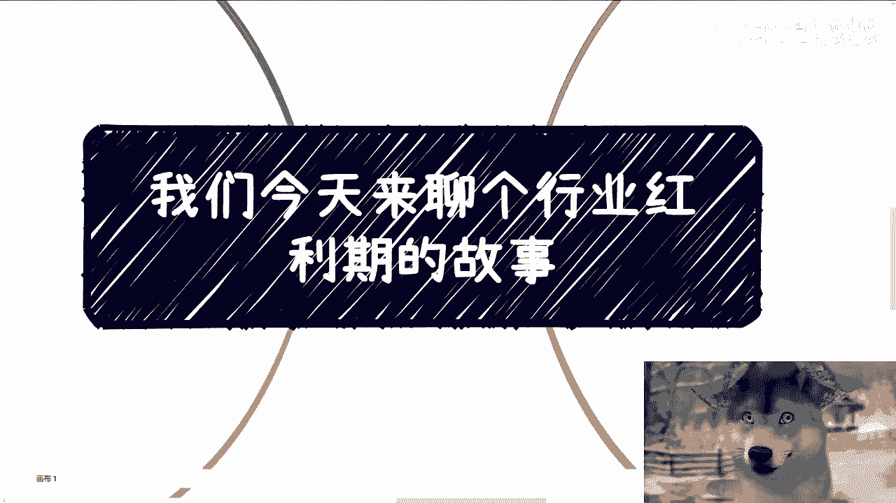
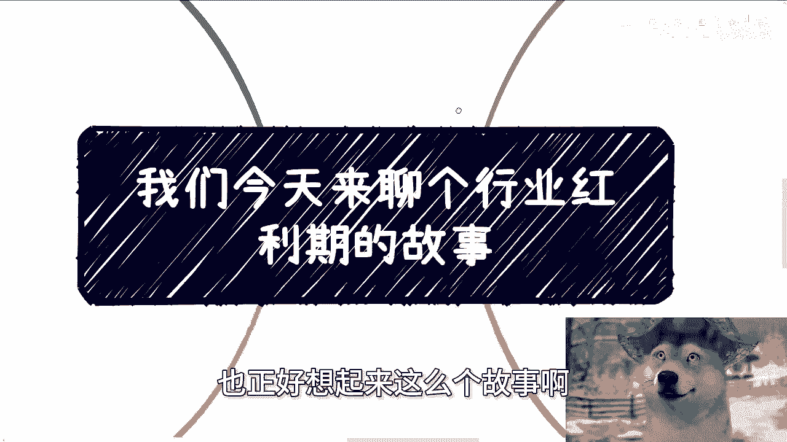
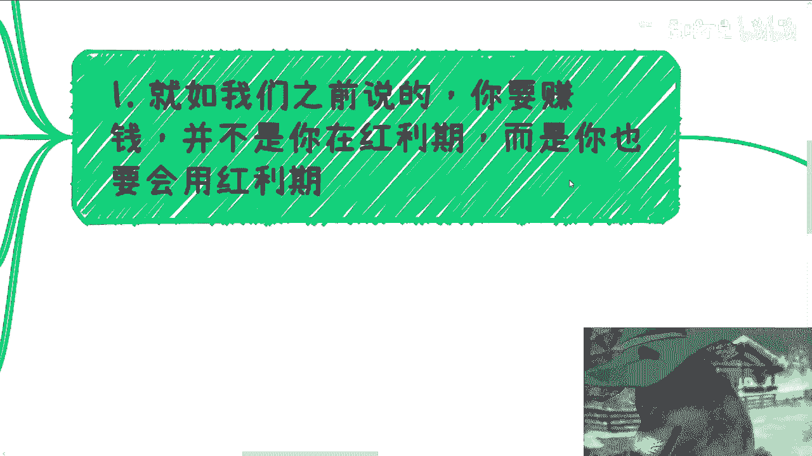
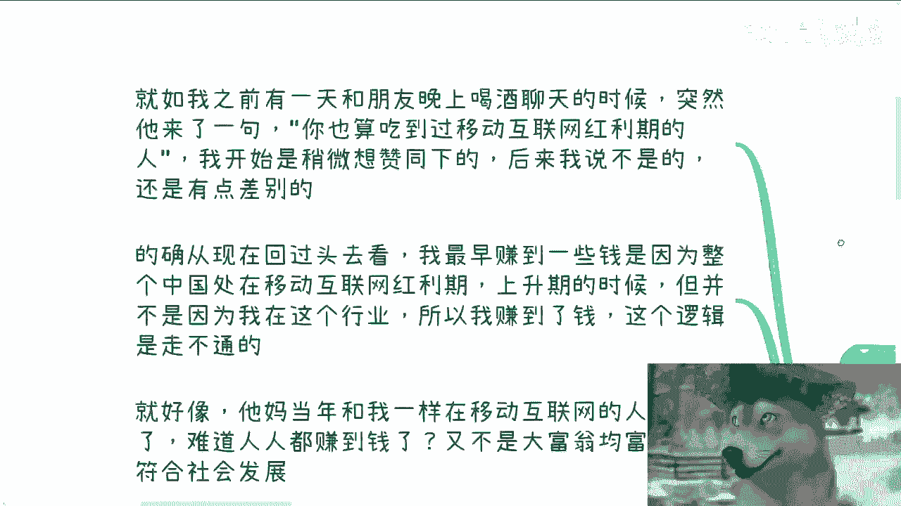
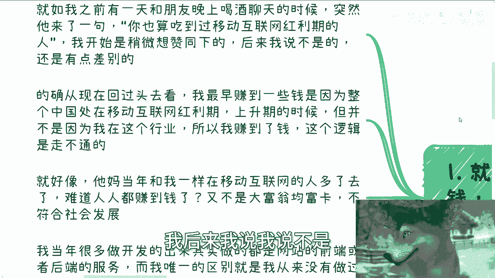
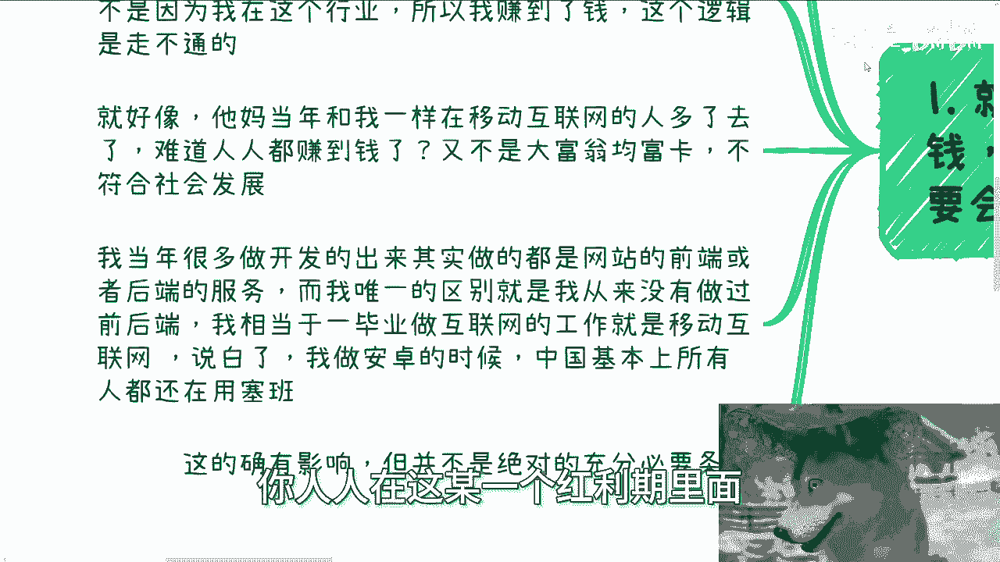
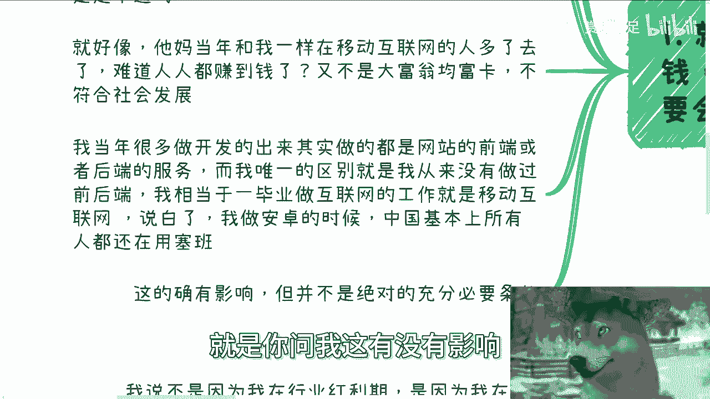
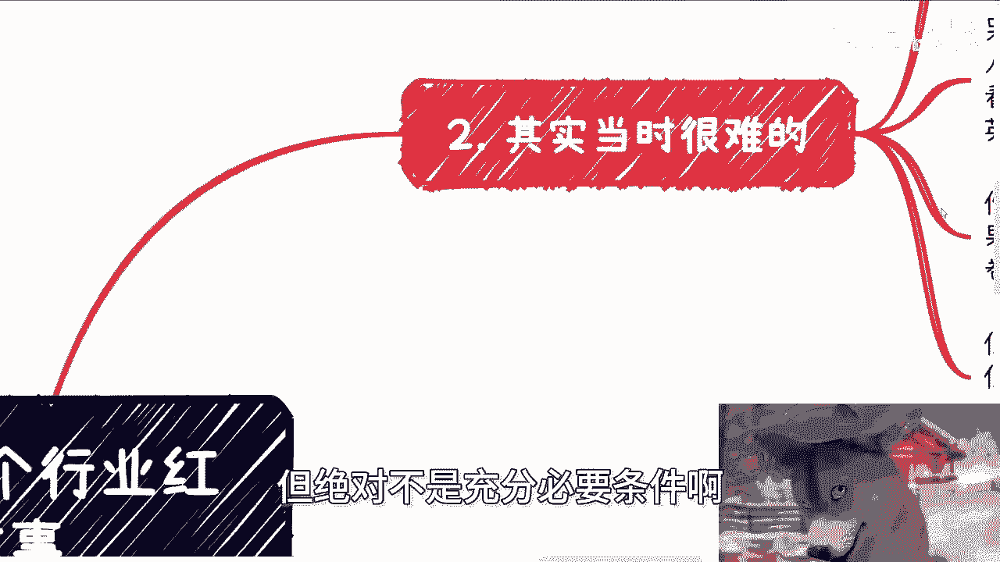
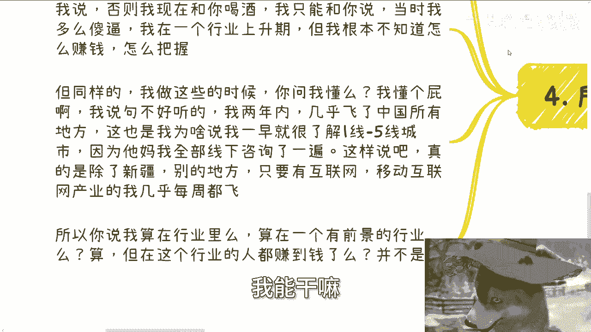
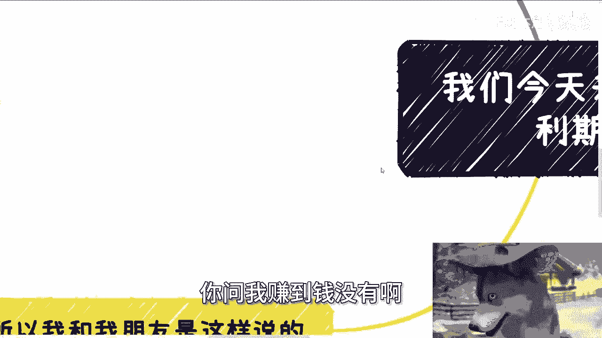

# 课程：理解行业红利期与个人机遇 - P1 🚀

在本节课中，我们将通过一个亲身经历的故事，探讨“行业红利期”的真正含义。我们将分析身处红利期与从中获利的区别，并总结出抓住机遇的关键行动原则。

---

## 概述：红利期不等于自动提款机 💡

我们常听说要抓住“行业红利期”，但关键在于理解：**身处红利期并不等同于能够赚钱**。赚钱的核心逻辑在于，对方愿意为你的价值付费。这与你所在的行业或你拥有的头衔（如高学历）没有直接的因果关系。

上一节我们概述了核心观点，本节中我们来看看一个具体的个人故事，它揭示了红利期表象下的真实运作逻辑。

---

## 个人经历：移动互联网的早期岁月 📱

我曾与朋友喝酒聊天，他提到我也算是吃过移动互联网红利期的人。我思考后认为，这个说法并不完全准确。

我最早赚到一些钱，是因为中国当时正处在移动互联网的上升红利期。但**“我身处这个行业”**和**“我因此赚到了钱”**这两者之间，并没有直接的因果关系。这个逻辑是走不通的。

当时与我一同进入移动互联网行业的人非常多，但并非人人都赚到了钱。这不符合社会发展的规律。

---

## 关键区别：选择与竞争的差异 ⚖️

我与其他毕业生的一个关键区别在于技术路径的选择。以下是当时的情况对比：

*   **多数人的选择**：毕业后从事网站前端或后端开发。
*   **我的选择**：一毕业就从事安卓开发，并且从未做过前后端工作。

我正式从事安卓开发时，中国的手机市场几乎被塞班系统垄断，安卓系统（当时版本为1.0）鲜为人知。这个选择有影响吗？的确有，但它绝不是成功的充分必要条件。

---

## 面临的挑战：压力与孤独 🧗

当时的选择带来了双重困难：

1.  **巨大的舆论压力**：身边来自顶尖高校和名企的精英都认为塞班才是未来，做安卓是“没有前途”的。
2.  **极度的实践孤独**：身边无人可以交流，网络上也没有中文资料可供学习，唯一能参考的是当时阅读起来非常困难的谷歌官方英文文档。

所以，如果说有“红利”，那可能更多是一种被动的、带有偶然性的“天意”。如果我当时去卷前端或后端，很可能就失败了。但反过来，选择安卓也无人能保证未来一定光明，以我当时的认知，并无能力做出精准判断。

那么问题来了：我在行业红利期里吗？在。这是红利吗？算。但核心在于：**你能不能把握住它？**

---

## 如何把握：在红利期内“折腾” 💼

关于赚钱，道理是相通的。仅在行业内打工，竞争压力或许较小，但工资不可能很高。2011年我转正后月薪是1800元。

我后来能积累一些财富，主要是因为我没有仅仅满足于打工。我同时并行做了以下几件事：

1.  **C端技术培训**：在2012到2014年，我面向个人开发者进行安卓/iOS技术的在线直播培训。
2.  **政企咨询与培训**：为各大企业、政府和金融机构提供移动互联网技术咨询和团队培训。在行业爆发初期，拥有三四年经验的人非常稀缺，这构成了我的独特优势。

正是这些“折腾”带来的收入，远超工资，使我在2014年有能力在上海购置房产，抓住了资产增值的窗口期。如果我只靠工资，三年总收入不到十万元，将一事无成。

---

## 核心总结：红利常有，关键在于行动 🎯

本节课中我们一起学习了如何辩证地看待行业红利期。

1.  **红利期一直存在**：中国每个时代都有新的红利（如人工智能、乡村振兴、数字经济等），问题在于你是否能识别并进入。
2.  **位置不等于收益**：仅仅身处红利行业，并不保证你能获得超额回报。关键在于你是否在行业内创造了独特的、可被付费的价值。
3.  **行动是唯一桥梁**：必须主动“折腾”，拓展收入渠道（如培训、咨询、副业），将行业趋势转化为个人机遇。现在的风口周期越来越短，行动的速度更为关键。
4.  **能力在过程中积累**：很多认知和能力（如我对中国各线城市和商业的理解）并非事先具备，而是在不断“折腾”和实践的过程中被动积累起来的。

**记住这个公式：个人收益 ≠ 身处红利行业。真正的公式是：个人收益 = 在红利行业中的独特价值 × 主动创造价值的行动。**

所以，不要问自己在不在红利期，要问自己为抓住这个红利，具体做了些什么。