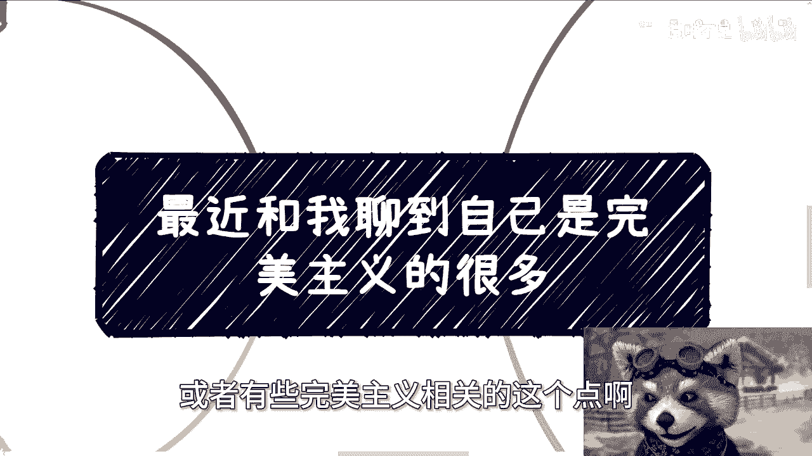
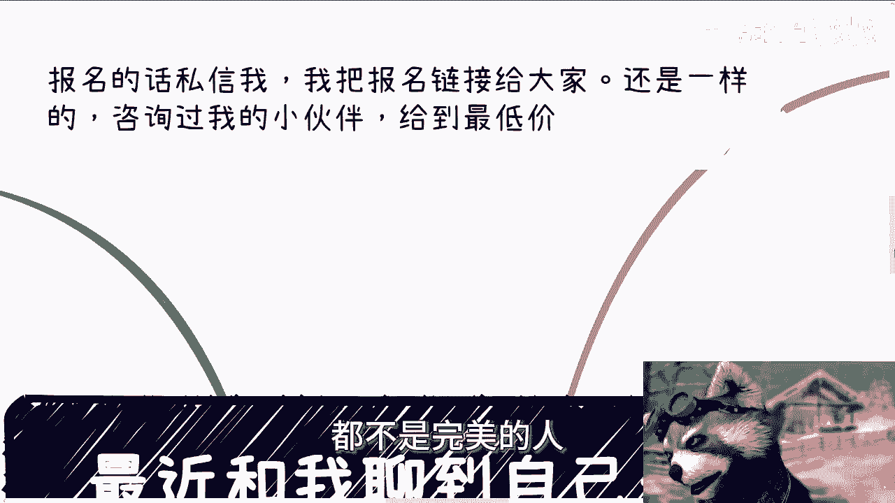
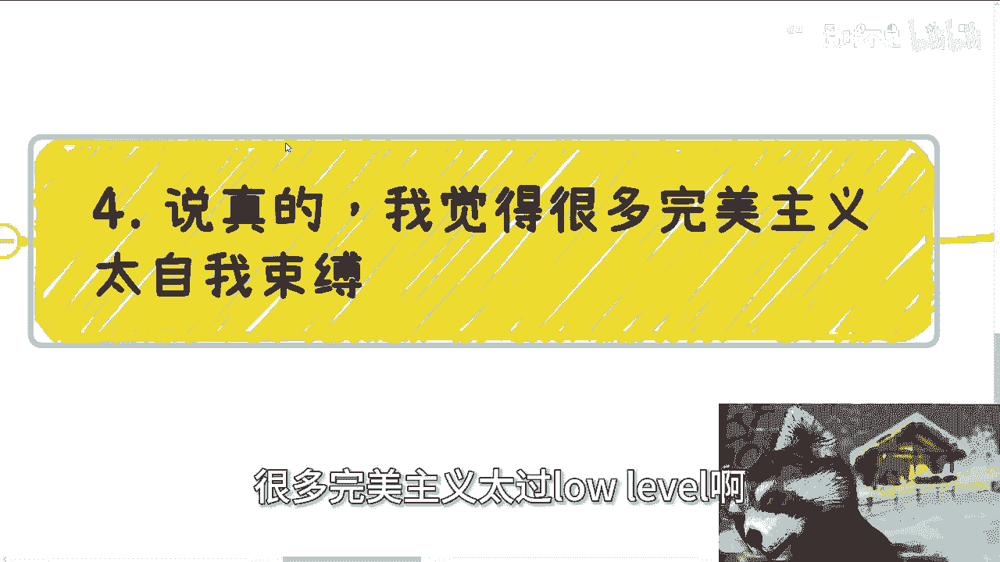
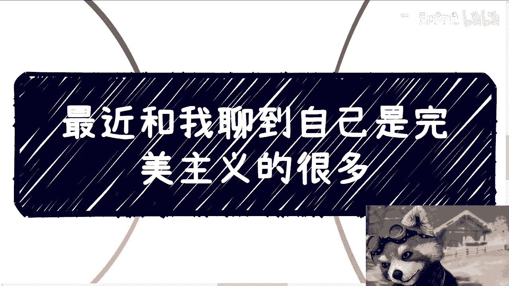
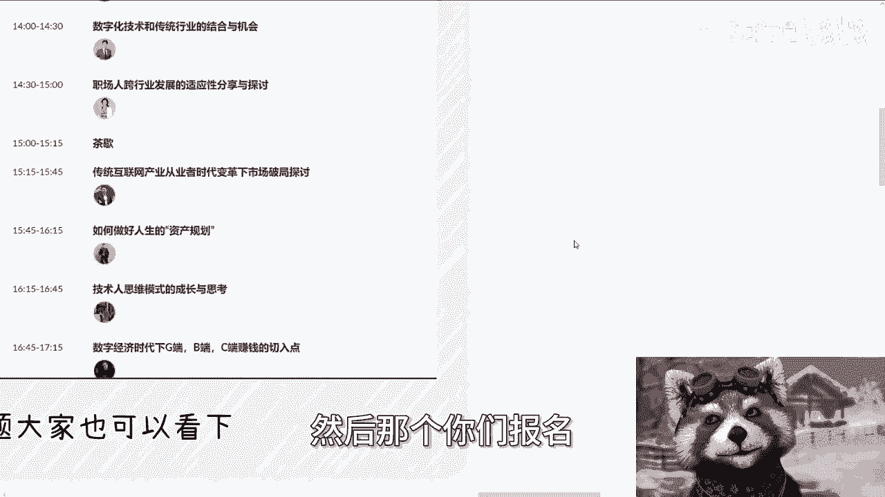

# 今天我们来说说完美主义 - P1 - 赏味不足 - BV1aw4m1e7QV

好大家好，呃今天啊我们来讲这个主题啊，就是啊完美主义，因为很多人最近聊的时候就也也提到，就说自己可能有些强迫症啊，或者有些完美主义相关的这个点啊。

呃首先我还是先说一下这个啊，就是深圳深圳的活动我已经定了好吧，30号在深圳南山区，然后这次跟之前有所不同呢，就我找了很多嘉宾啊，按照正式的这个数字经济的，这个大会的规模来做的，就大家也可以看到啊。

就是呃我找了123455个嘉宾对吧，加上我自己啊，呃然后这是一一个啊，然后第二个呢就是说主题这边呢，我也跟他们说了，就相对来讲会比较贴合于，可能大家比较关心的，包括比如说数字化转型啊，职场人的跨行业啊。

把传统行业产业这个变革下的这个探讨啊对吧，包括人生的这个资产规划对吧，包括技术人思维模式的这个成长，跟思考等等等啊，就这些我觉得可能对大家也会有更多，更多的一些帮助啊，呃然后同样的哎诶诶诶诶东西呢啊对。

同样的就是说报名的话私信我啊，然后我把我这次也不是单纯走我微信了啊，就是会我会把这个报名链接给大家，然后还是一样的好吧，咨询过我的小伙伴呢，我会我会给到底价好吧。

就给到底价就就这么找啊，好好吧，然后这个大家反正看吧啊。

然后我们今天来开始今天这个话题啊，就是首先啊我们以前讨论过这么一个故事啊。

就是今天假设啊，我们说我们有十个同胞，唉，其实就跟那个铁轨问题是一样的，就是我们今天有十个同胞在敌人的包围圈里面，我们想要去拯救这十个人对吧。

社会上就会出现很多二极管的思想啊，就比如说如果你不救啊，好啦，那么他们从道德制高点批判，你说你没人性啊，就死不救啊，你妈这个这个畜生啊，但如果你救了呢，那么问题又来了，就是你救这些人。

很有可能会牺牲更多的人，就比如说你救了十个人，很有可能牺牲20个人，那那那你怎么抉择呢，对对你说这20个人没有那十个人有价值吗，那你肯定不能这么说啊，那么如果你救了，你还是会被拖入别的道德问题当中。

只不过就不是你救不救这十个人的问题啊，那么你要这么想，我们每个人每时每刻其实都在面临这些问题，只不过啊他不是生死存亡的问题罢了啊，但是你仔细去思考一下，你把他们抽象一下或者怎么样子。

那那本质上都是说你想得到一些东西，但是你会失去一些东西对吧，所以说就是说我们得要明白，在你所有的面临的问题当中，我不管你是一个天才，还是一个就是呃平庸的人啊，不管是谁，你只要是一个人。

只要不是一个圣人对吧，这不是一个神仙，那么你就会出现缺陷对吧，你你所有做的选择其实都是不完不完美的选择，不存在完美的选择的啊，而且另外一方面我们得客观的去，就是就是认可一件事情，就是你们也好，我也好。

所有人也好，都不是完美的人，我们不可能也没有能力做出个完美的选择啊。

那么第二点啊。

我们可以从这个啊纵向跟横向啊，这两个角度来看啊，第一任何一件事情它不是一个点啊，也就是说我们做任何一件事情都会有长尾效应，也都会有个深深呃深远的影响，就比如说就算你能力很强。

你做出了一个当下你认为最完美的决定啊，或者说最完美的答卷，但其实也仅仅是在你的label的认知之下，认为是完美的，你就拿你选专业来讲，我们打个比方啊，如果从纵向角度而言，你看到了你喜欢的程度。

你你你感兴趣的这个方向呃，包括就业的这些这个点，你你可能都看到了，但是放到更大的纵向的层面上，你比如说从整个产业，和整个整个的行业动态来看，那可能你的选择就会有很大的缺陷，只不过你不知道哦。

或者说你可能有一部分缺陷，就没有你想的这么完美啊，那么同样的，如果来说我们把时间线拉长，也就是说你的选择可能在当下来讲，让你走得不错，或者说从当下的结果来看，你的选择是不错的。

但是也这个决决决定有可能只让你很不错了，半年或者很不错了，一年或者很不错了两三年啊，但是未来长远的时间走得好不好并不知道，那如果走的不好啊，你当你回溯当年的这个决定的时候，那就显得不那么完美。

当然啊我并不是要表达说我们要考虑这么多，因为那句话我觉得我是认可的，就是当下做的决定，一定是你当下最好的一个安排，这句话是没有错的啊，但是前提这句话没有错的前提是什么，就是你不要去纠结。

你不要在未来去后悔对吧，也不要在现在去完美主义，因为你一旦做一个决定时候，你一比如说未来去后悔了啊，然后或者说现在就完美主义了，那这个决定一定不是最好的安排啊，这这这这两者其实就是个悖论啊，那么第三啊。

完美主义往往带来两个很大的弊端，一个呢，就是它不停的停留在做事情的执行阶段啊，也许啊我们说这个事情会有一个结果，当然这个结果好和不好已经不重要了啊，但是执行阶段他会非常漫漫长，而且非常内内耗。

而且很容易闭门造车，而另外一个就是很容易自己打击自己，或者说自己去错误的判断一个事情带来的结果，从而让自己去绕弯路啊，你比如说啊，我见过很多创业者或者很多自己做业务的人啊，非常的神奇。

就是明明啊比如说一个事情要得到反馈，他只需要交付给对方，看对方的反馈，然后不停的根据对方的反馈去修正，就好像如果你今天没有个客户，那么你就做一件事情，让事实让现实来抽你，然后不停的修正就好了。

但是呢他不用啊，他非要自己在那边折腾，或者说去折腾团队啊，我见到过很多，就是那种就是说啊明明我们应该交付给甲方，不是的呃，这个员工交付给的是自己的领导，然后这个领导也不是甲方。

但是这个领导来给你挑出AABCDEFG，各种毛病，但是这些毛病根本不是甲方所care的，嗯你知道吗，就他妈很啊，然而呢就是不停的折腾团队，不停的折腾自己，然后无视真正的需求方的反馈啊。

最终很容易做白工对吧，那你说你你问他，他可以说我我我有自己的这个呃，叫什么这个这个原则，或者我有自己的这个完美完美主义的这个方式，但问题是你的原则跟完美主义有卵用啊，啊你又不是甲方诶，搞笑嘞，对不对。

你你折腾大家折腾你自己不是白折腾吗，你妈自我感动吗，是啊，还有一类呢，就是由于一些小小的失败或者挫折啊，就自我怀疑啊，就觉得卧槽他妈的自己啊要的这个结果啊，呃或者说当下这个结果跟自己规划当中。

和期望当中结果不一样啊，然后然后就深入深深的这个内耗当中啊，不过我说实话啊，就是如果你真的完美主义，或者你怎么说呢，就是说有这种强迫症啊，我是觉得除了自己呢很难走出来，他妈劝不动的。

因为我劝过很多人劝不动的啊。

然后第四啊，说真的啊，我觉得啊很多完美主义太过low level啊。

就太过低太过低级啊，太过自我束缚，就我觉得真正的完美主义并不是说一个事情，或者一个节点或者某一件事情，你做的或者你想的十全十美，而是你在你的人生当中不停的去试错，不停的去修正，不停的试错，不停的修正。

然后得到你的结果以及得到你想要的结果，我觉得这个过程加结果呃，这个是一个完美的，当然啊你单纯有结果，如果你为了这个结果花了太多的时间，或者说花了太多无用的时间，绕了太多的弯路，那就是不完美的。

当然我觉得就是说如果你能有结果，那当然是不错的，当然所以我这个地方打了个括号嘛，对完美主义者来讲，我觉得这个东西就是不完美的，那同时你做了很多正确的事情，却没有一个好的结果，那整个也是不完美的，对吧啊。

所以说就是说可能啊，我觉得有一些强迫症或者有些完美主义呃，肯定是有的啊，但是我觉得在你自己足够强大之前，或者在你足够，就是说呃就是能够让让让自己，在这个这个真实的这个人类社会，当中呃有一席之地之前。

我觉得其实就是一种自我束缚，闭门造车，然后阻碍自己前进的这么一个情绪啊。

因为嗯怎么说呢，就说我们以前做海报啊，做易拉宝啊，做很多东西啊，其实碰到过这种，就是就是你跟他讨论一个问题，你说他不对吧，你不能说他不对，因为他说的东西也对，就是应该这个地方啊做做好那个地方怎么样子。

但是我我嗯怎么说呢，就是说我为什么你像今天这个主题，我会跟大家说，就这些这些完美主义没什么太大意义，因为本质上对于我们大部分普通人来讲，我们要的是结果，我们远远没有达到要去追求一些细节。

或者追求一些完美主义的，这么一个这么一个级别上面对吧，你说你说有很多人说什么匠人精神对吧，说说什么什么完美主义精神或者怎么样子，那我我觉得就真实点来讲，对于我们而言，大部分人连0~1都没有。

你谈什么一一九十九到100呢，对吧啊，所以说就是说你说我们很多人做做问题，或者来说做事情跟别人那个合作的时候，就是对方会跟你抠细节，但是你不要陷入到跟对方抠细节的角度，就是你得要有足够的格局。

那当然对方可能跟你说，哎我是个完美主义，或者我我可能呃我觉得这些细节是很重要，或者怎么样子的，那OK那我只能说什么呢，就是你们没有对跟错，就就是道不同不相为谋，只能这么说，就是要么他能明白你的格局。

要么就是说你放弃你的格局，你去你去跟他去纠结细节，但其实本质上没有意义，主要是没有意义，因为你们双方缺的都是一个结果，你们双方都不够强大，那何必呢对吧，你自己跟自己在那边较劲和干嘛呢。

哦好那么就这么着啊。

然后那个深圳好吧，深圳我这次反正也是花了大价钱啊，然后搞的啊，然后那个你们报名好吧。

继续继续报，然后另外一方面呢就是说那个职业规划，商业规划啊，股权啊，期权啊啊这个分红啊，丰润啊啊商业计划书啊，白皮书啊啊包括你们有什么手上有什么牌，你们手上没什么牌啊，你们希望通过跟我的沟通。

能够更好的给予你们贴近于国内，现在当下或者国外现在当下贴呃，比较贴近于真实情况的一些建议，或者说方法的话，那么你们可以整理好个人问题跟背景好吧，我们再来组咨询呃，同样的如果希望通过这个咨询啊。

什么一步登天的对吧，或者说什么呃什么直接产生质变的，那你们就别来找我啊。

