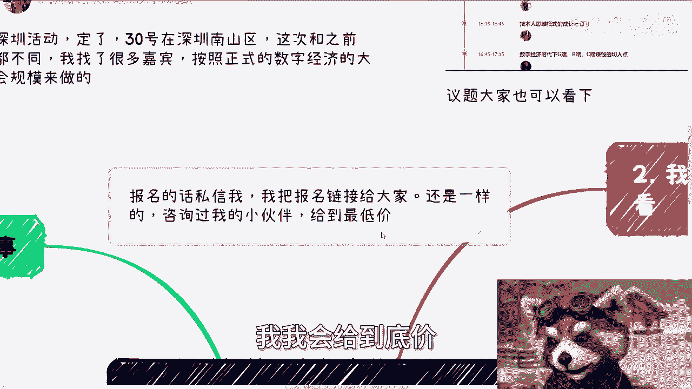
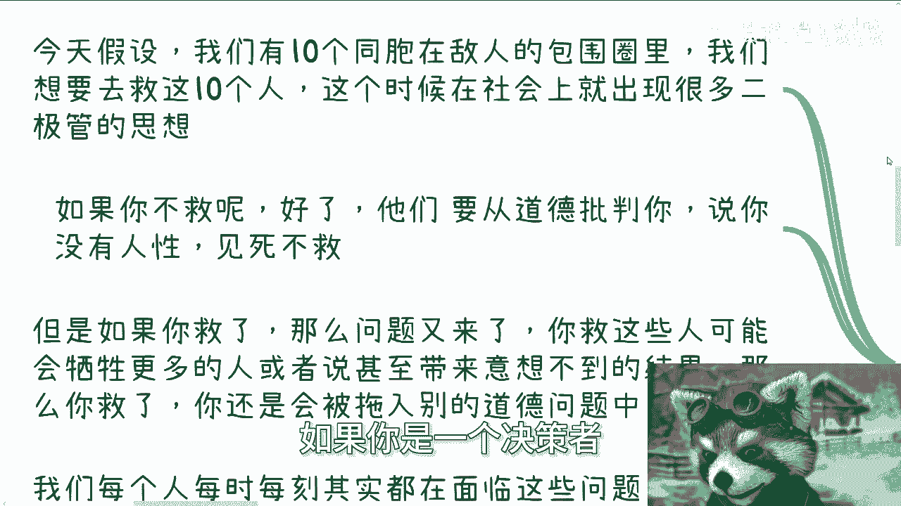
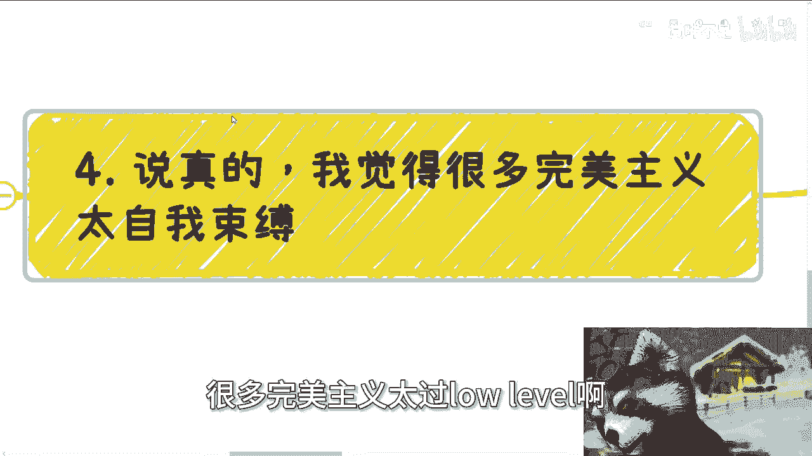

# 今天我们来说说完美主义---P1---赏味不足---BV1aw4m1e7QV

在本节课中，我们将要学习“完美主义”这一概念。我们将探讨完美主义的本质、它带来的问题，以及为什么对于大多数人而言，过度追求完美可能是一种阻碍而非帮助。课程将结合具体例子，帮助你理解如何在现实生活和决策中平衡追求与接纳不完美。

***

## 概述：完美主义的困境

我们首先讨论一个经典的思想实验，它揭示了完美主义在现实决策中面临的困境。

假设有十位同胞被困在敌人的包围圈中，我们需要决定是否去营救他们。

社会上存在一种“二极管”思维：如果你选择不救，会有人从道德制高点批判你，指责你没有人性。如果你选择去救，则可能面临更大的牺牲，例如为了救这十个人而牺牲二十个人。这又引出了新的道德难题：这二十个人的生命难道不如那十个人有价值吗？

这个例子说明，我们每个人时刻都面临类似的选择，它们或许不关乎生死，但本质是相通的：**你想得到一些东西，就必然会失去一些东西**。我们必须明白，只要是人而非圣人或神仙，就必然存在缺陷。没有人能做出绝对完美的选择。

我们所有人都不完美，也没有能力做出完美的选择。

***

## 第一点：纵向与横向的局限性

上一节我们介绍了完美选择的不存在性，本节中我们来看看任何单一事件的局限性。

任何一件事情都不是一个孤立的点，它会产生长尾效应和深远的影响。即使你能力很强，做出了一个在你当前认知下最完美的决定，这个“完美”也仅限于你的认知标签之内。

以选择大学专业为例。从纵向角度看，你可能考虑了自己的兴趣、喜好和就业前景。然而，如果放到更大的产业和行业动态（横向层面）来看，你的选择可能存在你未曾察觉的重大缺陷。同样，如果把时间线拉长，你的选择可能在当下带来不错的结果，但无法保证在未来三五年甚至更久之后依然是最优的。当未来结果不尽如人意时，回看当初的决定，它就显得不那么完美了。

需要明确的是，“当下做的决定，一定是你当下最好的安排”这句话本身没有错。但它的前提是：**你不要去纠结，不要在未来后悔，也不要在当下陷入完美主义**。一旦你开始纠结或后悔，这个决定就不再是“最好的安排”了。这两者构成了一个悖论。

***

## 第二点：完美主义的两个主要弊端

理解了完美主义的局限性后，我们来看看它具体会带来哪些问题。

完美主义往往带来两大弊端：

1.  **无限期停留在执行阶段**：做事的过程会变得异常漫长、内耗严重，并且容易闭门造车。结果的好坏反而变得不重要了。
2.  **导致自我打击和误判**：容易因为小小的失败或挫折而自我怀疑，陷入深深的内耗，或者错误地判断事情的结果，从而走上弯路。

以下是具体的表现：

*   **无视真实反馈，闭门造车**：很多创业者或业务人员，本应快速将成果交付给客户（需求方），根据真实反馈进行修正。但他们却选择在内部反复折腾，让非需求方（如领导）提出一堆非核心的修改意见。这本质上是无视真实需求，进行自我感动的无效劳动。
*   **因小失大，陷入内耗**：由于结果与预期有出入，便全盘否定自己或项目，陷入情绪低谷，阻碍了前进的步伐。

说实话，陷入这种完美主义或强迫症思维的人，往往很难被劝动。

***

## 第三点：低级的完美主义与高级的追求

前面我们分析了完美主义的问题，现在我们来区分什么是低级的自我束缚，什么是高级的持续优化。

很多所谓的完美主义层次太低，太过自我束缚。真正的“完美”并非指某个单一事件或节点做到十全十美。

我认为，真正的完美主义体现在：**在你的人生中，通过“不停试错 -> 获取反馈 -> 持续修正”的循环，最终达成你想要的结果**。这个过程与结果的结合，才是完美的。

*   如果为了一个结果花了过多时间或绕了太多弯路，即使有结果，这个过程也是不完美的。
*   如果做了很多正确的事却没有好结果，整体来看也是不完美的。

因此，在个人能力足够强大、能在现实社会中立足之前，过度追求细节的完美主义，更像是一种阻碍前进的自我束缚和闭门造车。

***

## 总结与核心观点

本节课中我们一起学习了完美主义的本质及其负面影响。

核心观点总结如下：

1.  **不存在完美选择**：人是有限的，任何选择都有机会成本，追求绝对完美不现实。
2.  **认知具有局限性**：我们的“完美”判断受限于当下的认知和信息，从更广的维度或更长的时间看可能并非最优。
3.  **完美主义带来内耗与低效**：它容易导致行动停滞、闭门造车，并因小挫折而陷入自我怀疑。
4.  **区分低级束缚与高级优化**：低级的完美主义纠结于无关紧要的细节；高级的追求在于建立“**快速试错 -> 反馈修正**”的迭代循环，以达成整体目标。

对于绝大多数尚未完成从0到1突破的普通人而言，首要任务是拿到结果，而不是在细节上追求从99到100。当合作中遇到过度纠结细节的“完美主义者”时，需要判断这是否有助于达成共同目标。如果无益，或许“道不同不相为谋”是更高效的选择。

***

**附：活动与咨询信息**

深圳线下活动已定于30日在南山区举行。本次活动规格较高，邀请了多位嘉宾，将围绕数字化转型、跨行业发展、产业变革、资产规划及技术人思维成长等主题展开探讨。

报名请私信获取链接。此前咨询过我的伙伴可享受底价。

此外，关于职业规划、商业规划、股权期权、商业计划书等问题，如需基于国内外现状的务实建议，可整理好个人背景与具体问题后进行咨询。请注意，咨询旨在提供思路与方法，无法保证一步登天或立即产生质变。