# 今天我来给大家分享四个创业项目-经典对话-创业项目不就靠骗么----P1---赏味不足---BV1Q

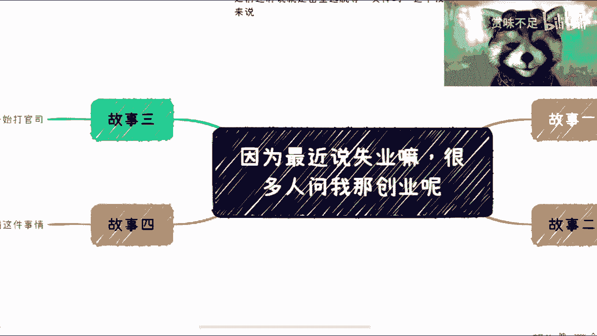

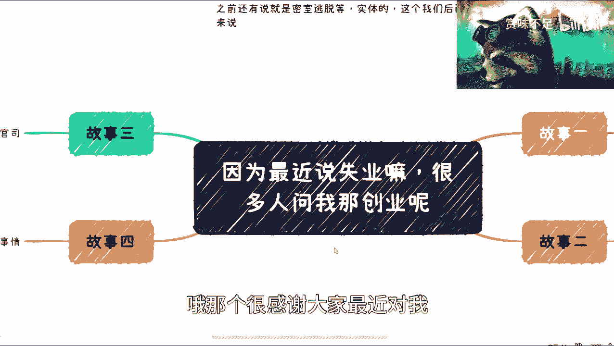

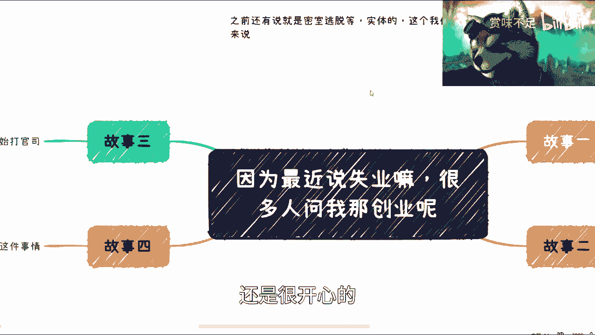

在本节课中，我们将通过分析四个真实的创业故事，来探讨创业过程中常见的、容易被忽视的风险与陷阱。这些故事涵盖了外部环境、商业诚信、团队管理和行业认知等多个维度，旨在帮助初学者建立对创业复杂性的基本认识。


## 概述

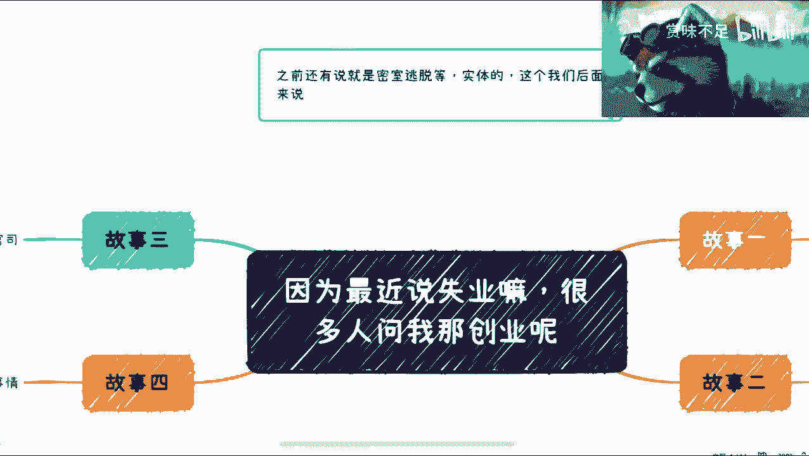

创业并非简单的“有一个好点子”或“足够努力”就能成功。在看似光鲜的表象之下，潜藏着诸多不可控因素和系统性风险。下面，我们将逐一剖析四个案例，揭示这些风险的具体表现。

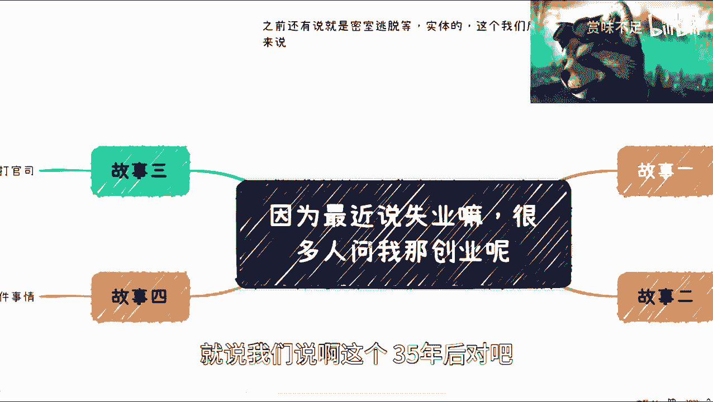

## 故事一：不可控的外部风险

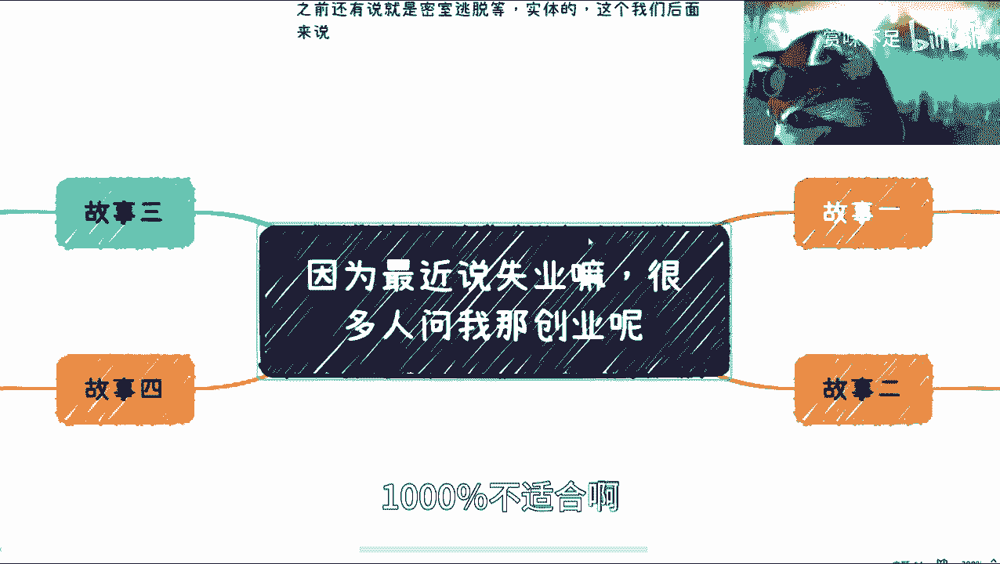

上一节我们概述了课程内容，本节中我们来看看第一个故事，它揭示了即使计划周全，外部环境突变也可能让所有努力付诸东流。

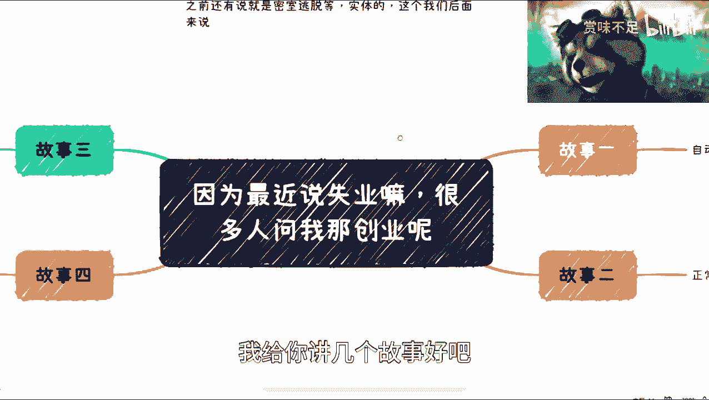

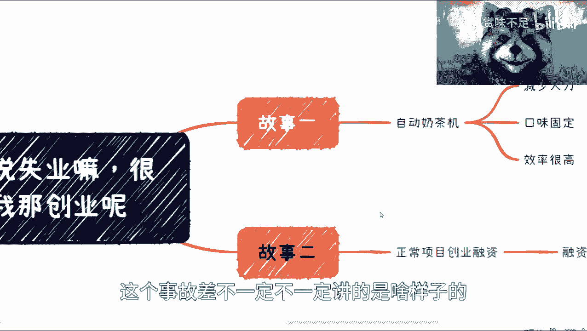

一位朋友在疫情前启动了一个自动化饮品机项目。该机器采用类似**左轮手枪的并行结构**，能一次性制作多杯饮料，旨在提升效率、统一口味并减少人力。

```
项目核心优势：高效率、标准化、节省人力。
```

然而，从机器调试、口味测试到资金筹措、渠道谈判，整个筹备周期长达数月。就在一切就绪、即将铺向门店的2022年12月，项目所在地上海遭遇封城。这一完全不可预见的黑天鹅事件，使得所有前期投入瞬间失去意义。

这个故事的核心教训是：**创业流程中总存在不可控的外部环节**，如政策变化、宏观经济或突发公共事件，这些都可能成为项目的致命一击。

## 故事二：商业诚信的崩塌

理解了外部风险后，我们转向内部风险。第二个故事关于融资，揭示了商业诚信的底线如何决定项目的生死。

2018年左右，一个项目在融资阶段进展顺利，接触了十几家风险投资机构（VC）。但在进入头部投资方（如滴滴）的尽职调查阶段时，问题出现了。

投资方反馈，商业计划书（BP）中的关键信息经核实“不真实”。投资方明确表示，如果信息属实，他们很愿意投资，因为模式本身很好。这时，项目合伙人的回应堪称“经典”：

> “中国做生意不就是靠骗嘛？”

这句话让创始人目瞪口呆。尽管商业世界可能存在夸大或包装，但**完全建立在虚假信息（100%造假）** 基础上的项目，注定无法获得正规资本的信任，也违背了商业的基本契约精神。

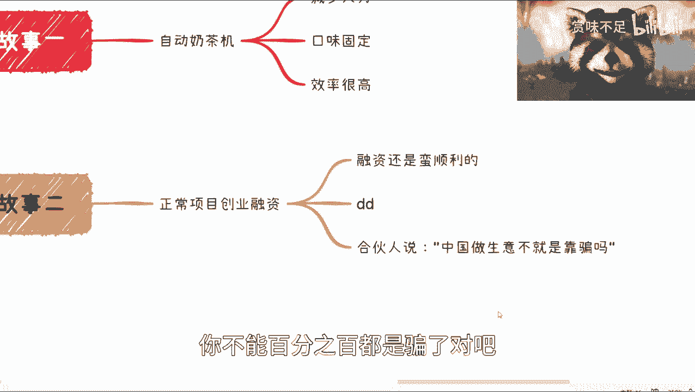

## 故事三：团队与信任危机

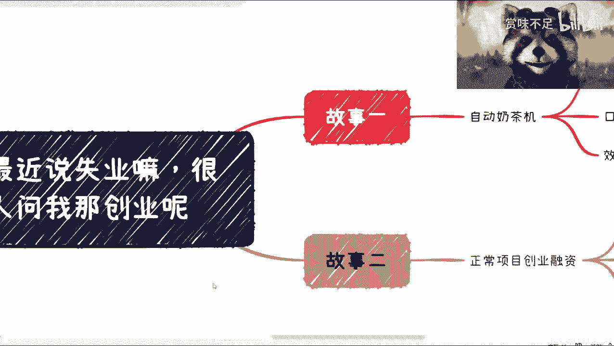

除了诚信，团队内部的管理与信任同样是创业的命门。第三个故事便是一位踏实创业的朋友，在业务发展良好时遭遇的团队背叛。

这位朋友创业一年半，业务稳步上升。但突然他发现，公司的公章被另一位负责销售/渠道的合伙人私自挪用，用于签署一些未经他同意的商业合同，其中涉及不当的利益分配。

起初是小打小闹，后来愈演愈烈，最终不得不对簿公堂。从起诉到结束，又耗费了一年半时间。这场内耗不仅消耗了巨大的时间和金钱成本，更致命的是：

*   它切断了公司原有的业务积累和增长势头。
*   它印证了一个残酷的现实：在创业早期，拥有市场、销售资源的人，其创业成功率往往高于纯技术背景的创始人，因为他们更接近“钱”和客户。但当这类核心成员失控时，带来的破坏也是毁灭性的。

## 故事四：对行业天真的认知

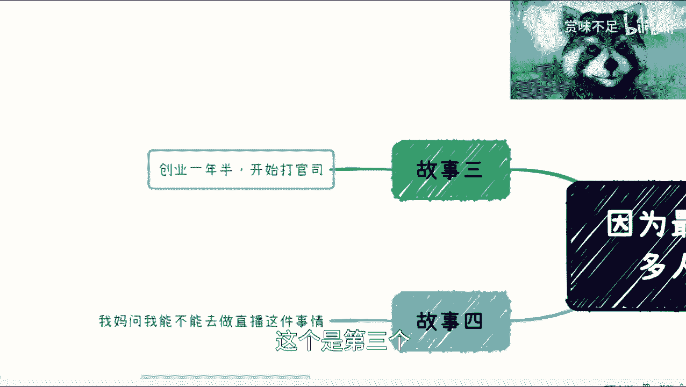

最后，我们来看一个关于行业认知的故事。它提醒我们，进入一个行业前，必须理解其真实的利润结构和核心壁垒。

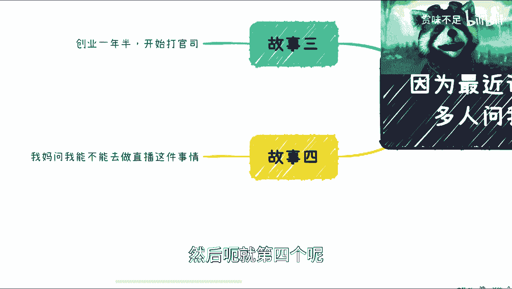

一位长辈看到直播带货很火，认为非常赚钱，想入场。对此，一个简单的逻辑反驳是：如果人人都能轻松靠直播赚大钱，那社会上就没有穷人了，这显然不符合经济规律。

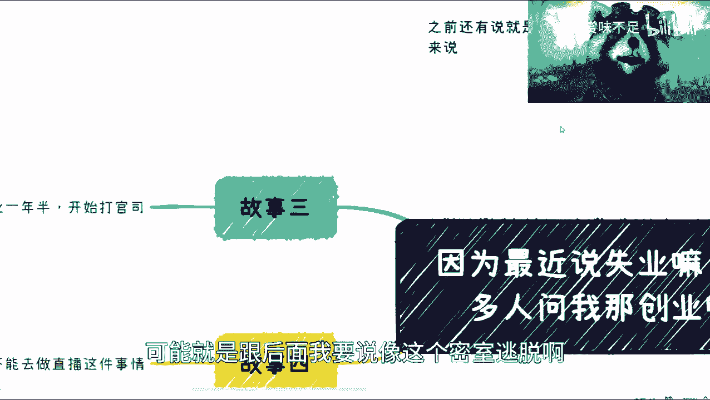

但更深入的问题是利润模型。以下是直播带货的一个简化毛利计算示例：

```
假设：
- 商品总销售额（GMV） = 10,000,000 元
- 渠道分成比例 = 12.5%（取10%-15%中间值）
- 团队年度成本 = 1,000,000 元

计算：
渠道毛收入 = 10,000,000 * 12.5% = 1,250,000 元
团队净利润 = 1,250,000 - 1,000,000 = 250,000 元

结论：要实现25万元的年利润，团队需要完成高达1000万元的销售额。
```

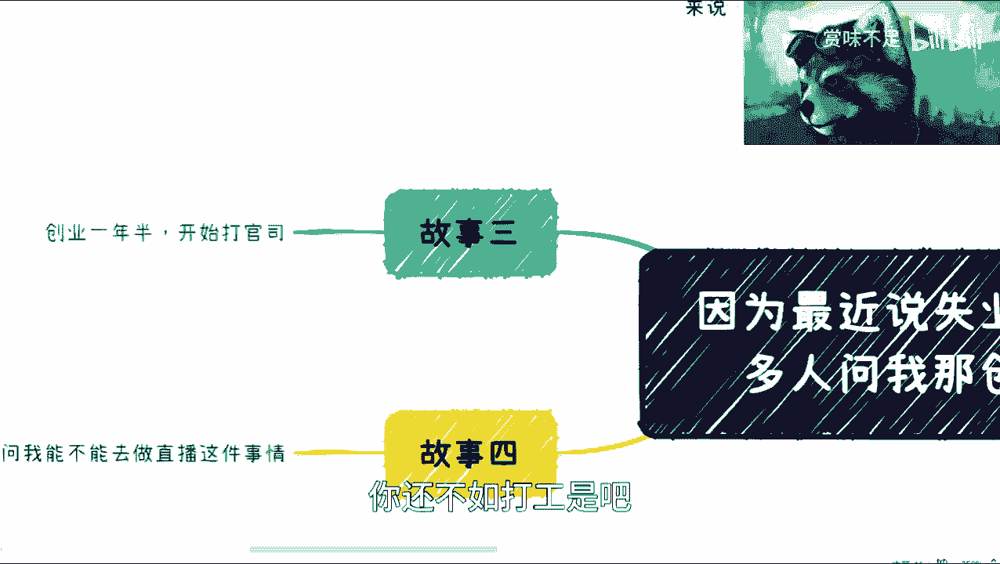

这揭示了两个关键点：
1.  **投入产出比可能很低**：忙碌一年，最终收益可能不如一份稳定工作。
2.  **核心壁垒在于供应链**：品牌方只愿给出10%-15%的毛利，因为最大的价值和难点在于**货盘和供应链管理**。你能拿到多低的底价？品质如何保证？库存如何周转？这远比“开个直播间”或“租个店面”要复杂得多。

无论是直播还是开实体店（如密室逃脱），**难点从来不是启动动作本身，而是背后整套体系（供应链、品控、管理等）的搭建与运营**。

## 总结

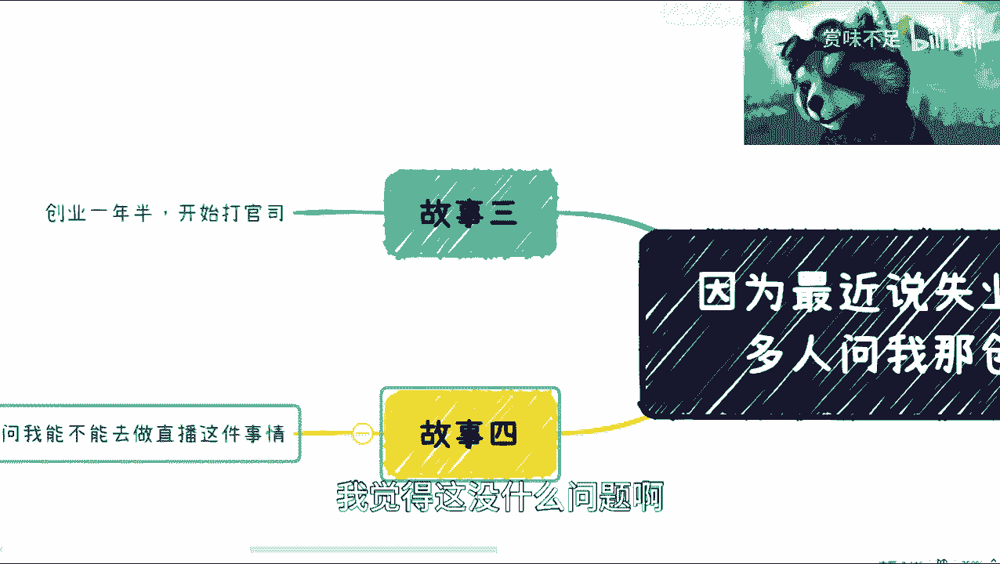

本节课中我们一起学习了四个真实的创业故事，它们分别指向了创业中的四类典型风险：

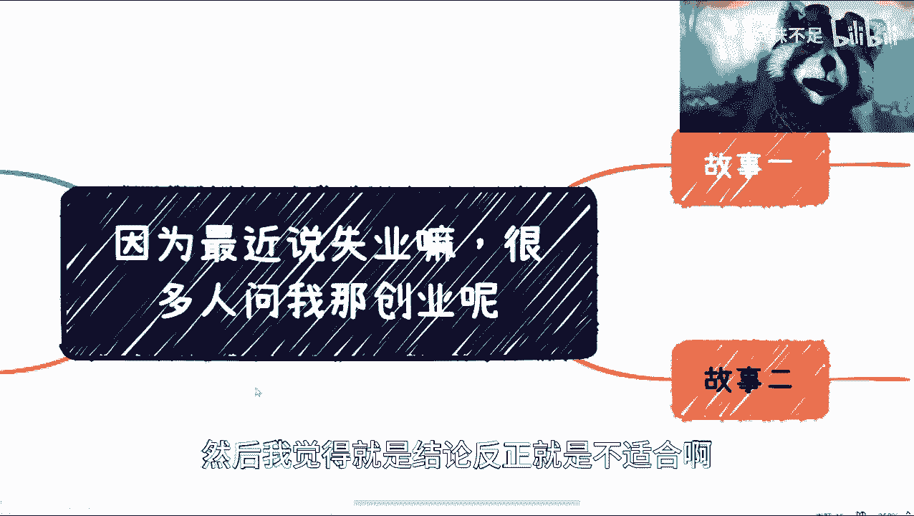

1.  **不可抗的外部风险**：如疫情等黑天鹅事件，可能让完美计划归零。
2.  **商业诚信的底线**：虚假信息无法获得长期信任与资本支持。
3.  **团队治理与信任**：内部权力失衡与背叛可能直接摧毁公司。
4.  **肤浅的行业认知**：不理解行业的真实利润结构和核心壁垒，盲目入场只会失败。

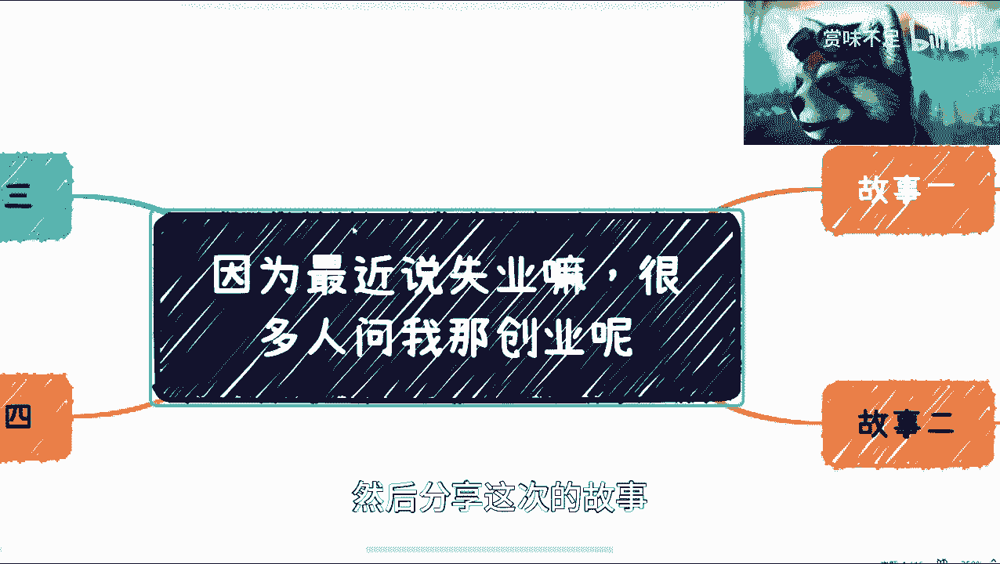

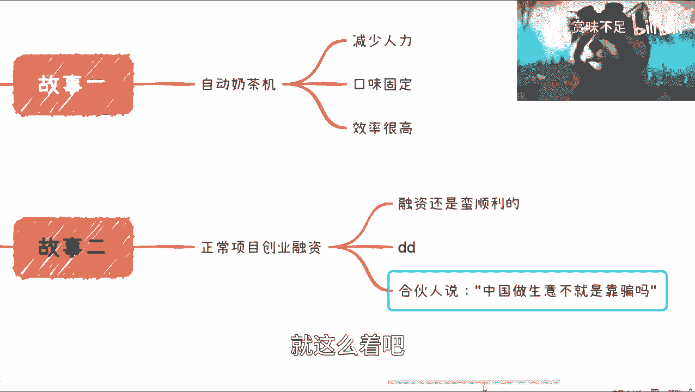

基于这些分析，主讲人的核心结论是：在当前环境下（尤其是近三年），创业的成功率极低，**绝大多数人并不适合创业**。对于初学者而言，深入理解这些底层风险，远比盲目寻找“暴富项目”更为重要。