# 今天我来给大家分享四个创业项目，经典对话”创业项目不就靠骗么“ - P1 - 赏味不足 - BV1Q54y1M7kF

哦那个很感谢大家最近对我。

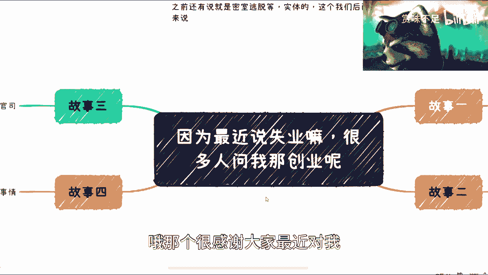

这个视频的这个喜爱哦，我收到了很多私信。

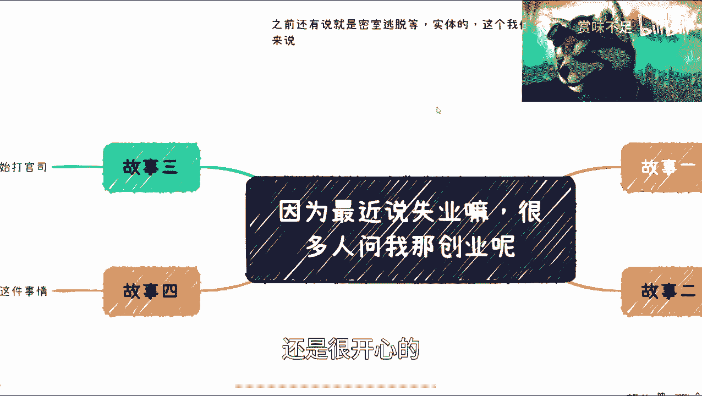

还是很开心的，呃今天呢我主要来讲一下这个内容啊，我顺便提一嘴啊，就是呃有很多也有一些朋友跟我说，说这个更新频率高一点，我其实很随性，就是我比如说想到啥，我可能说啥，我并没有去做过这个计划。

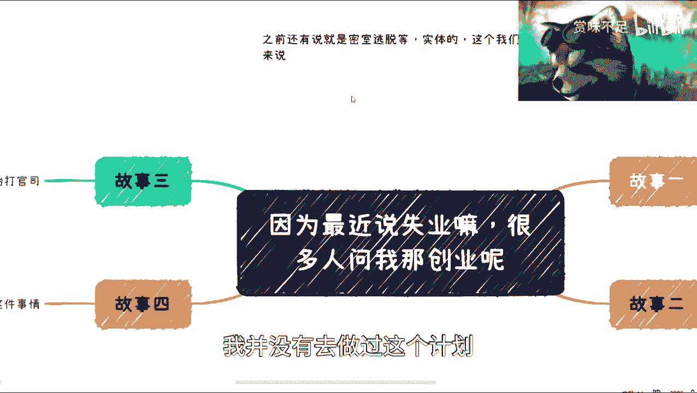

说不说我今天讲啥，明天讲啥对吧，然后我这边说一个点啊，就之前因为我看到有评论区说啊，关于现在比如说这个密有些做密室逃脱的对吧，实体的这个我觉得我后面再来开一期再讲好吧，这个是单独的东西。

然后呢就是说啊说到就是最近也有很多人说嘛，就说我们说啊这个35年后对吧。

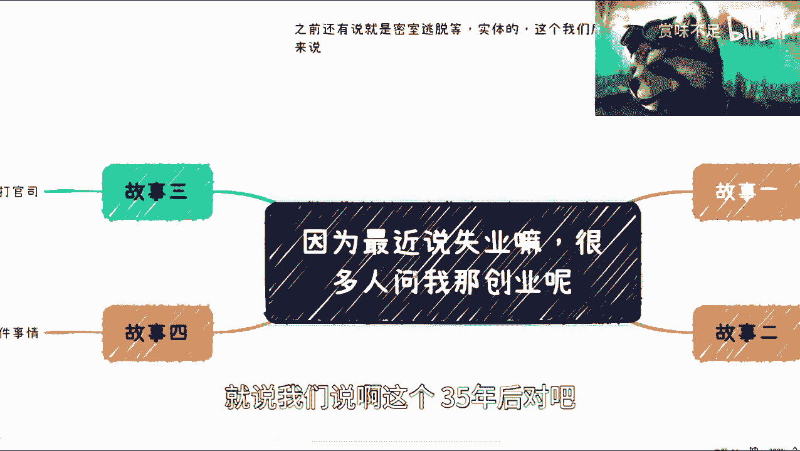

失业我觉得我现在越来越值得，不用5年，3年就过了啊，不用5年，然后呢就就也有很多人说啊，说这个创业对吧，创业问题我觉得这样子的啊，你要问我适不适合，我可以告诉你200%不适合，1000%不适合啊。

但是呢我就不去阐述为什么不适合了好吧，这个是回头再要说的。

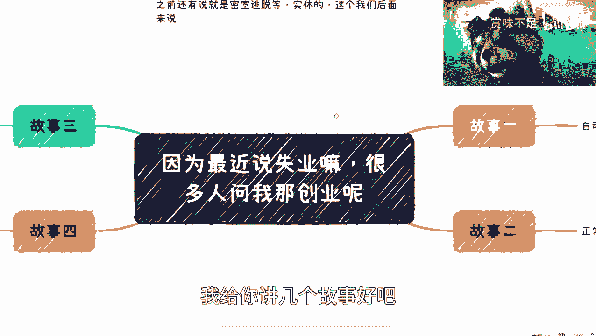

我给你讲几个故事好吧，我今天讲四个故事，四个故事，我觉得大家还是很赚的是吧，你你你你到这个这个叫什么这个付费平台对吧。

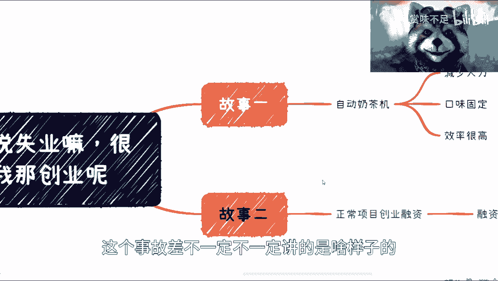

这个事故事还不一定不一定讲的是啥样子，第一个呢是这样子的，是我朋友啊，之前不都是我朋友啊，这个在疫情前就跟我讲的，他差不多去年的啊，前年前年的12月份跟我说，因为当时我问他嘛，我说你在干嘛。

他说我做了一个这个东西，哎这个呢我说实话我是不懂啊，然后呢他跟我解释了一下，我大概也明白了啊，就是呢它是那种什么呢，就是一个纯自动化的一个机械啊，然后呢你能减少人力对吧。

然后口味每处每每次调出来也是固定的嘛对吧，那效率很高，他这个效率很高，为什么呢，是因为呃，他那种就是你们可以认为有种，像那种这个左轮手枪的那种感觉对吧，就是它比如一次性能做十杯，一次性20倍对吧。

就是并行的啊，这效率很高，但是呢就像我刚刚说的，他这个问题在哪呢，就是本来啊因为你想啊这个机器要去挑事对吧，包括啊要要那个测试啊对吧，要口味去测试啊，包括资金啊这个渠道啊，各个去谈。

他差不多从大概78月份一直谈到12月，12月呢也就就绪了，你知道吧，然后就基本上要去铺到门店，但是呢没想到就是说3月份，当时上海这边封城了嘛，然后这个事情当时在上海做的啊，封城啊。

然后其实这个事呢就从现从封，其实从封城那一刻来讲呢，他这个钱就已经扔水里了，又没有意义了，对吧啊，那么因为哎各方面原因吧对吧，那么我觉得这是第一个故事啊，大家从这个上面呢其实可以明白。

就是他就是你会发现啊，就是所有的流程当中，总有一些环节你是不可控的对吧，那我觉得这是第一个啊，我们来讲第二个，第二个是什么呢，就是说啊正常项目融资对吧，大概是我记得大概是18年的时候吧，将项目融资。

然后谈了大概十几个vc，就十几个天使投资也还不错啊，也还不错，然后呢就是这个流程还是蛮顺利的啊，我不得不说流程蛮顺利的，但是到了什么地步呢，到了滴滴啊，滴滴滴滴可能很多人不知道啊，就是这个背调对吧。

b调的时候呢，他就那个融资方就是说啊，他说哎你们这个这个bp啊，bp就是商业计划书嘛对吧，他说你们这个bp上面的这个内容呢，我们去做了一下调研哦，发现这个内容好像呃不太真实啊。

然后呢我们那个朋友那个项目呢，就就大家开始内部讨论完了，在哪哪个地方有问题嘛对吧，然后我那个朋友就问他的合伙人，他说哎，那你这个这个这个我们投资人说，你你里面这个东西不真实，那其实那个投资方已经说了。

但凡你们的信息是真的，他他们就投了，因为其实这个模式还是很好的嘛，你知道吧，那具体是什么我不方便说嘛，因为这个就是说涉及到商业机密嘛，然后呢我就跟你们讲啊，他的合伙人说句句经典的话。

我来我打给你们合伙人是这么说的啊，合伙人说啊啊当然我我我说实话，我觉得他说的没有错啊，中国做生意不就是靠骗嘛是吧，哎我决定把这期主题他妈的就发生，哎我操就放弃，这句话绝了，b站是不是会把我和谐掉。

你知道吗，然后把我朋友气得半死，你知道吗，我朋友就跟他说，我就就说实话，就说你这句话说的你说对吧也对，但是呢就是人家说你十分，比如说七分靠骗对吧，三分靠打拼，三分靠真实，你不能百分之百都是骗了对吧。

他当时给出来的资源就是都是假的对吧，然后这个是第二个故事啊。

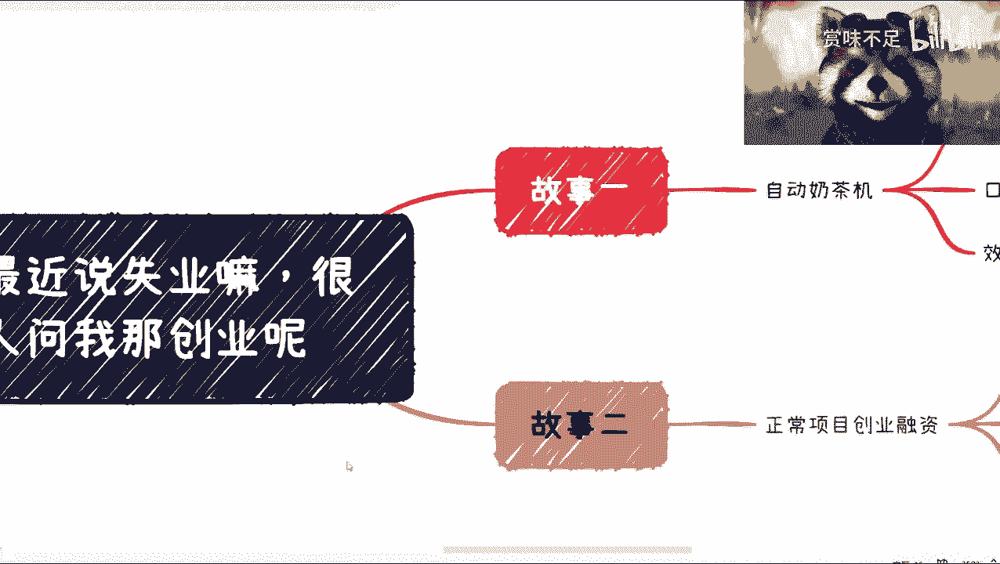

那第三个故事呢就是我那个朋友嗯，呃这种朋友特别多对吧，就创业1年半，然后呢他是什么什么情况呢，就是呃其实做的蛮好的，我觉得都踏踏实实，把没有我的小浣熊怎么怎么怎么怎么怎么，一下子傻了好了。

就是他1年半吧，1年半呃，业务做得也蛮不错的，因为我也看着他一直做起来的嘛，然后嗯那个那个突然之间呢，他发现就是说公章被挪用了，唉其实挪用也不是说别的事情，可能就是一些就是说啊这个商业合作对吧。

商业合作里面可能有些利益分配嘛，那利益分配的话可能有些合作或者怎么样，没有经过他手对吧，这合同就签下去了，那当然了，就是说一开始还小打小闹，后来就可能越来越就肆无忌惮了嘛对吧，那么呃就就可能不能忍了。

然后后面就就法院对吧开庭，然后做了大概又从他起诉到结束，过了31年半吧，差不多对吧，其实呢我觉得就是就是他这个事情啊，如果但凡当时不出这个事儿呢，我觉得他业务做得很好啊。

不至于就是说后面其实后面就变成什么呢，就是说因为我朋友是负责技术的嘛，他那个挪用他公章的其实是负责有点销售啊，渠道性质的，那其实就等于就是说他的积累又被一刀切了嘛，对吧，那这个也是个这很大的一个问题。

这也是我为什么以前一直说，我说虽然大家都打工啊，但是我觉得这个销售啊，市场啊，那个创业的这个叫做成功率，肯定会比很多做什么产品经理啊，开发啊，就技术层面的来的，这个成功的成功率高得多对吧。

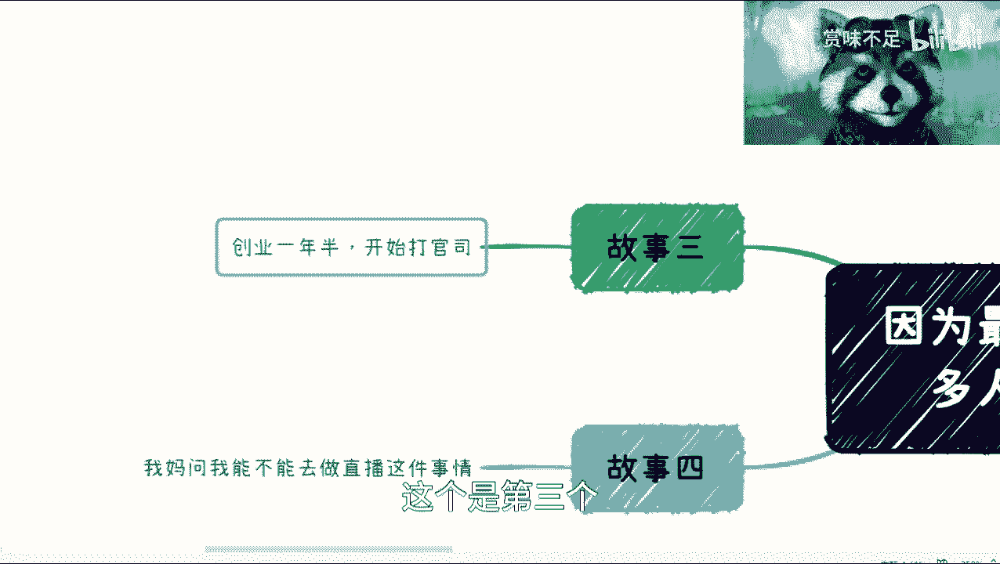

这个是第三个啊，第四个呢就是回到我妈，那我妈某一天对吧，突然问我，她说我能不能去做直播对吧，她说直播特别赚钱啊，特别赚钱，我说我说我说你要想这么一个问题，中国14亿人，你要觉得直播很很能赚钱。

你去做对吧，你你你做了之后你能赚钱，那那那中国14亿人就没有穷人了对吧，大家都赚钱，那请问这个钱哪里来对吧，我说你你但凡简单想想你就知道了对吧啊，然后呃就第四个呢。

我觉得这件事情呢，可能就是跟后面我要说像这个密室逃脱啊。

实体店这个有一点关联的，就什么意思呢，就是说其实你会发现啊，就是做直播呃，我这么跟大家讲吧，就是我们我以前给品牌方做过那种直播，就tiktok的对吧，然后呢就是呃毛利啊，毛利差不多，比如说呃他给渠道方。

差不多在10%到15%，什么概念呢，就是说你举你想想看，比如说1年对吧，你你你卖了大概200万，那么你这边最多也就是分到二，20万~30万对吧，但是万二十万三十万呢，你要这么想，20万~30万。

你还得刨掉你，你就是这个团队成本，那么简单来讲是什么意思呢，就是说如果你团队是100万的成本对吧，那么你你总共的这个这个收入应该是，你要盈利的话，总共差不多在120万~130万，那么这就意味意味着。

你带货起码要带掉1000多万的货对吧，1000多万货，那我就说嘛，就是说你你说你1年贷掉1200，2000万流水的货呢，我觉得嗯就从一个小团队来讲啊，就从一个100万成本团队来讲，我觉得还是可以的。

还是可以的，因为你又不是这种顶流还是什么对吧，还是可以的，但是你想想看你直播的投入产出比对吧，包括就是说这个你你最终忙上忙下，这1年下来的这个这个这个叫什么收入对吧，你还不如打工是吧。

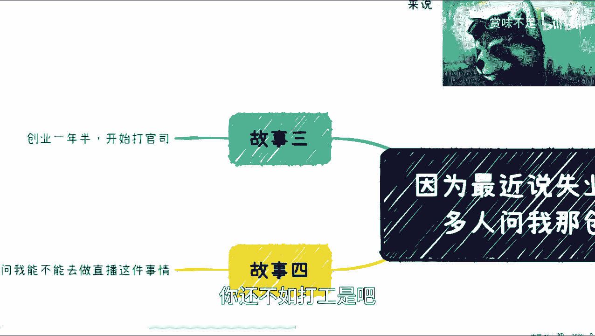

但是呢我觉得这个倒不是最大的重点，最大重点我在这地方主要是想跟大家说什么呢，就是你们你们想啊，为什么品牌方他只愿意给给到，比如说像m cn啊，或者其他就10%到15%，是因为最大的难点在哪。

是在于你有没有货源对吧，你的整个货盘，你的整个供应链的体系谁来管理对吧，这个是最最大的问题，而不是说你今天就去做一个东西，就像就就这个我顺便提一嘴，这个就像那个上上面我提的，就有很多人跟我说。

他说我们租个小店对吧，做什么就还是那句话，你去做个店本身并不难，难是难在你做的这个店里面的这些东西，你怎么去管理对吧对吧，你无论做任何吃衣食住行，你做任何的东西，你怎么从零开始管理，你自己是都认识呢。

还是说你朋友认识还是怎么样呢对吧，那么这当中这个给你的价格到底是不是底价呢，对吧，这些东西品质好不好，你还巴拉巴拉各种各样问题对吧，其实这个才是最大的问题，你说你去开个店，我觉得这没什么问题啊。

随便开是吧好吧，然后我觉得就是结论反正就是不适合啊。

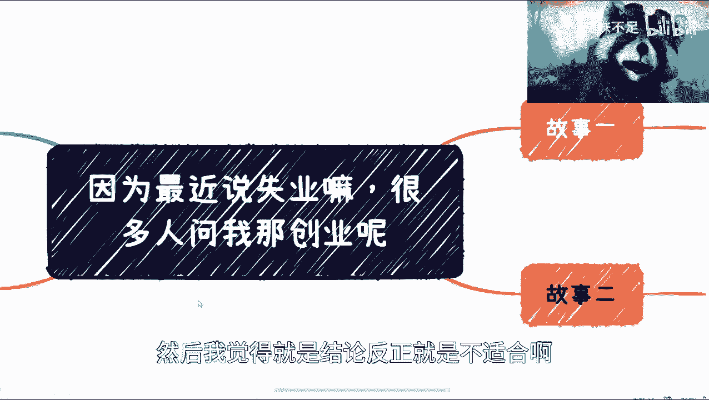

不管怎么样，我觉得近3年内都不适合去创业好吧，然后分享这次的故事。

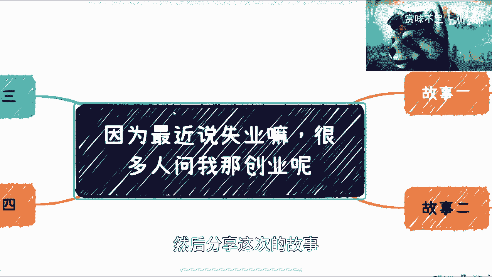

哎呀我今天就用这个主题了，卧槽会不会被和谐。

