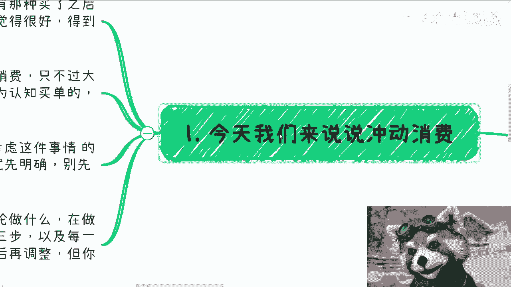

# 课程 P1：冲动消费的多维解析 🧠💰

在本节课中，我们将要学习冲动消费这一现象，并分析其在用户（C端）、企业、政府和高校等不同层面的具体表现与核心逻辑。理解这些差异，有助于我们更清晰地认识商业行为和市场决策的本质。

---

## 概述

冲动消费并非个人专属，各类组织同样存在。本节将剖析不同主体冲动消费的动因与特点，核心在于理解其背后的决策逻辑与认知局限。

---

## 冲动消费的定义

首先，我们来明确冲动消费的概念。

冲动消费是指：个体或组织购买后感觉并无实际用处、得到后就不喜欢、或落地后发现并无卵用的产品或服务。本质上，这是为其认知局限而买单的行为。

**核心公式**可概括为：
`冲动消费 = 决策时的高预期 - 使用后的低效用`

个人、政企、高校都存在冲动消费，只是理由各不相同。

---

## 明确目的的重要性

在深入各主体前，我们必须强调一个基本原则：做任何事都应先明确目的。

如果目的不明确，行动就是盲目的。若决策者自己都无法明确目的，则说明其能力不足。正确的做事方式是先设定明确目标，再朝着目标推进。过程中可以微调，但不能没有目标。

例如，在提供商业咨询服务时，我总会问：“你后续打算如何变现？”若对方回答“做一步看一步”，那这件事通常不靠谱。这就像无头苍蝇，缺乏方向。

---

## 用户（C端）的冲动消费

上一节我们介绍了明确目标的重要性，本节中我们来看看最常见的冲动消费主体——普通用户。

C端散户的消费大多是纯粹的冲动消费。他们通常缺乏判断产品与服务真实价值的能力。

以下是关于C端冲动消费的几个关键点：

*   **普遍缺乏判断力**：从大基数看，绝大多数C端用户没有分辨好坏的能力。他们容易受营销影响，觉得文案写得好就是大佬，产品包装好就是好产品。
*   **收入水平的反映**：如果C端普遍拥有强判断力，社会消费结构和人均收入（例如2.8万至3.2万年收入）就不会是现在的样子。
*   **消费差异的本质**：有钱与没钱的用户，其区别仅在于冲动消费的金额和方式不同，而非判断力的本质提升。

**核心结论**：若你的生意面向C端，需默认用户是冲动消费且缺乏分辨力的。你的策略要么专注于营销吸引，要么放弃赚大钱的期待，只服务少数认可你价值的用户。既想获得深度认可又想赚大众的钱，这二者通常不可兼得。

---

## 企业与政府的冲动消费

了解了C端，我们再将视角转向组织。企业与政府的消费决策更为复杂，冲动消费的表现形式也不同。

### 企业的冲动消费

企业因有层层审批流程，冲动消费较为困难。让底层员工兴奋没用，最终还需上级拍板。

不过，在特定情况下仍有可能发生：
*   **条件**：涉及金额较小（如10万以内）、交付周期短平快（几天到一周）的单子。
*   **现状**：在当前经济环境下，这类冲动消费已大幅减少。

### 政府的冲动消费

政府的冲动消费往往源于时间压力。
*   **决策缓慢**：政府决策流程长，涉及开会、提交材料、审核审批。
*   **核心动因**：当面临明确的截止日期（Deadline）压迫时，为了在规定时间内完成执行，可能产生冲动消费。

**两者共同点**：其消费核心仍在于**信息差**。当某个领域成为“风口”时，信息掌握更早、更全的人或机构，会迅速冲向相关的政府项目、投资或企业服务，因为许多决策者的认知参差不齐，容易跟风。

---

## 高校的冲动消费

最后，我们来看看高校层面的冲动消费。高校的情况较为特殊，且受经济环境影响明显。

目前，高校整体预算紧张，大规模冲动消费的可能性降低。但在过去，例如VR、AI等概念火爆时，高校确实存在过为跟风而投入的情况。

高校的冲动消费动机主要来自：
*   **冲业绩**：例如提升学校排名、建设亮点工程。
*   **冲就业率**：采购能提升学生就业数据的服务或项目。
*   **连带效应**：高校的某些决策（如开设“热门”专业）会引发学生和家长的连锁冲动消费。

这里需要特别指出，高校学生本身属于C端范畴，且是“韭菜中的战斗机”。他们往往自我感觉良好，认为不会上当，却最容易为“有前景”的承诺付费，例如报名昂贵的培训班或选择所谓的“热门专业”。

然而，行业风口变化极快。去年AI的风口期大约只有三个月到半年，如今热度已大不如前。基于当前“前景”做出涉及未来数年的重大决策（如选择专业），本身具有很大风险。

---

## 总结

本节课中我们一起学习了冲动消费在不同主体间的体现：
1.  **C端用户**：冲动消费的主力，普遍缺乏判断力，消费决策易受营销影响。
2.  **企业与政府**：冲动消费受流程和预算约束，但在特定条件（小额、短周期、时间压迫）或信息差驱动的“风口”下可能发生。
3.  **高校**：冲动消费动机源于业绩压力，并能引发学生与家长的连锁反应，但需警惕风口快速变化的现实。

理解这些差异，能帮助我们在商业规划或个人决策中，更清醒地识别冲动陷阱，聚焦于真正创造价值的核心目标。

---

（注：文末关于活动报名与商业咨询的内容为原文附带信息，按您的要求已整合在教程结尾，未作额外发挥。）