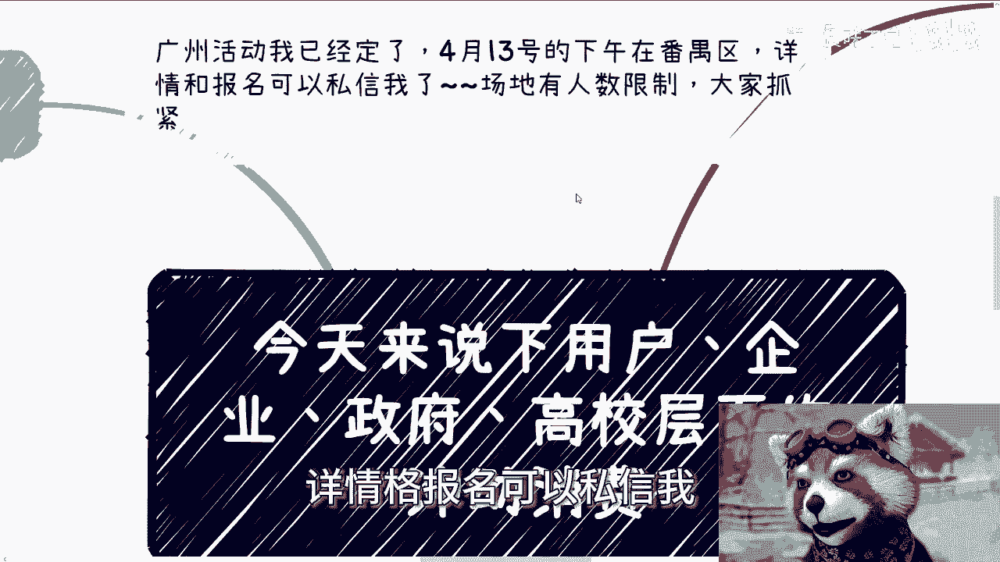
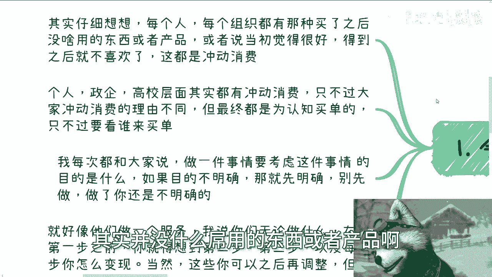
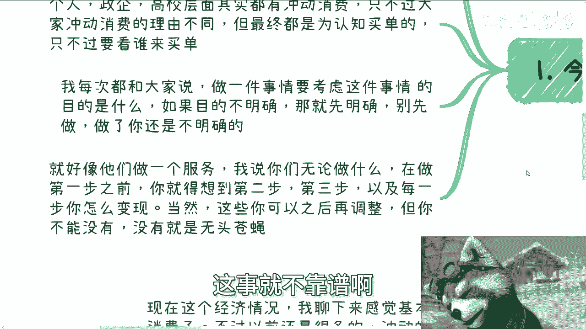
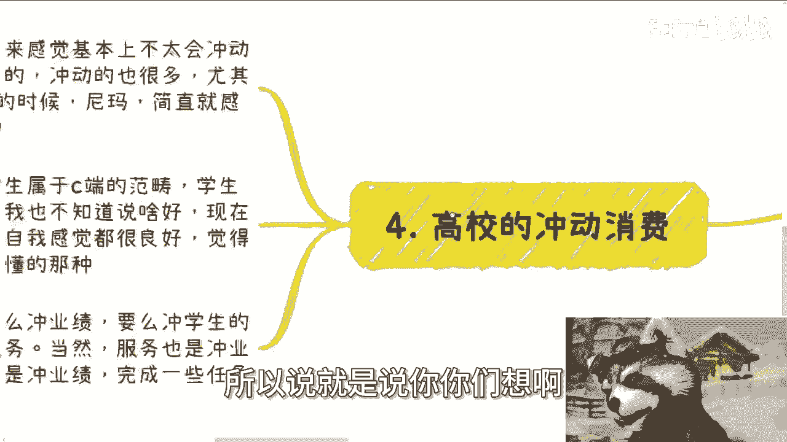
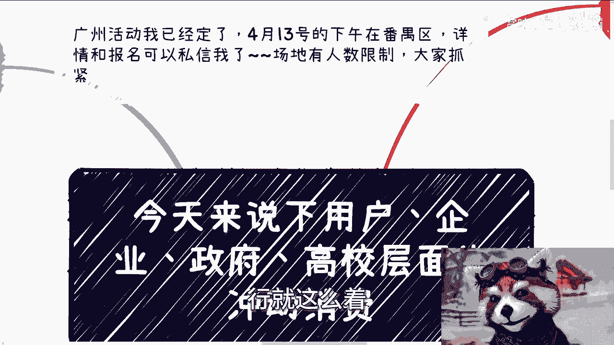

# 今天来说下用户，企业，政府和高校层面的冲动消费 - P1 - 赏味不足 - BV1jr421b7NH

好大家好，明天就北京活动了，然后广州活动我也订了啊，广州啊4月13号下午在那个番禺区啊，详情和报名可以私信我好吧。

场地也有人数限制，反正大家抓紧吧，越早越好好吧。

然后今天呢这礼拜五啊，就我们来聊点轻松的啊，就是这个用户啊。

企业政府高校层面这个冲动消费啊，呃我们来看啊。

首先我们来说这个冲动消费啊，为什么会说这个东西啊，呃你要仔细想想，每个人每个组织都有那种，买了之后其实并没什么吊用的东西或者产品啊。

或者说当初觉得很好，得到之后就不喜欢了啊，或者说就是当初觉得用处很大啊，然后落地之后发现并没什么卵用啊，这种都叫冲动消费，那么个人政企啊高效啊，其实本质上都有冲动消费，只不过大家冲动消费的理由不一样啊。

呃但是最终你会发现，他还是为他的认知而买单的啊，只不过就看谁来买这个单啊，那么我每次都跟大家说啊，做一件事情呢，你得先考虑这件事情的目的是什么，如果这个事情的目的不明确，那么你就得先去明确啊。

如果做这件事情是别人的主意，而你去问别人，别人不明确，那就说明这个人根本就不行，你明白吧，就是你不要觉得目的不明确是正常的，先做了才明确，不是的，你目标要明确，你朝着目标走。

这才是做真做事情正确的方式啊，你别说你目标不明确，然后就先做做了，我给你做了，你还是不明确啊，这就好像我们做一个服务啊，我说你们无论做什么，在做第一步之前呢，你就都得想好第一步的目标是什么。

然后都得想好第一步，第二步，第三步怎么变现呢，嗯谁给我发啊，就是都得变现的，而以及每一步你怎么变现，当然这些呢你可以之后再微调啊，但是你不能没有，就是你不能说我今天做了第一步，然后我就问你。

我一般都会问，就是你跟我咨询的时候，我一般都会问我说，我说那你后面打算怎么变现呢，然后大部分人都跟我说啊，我不知道对我做一步看一步，我说那你做一步看一步，这事就不靠谱啊。

就是无头苍蝇啊，那么第二就是说用户的冲动消费，我们一个来说，一般来讲C端散户都是冲动消费，就他是纯粹的冲动消费，就是纯粹的韭菜，就很多小伙伴在线下或者咨询的时候，他们都会问我。

他说我比如说啊他做什么产品，做什么服务对吧，怎么吸引更多的用户。

我说你用逻辑来讲这件事情本身就是错的，为什么，因为C端的用户，中国的基本盘就是冲动消费，因为什么呢，因为他们没有判断能力，你觉得有吗，没有啊，就如果你觉得有，那本身你的判断就是不对的哦。

C端你如果从大基数来讲，无论做什么都是没有判断能力的，拥有判断能力的都是很小的一部分，如果你身边有，或者你觉得你的朋友有，那就是幸存者偏差对吧，就大部分人都感觉貌似这个不错那个不错，他今天看到的产品。

看到服务，你只要营销的好，他就觉得嗯你是好的，你只要态度写得好，他就觉得你是大佬，他他们哪来的分，哪来那个那个分得清楚好坏的能力啊，没有的对吧，你我再多说一嘴啊，如果C端拥有分得清楚好坏的能力。

现在的社会就不是这个样子啊，中国人均年收入也不可能只有2万8到3万2，就这么简单，有吗没有，所以说我们如果要做C端生意，记住基本上可以说都是冲动消费，他们分不清楚好坏的，你懂吗。

他们的区别仅仅是在于当他没有钱的时候，他是怎么冲动，当他有钱的时候，他怎么冲动，仅仅是这么个区别，你说他的这个有能力分清楚好坏，不好意思，不存在的哦，如果你要打磨你的产品。

或者你要寻求那些真正分得清楚你价值的用户，那么你一开始，相当于就选择了一个很窄的赛道啊，同时你又抱有不切实际的期待，那么你最后就不要抱怨啊，为什么我没有用户啊，为什么我赚不到钱啊。

为什么我搬一个东西没有人来呀，没有为什么，这就是悖论，你懂吗，这就是悖论啊，所以这就是我说的，很多人关注自己的产品跟服务，然而目的就是赚钱，这就是南辕北辙，什么意思。

就是说你要么就明确用户就是没有分辨能力的，你就是靠营销吸引他们，你要么就是说OK我我我不给，我不在乎赚这个钱哦，我只在乎有谁认可我没问题的，但是你千万不要那种就是说哦。

我不在乎有有谁那个呃我我在乎有谁在乎啊，那个叫什么认可我，我又在乎要赚钱，那不好意思啊，鱼与熊掌这两个东西你永远不可能兼得的啊，这就是我跟你讲这个人人类社会，人就是这种生物，你没有办法啊，那么好。

第三个我们来讲政企相关的对吧，我跟你讲啊，企业要冲动消费很难很难，你们但凡未来有机会去做一些to b的业务，你们就会知道企业这种地方属于层层提交，基本上你把底层说high了也没有用。

因为他还要看上面的审批，你懂吗，你就算当下能够突破第一层，你后面也是很难突破的，所以说这个企业你要冲动消费比较困难啊，没有C端这么容易，但是呢你也要看业务，因为一般来讲啊。

企业它也要看单子的这个这个这个金额啊，你比如说像以前比如说23万45万对吧，或者10万以内的单子，然后呢它的这个交付周期都短平快的，比如说什么一两天啊，两三天啊对吧，或者说什么呃一个礼拜对吧。

那么这种我觉得是可以冲动冲动的啊，但是这种情况我就告诉你们，在当下这个经济环境已经不太可能了啊，那么政府的冲动消费呢其实来自于deadline啊，就怎么说呢，因为很多地方就我我们就宏观的说啊。

因为很多地方呢就是做事本来就慢，然后呢政府还得开会啊，还得提交很多材料，还要审核，还要审批对吧，那么他很难去冲动消费，但是他冲动消费很多时候来自于哪里，来自于这个这个叠的line。

就是最终呃时间时间窗口的这个压迫啊，他不得不去，我就比如说10月10月一号就就底线了啊，10月1号就截止了啊，那他10月1号之间不得不去把执行搞定，那这个时候他有可能冲动消费啊。

但这两个对象呢消费的核心啊，真正消费的核心还是在于信息差，这就好像我们在说风口在哪里，你你会发现当一个行业或者一个领域啊，他有这个风口的时候，真正懂得赚钱的人立马就冲冲政府项目，冲政府投资。

冲那种什么小中小型的foundation对吧，或者说怎么样，就是啊活动啊，服务啊，企业服啊，因为中国的企业信息，就中国的企业的这些企业家啊，他的认知太参差不齐了，就是这就好像我跟你说。

你一直在接触一二线，你可能没什么太大感觉，就是你比如说一直住在北上广深吧，或者说什么杭州啊对吧，南京啊这些地方你可能感觉不深啊，但如果二线及以下你比较接触多，你基本上就知道什么意思。

就是嗯你去接触那些组织或机构，你会发现他们没有脑子的，你明白我意思吧，就他们没有思考能力的，他们就是啊有什么舆论好好我们做这个啊，那个东西火好，我们做那个就这样子，就是大家都喜欢冲风口。

就是我跟你们说的吵架班子就都喜欢冲风口，那么风口是什么，就愿意就有付费的意愿，但是你具体要去深究啊，你说哎，那你那你比如说付了这个东西有什么结果呢，他们会给你画很多饼，但是真正能落地的呢不知道啊。

很少很少，嘶哎呀，等一下啊，好那么最后一个就是高效的冲动消费啊，我跟你讲，现在整个经济情况，就我聊下来，感觉高校呢属于完全没预算啊，不太可能冲动消费，不过以前还是很多的啊，就你哪怕前两年来讲。

比如说前两年啊，有些时候就是大众或者说市场都说什么哎呀，VR对吧，或者怎么样怎么样，你们真的你们经历过前两年，你们就会知道卧槽满地都在说ARV啊，然后我跟你们这么说吧，就唉就是我跟你们讲。

你们就经历的太少，就每个时代都有人问我哎陈老师啊，当时他们就问我哎陈老师哎呀，VR未来怎么发展，老牛逼了对吧，我们打算投资怎么样怎么样，你看现在呢有什么用呢，我当时只能怎么说，哼笑笑哼哼，对不对。

哎呀我跟你们讲一样的，这就像以前L阿尔法go出来的时候，说AI怎么样怎么样，你现在GBD说AIAI怎么样，不是一个道理吗，对不对，我跟你们讲，你但凡经历多了，你就麻木了，你就知道整个社会怎么运作的。

就这个吊样子啊，就像我昨天咨询的时候，我还在跟他们说了，我说你跟你问我有什么东西，哪个行业就他们有人问我，他说他说哎陈老师，你觉得哪个行业前景好，我说有意义吗，你我就反过来问你，你觉得你告诉我。

中国到现在或者全世界到现在有哪个行业，所谓前景的，他不都是每隔一两年，34年，312年，河东一年，河西30年，河东30年河西的，你告诉我哪个东西有前景，那么奇了怪了啊，我说真的有一个东西有前景吗，有吗。

对不对，我说有也是有的，如果说你比如芯片算力对，你比如说比如说某些呃那个叫什么，单片机对吧，或者其他的包括一些前沿的生物生物医疗，你说有没有有，但这个东西跟我们没关系啊，你真正的就我说了嘛。

就说人家真正的科学家或者真正的前沿科技，人家比如说1%，那跟我们没关系啊，我们算什么对吧，那你说我们作为一个普通人，你来问我爱哪个东西，前景好，有什么东西啊，没有的美哥，我跟他们说。

我说以前可能一两年两三年，你现在是什么，一个月两三个月就他妈过去了，你像去年AI整个风口才多久啊，三个月到3月份到10月份就over了，现在还有吗，现在有当时那么疯狂吗，没有啊，对了。

你还跟我说未来什么前景，我怎么知道啊，然后我觉得高校里的学生就不讨论了，因为学生属于C段的范畴啊，我跟你们这么说，学生简直就是韭菜中的战斗机，我也不知道说什么好，为什么，因为现在培养出来的学生就很搞笑。

就是那种就是说自我感觉很良好，觉得他妈的自己什么都懂，但他们其实什么都不懂，怎么办呢，你跟他讲讲不通了，就是我跟你们说啊，就是他们就属于那种什么就是那种就是说爱车，老师我不会的啊。

我觉得这个东西我不会上当的啊，我也不会受骗的，然后一转身爱陈老师，我就报了个班，45万的啊，好好好行，遥遥领先对吧，然后你高校本身呢我觉得还是要看的，你要么就是冲业绩，要么就是冲学生就业率。

要么就是充一些服务啊，啊当然服务其实也是冲业绩的一种手段，本身也是冲业绩，所以说就是说你你们想啊。

就是说高校到现在为止有很多东西，他都是冲动消费，但是高效一点冲动消费呢，好让学生家长也开始冲动消费，学生也开始冲动消费，那那到最后能怎么办呢，对吧，你就好像今年问我哎，周老师哪个队有前景啊。

好我去报个班啊，我去报个专业，报个专业，4年后还有还是这样子吗，我跟你讲，你别说4年后了，妈的四个月后是不是这样都不知道对不对，你这这没有逻辑性啊对吧，那那你说我能说什么呢，啊我能说什么呢。

就就有时候我真的觉得，就是你跟他苦口婆心去跟他讲没有用，你还不如跟他说，哎就这个专业好，这个专业有前景，他妈的我这边有个班来3万块钱一个人对吧，我跟你们讲真的，我跟身边很多人都说了，你有时候真的会发现。

可怜之人必有可恨之处，有那么一些人，或者有那么一大批人，你不割他都他妈对不起他啊，怎么办呢，能怎么办呢，没有办法，这群体就这个样子，对吧然后然后然后你说昨天聊的时候，还有那个小伙伴跟我说。

哎呀这个这个比较比较残酷对吧，比较怎么样，我说残酷不残酷，反正事实就是这样子，那怎么办呢。

对不对，你就像你就像我，我就这么跟你们讲，我们我们跟政府打交道对吧，跟政府做单子，我你你说残酷吗，残酷的哪个不是他妈的陪伴陪到陪到吐啊，哪个不是陪酒陪到吐啊啊你以为这么好弄的，他只不过不唉。

他只不过不会有一个书本，或者有一个哪怕ENBA，或者哪里跟你们这么去讲呀，他会讲这么露骨了，不会呀，哪个东西不残酷啊，是不了行啊，那就这么着吧啊啊，明天北京反正活动就就召开啊。

然后广州这边的活动呃已经定了好吧，13号啊，然后那个详情和报名可以私信我啊，然后剩下的就是职业规划，职业发展，商业规划商业发展啊，然后你们的比如说要融资啊，要要股权啊对吧，然后你们要想做些什么业务。

自己分不清，自己可能摸不清楚的啊，或者说你们觉得你们手上有些资源，或者有些什么牌啊，希望从我的这个视角，或者从我的角度能给你们一些支持的话好吧，那么你们可以啊，觉得有必要的话，那么你们可以私信我好吧。

我们再走咨询啊。

