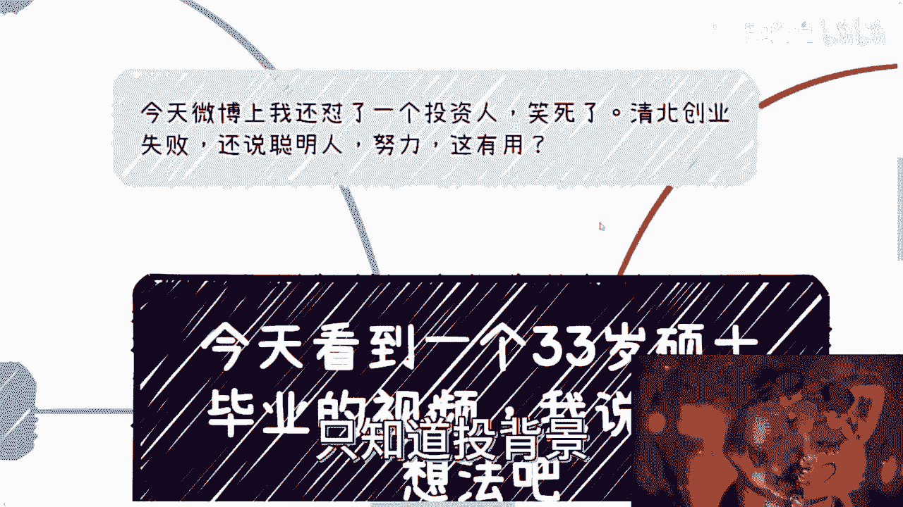
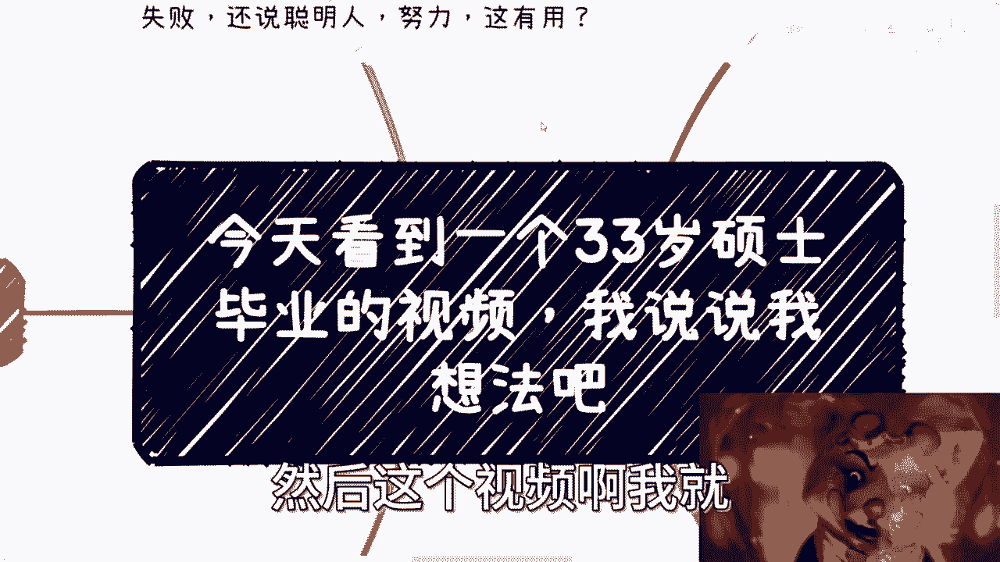
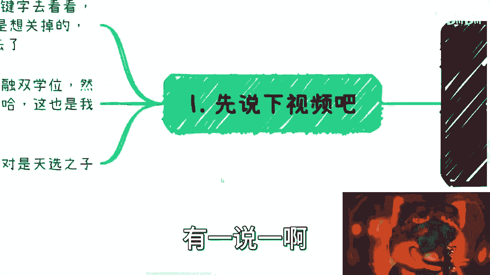
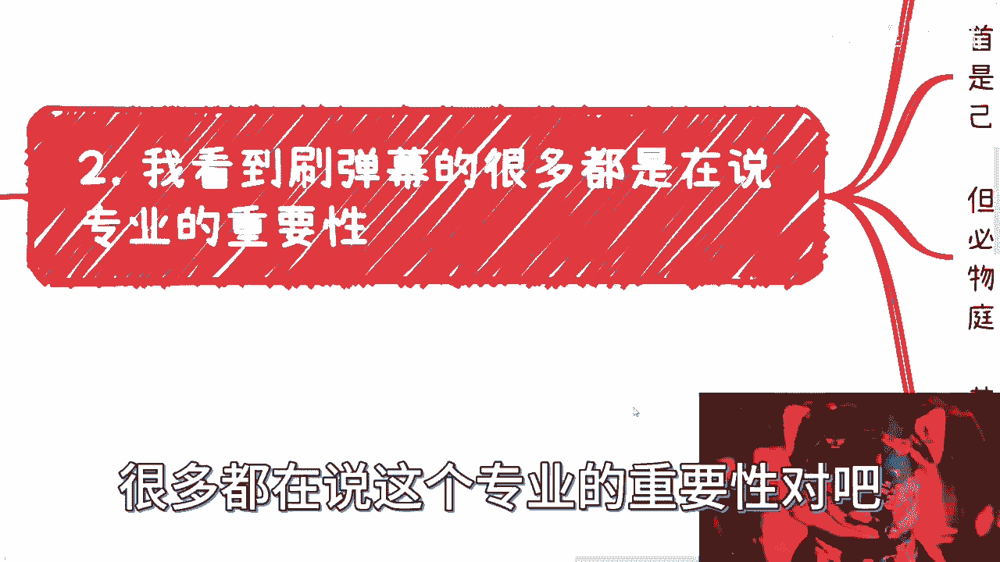
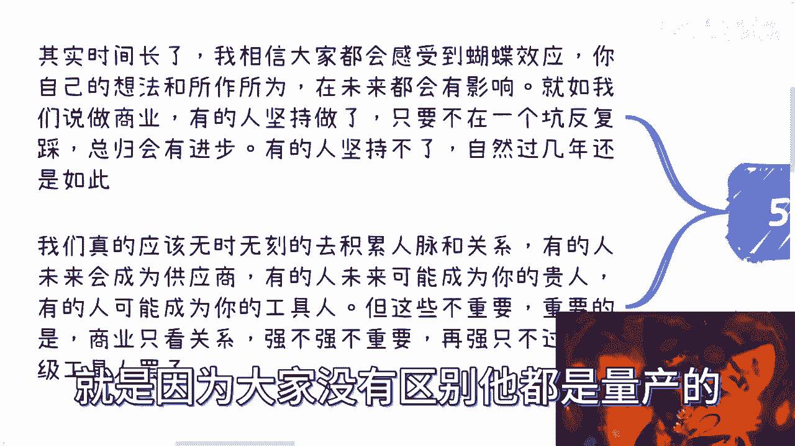
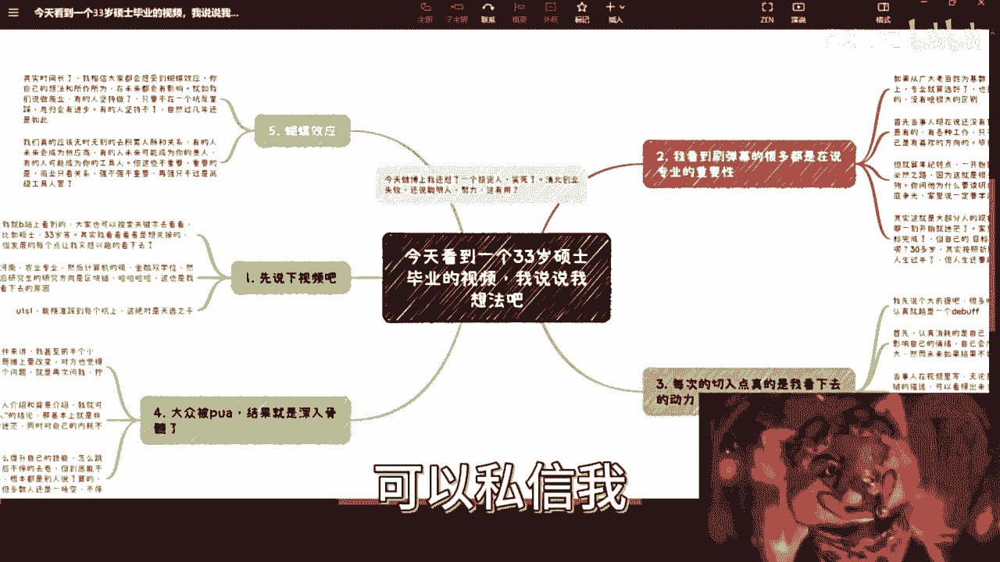

# 今天看到一个33岁硕士毕业的视频，我说说我建议 - P1 - 赏味不足 - BV1iX4y177uV

哦哦大家好，今天不是太舒服啊，所以我就声音讲得轻一点啊。

首先呢先说一个事啊，今天早上我在微博这边看到一个，看到一个内容啊，然后怼了一个投资人，你要笑死了，就是说他是说什么呢，他说连续投了这个三次啊，这个清北的啊，然后说什么失败了啊，然后说人家很努力啊。

聪明人怎么样，我就直接转发嘛，我说你要赚钱，你要做商业，首先你清北有卵用对吧，另外一方面你跟我说，聪明人认认真真干活，有什么用也没用啊，对不对，商业看的是这些吗，不是啊，对不对，你说你连续投三次。

那不是你傻吗，他妈怪谁啊，啊就我跟你们讲，现在人呢很多人什么老板啊，投资人都是的啊，就是自己其实已经old fashion，就是非常的不接地气，也已经被时代抛弃了啊。

然后也不懂得如何去真正的判断一个项目，好朋友只知道投背景。

那这种人他妈的不被割，谁被割对吧啊，那么今天呢来说一个，我正好这个不舒服嘛，就在那边看视频啊，看到一个三有就是33岁这个硕士毕业啊，然后这个视频啊我就想着也蛮想说说的。

先说一下这个视频，我在B站上看的，你们在B站上去搜这个关键字，你们肯定也搜得到啊，可以搜得到，你们可以看一下，也不长五分多钟吧，其实呢我一开始看着是想关掉的啊，但是好巧不巧啊，当事人这个每个节点都有。

有点让我感兴趣看下去的这个动力，你看啊河南对吧，农业啊，计算机金融，然后研究生研究研究生方向，研究生区块链对吧，就我就觉得啊，这也是我看下去的原因是吧，有一说一啊，能精准的踩到每一个风口。

也同时又是坑上，这绝对是天选之子啊，有一说一啊。

好能往我们往下看嗯，我看了很多刷弹幕能量。

很多都在说这个专业的重要性对吧，说张雪峰啊拯救人民群众对吧，呃没毛病啊，我一向是支持张雪峰的，这个没毛病啊，但是啊呃如果你从广大老百姓为基数啊，以中国14亿人啊，这么一个老百姓这个数量为基础。

你是放在这个视频的这个当事人身上，你就这么想，专业就算选好了，其实他结果也大差不差，当然就说因为他当中有些有有有很多复读嘛，对吧，他中考啊，高考都复读了啊，那么这个呢也是就我说这个大差不差的原因啊。

如果正常来说呢，我觉得还行啊还行，可能还有那么点发展空间啊，但现在从这个当事人的情况来讲，我觉得是大差不差的，你就算选了第一个不是农业又怎么地呢啊，就是说首先啊，你看当事人现在说还没有找到工作对吧。

也希望大家给点建议，我觉得本质上工作是有的啊，我不是说一定要拧螺丝，一定要去工厂对吧，我就说互联网这种工作，在中国各土地商业互联网的工作肯定好找的啊，只不过就是说你是不是会对自己有一定要求。

有没有自己喜欢方向，毕竟我相信一个对吧，比如说啊硕士对吧，或者未来的博士对吧，他毕业之后他肯定要去想啊对吧，我读我读书的沉没成本有多高对吧，我今年都换了这么多年了。

难道你让我现在就找一个跟本科一样的工作吗，那我也不愿意对吧，这个也是正常的啊，但是就是说就是说嗯我想听一，也就是说人呢最难的是什么，就是对社会对市场有个客观的评价，同时对自己又有一个客观的评价啊。

就是所谓识时务者为俊杰对吧，就是能屈能伸是吧，而且就是说战略要对战术无所谓啊，所以就是你会发现就是从当事人这个情况来讲，刚刚我说的这三点基本上都没切中对吧，因为你大战略其实是错的对吧。

然后就是说能屈能伸吧，也没有对吧，然后你说是不是对客观的事实，市场有评价有认知，我跟你讲肯定也没有，那么我们就说啊，就算年纪轻一点，其实一开始就算是计算机专业，你读研其实还是必然之路，为什么。

因为我跟你们这么说吧，到现在为止跟我咨询下来的，在我看来被家里PUA最惨的就是河南，别的地方我有吗，有的没这么多的比例啊，我可以告诉你们，河南简直是就无解，我碰到很多那个小伙伴，我也问了吗。

我说你老家哪里，他说河南我就会多问两句，你知道吗，就河南那边给他们给我的说法，就是说普遍都很穷啊，普遍家里面都很PUA，那PUA的点就是说你必须要赚钱，对你必须就是就是要读研，必须要读博。

反正你学历就得往上卷啊，就是就是说白了就是为家庭争光啊，家里说一定要学历高，然后呢啊然后呢还有一点就是重男轻女啊，重男轻女非常严重啊，已导致就说就说找我的，这些就是河南的这个小姑娘里面。

就是有的想高中辍学的，有这种，有的想大学辍学的，就是那种就是那种就是说我感觉啊，就是他们向我在发出呐喊，但这种呐喊就是说我其实不想这样，但是我的脑子，我的思想我没法一下子改变，这个其实也是悲哀的地方。

啊所以说呢其实我跟你说，这个也是大部分人的一个现状，因为当你就会发现，其实人生呢其实大家都是有人生目标的啊，只不过有的目标不是你的对吧，你比如说当人生的目标完成的那一刻，其实他就迷茫了，为什么。

因为你可能读完硕了，也可能读完博了，然后呢对吧，你家里的目标完成了，父母的目标完成了，那你自己的目标是什么呢，不知道啊对吧，那不知道接下来是什么，就是随波逐流，而且那个时候可能也30多岁对吧。

其实你按照你这个人的这个能试错的成本啊，能试错成本的时间或者能政策等时间角度来讲，基本上人生已经过半了，你知道吗，但是你要明白一点，就是目标，也许你完成了，或者说你完成任务对吧，但是你人生是要继续的。

就是对你爸妈来讲对吧，你的学历OK了，或者你找了个人结婚了，你也觉得OK了对吧，但是对他们来讲可能哎呀心满意足对吧，接下来就是就是抱抱孙子对吧，这个看看生个孩子，但对你来讲不是这样子。

就很多人其实他不知道自己要什么，但是其实真正的你说他完全的摆烂嘛也没有，其实他想要啊，那么每次呢这个切入点也真的是，我看下去动力对吧，就我刚刚也说了啊，就计算机金融区块链啊，你说我说大学题啊。

首先很多时候对当事人也提到了，他是个非常认知的一个人啊，他做事情很认真，包括从各种复读来讲，他就是个很认真的对吧，那但是呢包括最近找我咨询也是一样的，很多时候认知是个DEBUFF。

你越认真越是个DEBUFF啊，首先呢认知本身其实是消耗的是自己，不是别人啊，你你别以别指望着说啊，你今天认真了，你老板知道你的导师指导别人，你朋友知道不知道的，别人根本不知道。

而且每个人对认知的衡量度不一样，你觉得啊你好像很认知对吧，或者很怎么样，但可能别人觉得也就那样对吧，但是别人怎么样并不重要，重要的是你自己的这个认知，你会影响你的情绪，你会消耗你的情绪。

然后精神上压力也会很大，然而呢如果未来结果不如意啊，其实反噬也会很大，就是你结果越是与你的期望值差别大，那么你可能所遭受的遭受的这个，精神打击也会更大，那么当事人在视频里面呢也许也说到啊。

无论计算机金融还是区块链的描述，可以看得出来，就当事人这个事情做事是非常认真的，当然啊就是有时候我们说认真归认真，效率高不高啊，我们不说方法对不对，我们也不说，但至少非常认真。

然而我们来看一下这三个任务，非常感兴趣的点对吧，就是金融对吧，就是这个计算机跟区块链，对不对，你会发现这三个东西无论哪个点都是当下，应该说所有领域里面最赚钱的核心领域，没有之一啊，没有之一。

我可以说这三个简直是切到了top one到top three啊，那么简直我跟你讲就比印钞都要快，但是你会发现我们说赚钱，我们说嗯不是赚辛苦钱，就赚这个性价比高的钱，这是靠认知跟工作能赚得到的吗。

啊我觉得这个案例就非常好，就是你认知这种工作在这几个领域里面，明明是很能赚钱的地方，但赚到了吗，你赚不到，而且大部分人都赚不到对吧，你打工你说有没有人打个工好，你比如说中金对吧，或者其他的有啊。

有的没毛病啊，但是你打工去头去尾对吧，中间的那部分还是非常苦的，就是你不能拿个例来说嘛对吧，中间那部分还是非常苦的，你会发现这三个点几乎都在风口上，我不说多多大的风口，就可能是风口的末期对吧。

也可能是风口的早期，我跟你说，按照他33岁的这个年龄，他当时的这个时间点一定都是在风口上的啊，但是毫无疑问浪费了机会对吧，但是你会让他浪费机会，他觉得嘛他不会这么觉得，你知道吗。

因为他认知他觉得我的人生，或者说大家人生做事情就应该这么做的，在他的认知里面没有第二条路啊，他就觉得我就应该这样子，所以才能赚到钱，然而并不是对吧，前几天我在评论区，说得很清楚，我说前景好不好。

一个行业前景好不好，跟工作的人没有关系对吧，甚至跟你所打工的老板也没有关系，我们说有没有前景，跟你有没有关系，天时地利人和，缺一不可，什么意思，就是时机要好对吧，你要有合适的项目，你得有合适的合作伙伴。

同时你还有你对你自己来讲，你要有合适的积累，你的认知能配得上当时的风口，这个是很难的，而且这个东西其实是需要积累的，不是说啊这个这个这个有很多人就说哎呀，我怎么没把握住机会，你把握不了。

我把机会放你面前，你也把握不了，啊那么我们来看第四个啊，大众被PUA，就拿找我咨询的广东小伙伴来讲，我甚至在一个小时里面我会花半个小时对啊，通过各种案例其实说明了思维上是要改变的，我跟你讲啊。

对方也觉得是需要改变的，就大家是达成共识的，然而你会发现到他问我下一个问题的时候，他就再次会问我，就是拧螺丝怎么拧，你知道吗，就是人就是这样子的，就是潜移默化的意识的确很难改变哦。

你就像今天有个小伙伴问我，他说我要去微博三对吧，那微博三呃我应该怎么去了解整个行业对吧，他说我先从这个solidity对吧，智能合约了解怎么样，我说大哥对吧，你要了解个行业，你去了解里面拧拧螺丝怎么拧。

有用的啦，没有用的，你你拧了两年，你还是不知道行业怎么样对吧，而且我说你半路出家，你是比别人好在什么地方呢，就是你一开始的行为，一开始的切入点就是错误的，然后你的努力其实都是白费的，你知道吗啊。

那么你看啊，我现在看一个人给我介绍，还有背景介绍，我基本上就可以得出来了，这个人是好人啊，以及老实人的这么一个结论啊，那基本上我可以跟你讲，他就是个非常苦的状态，为什么，因为他要工作，他对未来还迷茫啊。

同时呢还对自己是内耗不断的，因为只有好人和老实人才会这样子，那么我们再来说大众考虑是什么，大众考虑就是我应该怎么提升自己的技能对吧，怎么跳槽啊，怎么多赚点钱啊，然后不停的去卷，但到底能不能跳槽。

你就想啊，你跳槽能不能成功，能不能做，多赚点钱，根本不是你能决定的，是别人决定的，对不对，那么也许啊我们说有的人能达到目标，但是剩下的80%甚至90%的人，最终还是一场空。

然后他还要不停地面对内心的骄傲煎熬，要包括家里的这个challenge啊对吧，包括你的这个婚姻啊对吧，各个方面就到最后他会越来越烦对吧，但是你会发现问题在哪，问题在于他一开始的方向就不对。

啊所以啊就是说呃其实时间长了，我相信大家都会感受到一种蝴蝶效应，也就是说你自己的想法跟你的所作所为，你当下的积累和当下的这些思维，在未来对你都会有影响，你知道吗，就是你20岁所做的积累。

25岁所做的积累，你所出去闯的认知的各种各样的人，所谈的各种各样的话，他会在30岁，30多岁都给你反馈，一定会有的，你知道吗，就像我们说做商业，有的人我跟你讲，坚持做，他只要不是在一个坑反复去踩。

他总归是有进步的啊，包括融资啊，包括法务财务啊对吧，包括这个产品打磨啊啊投资人想要什么，他总归会有进步的，但是你不积累，你不去，你不去实践，你永远没有进步，纸上谈兵没有任何用处啊，我跟你讲。

我们每个人其实都应该，无时无刻的去积累人脉和关系，因为你要知道你现在积累的这些人，有的人未来会成为大佬，有的人会成为供应商人，有的人会成为你的贵人，有的人会成为你的工具人，但这些并不重要。

重要的是对于赚钱来讲，一切只看关系，你这个人牛不牛逼，你的技能点点的强不强，这并不重要，因为你的技能只要不是全球，就只要不是像比如说韦神这种对吧，你没有意义的呀对吧，你再强只不过就是个高级工具人。

而且这种高级工具人在我看来，在社会来讲它就是个量产物，你知道吗，你除了性格不一样，性别不一样对吧，爱好不一样，你对资本家来讲，你都是量产产品，我为什么说叫电池啊。

就是因为大家没有区别啊，它都是量产的，所以说你在一个以你以一个量产物的角色去卷，你想会有结果吗，不会有结果的对吧，所以你说如果你拿我的角度来讲，你说我要给这个33岁的硕士对吧，你说什么建议。

我觉得也很简单，就是你学什么已经不重要了，你做什么也不重要了啊，我觉得你应该花那么一两年，真真切切的去明白人是怎么样的一个生活，社会是怎么运作的对吧，国家又是怎么运作的对吧。

包括就是说我们说的省市区政府对吧，到底日常跟你专业有关的，还有哪些事情对吧，你哪怕哪怕是跪着，别人跪着求别人对吧，免费做，你也得尽可能的去了解，然而从而就是说从根本上面去改变你的想法哦。

否则你说一条路往下去走，没有用的，没有任何用的，谁给建议都是白搭，你知道吗，就是今天比如说我们给一个建议，他能够找到一份工作也很不错，我跟你讲过了若干年还是一个结果啊，可能过弱冠年又换了个标题。

然后就是自己还是很焦虑，没有任何区别的，哎呀我只希望吧，就是嗯前半生已经为了家庭而活，后半生为自己而活啊。

行吧，那个好吧，反正大家有这个职业规划的，或者说大家对于对于手上牌不知道怎么打的啊，对于这个未来有什么想法呢，有任何的这个这个这个这个资源需要整理的，好吧。

