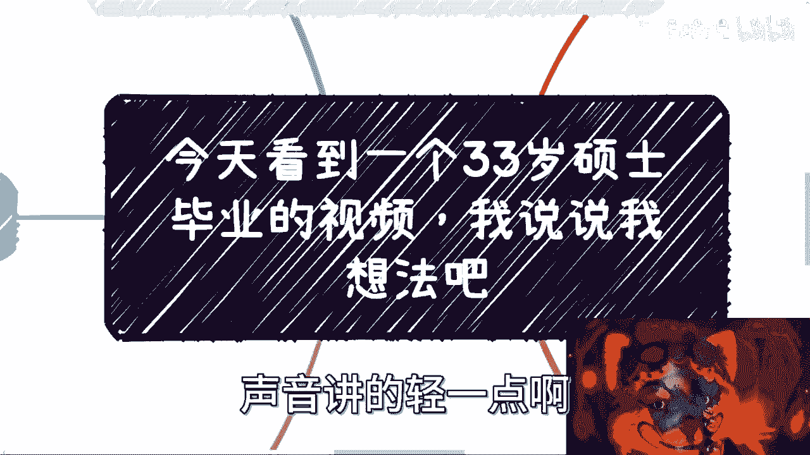

# 今天看到一个33岁硕士毕业的视频-我说说我建议---P1---赏味不足---BV1iX4y177uV

在本节课中，我们将通过分析一个“33岁硕士毕业生”的典型案例，探讨个人职业发展中的常见误区与核心问题。我们将解析为何高学历、认真努力有时却无法带来预期的职业成功，并指出改变的关键不在于“如何拧螺丝”，而在于“如何看清全局”。

---

## 一、 案例背景与核心问题

今天在B站看到一个视频，内容是一位33岁的硕士毕业生分享自己的经历。他来自河南，本科学农业，研究生跨考到计算机，研究方向是金融区块链。他中考、高考均经历过复读，目前仍未找到理想工作，并向网友寻求建议。

这个案例之所以典型，是因为当事人几乎精准地踩中了近年的每一个“风口”领域（农业、计算机、金融、区块链），但结果却不如人意。这引出了一个核心问题：**为何选择了看似正确的赛道，付出了巨大的努力，却依然陷入困境？**

---

## 二、 对案例的深度剖析

上一节我们介绍了案例背景，本节中我们来看看导致其现状的几个深层次原因。

### 1. 战略失误：目标与路径的错配
当事人的人生目标很大程度上是家庭和社会赋予的（如“必须读研读博”、“为家庭争光”），而非源于自我驱动。当“完成学历”这个外部目标达成后，他陷入了迷茫。其发展路径是**战术上勤奋（认真复读、学习），但战略上错误（盲目追逐风口，缺乏自我规划）**。

### 2. 认知偏差：将“努力”等同于“回报”
当事人做事非常认真，这是一个优点。但在商业社会，**回报 ≠ 努力 × 认真**。尤其在计算机、金融、区块链这些高回报领域，赚钱的逻辑往往不是线性的辛苦工作，而是对时机、资源、关系和商业逻辑的把握。单纯的“认知”和“努力”在这些领域是**必要不充分条件**。

### 3. 环境与思维惯性：难以摆脱的“PUA”与路径依赖
当事人来自河南，他提到当地普遍存在家庭“PUA”现象：极度重视学历、重男轻女、要求子女必须为家庭争光。这种环境塑造了一种思维定式：人生是一条必须按部就班完成的“任务清单”。即使意识到需要改变，但在具体行动时，又会下意识地回到“如何更好地拧螺丝”（如：我该学什么具体技术？）的老路上。这种**思维惯性是改变的最大障碍**。

### 4. 自我与市场认知的双重缺失
个人发展需要两个客观评价：**对市场社会的客观评价**与**对自我的客观评价**。案例中，当事人既未看清风口行业的真实运作规则（非技术驱动，而是资源与时机驱动），也未能客观评估自己的核心优势与真正诉求，导致选择与自身特质脱节。

---

## 三、 给迷茫者的核心建议

基于以上分析，我们可以得出一些超越具体技能学习的根本性建议。

以下是几条核心行动建议：

1.  **暂停“执行”，先“重构认知”**
    暂时放下“下一步该学什么技术”或“找什么工作”的具体问题。你需要用一两年时间，真正去理解社会、商业和人是如何运作的。哪怕从最基础、甚至免费的工作开始，也要去接触真实世界的运行规则。

2.  **积累“关系”，而非仅仅“技能”**
    在职业发展中，**关系网的价值 > 技能点的价值**。除非你的技能达到全球顶尖水平（如韦神），否则在雇主眼中，熟练工更多是“可量产”的资源。有意识地去积累人脉，认识未来可能成为伙伴、贵人甚至竞争对手的人，这些关系会在未来产生意想不到的链接与机会。其价值模型可以简化为：
    `未来机会 = ƒ(技能， 时机， 人际关系， 认知水平)`

3.  **完成从“为他人目标而活”到“为自己而活”的转变**
    前半生可能为满足家庭和社会的期望而活。后半生，你需要找到自己的内在目标。这意味着要勇敢地对不符合自身发展的“任务清单”说不，并承担自我选择带来的所有责任。

4.  **接受“实践出真知”，敢于试错**
    商业嗅觉、人际判断、机会把握这些能力无法从书本完美获得。核心公式是：**真知 = 理论 × 实践**。就像创业，只有真正去谈融资、打磨产品、接触客户，才能获得无法替代的认知进步。避免陷入“纸上谈兵”的无限准备循环。

---

## 四、 总结与共勉

本节课中，我们一起学习了一个高学历却陷入职业困境的典型案例。我们分析了其背后**战略错配、认知偏差、思维惯性及双重认知缺失**四大核心问题。

最终的结论是：当发展陷入瓶颈时，关键解药往往不在“如何更努力地拧螺丝”，而在于**跳出原有框架，重构对社会与自我的认知，并勇敢地积累实践与人脉**。职业发展是一场复杂系统游戏，单一维度的优化（如学历、技能）效果有限，需要多维度的战略布局。

希望这位33岁的硕士，以及所有面临类似困惑的朋友，能打破思维枷锁，前半生为他人，后半生真正为自己而活。