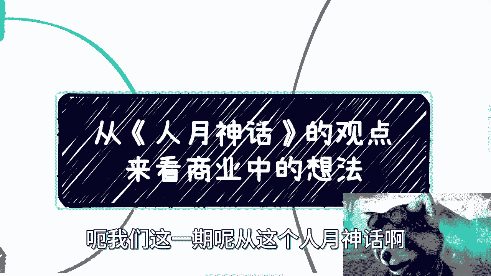
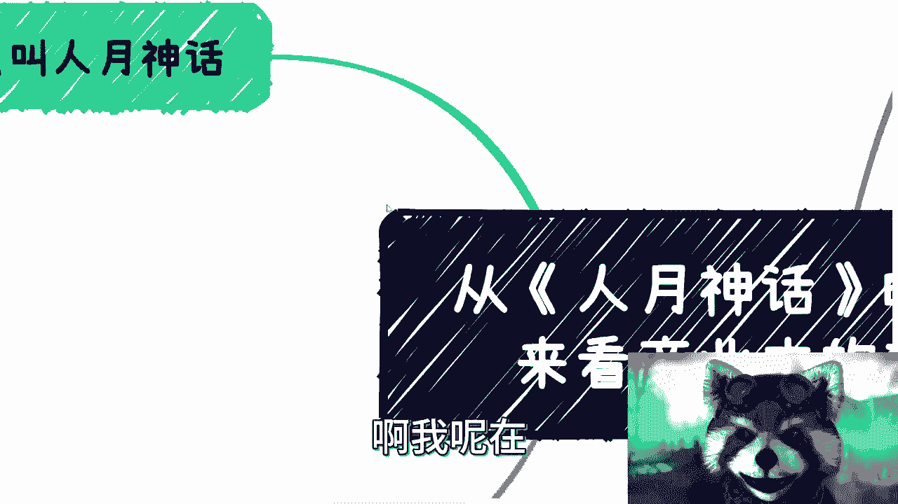
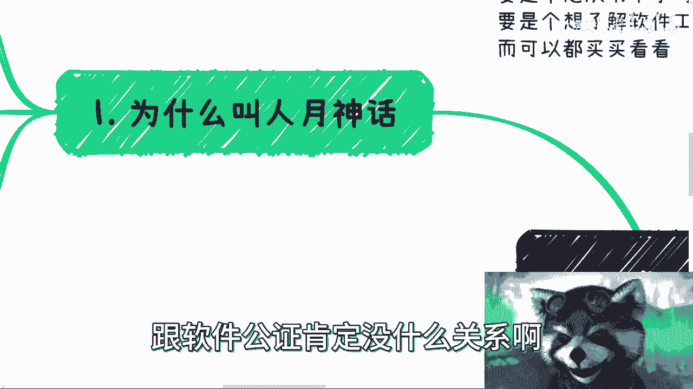
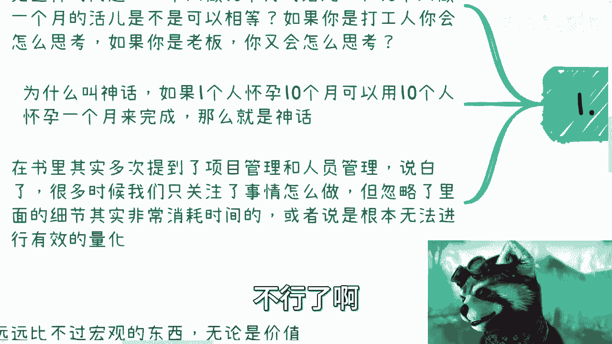
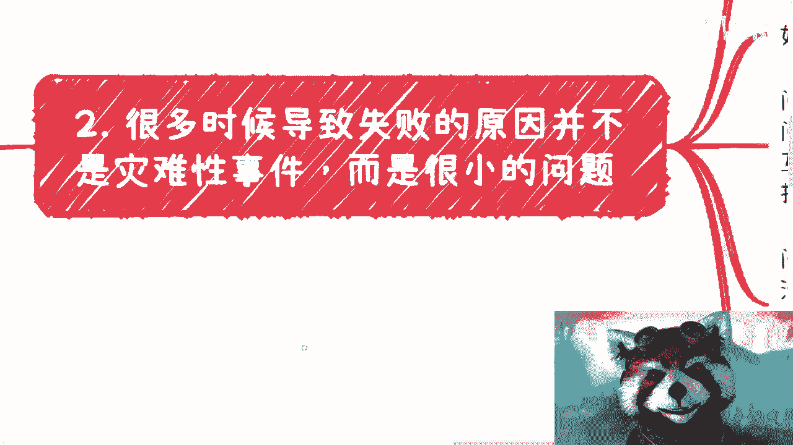
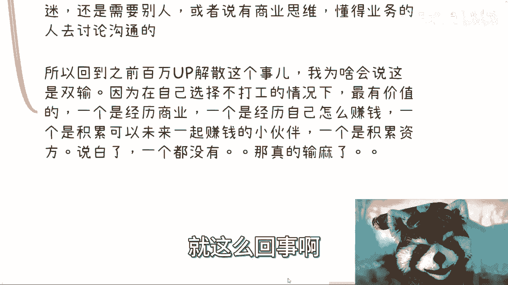
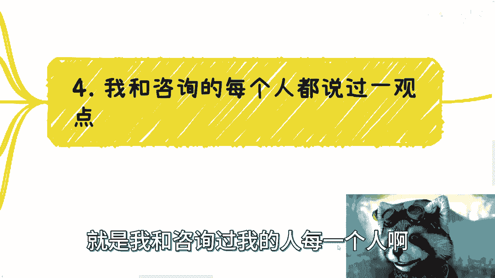
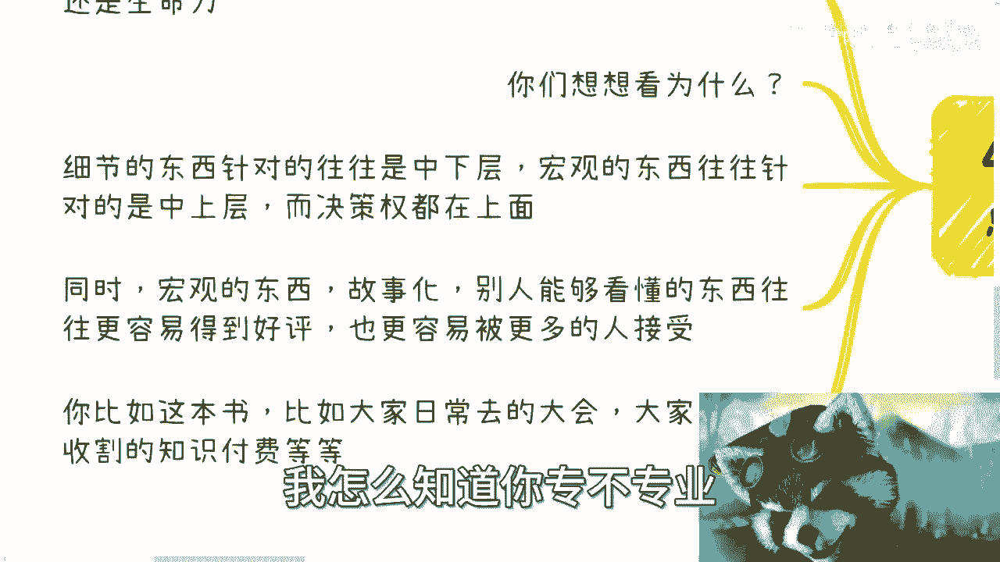
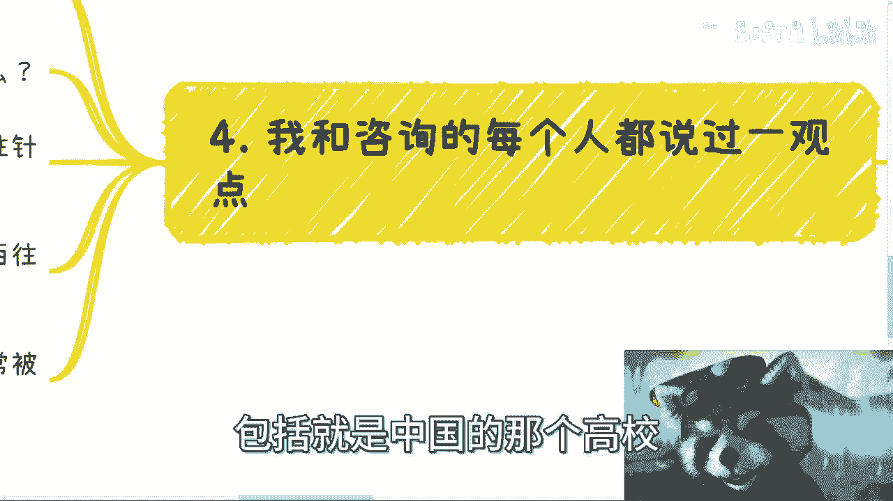
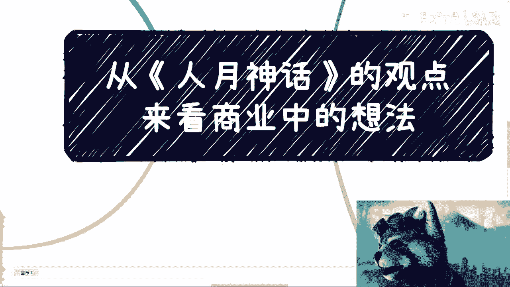

# 从-人月神话-的观点来窥探商业中的运用---P1---赏味不足---BV1Hp4y1J7eB_not

在本节课中，我们将从经典著作《人月神话》出发，探讨其中超越软件工程领域的核心观点，并将其应用于更广泛的商业实践。我们将重点关注项目管理、团队协作以及商业思维的本质。

---

## 一、 “人月神话”的由来与核心误区

《人月神话》一书虽然从软件工程领域切入，但其核心思想在许多其他领域同样适用。书名中的“人月”是一个工作量评估单位，指一个人一个月的工作量。

**核心误区公式**：
`10个人 × 1个月 ≠ 1个人 × 10个月`

这个公式揭示了一个常见的管理误区：许多创业者或管理者会错误地认为，任务所需的时间可以通过单纯增加人手来线性缩短。就像“一个人怀孕需要十个月，但十个人并不能在一个月内完成怀孕”一样，许多创造性、逻辑性强或依赖紧密协作的工作，其时间是无法通过堆叠人力来压缩的。这种认为人力与时间可以简单互换的想法，本身就是一种“神话”。

许多初创公司的管理者容易陷入这个误区，源于对项目管理和执行细节缺乏深入了解。他们往往只关注“要做什么事”，而忽略了“如何做成这件事”过程中的复杂性与协作成本。

---

## 二、 失败源于细节的累积，而非单一灾难

上一节我们探讨了资源规划的误区，本节中我们来看看项目失败的根源。书中指出，项目进度偏离计划，很少是因为突发的、灾难性的“龙卷风”，而更多是由于无数细小“白蚁”的持续啃噬所导致。

在商业实践中，最终的失败（如产品滞销、项目亏损）往往不是最后一个环节出了问题，而是整个执行过程中无数小问题的累积结果。这些问题大多源于内部。

以下是导致商业失败的几个常见内部问题来源：

*   **团队内部问题**：沟通不畅、目标不一致、发现问题隐瞒不报、相互推诿责任、不懂得及时止损。
*   **合作方问题**：沟通效率低下、会议冗长无效、各方过于维护自身利益而难以达成共识、缺乏打破僵局的勇气。
*   **交付与执行问题**：对合同条款理解不一致，或在实际交付产品、服务时质量失控。即使初期方案获得认可，若后期执行“虚”得不够专业，无法在既定框架内满足客户预期，也会导致验收失败。

真正的挑战往往来自内部协作与执行细节，而非外部竞争环境。

---

## 三、 人是商业成功的第一要素

我们讨论了流程和细节的重要性，但所有这一切的基础都是“人”。书中强调，在项目中，“人几乎就是一切”。这一观点在商业中同样成立：合适的合作伙伴比具体的商业模式或项目本身更为重要。

**核心观点**：`成功 ≈ 对的人 + 对的协作`

以下是关于“人”这一要素的两个关键认知：

1.  **个人能力的局限与团队的价值**：个人的时间和精力是有限的。要想扩大事业规模，必须依靠团队。寻找可靠、可信、能够长期合作的伙伴，是比钻研具体业务技能更重要的能力。一个各有所长的团队，其综合能力远胜于任何一个全能的个体。
2.  **“人”对试错效率的决定性作用**：拥有对商业有深刻理解、能果断决策的伙伴，可以帮助团队更快地验证方向、及时止损、调整战略。在充满不确定性的商业探索中，与“对的人”讨论，听取多元、接地气的意见，远比沉迷于网络上的宏观趋势分析更有价值。

商业模式可以调整，项目可以更换，但只要核心团队“人”是对的，拥有共同的信念和协作能力，成功只是时间问题。

---

## 四、 宏观叙事比细节技术更具商业生命力

最后，我们结合国内商业环境，探讨一个现实策略。在与众多咨询者交流后，一个反复被验证的观点是：在国内，宏观的、框架性的思维与内容，其商业价值和生命力往往超过具体的技术细节。

**价值对比公式**：
`宏观叙事（面向中上层决策者）的商业潜力 > 细节技术（面向中下层执行者）`

原因在于：
*   **受众与决策权**：宏观内容（如行业趋势、商业模式、经济逻辑）更容易被拥有决策权和预算的中上层管理者所理解和接受。而具体技术细节的受众面相对较窄。
*   **接受度与容错率**：宏观叙事易于包装成故事，听起来更具启发性，且因其不涉及具体操作，不易被挑出细节错误，听众的“获得感”更强。反之，深度的技术讲解可能因听众背景知识不足而难以获得共鸣。

因此，在构建个人商业价值或选择赛道时，需要思考你的输出是更偏向于“宏观”还是“细节”。例如，在教育培训领域，面向职业院校（更侧重技能应用）的商业模式可能比面向顶尖高校（更侧重理论基础）更容易实现商业化；同样，提供商业战略咨询的价值和定价，也可能高于单一的技术技能培训。

这要求所有进入商业领域的人，保持“空杯心态”，抛弃学生时代对“技术至上”的执着，重新以敬畏之心去理解市场的真实运行规则和需求层次。

---

## 总结

本节课中，我们一起学习了从《人月神话》中提炼出的四个商业核心原则：
1.  摒弃“人月神话”思维，理解复杂工作的非线性协作成本。
2.  警惕细节的“白蚁效应”，商业失败多是内部小问题累积所致。
3.  确立“人是一切”的认知，寻找并维系可靠的合作伙伴是首要任务。
4.  在中国商业语境下，理解并善用宏观叙事往往比钻研细节技术更具市场价值。

希望这些观点能帮助你构建更务实、更有效的商业思维框架。