# 从0到1咨询盈利篇1：如何切入咨询行业，如何获取流量 - P1 - 赏味不足 - BV1NC4y1f76A

好啊大家好啊，这次充电篇开始呢，我要新开几个篇章啊，我打算把不同的这个领域把它分开来，所以呢我会在标题上写好，就说是从0~1啊，咨询对吧，还是自媒体还是其他的，反正我能想到的呢，或者我大概知道呢。

我可以跟大家讲一下，模式上呢其实大差不差的啊，但是就比如说我这边写这个一啊，我不代表我一定想得出二是什么，但无所谓，一先写着对吧，反正万一有二的时候，这一不写就有点傻是吧啊啊行。

那么我们本次呢就这个内容呢，是说个人如何切入咨询行业，如何获取咨询的流量啊，呃首先是这样子，首先呢我先说一下咨询行业的这个好处啊。

或者说一些这个怎么说呢，对吧，潜规则是吧哈哈呃。

可以说自由度非常高啊，高到就是你们每次都觉得我很忙，但是我每次都在打游戏对吧，你比如说我最终幻想就装了一个礼拜，现在他妈游戏时间都他妈快超过40个小时了，我也不知道我在干什么对吧啊，这是第一点。

第二点呢就是说由于行业不同，内容不同，咨询的方式也很不同啊，就像我跟你们说的对吧，就是政府跟高校，包括企业找我咨询对吧，就是那他不可能365天找我吧是吧，而且他365天找我，那不得了了。

如果按照我那个价格，我我可以退休了，是不是，那不可能啊对吧，但是相对来讲啊，就是他们一年找我呢，这个也就那么几次，但几次呢，也够你们那些什么996007的年薪了，反正也都大差不差啊。

所以你说我能忙到什么地方去呢，我又不忙，我又一不做销售，而不是商务，我能忙什么东西，我每天忙着去打游戏，操对啊，那么呃由于行业不同啊，我说过了，是我傻了啊，有的呢是驻场咨询啊，有的是短期咨询。

有的是技术咨询，有的是宏观咨询啊，也就是说咨询这个东西老多老多了对吧，还有就是专家那种知识付费的，还有就是收割C端韭菜的啊，有的类似于像咨询服务的，哎呀多了去了对吧，你看我作为一个充电视频。

我就放开很多对吧，不会这么拘束是吧，那大家要明白啊，咨询的核心并不在于你真的懂多少东西啊，一定要明白啊，这个东西是最大的bug啊，呃你要明白，咨询本身是要让社会跟市场里面的人啊。

无论是这个人还是组织还是这个对方啊，就是说感觉到你懂很多东西，以及你能满足对方的情绪价值啊，就比如说我去招行，我去中行，我去滴滴，我去BT对吧，呃一般啊大的公司你做完培训呢，他都会给你打分啊。

然后呢像有些培训公司呢，也会根据分数来给我这个啊报酬啊，有些分数低呢，他报酬就会扣啊，所以说你会明白一点啊，就是说呃在短期内，比如说一两天三四天内，你想把一个技术讲到对方懂，那是不可能的。

但是你安抚好对方的情绪价值，哎，那就很可疑对吧，所以这个是核心，一定要明白这个是核心啊，然后咨询和本身的性价比很高啊，一般的入门咨询性价比也比打工很高，呃我给你们举个例子啊，就比如说技术层面，技术层面。

比如说前端后端就做技术的这种，你一般入场啊，呃你报价报个一天五六千差不多了啊，再低不可能啊，你再低就就要么是那样，就说你你说我在上海对吧，那我可能会高一点，你说再低吧。

那有可能就是往真的三四线城市跑了啊，那当然也行啦对吧，你要一天三四千，那他妈也比你打工靠谱是吧，那你要说高的话，那我跟你讲就没上限了，没上限啊。

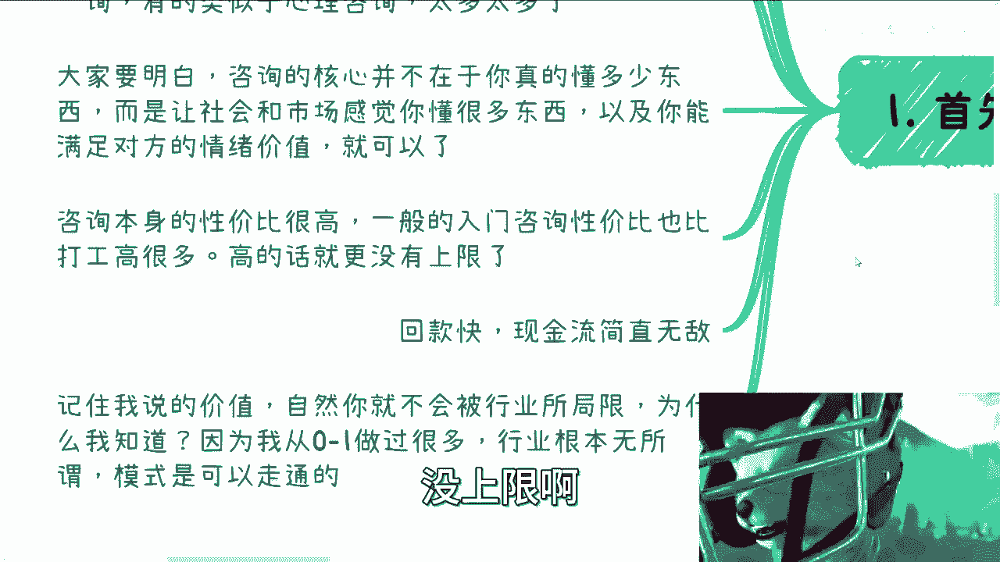

当然也有个上限啊，我反正知道最高呢一天嘛大概小几10万吧，三四十万吧啊，那回款快呢，呃那个优点还有一个优点呢，就是说他回款快对吧，性价比很高啊，现金流无敌啊，就一般来讲最多就一个月不会超过一个月的啊。

呃所以记住我说的价值啊，就是我这个地方我框出来了对吧，就这个地方的价值啊，就自然你不会被行业所局限，为什么我知道呢，因为我从零做过，我，我从0~1做过不同的行业，就是我把我曾经把我以前的积累全部舍弃掉。

然后我什么都没有，我0~1我照样能做起来，为什么，因为你方法论正确对吧，那当然了，没有一个固定的方法论对吧，这个东西唉怎么说呢，我我我正在尝试把它这个说出来，但是我也不知道我能不能说出来。

当然我说的能不能说，我能不能很好的把它描述出来啊。

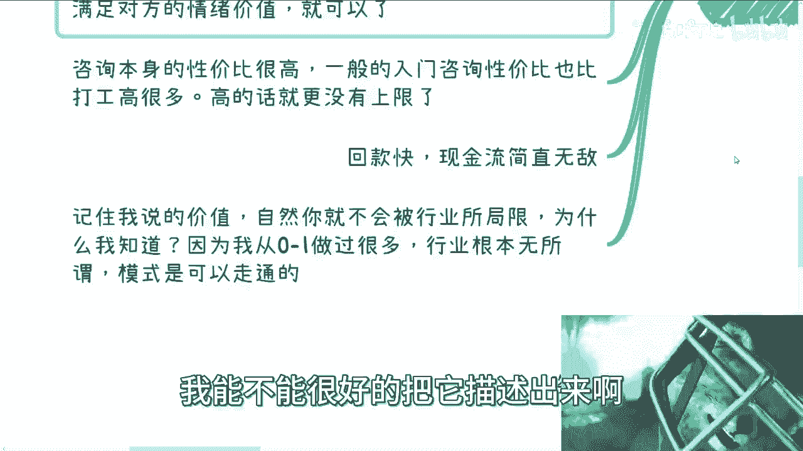

那么行业根本无所谓啊，模式走通就可以了好吧，那这是第一点，第二点呢说正题啊。

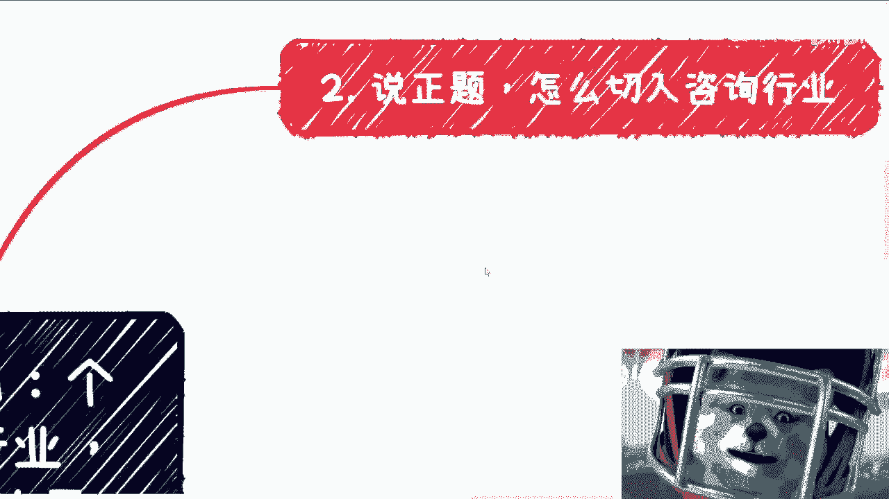

怎么切入咨询行业啊，呃你可以选择入职一家咨询公司，你也可以选择兼职，就跟我以前一开始一样啊，那这个跟我看来呢关系不是特别大啊。

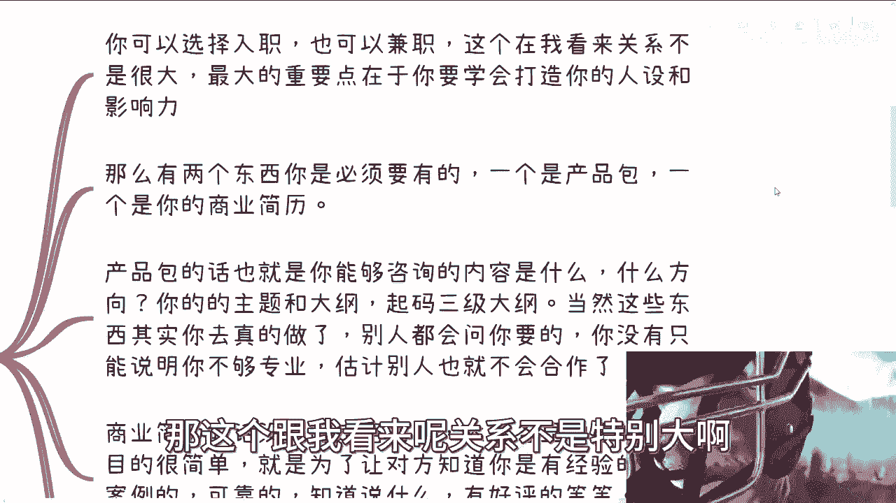

最大的重点在于，你要学会打造你的人设和影响力啊，那么这两个东西呢有两个东西呢，你是必须要有的，一个是产品包，一个是你的商业简历，那既然我们说咨询呢，其实也是一种做商业的过程啊，那么你就必须要有产品包。

你不能跑出去说啊，我空中就在那边靠张嘴，那不行的对吧，你你你你就像昨天有个评论区小伙伴问我说啊，我这个别人以貌以貌取向，是不是代表lo很低，那你这个要看场合对吧，你说我今天要去建个市场，你穿个拖鞋去。

你觉得合适吗对吧，你要看场合啊对吧，有些地方你有些时候你做得好对吧，代表你尊重对方，有些时候你做的不好啊，其实无所谓，因为这个场合也不看重对吧，但是你要开始白kiss，你不能清一色的一刀切啊对吧。

那么我们说你做商业，那么自然而然就得有产品包，产品包的话呢也是你能够咨询的内容啊，什么方向，比如说你的主题啊，你的大纲啊，而且起码三级大纲啊，你别做出来像小学作文一样的东西啊，这个没人看的。

当然这些东西呢其实你真的去做啊，你真的去做了什么意思啊，就是真的你要去做咨询了，你跟别人对接呃，无论是客户还是中间商，他一定也会问你要的啊，但是你不能没有对吧，你不能别人问你啊，你说啊我准备一下。

卧槽那他妈人家慌了，一看就没做过对吧，那他妈谁敢合作是吧，那估计别人不敢合作啊，那么商业简历呢没有固定格式啊。

大家各显神通呃，但是目的很简单，他就是为了让对方知道你是有经验的啊，有案例的可靠啊，知道说什么有好评对吧等等等啊对吧，那那说白了就是让对方有case的时候，能够知道找你对吧，你很简单嘛对吧。

有很多人就在跟我说，哎呀这个东西人家怎么样怎么样，哎呀这个东西环境怎么样怎么样，这个东西你们做的人很多了，我说他妈的跟我们有什么关系呢，对了你就做你一亩三分地好了，我中国14亿人这么多单子。

你想吃多少啊，啊野心这么大吗，啊你野心大没问题啊，那你先吃呗对吧，你0~1都不做，就跟我在那边说，哇哇哇哇哇，说说这个东西啊，不做的人很多了，那你不最终还是赚到赚不到钱吗。

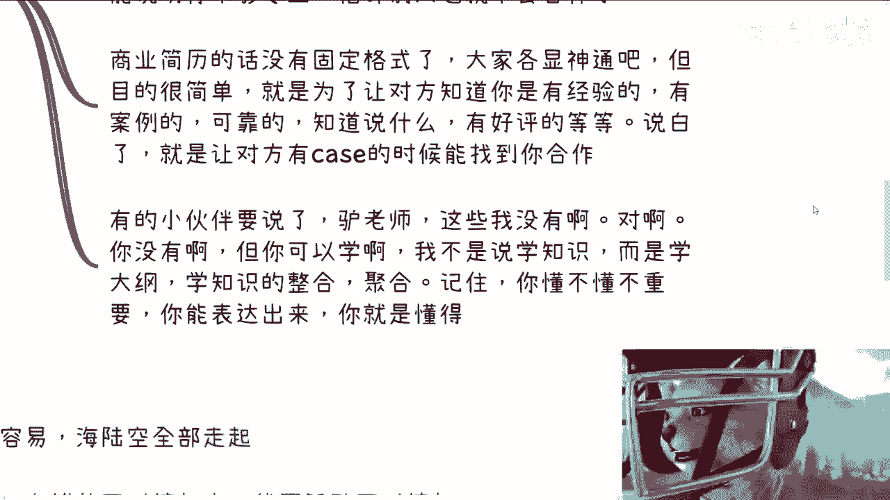

对不对，那照你这么说，我以前做咨询，那他妈我所在互联网行业做的也很多人，我关心过他们吗，我从来不关心他们对吧，你比我牛逼也好，比我也好，跟我有什么关系，比我牛逼，你也不分我钱，那么有比我。

我也不分他钱是吧。

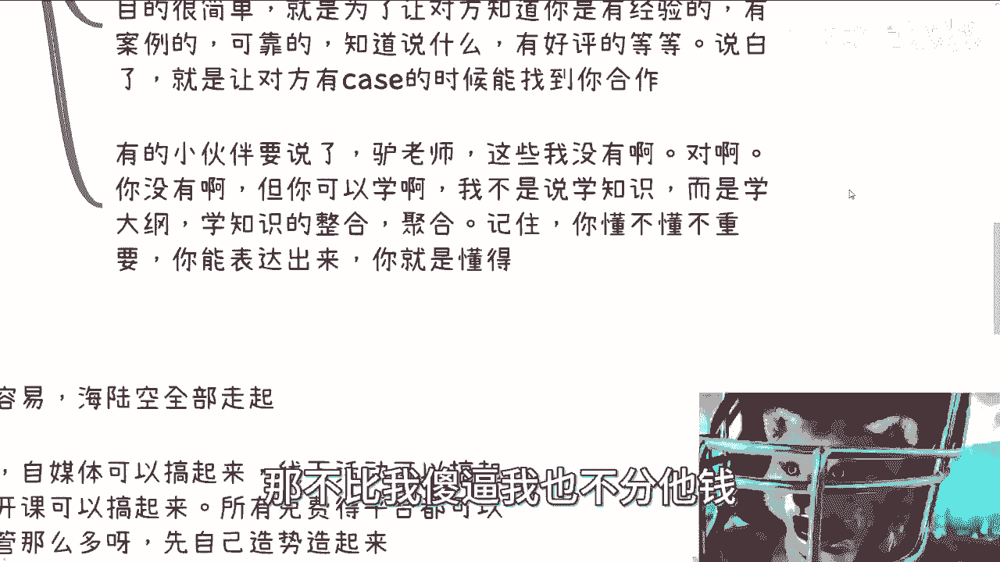

哦那有的小伙伴要说了啊，吕老师啊，这些我都没有啊对啊，没毛病啊，你是没有啊，你没有，所以才要看这个视频啊对吧，所以我告诉你要学什么意思啊，就是说我不是说你要去学知识啊，而是说你要去学那些面上的东西啊。

你要你要学会轮廓，什么叫轮廓，就是大纲主题，你要学会知识的整合聚合对吧，就比如说你今天讲一天医疗的东西，我可以不懂啊，但是我可以搜集资料啊对吧，你让我学一个，比如说生物医疗的东西。

我他妈的学个专业不得花个一两年啊是吧，但是你让我做咨询，不好意思，两个礼拜我跟你讲最多了，我对我能力很有自信，两个礼拜啊，我可以不懂，然后我去讲医疗，你随便让我讲什么，没关系的啊，我就这么跟你们讲。

在我们行业里面，包括我身边的小伙伴，我去找他们讲一样的，我说AI有没有做过啊，没有能不能讲，可以讲给我点时间多久啊，半天还行可以，这叫咨询，你懂吗，这叫赚钱啊。

你懂不懂不重要啊，你能表达出来，你就代表你懂啊好吧。

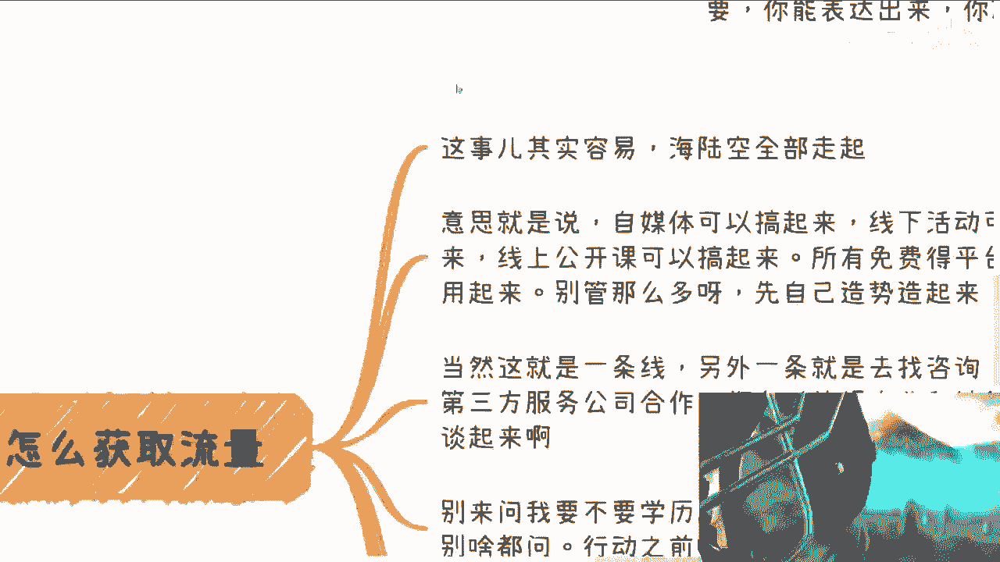

然后第三点怎么获取流量啊，这事其实蛮容易的，海陆空全部走起，什么意思呢，意思就是说自媒体呢可以搞起来，线下活动，可以可以可以搞起来，线上公开课可以搞起来，所有免费的平台都可以用起来，别管那么多。

你先把自己制造起来对吧，你我跟你讲，有很多人跟我说，爱丽刘老师，我没流量，我就问你抖音小红书快手对吧，斗鱼对吧，B站微博小红书，你能用的都用了吗对吧，活动型会哥，你能用的都用了吗，互动吧对吧。

各种微信群，网上加起来，QQ群用了吗对吧，就所有没有成本的，你倒用啊，你倒是啊，刘老师，我怕被人家踢出来，我会拉黑，拉黑了，拉黑了，提出没提出来了，你做商业啊，你怕毛啊，你怕这个东西还赚个屁钱啊。

是不是哦，昨天有个小姐姐呸，昨天有个老爷爷吐槽我最近很暴躁，我的确很暴躁，真的啊，这每天C端问我的，他妈的有些有的没的问题，血压很高啊，那当然这只是一条线啊，另外一条线呢就去找咨询培训。

第三方服务公司合作啊，你比如说那个你找这些咨询公司培训公司啊，什么东西啊，他们都有这个对，他们都有这个对外的商业跟销售的啊，全部弹起来啊，谈呢你又不少块肉，你要不要额外的付出，你要不你又不像别人，真的。

我有时候想想，真的妈的，我也是，对啊，就是这么多人对吧，愿意付那种45万6万啊，给别人那种什么培训的对吧，我在这边免费的跟他们说啊，也不免费对吧，30块钱啊，我在这边30块钱跟他们掏心掏肺的说。

他们也不理我对吧，还有就是别来问我要不要学历。

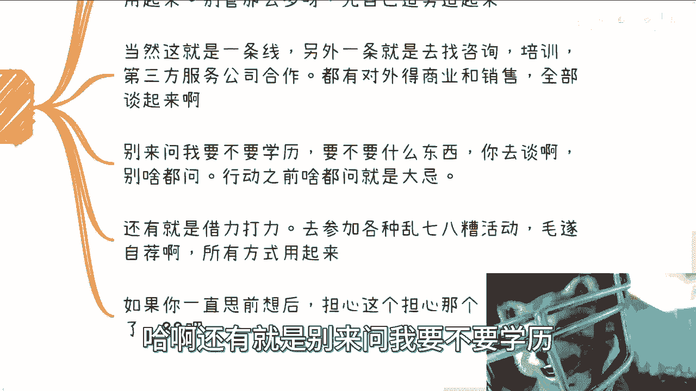

要不要什么东西，你去谈啊，要的话我会跟你讲一下，我竟然不讲。

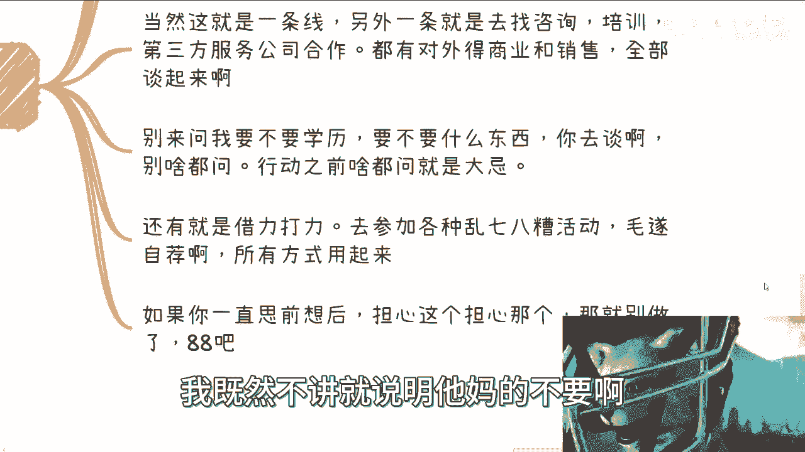

这说明他妈的不要啊，对不对啊，还有就是借力打力啊，去参加各种乱七八糟活动啊，毛遂自荐啊，你把你的背景这个积累起来没有，就是积累啊，对不对啊，那当然我最后说一句，如果你一直思前想后对吧。

但跟我说哎担心这个担心那个我跟你讲。

别做了，拜拜啊拜拜您嘞，哎啊第四个就是重点啊。

你看这个重点三个重点，我的多么重点，你想想看吧。

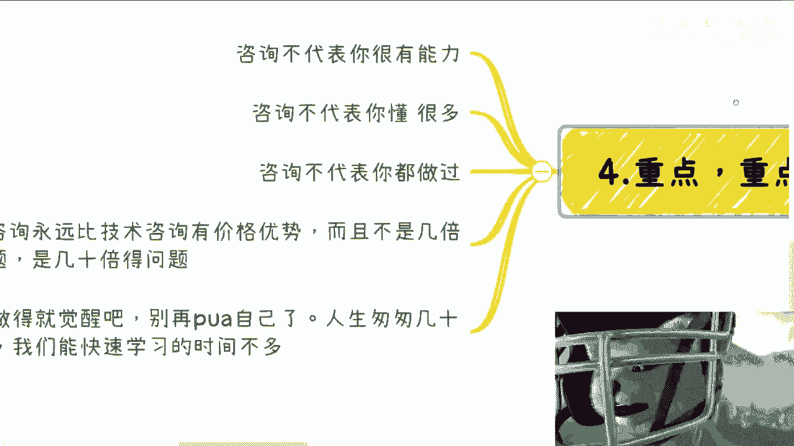

记住啊，咨询不代表你很有能力，咨询也不代表你懂得很多，咨询也不代表你都做过啊。

也就是这些东西不妨碍你做咨询，明白吗。

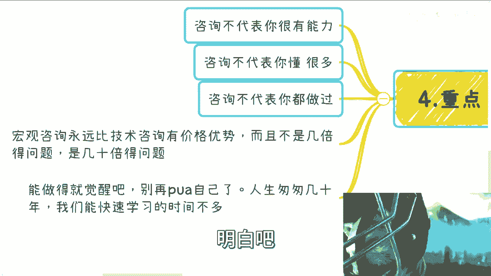

do you understand呃，宏观咨询永远比技术咨询有价格优势，而且不是几倍的优势，是几十倍的优势啊，我还是那句话，你们没有接触过，可能你们想象不出来，但是不好意思，就真的这么的离谱啊。

我最后说一嘴是什么呢，就是你们要是能明白啊，能能去做就去做，别再PUA自己了，人生匆匆几十年，你们也好，我也好，普通人能够快速学习的时间不多了啊。

你别什么，到时候什么上有老，下有小对吧，这边要操心，那边要操心对吧，自己嘛好像身体也不也不好对吧，然后这个学习能力也不强，你到时说啊，我曹操吕老师，我要赚钱了。

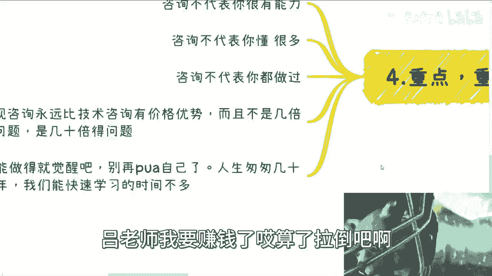

唉算了拉倒吧，OK那我觉得这一期我是从个人切入金融行业啊，获取咨询的流量对吧，那么我想想二二的话，我可能会跟大家说一下呃，咨询的过程当中的一些流程吧，就咨询整个流程大概什么样子的啊。

企业高校政府可能怎么样子的，然后你准备的材料怎么样子怎么样，是不是还可以啊，我也觉得还可以是吧，怎么办呢，膨胀啊行吧，那就这样吧好吧，然后这个一样的好吧，大家有什么，反正你们整理好问题好吧，可以咨询我。

OK就这么着吧。