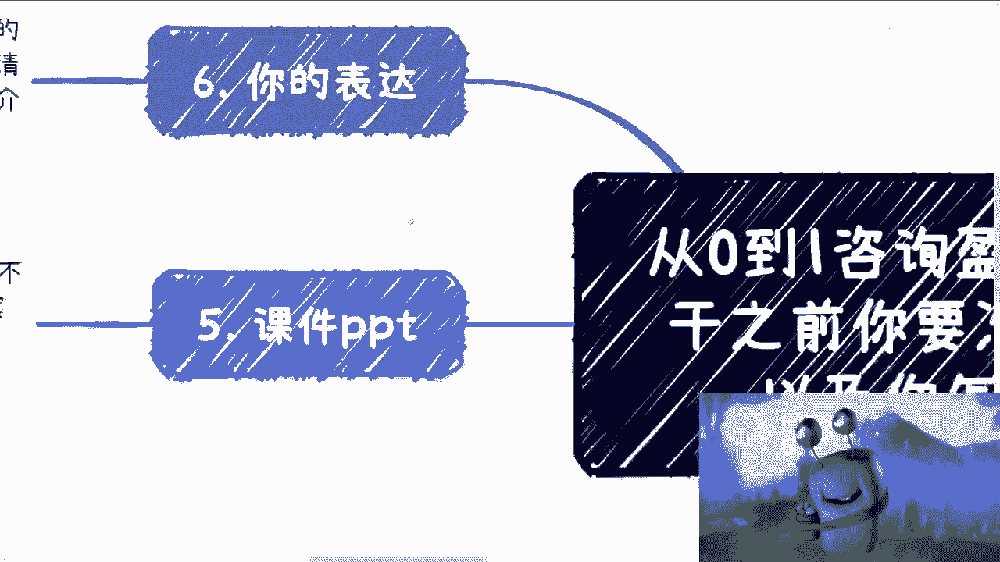
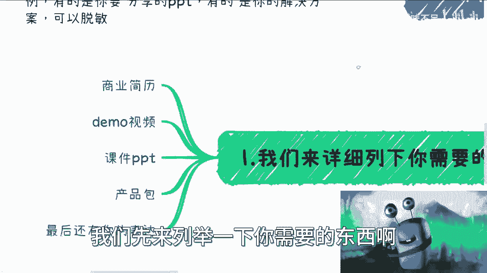
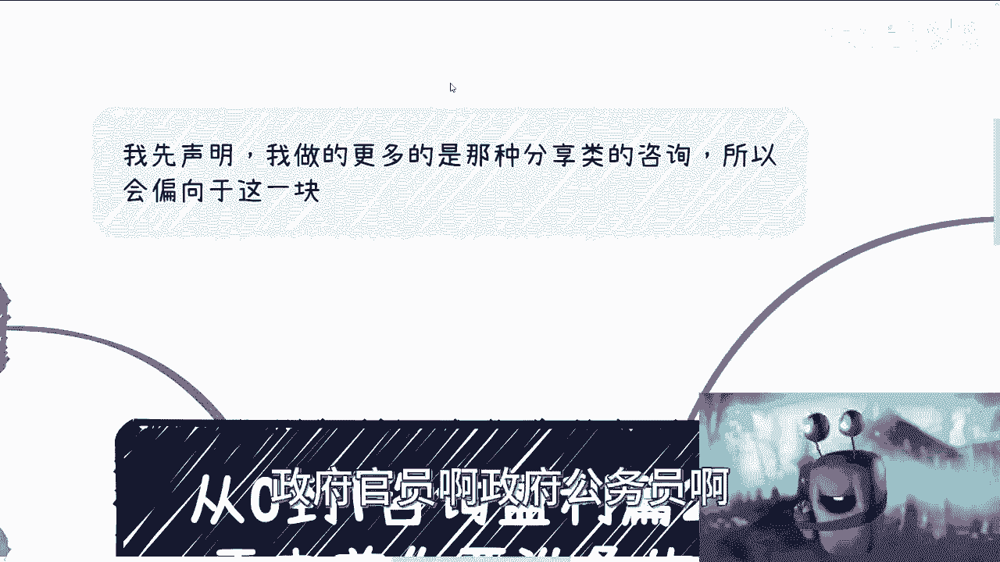
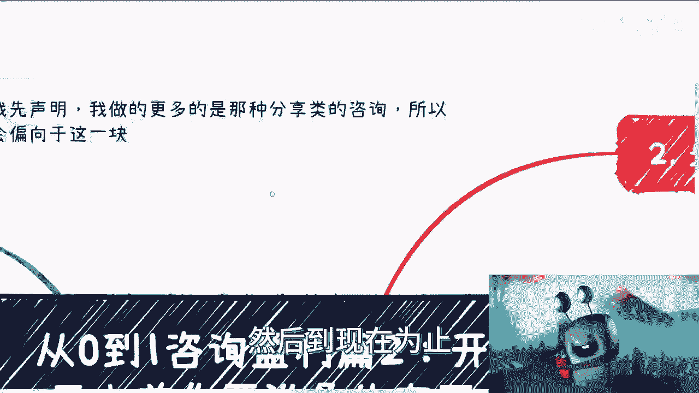
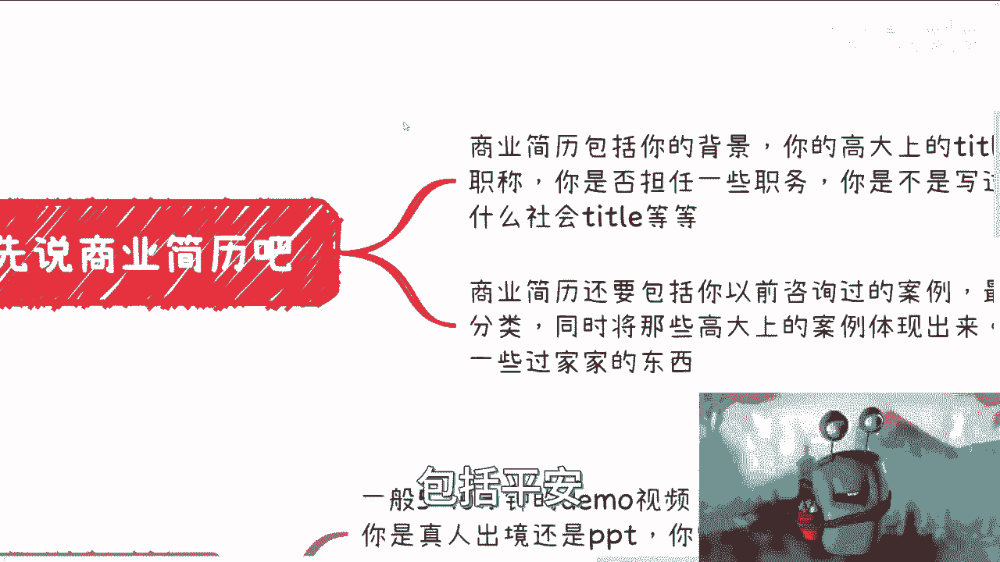
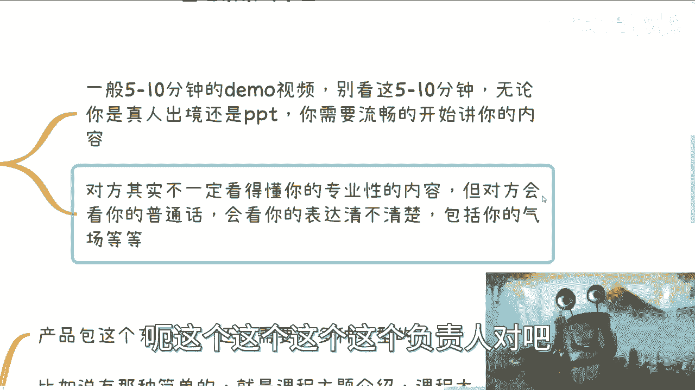
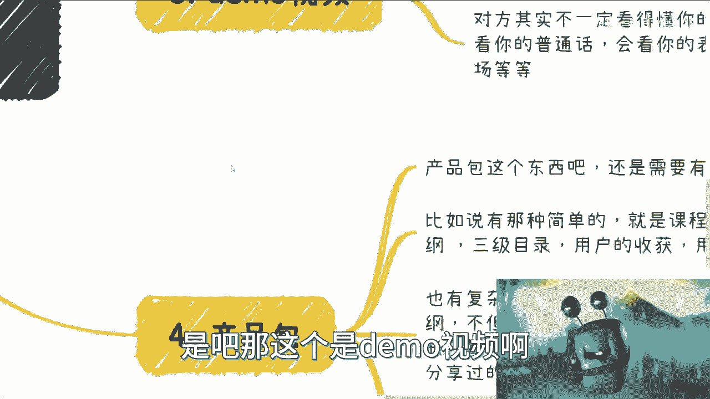
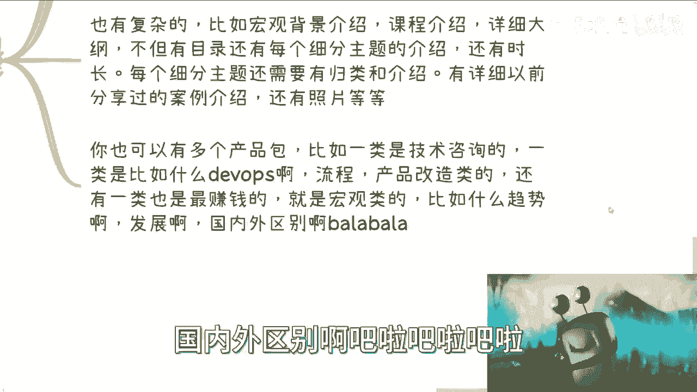
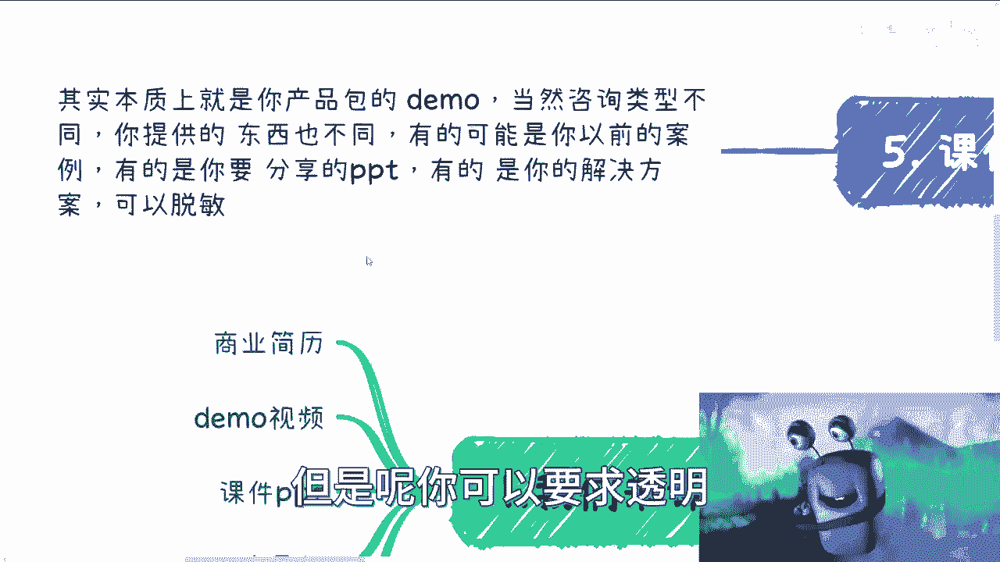
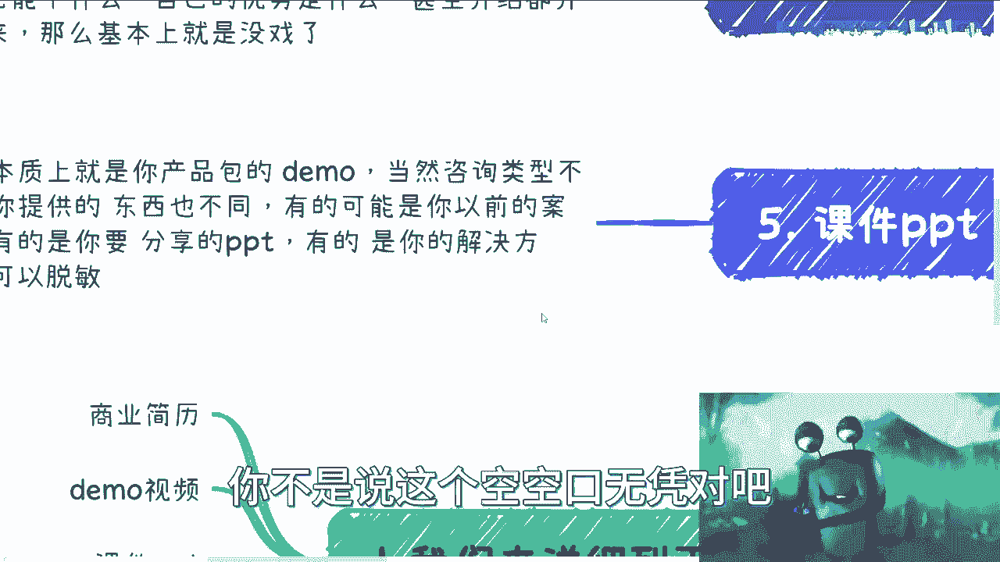

# 从0到1咨询盈利篇2-开干之前你需要做好什么准备---P1---赏味不足---BV1F94y1h7w

在本节课中，我们将要学习在正式开启咨询业务之前，必须准备好的核心材料。这些准备是建立专业形象、获取客户信任并成功拿下项目的基石。

上一节我们介绍了咨询业务的初步概念，本节中我们来看看具体需要准备哪些“弹药”。

## 核心准备材料清单

以下是开始咨询业务前必须准备好的六项核心材料。

1.  **商业简历**
2.  **Demo视频**
3.  **产品包**
4.  **课件PPT**
5.  **表达沟通能力**

接下来，我们将逐一详细解析每一项的具体要求。

## 1. 商业简历 📄

商业简历与求职简历有本质区别，切勿混用。它的核心目的是展示你的专业背景和行业地位。

一份合格的商业简历应包含以下要素：
*   **专业背景与头衔**：列出你拥有的高级职称、担任的职务、出版过的书籍或重要的社会头衔。
*   **成功案例**：分类展示你过往的咨询案例（例如：高校、国有企业、政府机构、大型企业如中国移动、招商银行等）。将最具分量和知名度的案例放在最前面。

**核心公式**：`商业简历 = 专业头衔 + 分类成功案例`

如果你目前缺乏这些资历，需要先去补充，不能在没有的情况下贸然开始。

## 2. Demo视频 🎥

Demo视频是一个5到15分钟的演讲录像，用于直观展示你的演讲能力和专业气场。

制作Demo视频时需注意：
*   **形式不限**：真人出镜或仅录制PPT均可。
*   **核心考察点**：客户或中介通过视频评估的不是内容的专业深度（他们可能不懂），而是你的**普通话标准度、表达清晰度、逻辑性和整体气场**。
*   **流畅与逻辑**：必须能够流畅、有逻辑地完成一段时间的演讲。

通常，最初与你对接的是客户的培训负责人或中介，他们正是通过这个视频形成对你的第一印象。

## 3. 产品包 📦

产品包是你提供的咨询服务目录，可以根据复杂度和客户类型准备多个版本。

以下是产品包的主要类型：

*   **简单版**：包含课程主题、大纲（至三级目录）、目标用户画像（如：开发、产品经理、中层管理者）以及学习收获。
*   **复杂版**：除上述内容外，还包括宏观背景介绍、每个细分主题的详细介绍与时长规划（如：0.5天/模块），以及过往案例的详细说明与照片。
*   **内容分类**：产品包可按内容方向分类，例如：
    *   **技术实操类**：接地气的技术咨询。
    *   **流程管理类**：如数字化转型、产品改造、领导力培训。
    *   **宏观趋势类**：行业趋势、国内外发展对比等（通常利润较高）。

## 4. 课件PPT 📊

课件PPT本质上是产品包的演示版或脱敏版。

根据咨询类型的不同，你可能需要准备：
*   **过往案例的PPT**（可提供部分章节）。
*   **解决方案的PPT**（需进行脱敏处理）。

在业务初期，提供脱敏材料是为了证明你具备相关能力和素材，避免被“白嫖”，同时保护自己的核心知识产权。

## 5. 表达沟通能力 💬

与客户或中介的每一次沟通，都是一场无形的面试。

许多人在沟通中会暴露问题，例如：
*   无法清晰描述自身优势与服务内容。
*   普通话不标准，吐字不清晰。
*   沟通气场弱，缺乏自信。

在商业场合，对方通常不会直接指出你的问题，而是会以“客户已找到其他人”、“预算不足”等借口婉拒。因此，卓越的表达能力是综合实力的关键一环，任何一项短板都可能导致合作失败。

## 进阶能力：随机应变

除了上述准备材料，**随机应变能力**是咨询业务中更高阶且至关重要的综合能力。它直接关系到客户对你最终的评价和口碑，我们将在后续课程中详细探讨。

本节课中我们一起学习了启动咨询业务前必须备齐的五项核心材料：专业的商业简历、展示能力的Demo视频、结构清晰的产品包、用于演示的课件PPT以及卓越的表达沟通能力。这些是敲开咨询之门的必备工具。下一节，我们将探讨如何获取和优化这些材料。