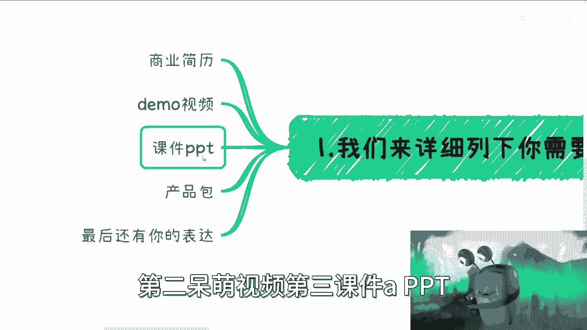
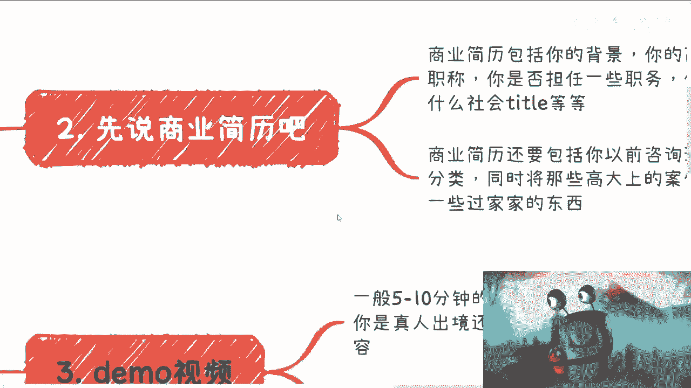
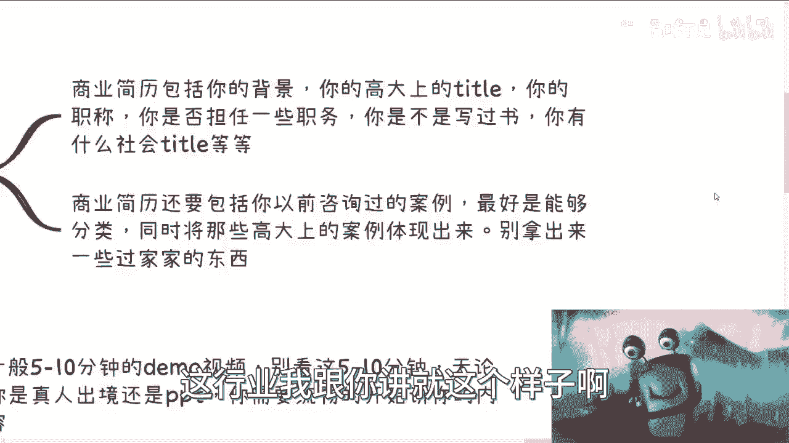
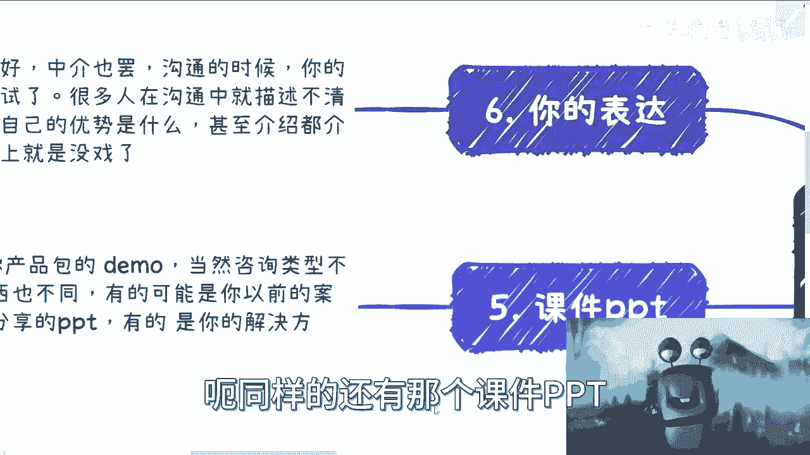
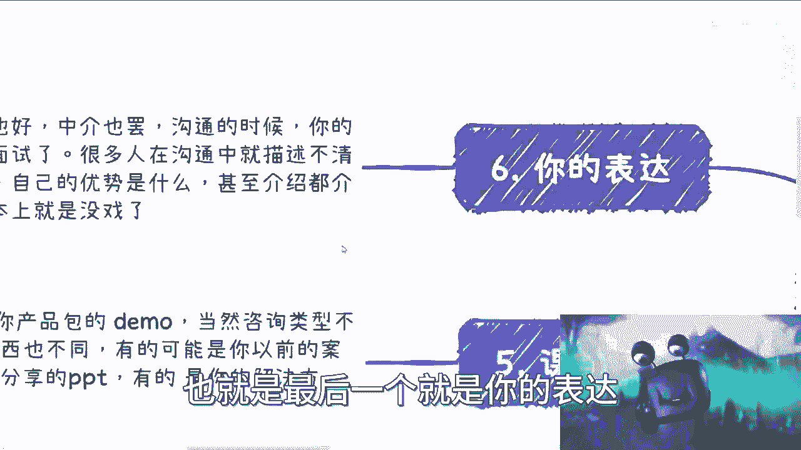
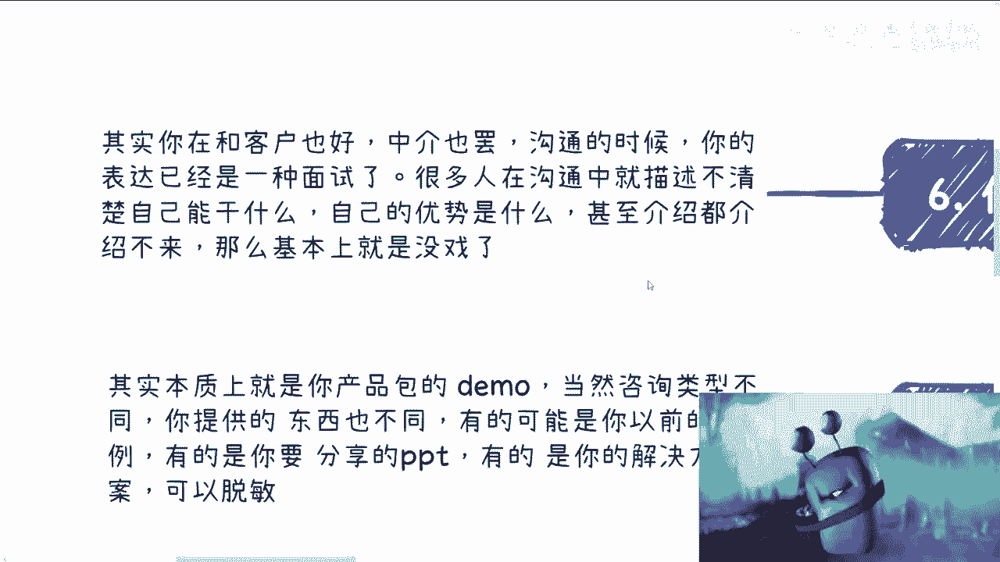
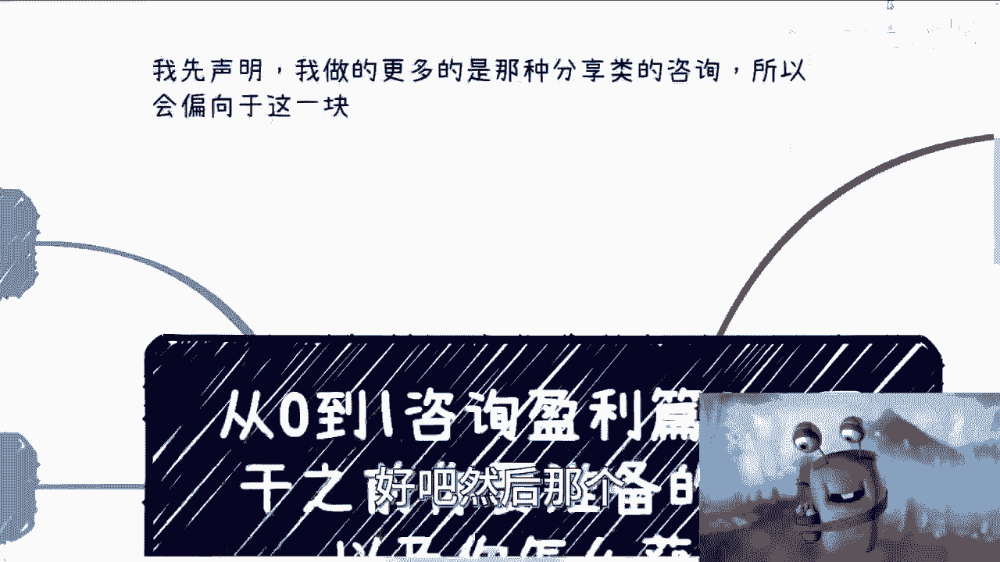

# 从0到1咨询盈利篇2：开干之前你需要做好什么准备 - P1 - 赏味不足 - BV1F94y1h7wZ

好啊大家好啊，今天我们继续来说这个第二篇啊，就从0~1，咨询盈利篇到二对吧，我越来越觉得这个蜗牛很可爱呀，就因为他的眼睛跟我就特别像呀，哈哈笑死额，盈利片二是什么呢，就是开干之前啊，你要准备的东西。

以及你怎么获取，呃好吧，就你准备的东西怎么获取，我没说好，放在下一期啊。

没事，这个可能是我做的时候的bug，首先我们先来列举一下你需要的东西啊。

第一商业简历，第2demo视频，第三课件PPT。

第四产品包，以及你的表达，好我们一个个来说，首先先说商业简历啊。

商业简历这个东西呢，跟你的找工作的简历不一样啊，千万别把什么找工作简历拿出来，我都low爆了啊，商业简历简单一点啊，就是写好你的背景，你有哪些高大上的title啊，你你有没有职称，你是否担任一些职务啊。

你是不是写过书，你有没有什么社会title，OK你不要跟我讲，你没有你没有，你就去补哦，好那没事，这个下期下期我们再说下去我们再说，但是你不能没有我告诉你啊，你不能说我没有，然后我就去做。

那你别做也没什么好做的，这行业我跟你讲就这个样子啊。

啊对有个前提我说一下啊，我先声明我做的比较多的类型呢，是那种分享类的咨询，也就比如说按天的哦，不是那种就是说什么驻场的，什么一住住半个月住一年的，我不做这种的啊，然后我主要的客户就是基本上都有。

就是企业家啊，政府官员啊，政府公务员啊。

然后高校老师啊，反正反正都有，然后到现在为止就说小的几百场我都做过了。

大的嘛，比如说那种联通移动对吧，就整个集团做的，包括平安。

估计小100场也有吧，好我们继续来说啊，第二个呢就是商业简历啊，它还得包含包括啊，你以前咨询过的案例啊，最好是能够分类啊，就分类，我指的意思就是说，比如说有没有哪些是高校的啊，有没有哪些是国央企啊对吧。

或者怎么样啊，那么同时呢，你要想将那些高大上的案例体现出来啊，你就比如说我的那个上面就会把就是说高校啊，把政府领导啊，把呃中国移动啊，联通啊，招行啊这些放在最前面对吧，那么这样的话就是别人是知道啊。

你是做过大公司的啊，然后呢就是说你别拿出一些过家家的东西啊，这个拿出来一看就比较low，那这个就没必要啊，没必要，那这个是一啊，二呢就是关于呆萌视频，Demo，视频呢。

其实是一个五到15分钟的这么一个东西，啊啊五到十五十五分钟的这么一个演讲的东西，那无论你是真人出镜，还是说只录PPT，这不重要，重要的呢就是你跟我现在一样，就是你会对着一台电脑去讲。

而你要流畅的去讲五到15分钟，哦同时呢你还要讲的有逻辑性，你知道吧，所以说啊就是说你要去这么想，就是说啊你要让对方觉得，你要让对方觉得什么呢，就是我这个地方也写了。

就是对方肯定他不一定他不是不一定的问题了，他肯定看不懂你的专业性内容，但对方会去从你的视频当中能得到一些信息，比如说你的普通话是不标准啊，比如说你的表达清不清楚啊，啊比如说你的气场怎么样啊，对吧等等等。

那么这些其实他想看到的，至于你说你今天讲大数据，明天讲讲云计算，后天讲什么AIGC，这你觉得他能他能一定懂吗，他肯定不懂啊，而且你们要明白，就跟你对接的人要这个东西的不是中介，就是客户，而就算是客户。

比如说招行跟你对接，那也不可能是招行的这个部门立的，他一开始跟你对接的，估计是招行负责培训的这个负责人对吧。

那你说他能懂啥是吧，那这个是demo视频啊。

第三个叫产品包，产品包这个东西呢，呃还是需要有更有更多类型的，就是你可以提供不同的种类，比如说啊那种简单的，就比如说只有课程主题介绍课程大纲，然后只有个三级目录对吧，然后包括什么呀，你要写清楚。

就说那个上了你这个内容对用户的收获是什么，用户的画像是谁对吧，因为因为很简单，你用户画像写清楚啊，到底是开发程序员，产品经理，项目经理，还说是架构，还说是中层管理对吧。

你总不可能说你这个课程所有人都适合，那也不可能，那么这是简单的，也有复杂的复杂的，比如说什么呢，比如说宏观背景介绍啊，课程介绍啊对吧，详细大纲啊啊然后呃这个目录啊，它不但要有三级目录。

而且每一个目录呢它都得有细分的主题介绍啊，而且还有时长，比如说每个细分的领域是是0。5天，0。3天，0。2天对吧，然后每个细分的主题还需要有归类啊，还是要有有有他的这个主题的介绍啊，然后你这个方案里面。

你还得有详细的以前分享过的案例的介绍啊，包括照片，那这个可能就会比较复杂的一个东西啊，不像上面比较简单啊，那么你也可以有多个产品包，就比如说一类呢是是技术咨询类的，就是它可能是比较接地气的啊。

是那种叫做实操类的啊，一类呢是比如说像DIOS啊，这这这这这这这流程管理啊，对产品改造啊，数字化改造啊，改革啊这些，那么这种呢可能是啊，包括什么数字化转型啊对吧，领导力培训啊。

那这一类我们称之为是一种流程类的啊，或者来说是一种产品这个改革啊，升级啊这一类的，那么还有一类呢也是最赚钱的，就是宏观类的啊，比如说趋势啊，发展啊对吧，国内外区别啊，巴拉巴拉巴拉这样子的啊。

那么这个是产品包呃，同样的还有那个科技PPT课件。

PPT呢其实本质上就是你产品包的demo，就是你产品包的一个脱敏的或者一个阉割版啊，当然咨询的这个内容啊，就由于它的这个类型不同，类型不同，你呃提供的东西也不同，就有的可能呢是你以前的案例啊。

就你以前的比如说一些介绍啊，或者这个这个照片啊，有的人可能是你以前分享过的PPT啊，当然他不会问你要全部的，你可以给给一部分啊，那有的呢是你的解决方案啊，可以脱敏，因为你做的咨询类型不一样嘛。

哦那么他可他可能要你问你的，要要的东西可能不一样，但是呢你可以要求脱敏。

因为毕竟你们就现在这个阶段，就比如说我们今天说的这个阶段，你其实还没有去做这件事情，那么你要避免被他白嫖，那你可以去脱敏一部分东西，让他能知道你其实是有的，你不是说空口无凭。

临时抱佛脚出来的啊，那么第六也就是最后一个就是你的表达。

就是其实啊就是说你在跟客户沟通也好，中介沟通也好，你在跟他沟通的时候，你的表达已经是一种面试了，你知道吧，就是说很多的人在沟通当中，可能客户啊，或者来说培训公司，咨询公司啊，他就会感觉到。

就是说可能你连自己的这个优势也描述不清楚，你连你讲什么也描述不清楚对吧，然后你可能普通话也不标准对吧，然后你可能吐字也不清晰对吧，那么这种情况下对方可能不会说啊，他不见得就是就是商业当中是这样子的。

商业当中大家尽量不得罪对方对吧，就他可能不会说，但是呢就是说结果就是说唉，可能我们这个可能他随便找个借口，比如说客户已经找到合适的人了对吧，或者说客户已经这一次可能预算不够吧，或者怎么样。

反正他不会说你的问题，但是大概率都是你的问题，你知道吧，所以说就是说这些事情呢，其实你得要综合，你别看就好像做咨询啊，很简单，是从某些角度来讲是很简单，但是你有很多的东西它属于一个综合能力。

你得让对方觉得你是可以做的哦，那如果来说你的各方面条件当中，有一项他觉得啊可能不符，那基本上就没戏了。

你知道吧，而且这些也只是你的那个这个叫什么，就是你需要准备的东西啊，我们说综合能力来讲，咨询这个东西呢，最大的综合能力就在于它的应变，随机应变呃，这个东西我后面再说吧，好吧。

就是随机应变能力是一个非常可能需要锻炼，也同时是一个非常重要的一个东西，因为这个东西会最后直接关乎到你的客户，对你的评价，好吧行，那就这么着吧啊就这么着吧，然后后面我会再想想后面怎么个拆分，怎么获取。

没说对吧，就放到30了好吧，然后那个叫什么。

就是呃随机应变这个东西，我也放到后面再说好吧，这些是非常重要的能力啊，哎行吧，我再转转眼睛，眼睛老可爱了，这眼睛能不能能不能能不能打个结好吧，然后反正就这么个情况啊。

这么个情况大家有什么这个细节问题好吧，然后需要了解到更多的一些商业的东西啊，或者来说需要能够看到更多商业的东西，或者说想要我给大家去整理一下手上的这个牌，包括未来的发展怎么走的好吧，那你们再咨询我行了。

