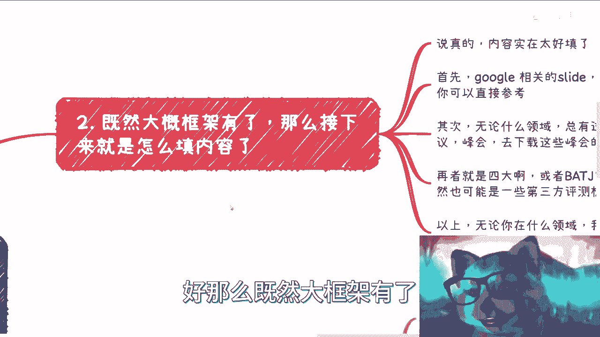

# 从0到1咨询盈利篇3-我们应该怎么快速的准备咨询的材料---P1---赏味不足---BV1Nu4y1

在本节课中，我们将学习如何高效地准备一场咨询或演讲所需的材料。我们将从PPT的构成、内容搜集方法、演讲练习技巧以及心态调整等多个方面进行拆解，帮助你快速构建专业且有说服力的演示内容。

---

## 课程前言与说明

课程开始前，有两件事需要说明。

第一件事，请记得去视频首页参与抽奖活动。本次抽奖的奖品是一个键盘和一个提问机会。

第二件事，是关于我们无法控制的外部因素。例如他人的议论或攻击，这些都不重要。我们不应在无法控制的事情上浪费时间。这没有意义。

同样，如果有人使用了我的PPT模板，这也没有关系。模板本身没有版权，可以随意使用。

现在，我们进入今天的主题：如何快速准备咨询材料。

---

## 一、PPT的核心定位与构成 🎯

上一节我们明确了咨询的目标，本节中我们来看看承载内容的核心工具——PPT。由于咨询的特殊性，PPT有很大概率会成为客户的“教材”。这意味着客户可能会提前打印，或在某些允许录屏的场合下反复观看。因此，PPT不能仅仅是图片或总结性文字的堆砌，否则客户将无法从中有效学习。

为了让PPT成为有效的复习材料，你需要将那些“不靠谱”的图表和文字背后的逻辑与细节补充完整。

关于演示形式，通常存在以下区别：
*   **政府咨询**：通常以纯PPT演示为主。
*   **企业与高校**：除了PPT，常会配合白板或板书进行现场发挥和扩展。我个人更倾向于后者，例如用30页PPT讲一天，其余时间通过板书进行深入阐述。

从内容上看，一份合格的咨询PPT通常包含以下四个模块：

以下是PPT内容的四大核心模块：

1.  **宏观政策**：涵盖你所讲领域的国家政策、法律法规、海内外发展趋势等宏观背景信息。
2.  **图表数据**：包括年度报表、受众人群分析、GDP等经济指标，即各类Dashboard式的数据图表。
3.  **实际案例**：从公开报道中寻找历史上或网络上真实存在的、已落地的相关案例或项目。
4.  **实操演示**：根据咨询内容灵活呈现。例如，技术开发类咨询可以展示Github上的 **`sample code`** 或开源项目；无法实物演示的领域（如电动车），则深入剖析案例细节。

既然有了内容框架，接下来就是如何填充具体内容。

---

## 二、高效填充内容的三大渠道 🔍

内容填充并不困难。无论是否精通该领域，都可以通过以下三个渠道快速搜集高质量材料。

以下是三个高效的内容搜集渠道：

1.  **Google Slides**：在Google上搜索相关领域的 **`Google slide`**。许多会议和活动的演示文稿都会收录于此，可供参考。部分免费，部分收费。
2.  **行业峰会PPT**：无论哪个领域，都有行业大会。搜索并下载该领域近年（如2022、2023年）行业峰会的公开PPT资料。
3.  **权威机构报告**：参考四大会计师事务所、BAT（百度、阿里、腾讯）、京东、字节跳动等大厂的年度报告，或第三方评测机构发布的行业分析报告。

通过以上三种方法，你可以在半天内为几乎任何领域的咨询拼凑出基础材料。当然，这需要“高情商”的借鉴与重组，而非无脑抄袭。

有了骨架（框架）和血肉（内容），下一个关键是如何让内容拥有灵魂。

---

## 三、赋予演讲灵魂的两步练习法 🗣️

通过第一、二步，我们得到了PPT的“骷髅”，但缺乏“血肉”和“灵魂”。要让演讲者与PPT内容产生深度连接，需要进行刻意练习。这个过程一般分为两步。

以下是两个关键的练习步骤：

1.  **观摩学习**：静下心来观看多个高质量演讲视频（平台不限）。目的不是娱乐，而是学习其**演讲风格、逻辑框架、案例引用技巧**。观察演讲者如何将100页PPT有机组织起来。如果缺乏耐心看完一两个小时的演讲视频，那么很可能也难以胜任咨询工作。
2.  **自我演练**：对着电脑摄像头自己练习演讲并录制下来，反复观看、修正。如果能找到真实观众试听则更好。我早期的演讲能力，正是通过组织半年多的线下活动（从三四个人到五六十人），在不断实战中锻炼出来的。

掌握了方法，最后需要攻克的是心理关。

---

## 四、克服对失败的恐惧 💪

在咨询、演讲或任何商业活动中，恐惧失败是最大的障碍。这就像小时候学走路总会摔跤，但当时并不害怕。长大后，我们反而因为“怕丢脸”而畏缩不前。

这种恐惧必须克服。回顾我的经历：
*   初入职场面试他人时，我紧张得手发抖。
*   在某次公开分享后，我曾被吐槽“PPT毫无逻辑、内容不佳、讲述不连贯”。
*   政企内训中，不可能每次都能获得所有客户的好评，因为客户的喜好千差万别。

这些都是正常的成长过程。作为提供服务的乙方，获得评价是工作的一部分。没有失败和修正，就没有进步与发展。

很多人因为害怕失败，导致第一步都迈不出去，总是在“做之前”提出各种假设性问题。但很多答案，只能在“做之中”获得。例如，有人问如何分辨人脉的价值。答案是：只有当你认识足够多的人（基数足够大），才能逐渐培养出这种分辨力。我的微信有近7500名经过筛选的联系人，这正是建立在巨大基数之上的。

所以，面对挑战，选择很简单：**要么果断行动，要么坦然躺平**。没有中间地带可供犹豫和消耗时间。

---

## 课程总结 📝

本节课中，我们一起学习了快速准备咨询材料的完整流程：
1.  **明确PPT定位**：将其视为客户的“教材”，内容需完整、可自学。
2.  **构建内容框架**：围绕**宏观政策、图表数据、实际案例、实操演示**四大模块组织内容。
3.  **高效搜集素材**：利用 **`Google Slides`**、行业峰会PPT、权威报告三大渠道快速填充内容。
4.  **进行刻意练习**：通过**观摩学习**和**自我演练**，将内容转化为有灵魂的演讲。
5.  **调整核心心态**：**克服对失败的恐惧**，在行动中学习和进步，扩大连接基数以获取更多机会。

希望你能举一反三，将这些方法应用到自己的实践中。下节课，我们将探讨咨询中的另一个关键环节。