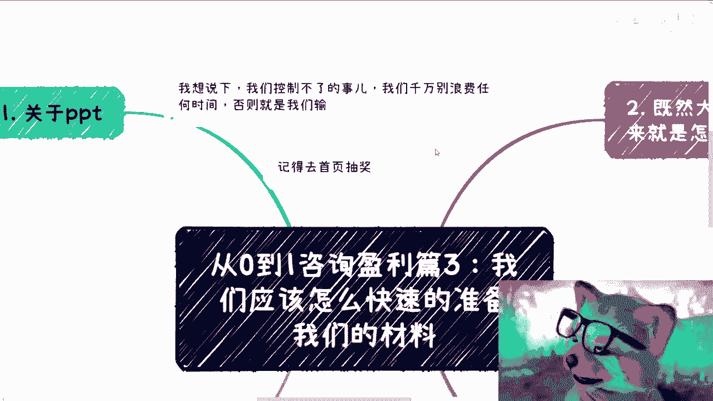
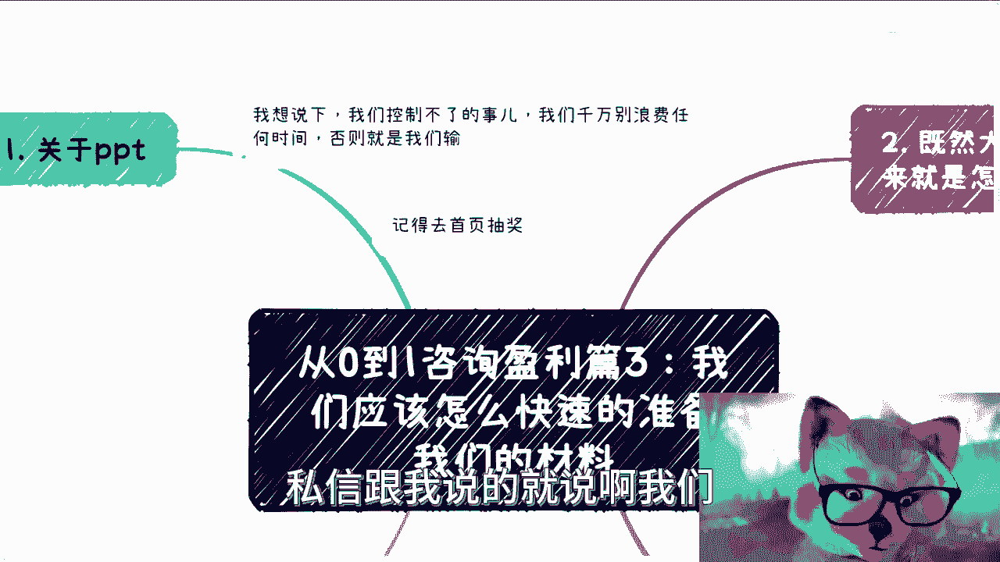
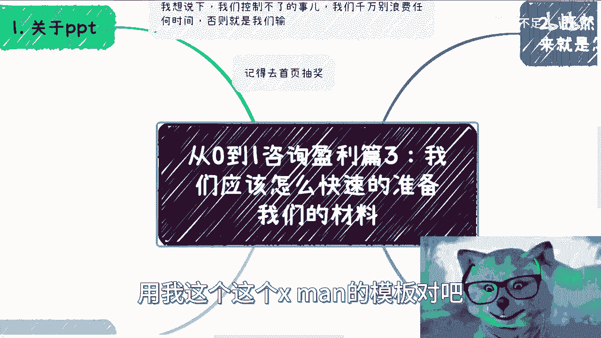
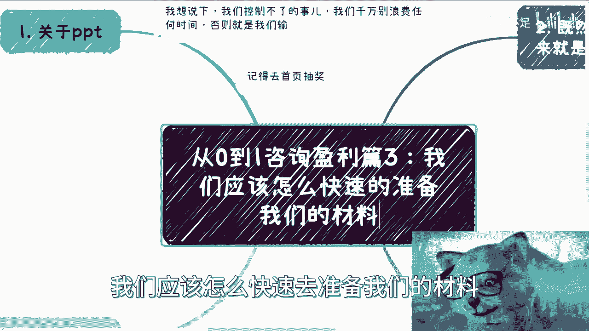
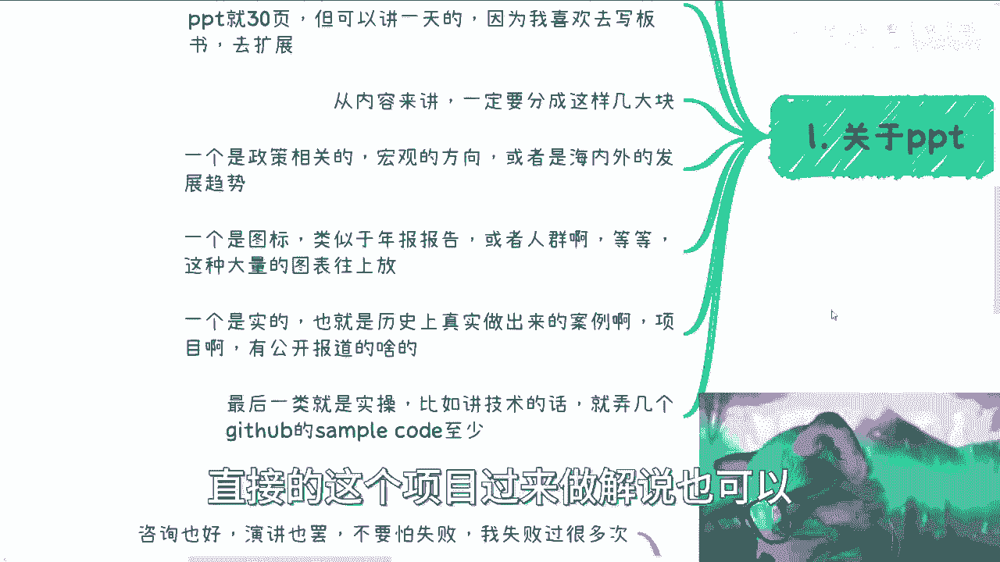
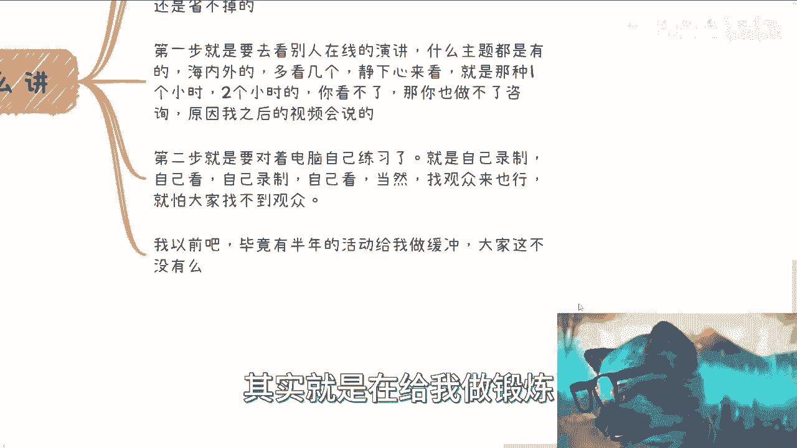
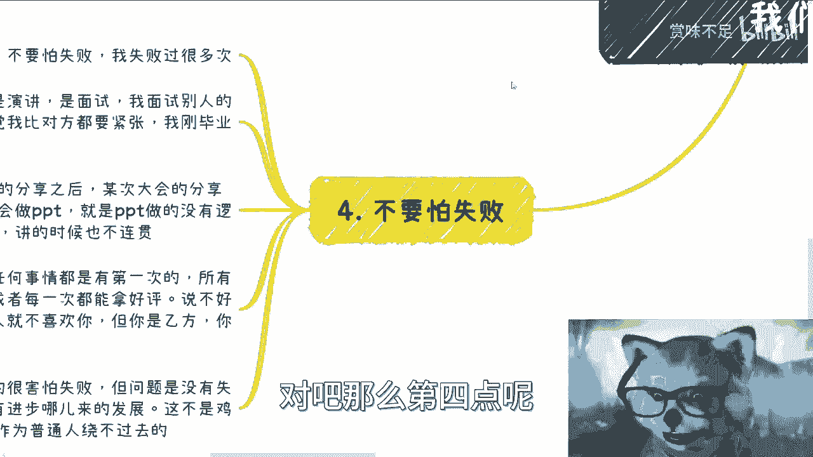
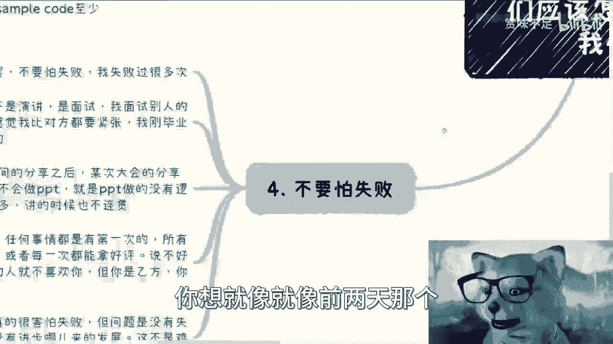
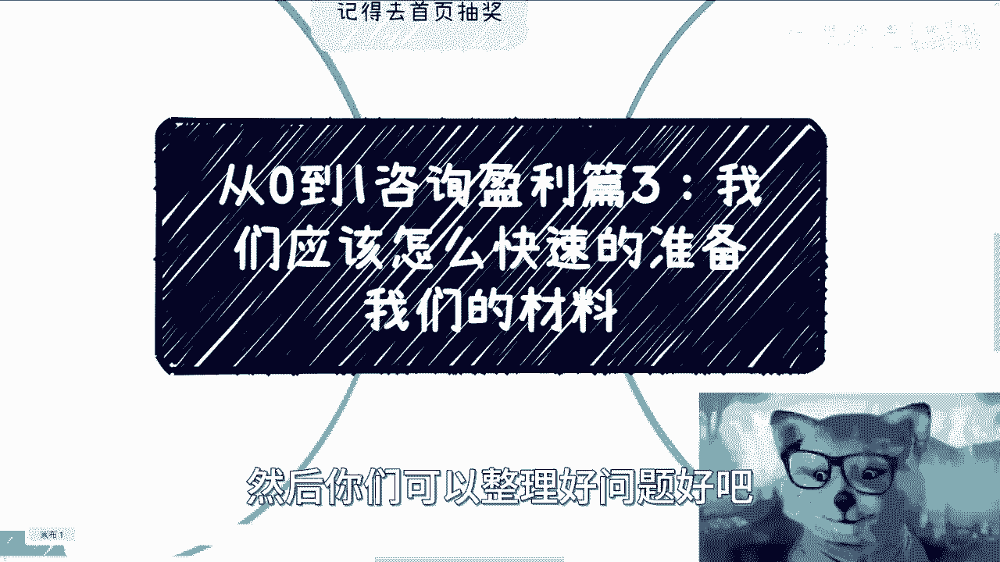

# 从0到1咨询盈利篇3：我们应该怎么快速的准备咨询的材料 - P1 - 赏味不足 - BV1Nu4y1t7ZH

好这个大家国庆节好啊，继续啊，继续这个盈利篇三，盈利篇三呃，首先呢有两个事说一下，第一个就是说大家记得到首页去抽奖哦，嗯我怕很多人没看到对吧，这次还是抽一个键盘加一个提问的嗯，反正机会吧。

反正就这么个东西也是B站建议我的。

第二呢就是说我想说一下啊，就是说我们控制不了的事啊，就比如说有人议论你们啦对吧，有人嗯这个攻击你们了对吧，然后有人怎么样了，我觉得这个不重要，呃我们控制不了的事，不要去浪费时间啊，没有什么意义。

你包括还有这个私信跟我说的。

就说啊我们看到有谁谁谁对吧，用我这个这个X的模板。

对我说模板又没版权是吧，随便用无所谓啊，呃我们说主题啊，就是说第三个啊，我们应该怎么快速去准备我们的材料对吧。

这个也是呃很多人所关心的啊，那我今天给他列一下，首先第一点关于PPT呃，由于是咨询，所以PPT这个东西呢大概率会变成对方的呃，就有一定概率会变成对方的这个教材，那所谓教材就是说他可能会提前打印出来啊。

或者说意思就是说他们呃因为有一些咨询啊，他可能是录屏录，会把你这个讲的东西录进去的，那有一些呢，就是说你比如说一般我就是这个，不允许他们录的啊，我意思就是说这个东西可能有版权对吧，但是你要我PPT可以。

我可以给你们，那么这个时候呢就是说PPT这个东西呢，如果全是图或者全是全是一些总结性的东西，那可能他们也学习不了什么，你说最后这个你做完咨询啊，人家就抱着一群图在里面看，那看不出什么东西来嘛，对不对啊。

那么好吧，然后我觉得这是一块啊，那么如果我们一般来讲呢全是图或者全是文字，的确是不靠谱的，但是如果我们是留给别人做诶，这怎么回事啊，就是如果留给别人去做教材的话呢，那么你需要把那些所谓不靠谱的图和文字。

都补上去，因为这个东西，最终其实人家会当成一种复习材料来看，那么你是需要把这些东西补上去，否则别人看什么东西呢，对不对，那这是第一个，第二个呢一般来讲啊，政府的咨询呢都是纯PPT啊，都是纯PPT。

那么呃企业跟高校呢，还会有一些白板或者板书来配合，那这个东西主要是看你现场的发挥，因为一般来讲呢纯PPT啊，就是企业跟高校这种地方呢，嗯可能感觉会不会很好啊，政府这边呢相对来讲。

就有可能他们比较习惯听这种东西嘛，那比如说你说像我这种对吧，我就比较喜欢那种PPT，可能就30页对吧，然后讲一天对吧，然后剩下的就是我去写板书，去去扩展，那么这个是第二点，那么从PPT内容来讲呢。

一般分成几块啊，一块是宏观政策啊，也就是说今天不管你讲什么内容，比如说讲医疗啊，讲金融啊，无所谓啊，一个宏观政策，宏观方向啊，或者说是你可以理解为海内外的发展趋势，你就把一些宏观的。

这个跟那个国家法律相关的政策相关的，全部一股脑的扔上去对吧，我觉得这第一个第二个呢就是图表类，图表类就类似于像年年度报表啊啊，或者说这个受众人群啊对吧，或者说GDP啊。

就类似于这种dashboard对吧，这种大量的图表你往上放，这个是第二类，第三类呢就是实的啊，也就是说比如说我们在历史上对吧，我们也不知道历史上就过去啊，我们在网上能够看到真实的。

做出来的案例或者项目啊，然后这种案例有公开报道的对吧，那这第三点最后两点就是实操啊，那么实操呢这个根据你咨询的内容不一样呢，可能有很多的不一样，因为有些东西你比如说啊你说电动车对吧。

那实操你总不能现场去这个抬辆车过去吧，那也不现实嘛对吧，那这种实操更多的就是说，还是把那个案例拿出来说啊，或者说就是把案例里面的一些细节啊拿出来说，那么如果是像开发类的对吧。

那比如说你到GITHUB上面去找一些sample code对吧，这些或者说有些找一些GITHUB，直接的这个项目过来做解说也可以啊。

那么基本上呢就这四类好，那么既然大框就有了。

那么接下来我们就要填内容，对不对，我跟你讲啊，内容呢很好填啊，真的很好听，我其实不是很明白，大家觉得这个内容不好做的原因啊，我我因为你像别人找我做，我懂也好，不懂也好，我都能做，无所谓啊。

没啥不能做的对吧，那么首先第一点google相关的slide对吧，你去看好了，你去google上面搜有那个很多的那个google slide，就是比如说呃就各自各个领域的，然后各种各样的会议啊，活动啊。

它就会收录在上面，但是呢能不能下载，这个是另说啊，因为有些是要收费的哦，有些是免费的，但是不管他能不能下载，本身你都是可以参考的，这可以说就是说我可以说，除非啊只要你不是去做那种诺贝尔奖的。

或者说是那种特别特别，比如说顶会学术类的对吧，那剩下的我觉得你都能查得到，第二个是什么呢，就是无论什么领域，你总归会有大会对吧，那你去把你比如说2023年对吧，那你把2022年2021年的东西拿出来呗。

你去搜索对应的会呗，峰会去下载这些峰会的PPT啊，对不对，那这第二个第三个就是四大对吧，或者说bat这个嗯这个京东对吧，字节对吧，等大厂的这种年度报告啊，包括当然也可能还会有很多，第三方评测机构对吧。

什么各种各样的对吧，你你这报告看看对吧，你看啊，第一个slide，第二个是大会PPT，第三个是报告，以上三三点啊，你无论是什么领域，我都可以最快的，你给你，你给我半天，我都能拼出来的，无论你什么要求。

这是三个东西抄呗，谁不会呀，对不对，那当然了，当然了，这个你要说的这个人家都知道对吧，就大家都知道低情商超对吧，高情商借鉴对不对，你还是你抄也是有手段的，你别无脑抄好吧，那这个是第二个，第三个呢。

那么问题来了，应该怎么讲，对不对啊，通过一跟二，你就是去骷髅啊，但没有血肉，没有灵魂，你跟PPT之间是没有这个这个灵魂上的，这个叫什么连接的啊，那么他是他，你是你，那么如何让我们能够跟他们产生关系啊。

这个事是需要锻炼的，一般来讲啊，分成两个步骤啊，但是像我这种对吧，我作为已经已经做过什么上千场，大大小小分享的人对吧，基本上从来不做第二步啊，但是大家我觉得是省不掉的，那么哪两部呢。

第一步就是说你要去看别人在新的演讲啊，我不管你们到底是从YOUTUBE上面，google上面啊，微博上，B站上面啊，无所谓在什么地方啊，呃什么主题都有的，海内外你要多看几个，而且静下心来看。

你看是什么意思啊，你不是让你去，就是像看电影看了，不是的，你要去学习他的演讲的风格，你要去演看，你要去学习他的演讲的这个框架，他比如说整个PPT，比如说100页对吧，他可能是分成几个模块。

它一定是有他逻辑性的啊，包括就是说就是说他举的哪些例子对吧，因为有很多PPT你借鉴，但是PPT里面的例子你可能借鉴不了，因为他讲的时候可能不见得写在PPT上对吧，那你也可以借鉴过来对吧。

那么你需要静下心来看，就是那种一个小时两个小时的，我跟你讲，你要但凡看不了，你没这个耐心，我跟你讲，你是做不了咨询的，而且那我觉得大概率你也赚不到钱啊，原因后面我会视频后，后面再说好吧。

第二步呢就是说你需要对着电脑自己去练习，就是自己录制自己看啊，自己录制自己看，然后反复的这么一个去做，当然了，你找观众来也不是不行，但是我怕你们找不到观众，那么关于你们问我，我以前有没有找过观众呢。

我跟你们这么说，我做过半年的活动对吧，就是从最小的就那么三四个人对吧，到后面可能每一期五六十个人，这种活动的过程当中，其实就是在给我做锻炼。

就是给我做缓冲，但但现在大家不是没有这个机会嘛对吧。

那么第四点呢，我跟你们讲，就是不要怕失败，因为咨询也好，演讲也好，商业也好啊，不管是什么东西，你不能怕失败，你就我觉得是这样子的，你比如说你们小时候对吧，你说这个那个走路跑步，你总会摔跤，但你们怕吗。

你们不怕，为什么，因为你们就说本能的觉得哎我就要我就要走，就要跑，但现在为什么会怕，是因为你们长大了对吧，你们你们年纪大了，你们觉得哎我我就怕失败，但其实没有用的，你知道吗，就是我最早的时候。

其实就比如比如说不是演讲啊，我是在面试的时候，而且是我是骗别人的时候，你知道吗，我还是甲方对吧，对方是应这个应届生对吧，当然了，我当时也毕业没多久嘛对吧，我我面试别人的时候，我手都在抖对啊。

就感觉就是我比对方紧张，卧槽对方那个小姑娘这个镇定自如啊对吧，然后哎很有缘分的，我跟他在10年后吧，10年后有一次在也是一个大会上面，然后我跟他都是嘉宾，然后又见面啊，也是很很有缘分的对吧。

那我刚毕业的时候连话都说不来啊，其次呢在做了一段分享之后呢，某次大会的分享吧，我我还被公开的吐槽，就说啊不会写PPT，就PPT做的毫无逻辑性对吧，而且这个内容嘛也不不好对吧，而且文字太多。

讲的时候不连贯唉很正常嘛，对不对，你你一个人你总归是有进步的，你总不能说我我天生对吧，你把你的技能点点满了，那你你就不可能就如果我把技能点点满了，我今天也不会在这里做这个视频。

你也不可能在这里看这个视频，对不对啊，然后就是政企内训，我跟你讲，任何一个事情都有第一次的，所有的人不可能第一次，或者说所有的人不可能每一次都拿好评对吧，因为客户是千奇百怪的对吧，你到各地方政府。

各地方政府难道喜好都一样吗，不可能的呀对吧，那说不好听点，有的客户里面就有人就不喜欢你对吧，但是你是乙方啊，你是一个需要得到客户评价的一个人，因为做咨询培训，做服务类的东西你都要得到评价的。

你不得到评价哦，你在那边乱讲一通啊，对方付个钱给你，那他妈的也不可能啊，对啊，所以呢我其实聊下来我就发现吧，其实大家是真的很害怕失败，害怕失败，导致第一步迈不出去。

导致各种各样的莫名其妙的问题就不做而问啊，但问题是你没有失败，没有这些进步，没有这些进步，哪来的发展，我跟你说，这不是鸡汤啊，这个就是很多时候我们作为普通人，富二代，你绕不过去啊，你怎么绕的过去呢。

对吧，这就好像有很多人问我，他说哎刘老师，我们出去，你说出去认识人，我们分辨不了哪些人是有用，哪些没有用，那所以你才要尽可能更多的认识人啊对吧，你你你我这么说吧，我微信我早就说过了。

我微信现在年轻人将近7500多人对吧，这7500多人，我还不是属于那种阿猫阿狗都加的，我还属于那种有一定联系，有一定交集才加的对吧，那你们想想看我的基数得有多大，对哦。

你今天参加一个活动，就那么一两个人就跟我说，哎呀，我都不知道怎么分辨，你怎么能分辨呢，对不来，你每次就是大家每次在问这种问题时候，就是其实就是在给一个台阶，让自己去下这个台阶对吧，让让自己往后退。

但其实没有用啊，你想就像就像前两天那个昨天吧评论区吧。

有一个小伙伴问他，他说他说怎么办，我说没什么怎么办呢，就是你要么做，你要么就躺对吧，我不我不管你有没有能力躺，或者有没有资本躺，无所谓，因为当下没有别的选择，你要么就做，你要么就闯，对不对。

你要么就躺没了，就这么简单，对啊哦对，我想起来了我自己写的那个状态嘛对吧，就是果断一点就结束了，没有这么多时间给我们去耗，现在好吧行，那么这个是三好吧，后面四的话我也想好了，大概讲什么内容。

哎呀希望反正大家能够举一反三，触类旁通吧，好吧行，那就先这么着吧，然后有什么呃就是问题的对吧，或者说就是想要找我合作的对吧，或者是有些什么啊，商业上呃，不知道摸不清楚方向的啊。

然后你们可以整理好问题好吧。

