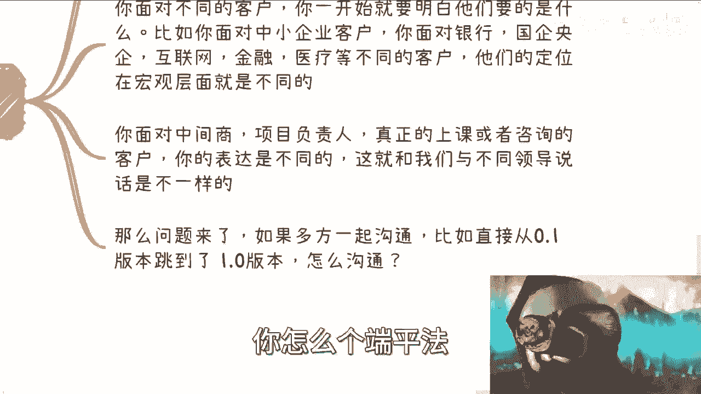

# 从0到1咨询盈利篇4：如何与客户沟通，从而让客户觉得自己很专业 💼

在本节课中，我们将要学习咨询或培训项目中，如何通过结构化的沟通流程和材料准备，让客户感受到专业性，从而成功推进项目并建立信任。

上一节我们介绍了项目启动前的准备，本节中我们来看看与客户沟通的具体流程和核心要点。

## 沟通的核心流程 🔄

与客户的沟通并非简单的单次对话，而是一个包含多个阶段和多方参与的迭代过程。以下是主要的沟通流程：

以下是沟通流程的几个关键阶段：

1.  **从中间商获取信息**：在咨询或培训项目中，通常存在中间商。你首先会从中间商那里获得关于客户需求的初步信息。
2.  **编写0.1版材料**：基于中间商提供的信息，你开始编写初步的方案或产品介绍。这个版本我们称之为 **`0.1版`**。
3.  **获取客户反馈并迭代**：中间商将你的0.1版材料递交给客户后，你会从客户那里获得反馈，从而进行第一次迭代。
4.  **产出0.2版材料**：根据客户的直接反馈，你修改方案，产出 **`0.2版`**。这个阶段可能包含多次来回沟通。
5.  **进行三方会议**：你、中间商和客户方的项目负责人进行三方沟通，进一步明确需求。
6.  **产出0.3版材料**：在三方会议后，你得出一个更贴合项目负责人KPI和目标的 **`0.3版`** 方案。
7.  **接触最终受众**：你可能会与最终接受培训或咨询的学员或项目方直接沟通，了解他们的具体、接地气的需求。
8.  **产出0.4版材料**：结合最终受众的需求，你调整方案，产出 **`0.4版`**。
9.  **敲定最终方案**：经过以上所有流程的沟通和迭代，最终你会产出一个让各方都满意的 **`1.0版`** 方案。

这个流程的周期可能延长或缩短，但其中大部分步骤在实际操作中都会遇到。

## 材料专业性的精髓 📝

理解了流程，我们来看看在每个阶段如何通过材料体现专业性。材料的准备是沟通中体现专业度的核心。

以下是各版本材料的关键作用：

*   **0.1版**：这个版本的核心是 **实现中间商对客户承诺的“牛皮”**。中间商能拿到项目，必然对客户做出了一些承诺。你的0.1版材料就是将这些承诺具体化、可执行化的第一步。
*   **0.2版**：这个版本需要 **直接、无条件地满足客户的反馈**。即使客户的需求从“鱼香肉丝”变成了“地三鲜”，也不要试图反驳或质疑中间商。因为大概率是客户改变了主意，而中间商只是传话者。你的任务是快速调整，给出“地三鲜”方案。
*   **0.3版**：这个版本的目标是 **同时满足项目负责人的KPI和之前敲定的需求**。项目负责人关注的是项目成功交付的指标，你需要将方案与之对齐。
*   **0.4版**：这个版本要 **兼顾最终受众的接地气需求和项目负责人的要求**。最终用户的需求可能非常具体，甚至与项目负责人的目标有所差异，你需要找到平衡点。
*   **1.0版**：这是最终交付版本。它可能是你知识体系的一个子集，并且可能与最初的设想完全不同。**`1.0版 = 满足虚的KPI + 满足实的学员需求`**。

## 沟通中的关键注意事项 🎯

面对不同的沟通对象，策略也需要灵活调整。上一节我们讨论了材料的迭代，本节中我们来看看沟通对象本身的差异。

你需要明白不同对象的核心诉求：

*   **面对不同类型的客户企业**：例如，银行、国企重视安全性与宏观趋势；互联网公司、中小企业更关注定制化解决方案和实操性。你的沟通重点和材料侧重点应随之改变。
*   **面对不同层级的联系人**：对中间商、项目负责人、最终学员，说话的方式和内容要有区别。这类似于对不同级别的领导汇报需要不同的策略。

如果在多方会议上（例如中间商、项目负责人、最终用户同时在场），沟通的原则是：**以拥有决策权的人（通常是项目负责人和中间商）为主**。首要目标是拿下项目，至于最终用户的体验，可以在后续执行中灵活调整。试图在会议上“端平”所有人的需求是非常困难的。

## 沟通中的最大忌讳 🚫

最后，我们来总结几个在商业沟通中必须避免的误区。

以下是需要牢记的几点忌讳：

1.  **不要轻易拒绝或争论**：在沟通中，对于客户或中间商提出的要求，首先要答应下来。商业合作的首要目标是保住项目（Case），而不是争论需求的对错。即使最后需要外援协助完成，也比谈崩项目要好。
2.  **保持逻辑清晰，但避免正面冲突**：无论对方态度如何，都要在专业度和逻辑性上进行沟通。可以提出专业建议，但方向性问题上要迎合对方。**你的专业度必须通过满足客户需求来体现，而非自我标榜**。
3.  **不要试图教育客户**：即使客户提出的技术或方案在你看来已经落伍，也不要直接指出。落伍与否不由你评定，直接反驳会让对方难堪，不利于合作。
4.  **切勿流露负面情绪**：沟通中可能会感到憋屈或不愉快，但所有的情绪在商业目标面前都应隐藏。你、中间商和客户的共同终极目标是：**`完成项目 -> 拿到款项`**。一切个人感受在此目标前都需让步。
5.  **认清自己在商业链路中的位置**：在整个合作链条中，你可能只是其中一环（甚至可能是“二道贩子”的下游）。要清楚自己的角色和应得的利益份额。客户是资金来源，中间商维护关系，你提供专业服务。抱怨不公并无意义，确保项目顺利进行并获取自己应得的报酬才是关键。

**本节课中我们一起学习了**：咨询项目中从获取信息到交付成品的完整沟通流程（0.1版到1.0版），理解了每个阶段材料准备的精髓在于满足不同对象（中间商、项目负责人、最终用户）的差异化需求，并掌握了与客户沟通时需要保持的专业态度和必须避免的忌讳。核心在于始终明确商业目标，灵活调整沟通策略，最终实现项目的成功交付。