# 从0到1咨询盈利篇4：如何与客户沟通，从而让客户觉得自己很专业 - P1 - 赏味不足 - BV1w94y1a7AF

啊大家好啊，这个我们继续来讲的盈利篇四啊，呃如何与客户沟通啊，从而让客户觉得自己很专业啊，这个地方呢是这样子的啊，呃流程可能没有大家想的这么简单。

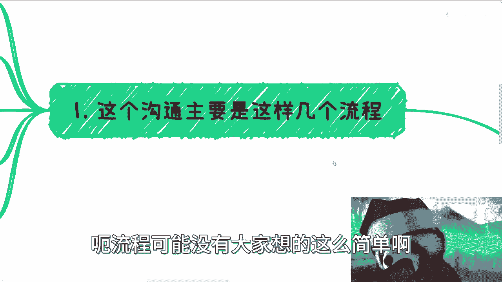

这个沟通呢主要有这么几个流程。

第一啊你会先从中间商，因为大概率啊你不管做咨询还是培训，你会你都会有中间商，因为大概率你不是个销售，或者你就算是个销售，那个甲方也不会你啊，就这么简单，所以说呢你肯定会找个中间商啊。

那么大概率你会先从中间商这边，得到对应的信息，好吧，得到这个信息。

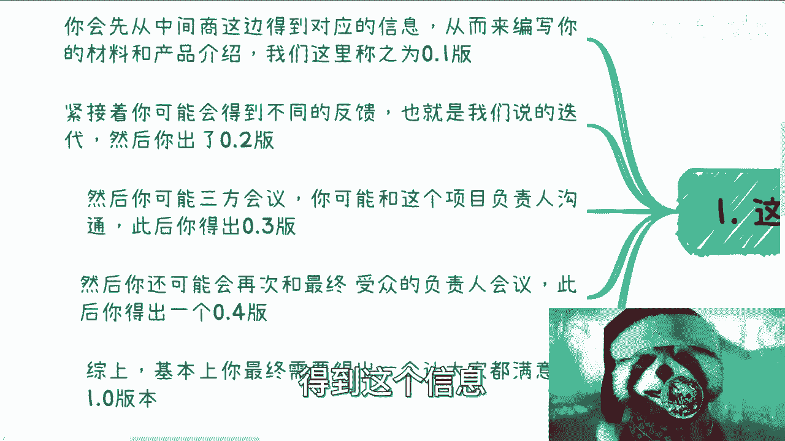

然后呢就是从而来编写你的材料和产品介绍啊，我们在这个地方呢称之为0。10。1版。

0。1版呢其实主要是来自于中间商的。

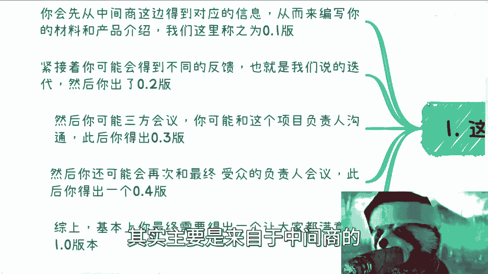

第二呢就是说紧接着你可能会得到不同的反馈，因为中间商把你的材料递过去之后，我们还会从客户这边拿到更新的东西，也就是我们说的迭代。

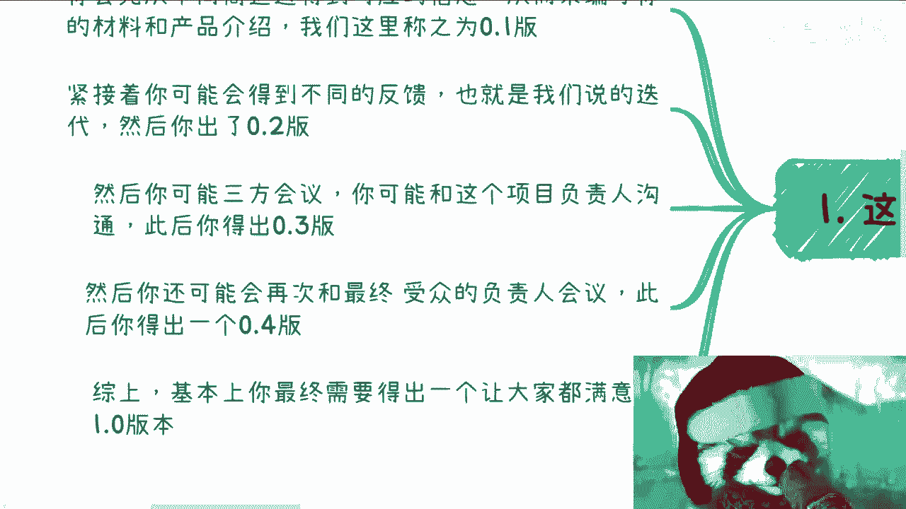

然后你会出0。200，然后呢你可能会有三方会议，也就是说你对中间商，然后是客户啊，那么这个时候呢，你可能跟的是这个培训或者咨询项目的负责人，三方沟通，那此后呢你得出了一个0。3版啊。

那么再然后呢你可能会跟最终的受众，也就是说来听你这个培训，或者说来接受你这个咨询的这些项目方啊，因为你要明白啊，就是公司里面啊，呃项目负责人，就是这个培训的项目负责人，和最终的来接受这个培训的人。

他往往不是同一批啊，那么此后你会得出一个0。4版，那么综上啊有可能周期更长，也有可能是相对缩短啊，但是综上所有的流程之后呢，你基本上会得出一个让大家都满意的。

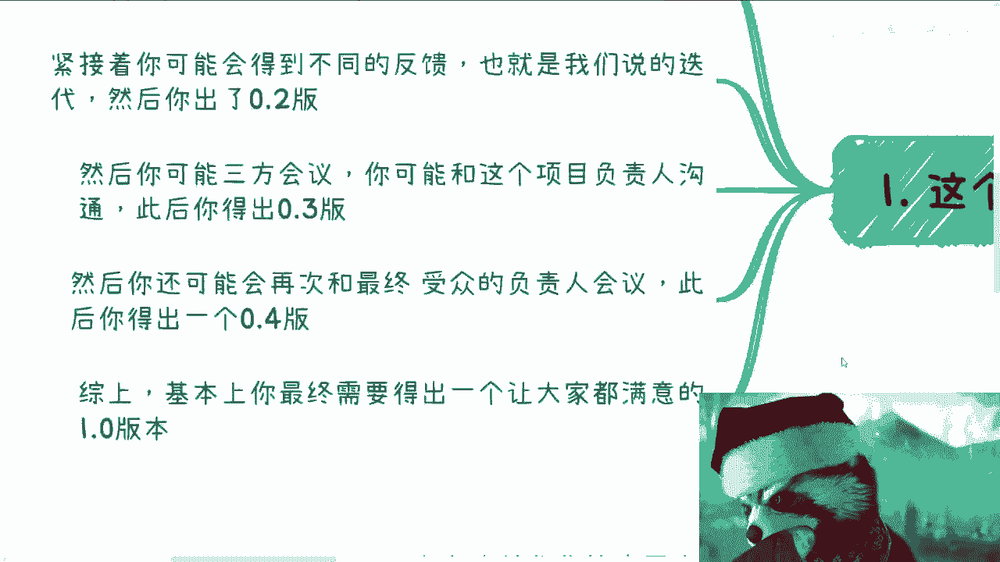

1。0版本啊，那么这个就是我们说的流程，那么在我相信啊。

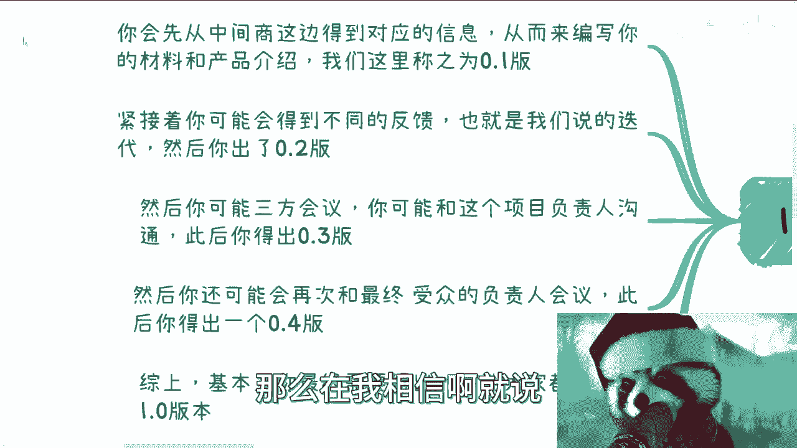

就说呃你们但凡没有做过呃，我不知道啊，就大家的悟性啊，能从这个文字当中能理解出来多少东西啊，但是不管怎么样，就是说真正做的时候呢。

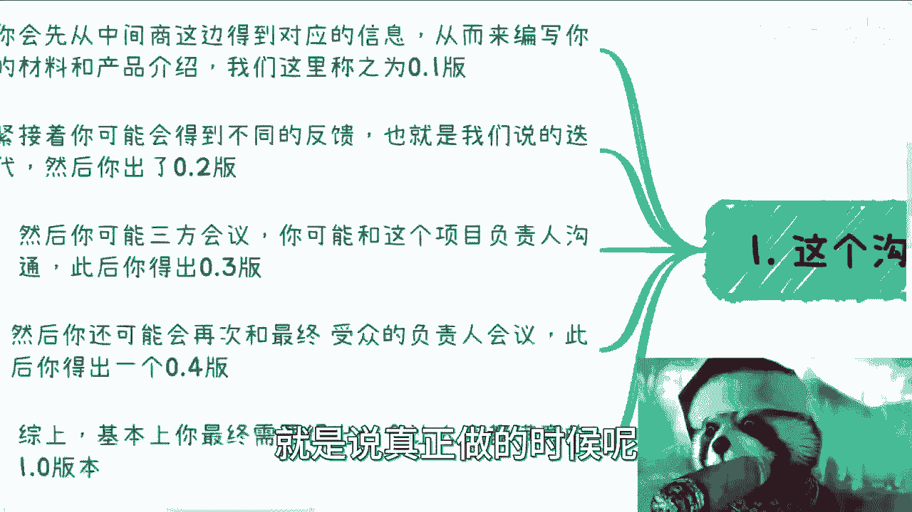

一般来讲就这些步骤呢你都会碰到啊，你最多就说是这个多多少少的问题。

那么第二点就关于这个材料的专业性，我跟你讲这事儿就是精髓啊，就很精髓，为什么，首先在0。1版本的时候，你其实给出来的是一个满足中间商跟客户吹的，牛皮的版本啊，因为你要明白一点。

中间商之所以能拿到客户的case，一定是有他的手段对吧，一定是他说了什么，因为你要明白啊，永远是僧多肉少啊对吧，那么这个森他能拿到这块肉，就说明他比别的森牛逼对吧，那牛逼在什么地方呢。

那就看你是不是能够把这个牛逼坐实了对吧，那么这个时候这个0。1版本，其实是为了这个牛逼而吹出来的这么一个东西，那么这个时候你就是来实现我就这么写了，你就是来实现这玩意的大陆神仙啊，这个赤脚大仙。

这是第一点啊，那么0。2版本呢，其实是需要根据反馈直接去满足啊，也就是说你给过去一个东西，中间商返回来一个东西，你可能会觉得哦一开始嘛跟我说，打个比方，我们烧个菜，一开始跟我说嘛，要鱼香肉丝对吧。

等你这么做了一个鱼香肉丝方案过去之后，他就跟你说，我不要我要地三鲜，你就会觉得我，中间商吧是吧，但不好意思，我跟你讲，你千万不要去说中间商是，因为我就这么告诉你，大概率啊，第一点中间上他是不懂的。

因为中间商要做的kiss多了去了，他跟你又又不搭边对吧，你说你今天做鱼香肉丝，那说不定这中间商他妈的做的东西太多了，有有做新零售的，有做这个餐饮的，衣食住行都做，他管你是什么东西啊对吧。

所以说大概率的呢他并不是周年生，而是你客户啊，那么这时候呢中间商会跟你沟通，就说唉可能谁谁谁啊，我们需要这个东西修改一下或者怎么样子，你不要妄图去沟通或者反驳，我跟你讲，就是聪明人啊，不要去沟通或反驳。

因为沟通或反驳没有意义的，因为中间上不懂的呀，你跟你反驳他会沟通没有用的，你知道吗，就是说你就根据对方跟你说的第三项没问题好，我就给你个第三线方案对吧好，那么在0。2可能这个当中有有N多次啊，0。

2不是一次，可能有N多次啊，好那么到了最终要跟0。3版本开始做了，那么0。3版本开始，就是要去摸这个对方的需求对吧，那对方可能是这个项目负责人啊，他主要是为了完成这个项目，他就有一定的KPI。

只为了满足这个KPI，他不知道这个项目到底做什么的啊，所以说呢你要想办法在内容上，那这个时候就0。3版本，你得做一个新的方案，这个方案就是在最终0。2版本的情况下面，给出一个既能够满足当时0。

2版本的需求，又能够满足这个项目负责人的KPI的需求，的这么一个东西。

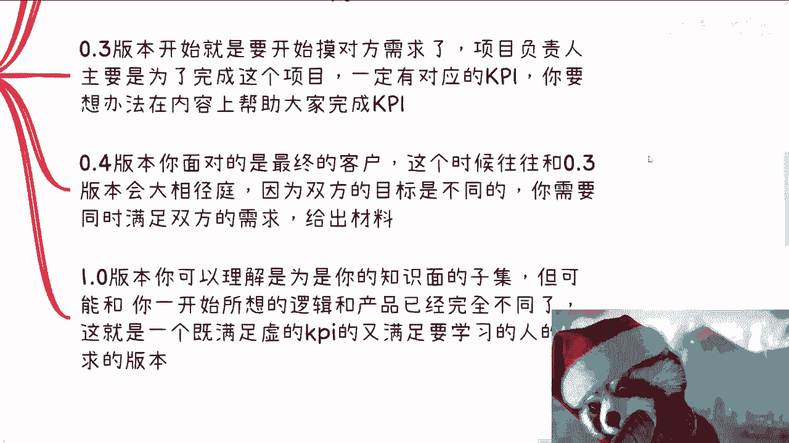

那么在接下来就是0。4版本，0。4版本呢你面对的是最终的客户对吧，那这个时候呢他跟它往往跟0。3版本呢，它又可能出现一个就是说这个南辕北辙的情况，因为双方的目标是不一样的对吧，因为0。

4版本你要面对的是最终的客户，他可能的需求是很接地气的对吧，而0。3版本呢他会告诉你，就说啊这个反正给你一些信息，那虽然0。3也很接地气，但是0。3和0。4，可能接的是不一样的地气啊。

因为双方的目标是不一样的，那么与此同时呢你得满足，同时满足双方需求，给出这个材料。

那么最终1。0版本呢，你可以理解为是为了就是呃11。0版本，这个东西呢就是你的整个知识面的子集，也就是说你甭管他要什么东西对吧，都在你可控的范围里面，但是呢有可能跟你一开始所想的逻辑跟产品。

已经完全不是一个东西了啊，就是给你0。1版本，0。2版本给出来的大纲，已经完全不是一个东西了，对他1。0版本就是一个既满足虚的KPI，又能满足最终来学习的，这些人的需求的这么一个版本啊。

那么这个事就说大家在关于材料的准备。

要去明白。

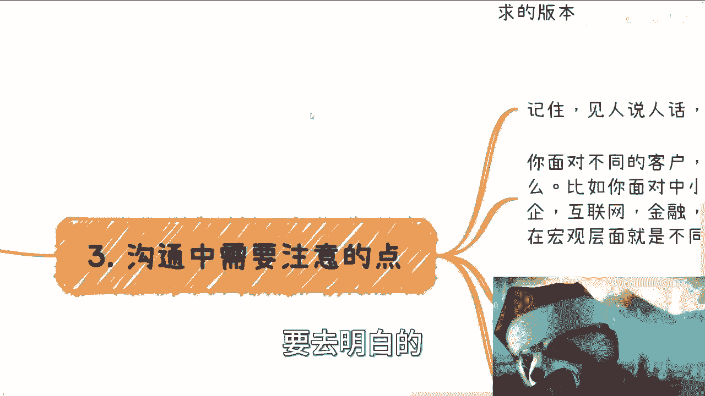

那第三个呢就沟通当中需要注意的点呢，我觉得你不一样的客户。

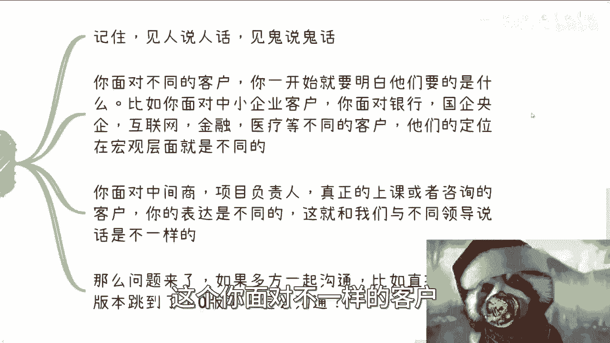

你一开始就明白他们要的是什么，就比如说你面对的是中小型企业对吧，你面对的银行国企央企，互联网金融，医疗对吧，它不同的用户，那他们原本的定位，在宏观层面上肯定是不一样的对吧，你比如说你说医疗银行这边。

他可能对安全性要求比较高对吧，他对于这种产品就是对你所讲的东西，它对于这种这个宏观层面，比如说海内外发展啊，新型技术啊，他可能要求比较高啊，那同时呢他对那种比如说这个实操类的对吧，那要求会比较高啊。

但是你比如说你放到互联网对吧，放到比如说很多中小型企业，那又不一样了，它可能需要你定制化对吧，就是说他对于这个这个这个海内外需求，包括有些这个全新的技术，他要求可能不是那么高，你提带到一笔啊。

这个说一下就可以了，但是他对于他对于就说这个跟他们公司的这个，目前所碰到的问题对吧，想要解决的问题可能贴合度更高，那么你可能需要针对他们，才在做这个针对性的方案啊。

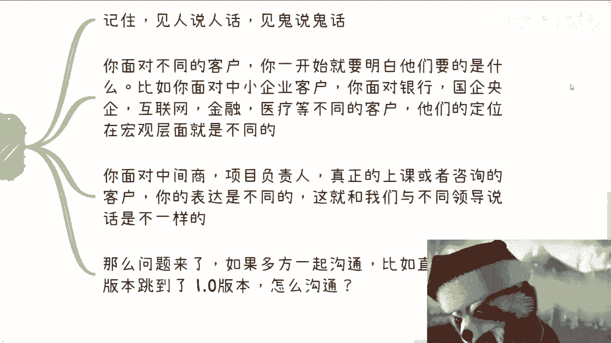

那么同样的你面对中间商项目负责人对吧。

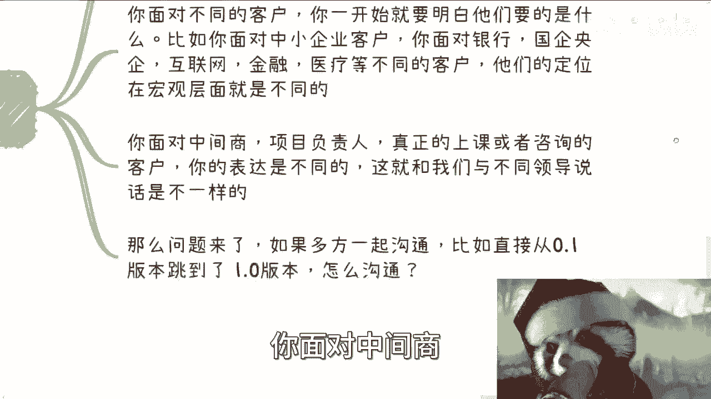

包括就是说真正来上课的这些人，或者真正来咨询的客户，你的表达也是不一样的对吧，这就像比如说你跟不同的领导去说，不同的话，你对不同的级这个级别的人说不同的话，其实都一样的对吧，那么那问题来了。

你说如果多方一起沟通，就是说0。1版本的人，0。2版本的，0。3版本人，0。4版本人，甚至还有0。5版本的人对吧，就是很多人一起沟通对吧，他直接从0。1版本跳到1。0版本，那怎么沟通，那我跟你讲很简单。

就是如果大家开一个这个多方会议对吧，那么你一定是以什么，是以在这个项目谁能拍板为主，你就去跟跟他对那些人来拍板了，中间商是很重要的对吧，然后就是他们的那个项目负责人，因为最终来学的人你重要吗，重要的。

但是最重要的是，你先把这个kiss拿下来，学的人怎么样，这个是后话，你人去了灵活随机应变对吧，但是你一开始如果在多方会议里面，你要去把这碗水端平，端不平呢，因为大家目标不一样，你怎么端平法。

然后我们来说第四点。

就这个这个最大的一些忌讳啊，第一个就是你在沟通的过程当中啊，任何事情你都得先答应下来对吧，因为你所有你要明白，你去做一个商业的行为，你去执行这个case，这个kiss保住是最大的优先级。

而不是说来评论来，而不而不是大家来在那边争吵说啊，这个需求应该怎么样，不需求怎么样，不重要啊，重要的是你能满足别的一切都好说，哪怕最后不是你来做，你说我找个老师来做也可以，无所谓对吧。

你不能让这个中间商，不能让这个甲方，乙方把这个K4最后最后谈崩了啊，我跟你讲，以前我们谈崩的K4多了去了啊，很多的啊，这是第一种，第二种呢就是在沟通过程当中呢，你逻辑性要清楚，客户也好，项目负责人也好。

哎我跟你讲，每个人情况不一样的对吧，有的人很聪明，有的人很对吧，有的人在企业里面这个做领导做惯了对吧。

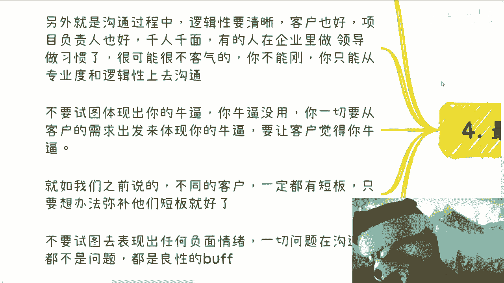

他可能比如说对对外面的人他看不惯对吧，或者很不客气的对吧，所以说就说你不能直接去跟他这个，正面去起冲突对吧，你只能说在专业度和逻辑性上面制作沟通，而且你要迎合他，反正他说什么是什么对吧，当然了。

就是说就是说方向上面他说什么是什么，但是专业度上面你可以去体验啊，体现出你的专业度对吧，然后呢就是说千万不要试图体现出你的牛逼，你牛不牛逼没有用，因为你的牛逼是客户说了算的哦，你一切的牛逼。

一定要从客户的需求来体现出你的牛逼，那么客户会买你账对吧，否则客户只会觉得你是个，我要换老师，为什么，反正我是甲方，我管你是谁啊，对不对，我就不喜欢，那我跟你讲，有的客户就是这样子的。

有的客户就说我就不喜欢这个人，对你们给我换，我就问吧，你觉得中间商有有话语权威了没有的呀对吧，那就如我们之前说的，不同的客户，他一定是有短板的，你明白吧，就是国企央企，它一定是一定是流程很复杂。

一定里面的人呢他对外界很多信息呢，他了解程度不如不如互联网公司对吧，那互联网公司也是一样的，它跟它相对来讲可能比较灵活，但是它在流程啊，在很多别的上面他可能不是那么专业对吧。

你要明白的就是说你面对不同的客户，你要出不同的牌啊，而不是说而不是说你要去跟他们硬，刚就是说啊，你说比如说银行这边或者互联网这边跟你说，我们要用什么技术或者用个什么东西，你跟他说哎这个东西落伍了。

这个东西怎么样了，你不要去讲，你知道吗，落不落伍，这不是你来评定的，你懂吗，甚至就是对方可能也知道落伍，你跟人家说落伍了，你让人家怎么回你哦，我们是，对吧啊，就说最后呢。

就是说不要试图去表现出任何负面情绪，就是你可以觉得对方是，你也可以在沟通当中呃，很不愉快啊，你也可以就是说啊让你觉得很憋屈或者怎么样，但是一切问题在沟通当中都不是问题，因为你的目标跟中介的目标只有一个。

就是让甲方把这个case确定下来，从而完成这个case。

最终拿到这笔钱就结束了，你知道吗，所有的东西在商业合作面前都是没有意义的。

因为还是那句话，我就告诉你们，我跟中间商，我跟我的合作方以前受过很多的气对吧，我们以前经历过非常多的case，就像我说的，就是我20131415年，我一年365天，可能有2/3的时间都在外面飞对吧。

也就是说有2/3的时间我都在客户这边，在做这个这个咨询和培训，我1~5还要上班对吧，那这当中太多了，但是到最后你要明白一点，就是你跟中间商要让甲方觉得嗯你们很专业，你要让甲方很开心。

而你跟中间商如果觉得客户，你跟中间商一定要达成一致，对客户，而不是你，你知道吗，因为如果你跟客户起冲突，或者你跟中介要起冲突，你要明白你永远是最的一个，因为客户比你有钱啊，中间上是靠客户养着的。

算老几啊，对不对啊，所以说在整个商业链路里面，你一定要明白，就是在这个链路里面，你看上去好像只有你对吧，只有中间商，只有客户三房，但其实真正的沟通他不止三房，他可能有很多人。

甚至你不是直接跟中间商合作的对吧，你可能是隶属于一个一个中间商的中间商，二道贩子，你不知道对吧好，那么这个当中呢，就是说很多时候他的链路是很复杂的，你得明白你在链路里面到底处于什么个角色。

而同时你你差不多能拿到最终case的这个多少对，就是说你可以赚钱赚的少，但是你得心里有逼数对吧，你就像我当时我大概13年一天，我差不多在1万2到1万5吧对吧，就我得有B数。

就是客户给的远远比这个高啊对吧，中间商拿的远远比我高啊，但是我从来不会说我不会抱怨一个子，为什么，因为人家要养销售啊，人家要去维护关系啊，我他妈就是只不过是过去劳个动了而已，对我有什么资本跟他们去谈。

对啊行，反正就是这么个意思好吧，我希望就是说嗯，大家因为我为什么在前面编这个序号呢，是因为大家看的时候呢，能够把前面都看进去，你单纯看一篇，你可能不知道我在讲什么东西，行好吧，那就先这么着吧。

这个大家反正有任何其他的一些呃，商业上的问题啊，或者来说个人的这个规划啊，或者职业发展或者其他的，反正就是跟赚钱有关的啊，然后有什么问题呢，反正你们整理好整理好，反正私信我，我们再走咨询好吧。

