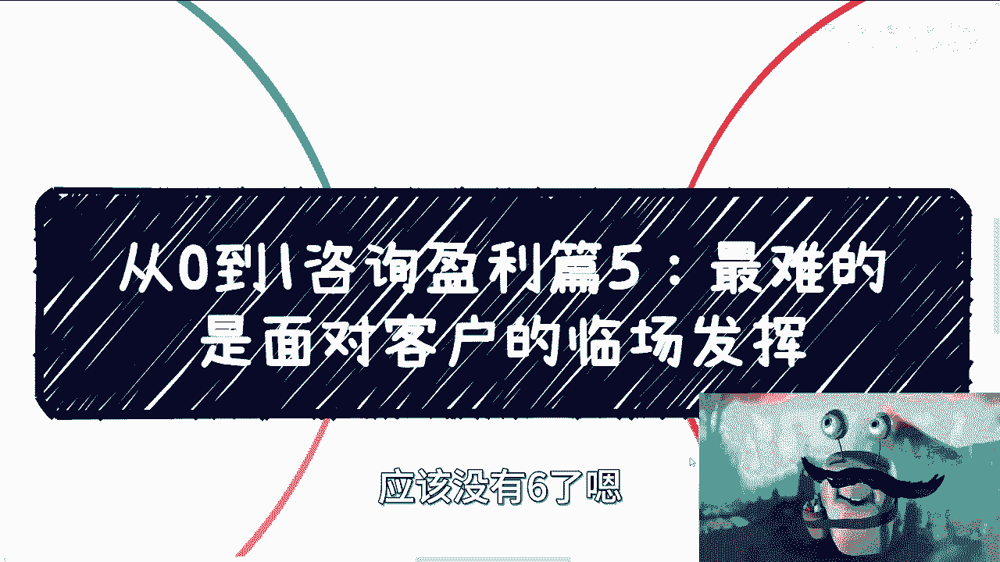

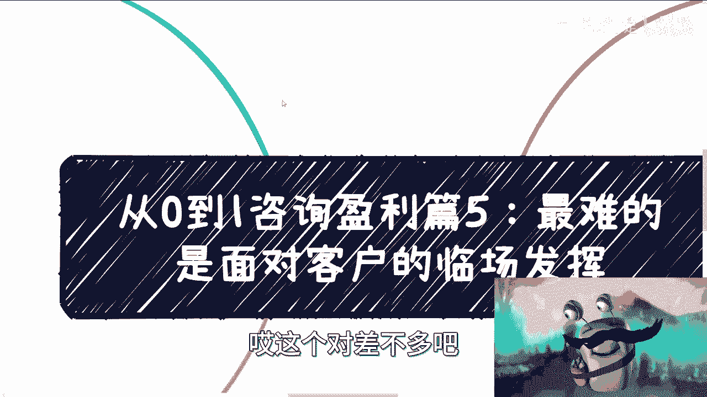

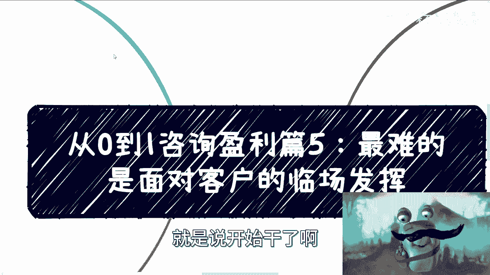

# 从0到1咨询盈利篇5：最难的是面对客户的临场发挥 🎤

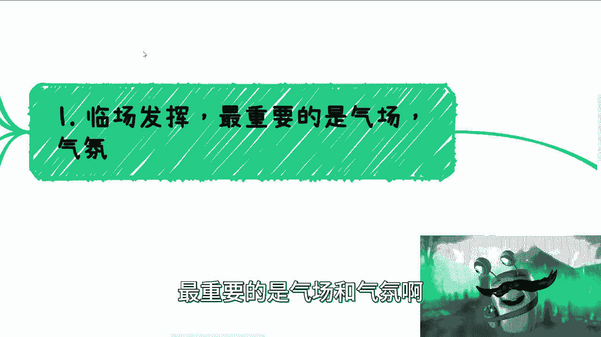

在本节课中，我们将要学习咨询交付环节中最具挑战性的部分：面对客户时的临场发挥。前面四篇我们重点讨论了如何准备，而本篇将聚焦于实战开始后，如何通过气场掌控与氛围营造来确保咨询或培训的成功。

## 临场发挥的核心：气场与氛围

上一节我们介绍了咨询前的各项准备工作，本节中我们来看看实战环节。与面试等短期沟通不同，咨询或培训通常按天计算，形式多样，可能是面对数百人的讲座，也可能是小范围的开放式讨论。形式由客户决定，咨询师没有主导权。因此，临场发挥的核心在于建立强大的**气场**和营造合适的**氛围**。

### 气场的建立：自信与专业

气场意味着要压住全场，让听众感受到你的专业与权威。这并非靠伪装能实现，因为咨询是一场持续数小时的“战斗”，伪装难以持久。真正的自信应融入你的DNA。

以下是建立气场的几个关键点：

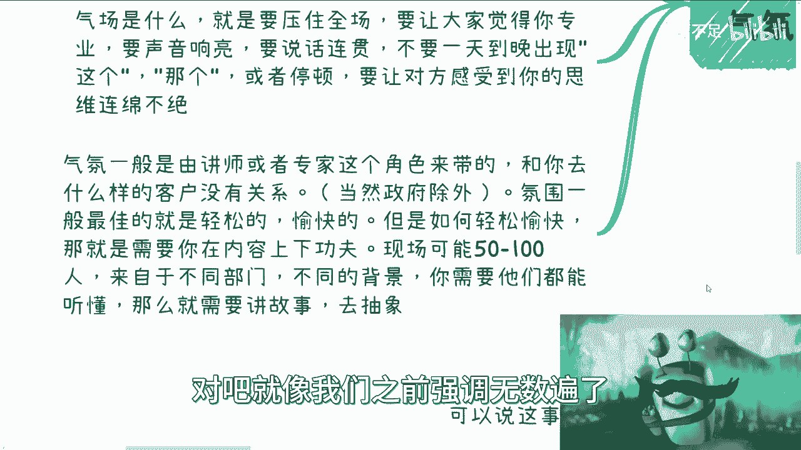

*   **声音洪亮，表达流畅**：说话要响亮、清晰、连贯。避免频繁使用“这个”、“那个”等语气词，或出现长时间的停顿和思考状（如“嗯…让我想想…”）。这会给听众，尤其是现场的中层管理者或领导留下不专业的印象。
*   **思维连绵不绝**：要让听众觉得你的思维是连续且深入的，让他们感到你足够专业，甚至难以插话或挑战。
*   **应对潜在危机**：即使现场客户不直接批评你，他们也可能向引荐你的合作方（供应商/中介）投诉。虽然合作方基于商业关系可能不会直接责骂你，但这不代表你的表现没有问题。你需要有高情商，理解合作的核心目标是**留住客户**，而不仅仅是完成当前项目。

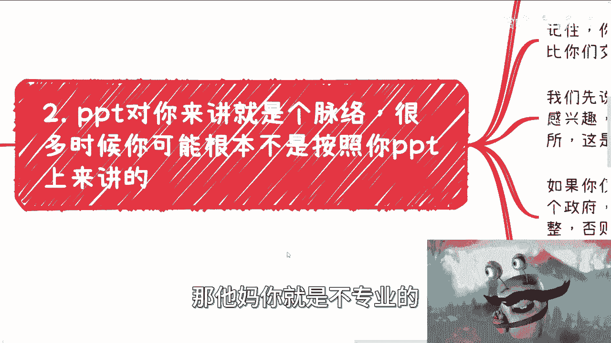

### 氛围的营造：让所有人听懂

氛围通常由讲师或专家主导（政府机构除外）。最佳的氛围是轻松愉悦的，但这并非靠讲笑话或变魔术实现，关键在于**内容的设计与传达**。

现场听众可能来自不同部门、拥有不同背景。确保他们都能听懂的唯一方法，是将专业知识**故事化、案例化**。

以下是营造良好氛围的两大原则：

1.  **专业与否由客户定义**：即使整个市场都认可你的专业，但如果现场客户觉得你不专业，那就是不专业。因此，让客户听懂是首要任务。
2.  **PPT仅是脉络，而非剧本**：现场演示时，十有八九不会完全按照PPT来讲。PPT往往是满足多方需求的折中产物，而非为现场客户量身定制的最佳交付物。真正的交付内容需要你根据现场情况灵活调整。

## 如何应对现场突发状况

上一节我们讨论了建立良好氛围的基础，本节中我们来看看实战中必然会遇到的挑战及应对心态。咨询现场充满变数，听众可能因工作繁忙而心不在焉、玩手机或频繁离场。如果是付费内训，你必须立即调整，否则可能失去当前乃至未来的合作机会。

以下是几种常见的突发状况及应对思路：

*   **听众不感兴趣**：如果发现听众低头、玩手机或反馈消极，必须立刻调整讲述方式或内容重点。
*   **被客户当场挑战**：领导或负责人可能直接打断你，指出内容不相关或大家不感兴趣，并要求你换种方式。这时切忌愣住，需要快速应变。
*   **案例讲完后仍不理解**：即使你讲述了行业内的案例，听众可能依然不懂。这时需要你将案例**举一反三**，类比到他们熟悉的领域。

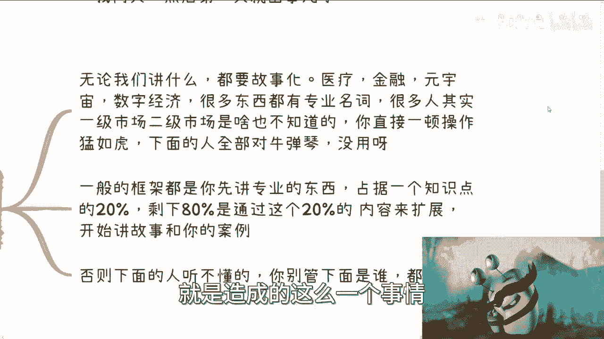

**核心应对框架**：通常，你可以用20%的时间阐述核心专业知识点，然后用80%的时间，围绕这个知识点展开，讲述跨行业的、生活化的故事和案例。例如，向金融客户解释医疗概念时，可以将其类比为金融领域的类似机制。

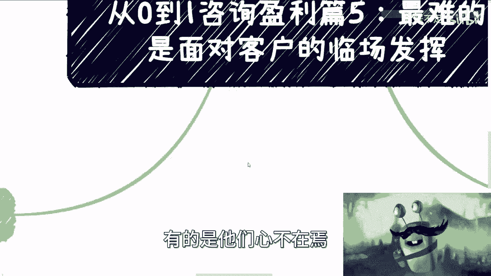

## 临场发挥能力的本质

那么，面对“讲完案例他们还是不懂怎么办”这类终极问题，是否有标准解决方案？答案是：**没有**。

真正的临场应变能力无法通过单一的方法论传授。它依赖于：

*   **丰富的经验积累**：只有经历过足够多的实战场次，才能将应变能力内化。
*   **庞大的知识储备**：脑中需要储存大量的案例和知识片段，才能在不同场景下快速提取、组合。
*   **从失败中学习**：很多能力只有在亲身经历并反思失败后，才能真正掌握。

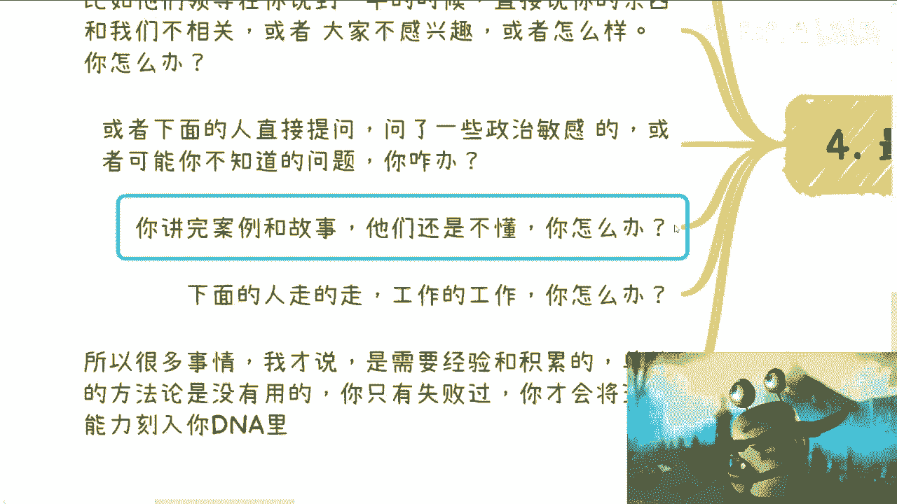

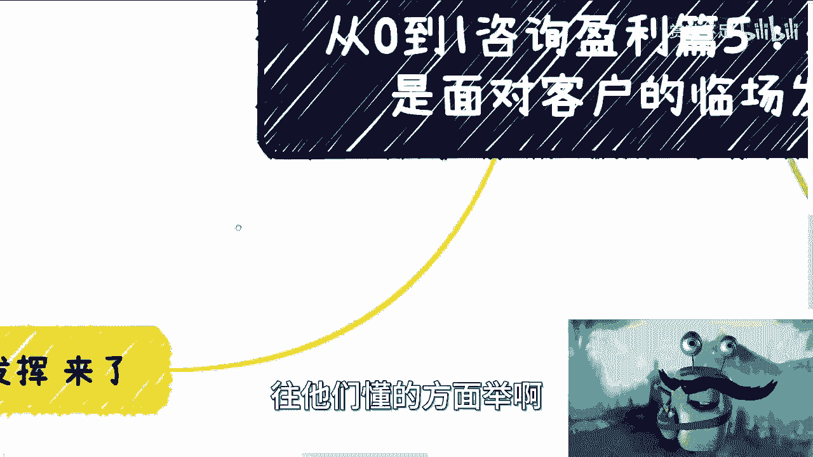

这就像学习驾驶不同类型的车辆，知道理论（方法论）很重要，但真正的操控感（应变能力）必须通过实际上手练习才能获得。咨询盈利的核心知识，更多是告诉你“有哪些坑要避免”，而如何从“及格”做到“优秀”，只能依靠实践中的自我锤炼。

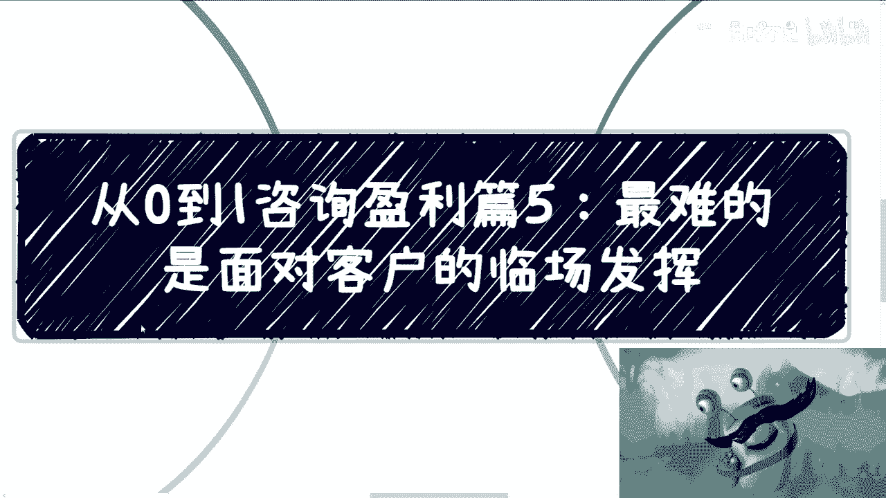

## 总结与回顾

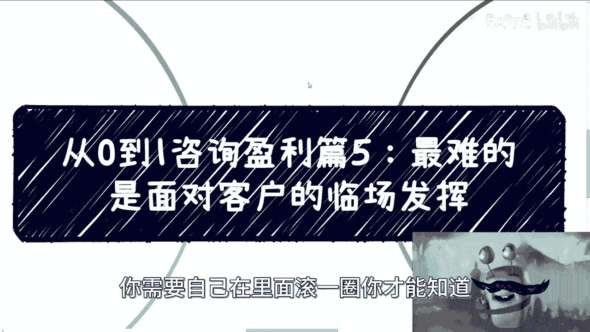

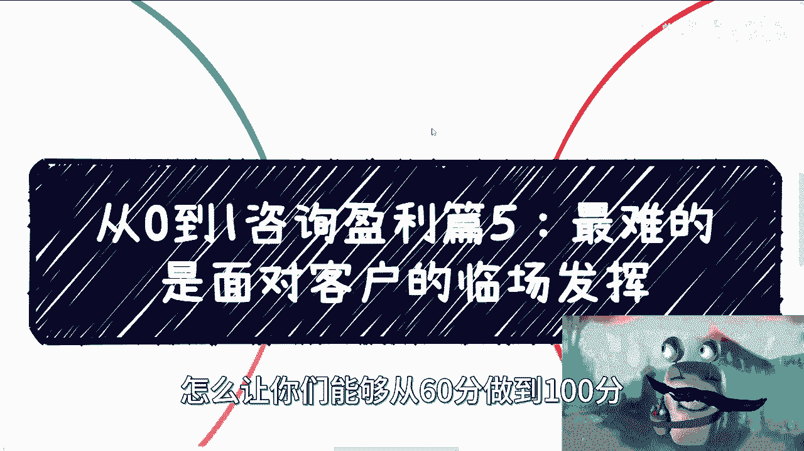

本节课中我们一起学习了咨询交付中最难的环节——临场发挥。我们明确了**气场**（通过自信、流畅的表达展现专业）和**氛围**（通过故事化、案例化的内容确保听众听懂）是两大支柱。我们了解到PPT仅是辅助脉络，实战中需灵活调整。同时，我们也认识到，应对各种突发状况的**核心应变能力**无法速成，它来源于大量的实践、积累和复盘。

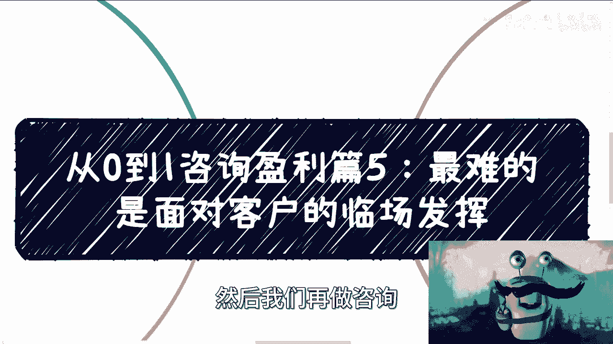

咨询业务的流程在不同领域大同小异。本系列的五篇内容构成了一个基本闭环。希望这些分享能帮助你避开一些常见的坑，而剩下的征程，则需要你亲自上场，在真实的商业场景中历练和成长。