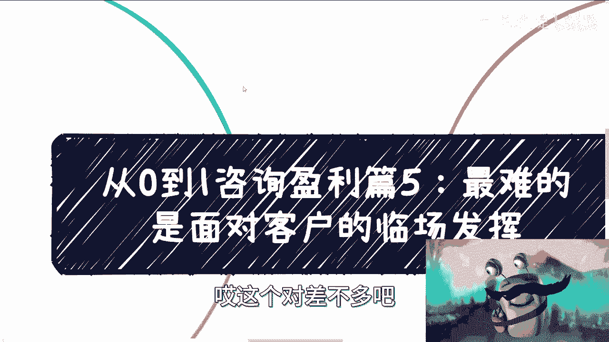
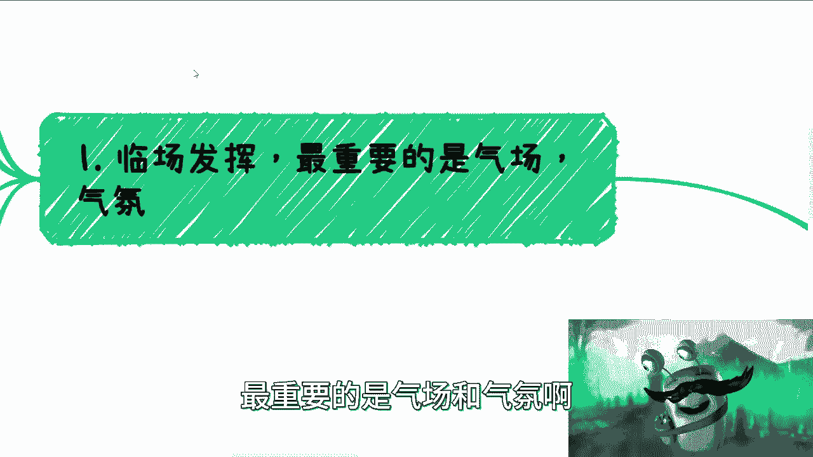
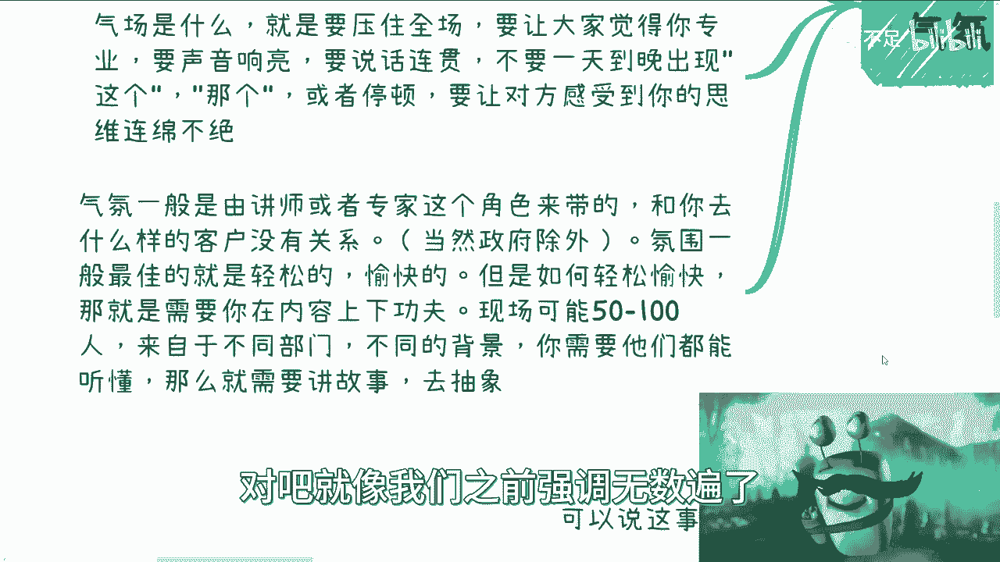
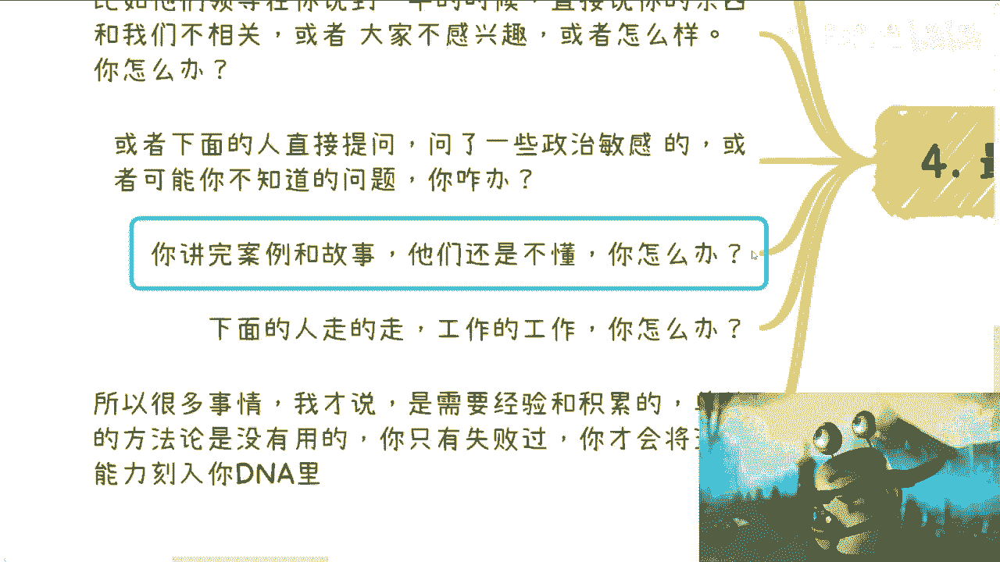
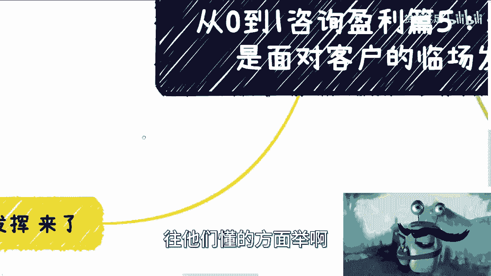
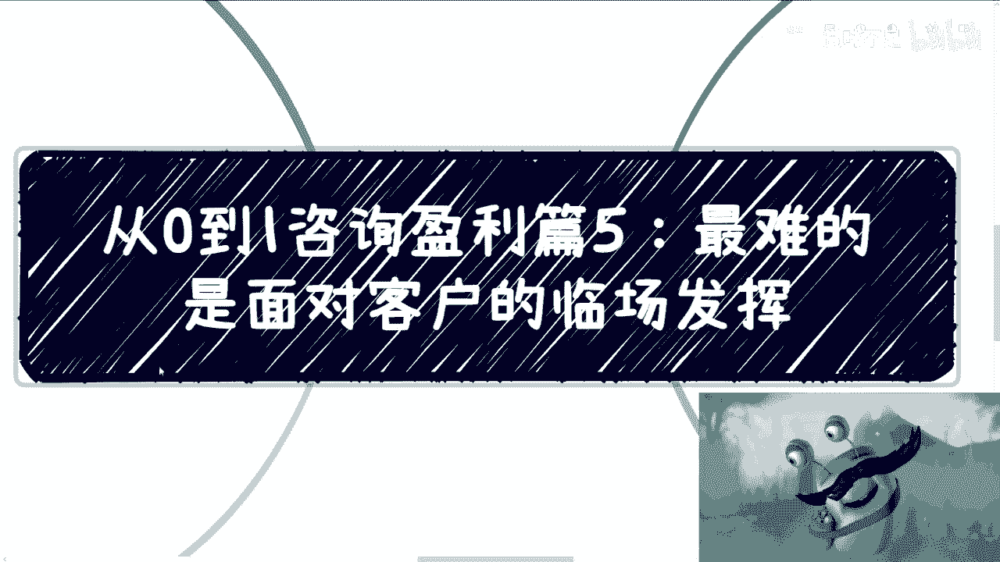
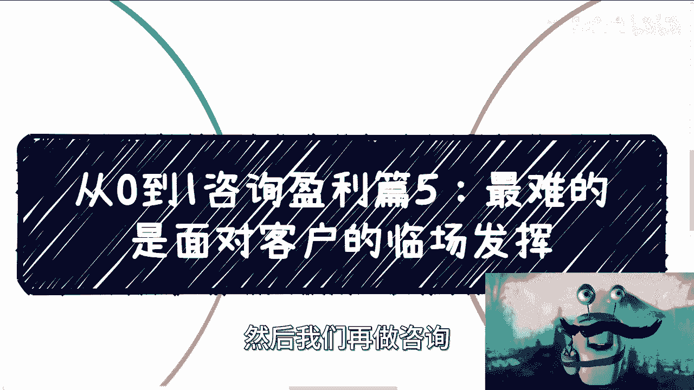

# 从0到1咨询盈利篇5：最难的是面对客户的临场发挥 - P1 - 赏味不足 - BV1k94y1b7qa

好啊这个盈利篇五应该就到这里结束了，我应该整个闭环应该也差不多了啊，应该没有六了。

嗯啊这个对差不多吧。

那最难的呢其实是面对客户的临场发挥，也就是因为前面四个我们说的是准备嘛对吧，那么到第五个呢，就我们开始说啊，就是说要开始干了啊。

好那开始干了对吧，那么临场发挥呢最重要的是气场和气氛啊。

呃这个呢跟面试，还有其他的很多的沟通不太一样，因为你一般的咨询啊，他都是按照天来算的啊，最少也是0。5个day对吧，那么培训也是一样的，当然了形式也有很多不同，有的呢是那种讲座形式的。

比如说在阶梯教室下面三四百人啊，有的呢是那种讨论形式的，很开放啊，当然了，这个东西取决于客户，不取决于你啊，你没有主导权，那么我们说这个叫什么气场啊，首先第一点你自信很重要对吧，那什么叫自信呢。

就是声音要很响亮，普通话要标准，而且啊这种响亮更标准，你装和坚持呢，我觉得你是装不出来的，因为为什么，因为你单纯弄个几10分钟对吧，我觉得是OK的，你说你要就是因为你我跟你讲啊。

你去做的时候做这种咨询的时候，你会发现你的脑子是是分开来的，就是你既要能够明白你在讲什么，你也要去看下面的人什么情况，你还要去时时刻刻去呃，就是看着说啊，就是自己的这个气场，自己的这个氛围怎么样。

就是你心中的有根线，你不能偏离这根线太远啊，所以说你如果还要装，那这个东西我跟你讲，你脑子是转不过来的啊，所以说这个东西呢它得融入到你的DNA当中啊，那么因为呢就说这是一场持续性战斗啊，单纯的你去装。

或者说你要去坚持呢，很难去坚持的下去啊，那么呃气场是什么呢，就是你要压住全场，什么叫压住全场，就是你要让大家觉得你很专业，你声音要响亮，你说话要连贯，你不要一天到晚就是经常性的出现啊，这个那个好。

这个那个之后你还不出声对吧，你说好，这个让我想想啊，嗯好好嗯，怎么样，那我跟你讲，他妈下面呃，那下面的这个员工他不会说什么，但是下面一般也都会有中层管理或领导在的，我跟你讲中层管理和领导。

他不会不给你面子，但是他直接会联系我们说的中介啊，也就是说他们的供应商，卧槽我跟你讲，你们可能你们不会知道，但是我跟你说，就是毕竟人家是甲方对吧，你的供应商是乙方哦，跟你联系的，找你的也是乙方。

我跟你讲，可以骂的狗血喷头啊，你懂吗，但是我跟你说这种事情当中呢，就是你得自己情商高，为什么，因为你想啊，你跟乙方的关系，你跟供应商的关系，前面四期我们讲的很清楚了，你是他的一个一个工具人对吧。

但是不管你好不好，他是不能来骂你的，为什么，因为大家是平等的，他骂你有什么好骂的对吧，你说今天我给打个比方，我给你们拉了一个这个呃招行招商了，招行的好单子啊，然后呢你们说哎陈老师我来好吧好。

你去去了之后呢，比如说张恒就跟我说，我的这人不行啊，这人他妈的讲讲的什么狗屁玩意儿对吧，怎么样子，然后呢我来骂你，我，你啊，你怎么能这样子，不可能呢，因为大家是商业合作。

就是一方面呢是嗯就是大家都萍水相逢对吧，也就是就事论事，他不用感情用事对吧，这是第一点，第二点就是说我骂你没有用，因为这事已经发生了，大家想的是怎么弥补对吧，就像我前面四期讲得很清楚。

就是所有的合作最终是为了把这个case拿下来，case拿下来也并不是说只是为了赚到这笔钱，更多的是把这个客户留住，因为你要明白客户才是重点，说你有了客户，你今年才有钱赚，你有了客户，你明年才有钱赚。

不是说我今天做完，明年就不做了对吧，所以说很多时候你情商要高，就是你的合作方他不来说你，但是并不代表你没问题，你懂吗，那么这个时候呢就是说我们回到这里啊，就是说你你不能老是出现这个那个。

你也不能老是出现停顿，你不能让对方感觉，你也不能让对方感觉到你很不专业对吧，好，就是你要让对方感觉到，你的思维是连绵不绝的啊，你要让对方觉得你很牛逼啊，他都插不动啊，那么咳咳，气氛男。

一般来讲是由讲师或者专家这个角色来带的，跟你去什么样的客户没有关系啊，当然处处政府单位除外啊，政府这个机构除外啊，那么嗯你不要觉得你去一个比如说啊国企，央企来就好像很严肃对吧，你比如说你去一个学校对吧。

去个什么地方，你就好像很很放松，不一定的，没有的，就这个氛围是由你来带的，那当然氛围一般来讲最佳的哦，是那种比较轻松愉悦的啊，但是如何做到轻松愉悦，不是说你在上面变个戏法来变个魔术对吧。

也不是说你嬉皮笑脸，这个没有用的，你要的是什么呢，你要的就在你的功夫功内容上下功夫，就是现场很有可能是50个人到100人左右，这个是比较常见的，而且他们来自于不同的部门啊，那么不同的背景。

你说你今天讲一个东西，我不管你讲什么任何的东西啊，你需要他们都能听懂，那么你想想看，你是不是只能讲故事，去把你的知识点抽象出来哦，否则你说啊我很专业对吧，我的是你的确很专业，专业到你在上面讲。

下面没人听得懂的，那有卵用啊，没有用啊对吧，就像我们之前强调无数遍了。

你专不专业，不是你说了算的，就算我们就算整个市场都觉得你很专业，今天你去客户这边，客户觉得你不专业，那他妈就是不专业的啊。

那么好，那么这是第一点，第二点，PPT对你来讲，他就是个脉络，很多时候你可能在真实的情况下，你根本就不是按照你的PPT来讲，为什么我跟你讲这事可以说十有八九，你看过之前充电的小伙伴，他肯定知道。

我之前就说过PPT这个东西，它是一个满足各方的一个产物，它并不是一个满足于你现场这个客户的，这个产物啊，它并不是一个真正落地的东西，所以说记住啊，你们就算去做项目，做产品对吧，就说PPT也好。

呃你们交付的软件也好，不包括你们交付的这个叫什么，就是硬件也好，就是无论你们交付什么东西，他可能是个产品，它可能是个服务，但是它是一个道理，什么道理呢，就是说这个产品这个服务。

它可能是一个多方满足多方需求的东西，但是你真正交付的时候，你交付的什么东西，你得想好，对吧，所以说很多时候你们去做政府，做那个高校，做这种企业的case的时候，你们往往会发现你们一开始提交的项目计划书。

那不是项目计划书吗，项目申请书里面内容跟你真正提交上去，它可能不是一个东西，但这很正常对吧，那么我们在这个地方说啊，这个十有八九这个会改的原因啊，我们先说原因嗯，很多时候呢你说着说着你会发现呢。

大家可能并不感兴趣，比如说头都低着啊，都在玩玩玩手机呀对吧，或者频繁上厕所啊对吧，或者说这个大家都在那个工作，因为你很多去的时候呢，你要明白你对面的这些人，他们是有要加班的。

或者说他们可能很多事务要处理，他们不是那种就是说你没事情做，就来听你上课的啊，他们听你上课往往是因为公司的要求，或者说公司的KPI，那么如果呢你仅仅今天只是个公开的分享，那无所谓。

你随便他们爱咋地咋地对吧，你比如说我办个活动对吧，我跟大家说两百两百块钱一个人啊，对对对，那个杭州的活动啊，14号那个活动啊，大家要是有空的可以过来报名啊，就是你这个无所谓，但如果你是一个政府。

一个企业，一个高校内训，那基本上你需要立马去调整，就马上去调整，否则我跟你讲，不单单你可能这一这一次的case没有你啊，你不单单是下一次case没有，你可能这次case都没有了，因为你要明白啊。

原对方是甲方，甲方他毕竟是出钱的，他要对自己的钱负责，或者来说他其实不是对钱负责，他要对自己的专业度负责对吧，你们想想看钱是企业出的对吧好，你去讲了，讲了之后呢，下面大部分比如说五六十%的人觉得哎呀。

这个人讲的不好，哎呀，我们没听懂哎，这个人讲的什么玩意儿对吧好，但是最终吃瘪的是谁，最终背锅的是谁，是你们的leader，就是他们的leader或者是这个项目的负责人，为什么，因为你找的这个人啊。

你当时三方会议的，你当时怎么样怎么样，那你这不是反而体现出这个人不专业吗，对不对，那你想怎么办，那这些领导肯定是可忍孰不可忍对吧，那么他们一旦你去一些就是说国企啦，或者去一些大公司，我跟你说。

你很容易当面被他们challenge，你知道吗，就当面就直接打断，就说哎陈老师，你这个东西我们不感兴趣啊，讲的不好对吧，那你看看能不能换个方式，我跟你讲很多的，我碰到过很多次是吧，好我跟你讲。

我们曾经发生过一个例子，2021年在北京，我们当天当时呢有三天的一个case，我呢找了一个老师，因为我哎讲不了，说难听点，我当时能力我也讲不了三天，我找个老师，然后呢我想让他帮我先弄，第一天啊。

他技术很牛逼，那起码比我当时做架构的时候肯定牛逼，N个档次啊，他第一天我后面两天，但是呢我跟你讲啊，我第一天在家里打游戏蛮开心的，还在打呢，卧槽他妈的，我们的这个合作方就直接打电话过来，他说出事了啊。

领导说不满意，就讲了半天就直接撤了，你知道吧，就讲了半天就把我们的老师撤了，然后我们合作方很急，为什么，因为就像我说的，他知道这个不重要，重要的是他妈的以后不合作了呢，这是个大客户啊，好了。

然后人是我找的，那锅是我北佬对吧好，那我也很急，我怎么办，我当时就是直接我就跟他说，我说那这样也不要烦了，我说你让他半天不要讲了，先撤先撤，撤了之后呢，我说我这样子，我现在就买飞机票，我就飞过来啊。

然后我就当时我就是下午直接去去了呢，因为到也是晚上了嘛对吧，然后第二天早上我再去讲，然后才把这个客户稳住啊，但是从这个事情上面其实也想也想得出来，也能够证明一点嘛，就是说讲一个东西跟他技术本身。

你说多牛逼没有很大的关系，就是啊这个我们往后讲吧，啊记住啊，除了实操，除了实操的内容，就比如说手把手写代码的啊，或者手把手教你什么电动车售后维修的对吧，就除了实操的，剩下的东西啊，你一定要多案例。

多故事，别的不重要，因为无论我们讲什么，你都要故事化，你比如说你今天讲医疗，讲金融，讲元宇宙，讲数字经济，甚至啊你去讲围棋，讲下象棋，将五子棋对吧，你每一个东西你们跟我讲，在你们领域里面也有名词。

我跟你们讲也有我的名词，你一旦碰到名词，大家就不懂了对吧，那很多人我跟你讲，其实我跟他们说一级二级市场，他们都不知道一级二级市场是什么，你要跟他解释嘛对吧，当然了，你比如说我今天做一个视频啊。

如果这个视频比如说今天就30块钱，或者说今天是一个免费的，那无所谓啊，大家不懂就不懂，那不懂你最多问问我对吧，也不会出现什么很大问题，但是你想看，如果你去政府，去企业，去高校，你是一个商业合作。

这个单子是一般来讲，可能10万块钱总归要的吧，好你一顿操作猛如虎，下面的人全部在对牛弹琴怎么办，这没法搞的对吧，你你觉得就而且很多时候你的案例啊，你的案例不能仅局限在你的领域对吧，你说你过去讲医疗。

你所有的案例仅局限在医疗行吗，不行，为什么，因为下面的人可能听不懂啊，你得你得自己去举一反三，把他举到他懂的领域上来对吧，这就好像你想想看，这就好像为什么驾照哦，他要分成这个这个小汽车的。

他要分成公交车的，他要分成那种那种房车的，那为什么就是你操作方式不一样啊，那虽然大家都是在驾驶，那他为什么要分呢，按照按照理来讲，那那统一价这么好呢对吧，一样的道理，就是你比如说当我跟一个开房车的人。

他来跟我讲，哎这个东西技巧怎么弄啊，怎么样子，我可能一脸懵逼，为什么，因为我没经验，也许我们大家都开车，但是我没经验，那怎么办呢，对吧，那一般的框架啊，我跟你说，一般框架是这样子的。

你先讲一个专业的东西，占据这个知识点的20%，剩下80%，是通过这个20%的内容来扩展的，就是你自己举一反三，开始讲故事，讲案例，我跟你讲，否则下面人肯定听不懂的，你不用讲，我跟你讲，你别管下面是谁啊。

然后下到学生，然后到什么什么国企，央企，什么什么什么AWS也好，或者google也好，什么地方也好，就是你甭管他是谁，我跟你讲肯定听不懂，就这么回事，这这这是这是这个商业模式。

原本就是造成的这么一个事情对吧。

有的是真听不懂，有的是他们心不在焉。

但你别管他们，反正最终就听不懂对吧好，那么我们来说最重要的临场发挥啊，我跟你讲这事是经常发生的，比如说啊这个领导在你说到一半的时候，直接说你的东西跟我们不相关，或者我们大家不感兴趣，为什么啊。

因为所有的培训咨询他们都会拉群，他们都有内部群，但很可惜的是，你不会在内部群里面，因为你不是他们公司的，而你一边讲的时候，他们的内部群很活跃，他们会讨论哎这个老师讲的怎么样，这个人怎么样对吧。

一旦反馈是负面的，那我跟你说，很容易他直接就打断你，因为现场没有办法，他就对方我说了，甲方他是不可能愿意浪费时间的对吧，那么他也许会给你一次机会，他说哎不相关啊，大家不感兴趣，你换一个方式你怎么办。

你愣在那边，你废了，我跟你讲对吧，或者下面的人直接提问，或者你可能不知道问题，你怎么办对吧，你讲完案例故事，他们还是不懂怎么办，对吧啊，下面人走着走，工作工作你怎么办是吧，所以很多事情我跟你讲啊。

就是那说到这，那有人要说了，那那吕老师陈老师对吧，那你怎么不把解决方案告诉我们，我告诉你有解决方案，但这解决方案我告诉你了，对你没有用，因为什么，因为很多事情是需要经验和积累的，你单纯的方法论没有用啊。

这真没有用，你你只有你失败过来，你才会将这种能力，将这种随机应变能力刻到你的DN里面，你只有足够经历过足够多的场次，你只有足够多的这个内容在你的脑子里面，你才能去去灵活应变啊，否则你怎么办，那一样的呀。

那我比如说我随便打个比方，比如说你说哎你讲完安妮跟故事，他们还是不懂怎么办，就按照我刚刚说的，你比如说去的是你讲的医疗，他们是金融，对不对，好，那么你可以举一反三，举到金融上的案例，那我就问啊。

万一他妈的你讲完金融案例，他还是不懂呢，你怎么办呢，对不对，就是很多东西没有办法，你怎么我怎么帮你讲出一个完整的一个solution来，没有这个solution对吧，那接下来真的只能靠你自己了。

那你能不能再举一些非常通用的，比如说比如说跟行业完全没关系，就跟大家衣食住行有关的对吧，就像我昨天做的那个视频，对你讲超级玛丽，超级玛丽，大家就懂了是吧，你就像我以前跟跟那个这个国企。

央企讲区块链的时候，你们是不知道讲到共识机制啊，POWDPOS啊，depose d d那个那个PPFT，我整个把逻辑讲完了，你知道吗，就是我把里面的逻辑就是抽丝剥茧全部讲完了，他们来一句，我们没听懂。

卧槽你知道吗，当时心态就炸了，你知道吗，就是就是那种就是我就我就感觉就说哦，我已经帮你们把每个细节都讲了，然后讲完了，你来跟我举，我不懂我操，那他妈你想我怎么讲呢，但是你没办法，你还得跟他讲啊。

那怎么办啊，好开始举例子怎么举啊。

那举啊往他们懂的方面举啊对吧。

那那那不行，说投票啊，那说说那个token不懂的，讲积分对吧，那积分再不懂的，那没关系啊，讲游戏对吧，游戏在不懂的，那那那这样子讲讲这种日常的滴滴呀对吧，这不饿了嘛对吧，怎么样子啊，你给他们举啊。

举例子啊，但是你要你要记住，你在那种紧张的下面紧张的情况下，你要想得出来啊，你下面我的五六十双眼睛盯着你的，对吧，所以说很多事情很多事情就是嗯，那我为什么说，其实很多东西真正赚钱的知识变现。

它没有太大用，是因为真正的答案它其实都是略，因为他没有一个完整答案，你就像你就像我之前呃，我跟大家其实也说过，就是有一个咨询我的人，他不是问我吗，他意思就是说就是说他去高校谈对吧。

或者去政府谈有没有什么流程，我说我这没有流程，因为你都是就是说你碰到今天碰到什么人，然后你到底想怎么谈合同，怎么签，每个人碰到问题可能都不一样，你让我怎么给你一个完整的东西，没有啊。

对吧所以呢就是你们想想看啊。

就是说你们比如说去读个EMBA或者读个啊，什么私董会，或者读个什么什么什么什么商商，商商从商的对吧，什么什么什么培训，其实你们想想看，你们就算给个四五十万，给个100万有用吗，没有用。

因为你们得到的其实都是历史上的东西，你们得到的都是只不过是理论上的东西，但这些东西你们真的对你们有用吗，其实可以说有没有有，但是真正有用的很少，你需要自己在里面滚一圈，你才能知道对吧。

你比如说我最多给你们讲什么，我最多跟你说的就是说有哪些坑，你们别去碰，但是怎么怎么让你们能够从60分到100分。

这个真的只能靠你们自己，好吧行，那就这么着吧啊这个差不多嗯，咨询方面，如果你们是想做咨询的，我觉得流程都是大差不差的，不管你们做什么领域的咨询，其实都差不多的啊，基本上就这五篇了好吧，然后其他扩展的话。

我暂时还没想到，想到的话，反正另开吧，好吧行吧，那就先这样，然后大家反正有什么要咨询的，反正你们整理好问题好吧，整理好唉，个人背景整理好介绍好吧，然后我们再做咨询14号杭州活动啊。

