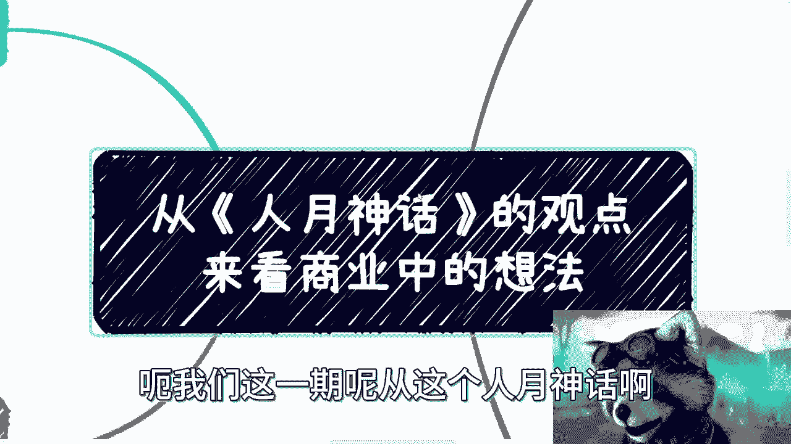
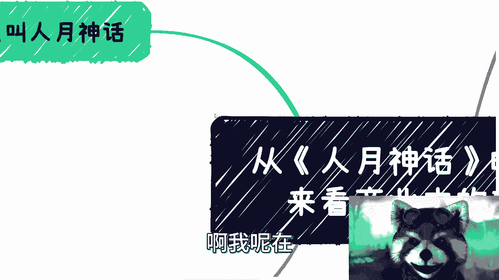
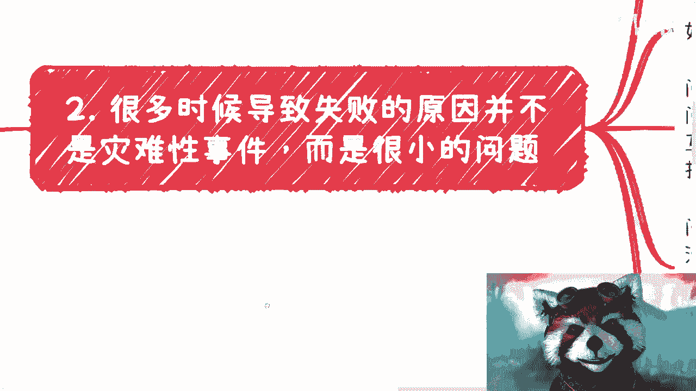

# 从《人月神话》的观点来窥探商业中的运用 - P1 - 赏味不足 - BV1Hp4y1J7eB

好大家好啊，我们这一期呢从这个人言神话啊。

就这个书来讲呃，为什么呢，因为这个清华大学出版社啊，寄了一本典藏版对吧，然后呢我大家也可以看到啊，就在这个视频连接下，当然我这个也不熟练，大家要是没看到，跟我说一下，应该是有的啊。

然后下面这个链接应该可以看到这本书呢，我可以说一下啊，首先他的切入点呢是从软件工程切入的，但是啊你要想从书中学习到写代码，我跟你讲你就别买了啊，你要想比如说从比如说你在别的领域啊，你说我想了解软件工程。

或者呢你就当故事会看啊，我觉得蛮好的啊，就真的推荐大家可以看看这本书，从头到尾故事会啊能增长不少知识，有一说一啊，呃我呢在这个里面呢结了一些观点啊。

但是呢虽然这本书啊，虽然是从这个软件工程角度出发啊，但是很多观点呢在很多别的领域也可以用啊，所以呢我就差不多抽了几个观点跟大家来聊聊，首先呢如果我不说啊，这个人人员神话对吧，我觉得大部分人看到这本书啊。

这个随便怎么想啊，这个跟计算机啊，跟软件工程肯定没什么关系啊。

那为什么叫人员神话啊，是这样子的，我们从书上呢其实可以看到啊，人越他专门有一个内容是来讲人越的，那么包括呢就是说但凡在互联网公司对吧，做过的同时呢，你们比如说给政府啊，给给这种产业园协会啊。

这个申报过项目的，你们都会有个东西叫什么呢，叫工作量评估啊，工作量评估里面呢，就是我们称之为叫什么叫人日啊，人越啊，人也没有啊，人家最多就是人月了啊，人月壬日这样子去做这个评估的，那么我们来说啊。

就是为什么叫人乐神话呢，是因为是因为在这个当中我们能看啊，就是一个人做十个月的活啊，和十个人做一个月的活是不是可以相等啊，大家可以想想这个问题啊，那如果你是打工人呢，你会怎么思考，如果你是老板。

你会怎么思考，你知道吧，因为呃我跟你们讲啊，你们在国内啊，这个这个如果创业公司去的比较多啊，你们就会发现其实很多老板啊，呃他也不能称之为资本家啊，他就是个这个创业者啊，他会有一个误区。

这个误区就是说就就我们说的，就是说他会有一种什么感觉呢，就是说如果这件事情你一个人，比如说怀孕十个月能生个孩子，那么在他思维里面啊，就是他会非常的就是有没有道理的，或者他自己觉得很有道理的。

就是什么理解呢，就是说他认为你可以用十个人来怀孕，一个月来完成，而且很多时候都这样子，你知道吗，就不管你今天做什么，就是你会发现很多的老板，尤其是那种个体户啊，他就特别喜欢这种，为什么呢。

因为因为我跟你们讲哦，为什么他会有这种，就是为什么他叫人乐神话呢，因为你本身如果能用十个人怀孕一个月来完成，那么本身这就是神话，但是我们说为什么很多私人老板对吧，这种个体户他会有这种感觉呢。

就是因为他其实对项目，对管理，对真正的商业当中，或者你要去做一个公司当中，所涉及到的一些细节，他根本就不懂啊，他就觉得就是说啊我有个idea，或者我有点钱，或者我找到个冤大头的资方，我就可以去创业了。

但并不是你知道吧，所以说呢你会发现在书中所有的知乎内容啊，其实他都提到了核心两个东西，一个是项目管理啊，也我们也可以认为他是个流程管理，一个就是人管，那说白了就是说很多时候，你比如说大家跟我讲啊。

我要做自媒体啊，我要去做什么摆地摊对吧，我要我要去开药房啊，就说包括今天早上这个咨询的小伙伴跟我说，他要去卖那个瓷器对吧，就说很多时候你会发现，就是大家把关注点都是关注在关注，在事情怎么做，你知道吧。

但是呢就是说虽然关注的事情，但是又忽略里面的细节啊，但是这个忽略的细节并不是因为大家想无聊，是因为大家对细节根本就不了解，所以会忽略，你知道吧，但是你会发现这些细节被忽略之后，其实很消耗时间哦。

我给你们举个例子，就比如说最近啊，我们我身边有些小伙伴正在做活动嘛对吧，那就是其实他真的要去做个活动，它里面所要准备的，比如说PPT对吧，准备的这个产品啊或者服务啊，就是你该有的表面的东西都得有。

而且你要做的是什么呢，就是至少让对方感觉你是专业的，同时要让对方感觉到，好像哎比如说你至少在一个及格线60分对吧，而不是说就是说啊我们急着就说啊，我们要做这件事情，然后呢呃这个这都说啊要包装啊。

要什么东西对吧，这是要包装需要什么东西，但是所有的啊该有的，比如说我们说活动方案啊，海报啊对吧，嘉宾啊什么东西啊，就你该有的模块，该有的规则你都得有对吧，你这就好像什么。

这就好像你今天啊可以忽悠这个投资人，你说我忽悠了100万1000万对吧，但是你忽悠他，你总不能单纯靠嘴去忽悠吧，你也不可能靠一个什么半成品的PDF呃，word去忽悠吧对吧，就说白了你要忽悠他可以。

那么你该有的团队该有的项目，就是我之前有个视频里面不是跟大家聊了，那个那个叫什么，就是投资的项目计划书嘛，就BP嘛对吧，那你BP里面该有的东西还是得有啊，你不能说啊，因为我要去忽悠他。

所以我我就是大概对吧，意思一下就可以了，不行了啊。

那么这个是这个人越神话的啊，这个由来啊，那么第二点呢我们来看啊。

就是很多时候呢呃在书中也提到了，就很多时候呢导致失败的原因，并不是一个灾难性事件，而是一个而是很多细小的问题所累积起来的，那么书中是这么写的，他说项目进度有所偏离啊，大部分人会认为是遭受到了重大的灾难。

而导致的，然而呢通常的灾难可能来自于白蚁的戏谑啊，而不是龙卷风的侵袭，为什么呢，就是说告诉大家，就是说真正的这种灾难啊，一次性把你就是什么啊，从从天上打到地下对吧。

或者说从这个现在打到解放前很少很少的啊，所以说在商业上也是一样的，就是几乎所有的事情，你最后如果失败了对吧，它本身的原因并不是因为最后失败，或者最后你说啊这我钱没赚到，或者这个项目这个产品没有卖出去。

这个不是真正原因，真正的原因是你在过程当中，点点滴滴所造成的哦，你真的因为一次你所有，你说我所有做的都很好对吧，仅仅因为一次性的一件事情把你打败了，有没有有，但概率很小啊，而且在这个地方我得跟你们讲。

很多时候敌人大概率都在内部，你明白吧，就是可能是你的合作方，可能是你的团队的小伙伴，可能是你的合伙人啊，你要明白真正外部的原因很少很少啊，那么如果你从商业来看，你会发现我这边列了几个。

第一个你会发现有可能问题来自于团队内部，比如说啊沟通不畅啦，各怀鬼胎啦对吧，有明明发现有问题并不及时沟通对吧，然后就是藏着掖着，当然你说他是不是故意藏着掖着，咱不知道啊，有可能他做事的方式就是这样子对。

因为大部分人做事情方式就是喜欢逃避嘛对吧，你有问题哎呀，算了吧，就这个这个说不定后面就没人追究了对吧，怎么样，但是你会发现所有的点到最后，他等到最后世界是呃，那个本身的这个项目失败了。

大家可能相互还要相互责怪，你会发现什么原因啊，你会发现这个就是这个团队本身综合所导致的，这么一个结果，就是说这些人可能格局都不大啊，他也不懂就不懂得，就说有问题，大家要找出问题来，而不是说相互指责。

他也不懂得，就是有问题，他应该去，就是第一时间提出来，大家来沟通对吧，他也不懂得，就是说如果觉得这件事情实在做不了对吧，或者说明摆着开始就注定会失败的，也不懂得及时止损对吧。

就说你但凡这个当中有一些就是有所改变，你也不至于就这个项目，肯定不至于这个样子对吧，因为我发现我今天突然没带道具是吧，来来来让我带个道具嗯，看看啊，我想带个带个雪茄在头上，但是呢我想把它横过来带啊。

这样对，然后把它放大，对吧嗯好，然后我们继续啊对吧，那你还有可能会发生什么呢，发现诶可能问题来自于合作方，比如说沟通不清楚对吧，无效沟通太多，一天到晚在开会啊，但是一天到晚呢就是说讲不到点子上啊。

大家都在绕圈子，你也在绕，它也在绕对吧，那么你也想赚大钱，他也想赚大钱，都不愿意把利益分出去对吧，那大家都在绕，那绕到最后就是谁都没有好处对吧，那么很多时候你会发现啊，就是绕圈子这个事情。

我这么跟你们讲，不管你们有没有做过商业，也不管你们是不是比如说大学生或者怎么样子，这一点都不重要，重要的是我跟你讲，但凡绕圈子的时候，你其实心里是有数的，或者参与会里面的人，总有人心里是有数的。

但是呢由于中国的比如从小到大的这个教育啊，他就觉得哎你要尊重别人，要怎么样怎么样，所以自始至终没有人跳出来跳出来去撕破，这个就是呃遮羞布，你知道吗，你想想看，大家绕圈子这个事情在日常是很长很常见的吧。

但凡有人跳出来说，你别逼逼来对吧，搞什么飞机啊对吧，要要赚钱就好好赚对吧，要要大家怎么分工，怎么分工作吧，别去讲这些，有的没的，你但凡怎么讲，这个事情反而能推进对吧，你我跟你讲，但凡自己赚过钱。

自己做个项目，其实都会明白，你果断对吧，你有什么说什么比什么都重要，比什么面子比什么啊，大家能不能以后做朋友能不能啊，这些都他妈不重要啊，好那么第三个就是问题还有可能来自于哪里。

来自于合同和你的交付产品，或者来说服务执行过程当中啊，什么意思呢，就是说就像我们我们以前说的，你可以去包装，你可以去忽悠，但是还是那句话，你交付的东西啊，再烂再烂再烂，你得在一个框框里面。

你得在一个规则里面，不是说你无限无底线的去烂，你也可以做对吧，那我话又说回来，那那那那甲方是你爸爸对吧，那甲方是你亲爹，那可以啊，那但凡不是这样子，你总归得有有你，你要在一个框架下面吧对吧。

这就好像我之前跟你们讲的对吧，大家说做商业做呃，CTRLCCTRLV没错呀，但是你要在商业规则条件范围内对吧，你要在大家的这个这个正常的做事应范围内啊，对吧，就像我们以前说白嫖对吧。

你白嫖你也是要就是去蹭也好对吧，或者说你在一定范围内白嫖了之后对吧，你可能达到了某个目的，但是你最终还是要让大家去赚钱的，你不是无底线去白嫖啊，啊那么我还是那句话啊，怎么做都取决于自己啊。

这个自己做做什么样子，我跟你讲会跟你们未来走多的走，走到多高的高度是完全有正正比例的，也完全有因果关系啊，那么我们说啊，就是说你会发现有很多时候，你的产品跟服务并不是一开始不行。

就是甲方对于你的东西其实都认可的啊，大家也愿意出钱，也愿意把这事情往下推，但是呢你会发现最后交付或验收他出了问题，我觉得这个出了问题呢，还是那句话，就是这个很多人他虚虚不来，你知道吧，就是我们说包装。

我们说虚，我们说空对空对吧，我们说叫什么，就是白嫖，你要懂得怎么虚啊，你要懂得怎么包装啊对吧，包装虚空对空也是一门技术啊，明白吧，好第三个人就是一切啊，我跟你讲，书中呢从软件工程角度看啊。

就是几乎呢人他有一个有一个标题，他就写了，人几乎就是一切，其实你会发现不管在哪里，人就是一切哦，就是包括你工作里面啊，包括你工作外面啊，对吧，你打工啊，不打工啊，人就是一切，别的你说重要吗，重要。

但是没有人重要哦，你只有有了合适的人，才有了配合，有了配合才有了上下游，有了上下游，你才会有你的商业模式，你知道吗，所以说商业模式本身做什么不是那么重要啊，不是商业模式，就商业本身做什么不是那么重要。

重要的是你跟谁一起做啊，那么你比如说我以前啊，我会认为很多事情我能做对吧，也不用依靠别人，那事实上也的确很多事情是我亲力亲为的啊，这没毛病啊，但是你时间做得长了，你就会发现就是你肯定会需求赚更多的钱。

而当你需求赚更多钱的时候，你就会发现你的个人单位时间里面，所产出的东西必然是有限的，你知道吧，所以说无论比如说啊，所以说我们会发现，我们需要花大量的时间去寻找，和自己可以长期合作小伙伴，而且是可靠的。

是可信的，这个是最重要的，所以你会发现整个的这个过程当中，我们还是这个强调这一点，就是大家不要去想着说啊，我的目标就是出去认识人，我的目标就是探索他们的商业那个背后的逻辑，我的目标是什么样子。

这些是你们的目标，但是所有的东西从综合角度来讲，他其实是为了锻炼你的沟通，锻炼你的识别人的能力，锻炼你的商业思维，锻炼你的很多的这种沟通能力，你综合能力提升之后，最终的目的是什么。

目的还是能够去很好的识别到一个可靠的，可信的跟你合作的人，或者说可靠的可信的跟你合作的合作方对吧，否则你说哦你你想赚大钱，也不说赚大钱，你想赚钱对吧，你想在打工外赚钱，靠你一个人不可能的啊。

一点概率都没有的，啊那么这是第一个，第二个呢，就比如说以前我也会觉得商业模式最重要，后来我发现还是人最重要，为什么呢，因为你想嘛你和对方总有短板对吧，你可能不懂商业模式，他可能不懂技术对吧。

但是你你要做的是什么，你要做的就是团队里面总有人要懂，你可以不懂对吧，那么你想想看，在一个团队角度来讲对吧，在一个团队里面，某些东西有人就一个团队里面啊，懂某些东西的概率总比集中在你一个人身上。

你什么都懂的概率来得高吧对吧，而且你要现在去补，就像最近咨询很多人，我就跟他讲，我说你们要明白，你们当踏上非打工的这条路的时候，你们前20多年和30多年经验，是没有任何用的，你知道吗。

就是你要完全从零开始啊，完全从零开始，不要抱着以前的思维一点用都没有的，对吧啊，所以说你要明白，在这种路过程当中，我不说要不要贵人啊，要不要有你说有没有贵人来带你，咱咱先不去说他。

你至少得有一个比你在这个市场里面，这个经验多的对吧，经历多的人至少给你合伙吧对吧，那么所以说你只要人对了，你今天做电商不成功，明天做自媒体不成功，后天做，比如说这个叫什么游戏，不成功无所谓。

因为你只要人对了，你总有一天会成功，你知道吗，因为很多东西不成功不是我们能控制的，但是你要明白，就是很多人的不成功，他并不是因为天时地利，没有天时地利，人和他很多是因为被坑，你知道吧，是人为因素。

它不是一个自然因素啊，那么这个是一个第二个呢，就是说就如以前说的，其实人对了，你也能更高效的去试错，因为很多人我沟通下来，我就发现他不是不懂，他都懂，但它不果断啊，然后呢我跟你讲。

这种时候你就需要外力帮你去果断对吧，你这么一个对的人，他可以帮你果断，可以帮你止损，也可以帮你选择更好的战略方向，也可以帮你选择更好的战术方向对吧，但是你一个人你很难啊，对吧啊，很多时候我跟你讲。

当局者迷，你是需要别人或者说需要那些有商业思维，懂得业务的人去沟通讨论，咱不是说谁高谁低啊，咱也不是说啊，你一定要请教他，并不是讨论对吧，你至少要听到一些不一样的声音，而不是就是大家一直在网络上哎。

就短视频对吧，或者说就每天在B站上看到啊，这个这个啊这个工作里面对吧，这个有效的是你看我最近在B站上看啊，就什么什么工作当中有效的实际，这种沟通方式对吧，什么商业上未来什么能赚钱的五个方向，有卵用啊。

啊就是有脑子的人都会明白哦，要你这种方法有用的话，那那别搞了，那他妈中国14亿人，每个人都学，那每个人都财富自由了，可能问了不可能的呀，对不对啊，所以就是说不要去。

就是我们要去吸收更多的那些真正接地气的，那个话啊啊啊那些那些观点啊，而不是说这个这个大国分啊，还有鸡汤啊，所以呢所以说呢我们来看啊，回到之前百万up主啊，这个解散的这个事，哎我跟你讲。

我讲我讲到这个事情，我写到这个点的时候，我也想到这个事情啊，就我为啥当时那个视频里面我说他会双输，为什么呢，因为你会发现他在自己选择不打工的情况下面，最有价值积累的是什么，一个是商业经历。

一个是赚钱的那个商业思维，一个是可以一起赚钱的小伙伴，一个是积累资方，你会发现一个都没有对吧，我跟你讲，在我看来就是输麻了，那当然了，很多人也说嘛啊，那人家至少做成一个百万账号了对吧。

人家至少怎么样怎么样，这个很多人认识他啊，赢马了对吧，转码了对吧，也没毛病啊，这个看大家看问题的角度啊，但是你从我商业角度来讲呢，我跟你讲就是输麻了啊，就这么回事。

我也没说这事儿一定对错啊，那么最后一点呢，就是我和咨询过我的每一个人啊。

我可以说我都说过这个这个观点，什么观点啊，就是在国内啊，国外咱不去说他，我跟你讲还是不太一样的，在国内实际的细节的东西，远远比不过宏观的东西，我跟你讲，无论是价值还是生命力，什么意思啊。

你们想想看为什么什么意思啊，就是说细节的东西，你的用户，你的客户，你的对象往往针对的是中下层，你明白了啊，那么宏观的东西往往针对的是中上层啊，而你们要明白一点，真正的甲方爸爸真正的能有很多决策权的人。

都是在上面对吧，那这个时候又有小伙伴不服了，驴老师啊，你这是看不起我们，哼哼这个老百姓是吧，看不起我们基本盘对哎，不好意思啊，的确看不起啊，而且不是我看不起我们自己，就得客观的明白。

我们到底是在怎么一个成绩上面，你懂吗，那我们是没有决策权利呀，我们有决策权没来啊啊是不是对吧，你你同样的，那为什么宏观的东西生命力更强，价值更高，因为宏观的东西它容易故事化对吧，别人能够看懂。

同时看懂的人会那个受众会比较多，同时呢看懂的人越容易更得到好评啊，也容易被更，就这个东西也容易被被更多人接受对吧，那你就比如人人乐神话这本书，就比如我跟你们看，你们自己去看日常。

你们这个能够去参加的各种什么会议沙龙对吧，或者说呃大家日常被收购的那些知识付费，你们就去看嘛对吧，就是今天一个垂直领域的什么夹板怎么写，Python怎么写，产品经理怎么做对吧，什么土木毕业应该呃。

土木土木这个技术应该怎么去用对吧，怎么样怎么样，这种它的受众永远是比不上，那些非常宏观的对吧，就比如说哎你看啊这个这个这个这个叫什么，就是不我不说假吧，技术也不说开开发技术对吧。

就说唉互联网怎么发展对吧，呃呃这个工业互联网怎么发展对吧，这个数这个经济怎么发展对吧，就是所有宏观的东西，它的受众永远是广的对吧，同时宏观的东西大家的接受度也都是更高的，为什么，因为他宏观它不细节。

你也很难去挑出它里面的一些一些毛病对吧，他可能说的就模棱两可对吧，更何况就是说就是说，大家可能讲的更多的是一些方法论啊，讲的是一些趋势对吧，那么这样的话呢，就是说听的人你说他到底能不能学到更多东西。

咱不去管它，但至少听的人感觉我听懂了啊，那如果来说你在那边听一个很细节的东西啊，虽然讲的这个人很专业，但是你在那边假设打个比方听六个小时，你五个小时听不懂，我让你打评分，你肯定差评啊，我听不懂啊。

我不知道你在讲些什么东西啊，你专业管理专业，我又我又不懂，我怎么知道你专不专业。

对不对啊，所以啊就是就是这个东西就没有办法啊，就是很多的时候啊，包括就是中国的那个高校啊。

这个合作也是一样的，因为我觉得大部分人呢，对于很多的这个业务上面，他的理解是有偏差的，你比如说我就跟很多人说过，你要赚钱，如果你要在高校里面赚钱，你一定是往下打，就是职校技校越有钱，你往98万211。

你赚个屁啊，你赚个屁啊，然后同样的，如果你想去跟我一样做咨询对吧，做什么东西，我演那句话啊，除非你有屠龙之术，除除非你是LK99对吧，否则，你的这个技术能力的培训，技术能力的咨询远远比不过我。

宏观能力和宏观的培训，就这句话，我价格可以翻你好几倍，就这么简单，为什么N那不好意思，我就告诉你中上层，根本不懂你说的是什么啊，反而懂我说的是什么对吧，你可以看不起我，这个你可以说哎驴老师。

你这个不懂技术对吧，你这种太不接地气了，我不接就不接这么低了，理解不了啊，我只关心整个商业逻辑上面，甲方爸爸要什么对吧，那你要关心技术可以啊，那你家里要么有矿，你去关心，那跟我有什么关系，对不对啊。

所以呢就是说就是说我为什么一直告诉大家，就是从一个啊就是学校里面出来啊，毕业之后我不管你是什么学历毕业啊，你终究，这个这个保持空杯心态，要把你以前所学所知所看到的全部抛弃掉哦，从零开始，谦虚的哦。

敬畏的去了解商业去做啊，否则就是我跟你讲，坑大了去了啊，坑大了去了，好吧行吧嗯，就这么着吧啊，然后那个同样的啊，大家几点啊，第一个就是说那个要做职业规划的，不知道怎么做的，你们可以找我。

第二呢你们手上有什么牌啊，可以列出来啊，不知道怎么打的，我可以告诉你们怎么打啊，或者我结合我的经验告诉你们怎么打啊，第三呢就是说啊如果有什么商业合作的啊，或者说怎么样的，比如说你们也想做数字经济。

或者做相关东西的啊，那么你们也可以跟我说啊，我们看看大家资源怎么去拼，怎么去赚钱啊，因为从我的角度来讲，我的核心点很简单，就大家有钱一起赚啊，但是不要去往low了做啊，不要往la做。

不要去老是做那些什么什么to c的，就是to用户的什么知识变现啊，然后去收割去什么，我跟你讲啊。

尽量不要做啊。